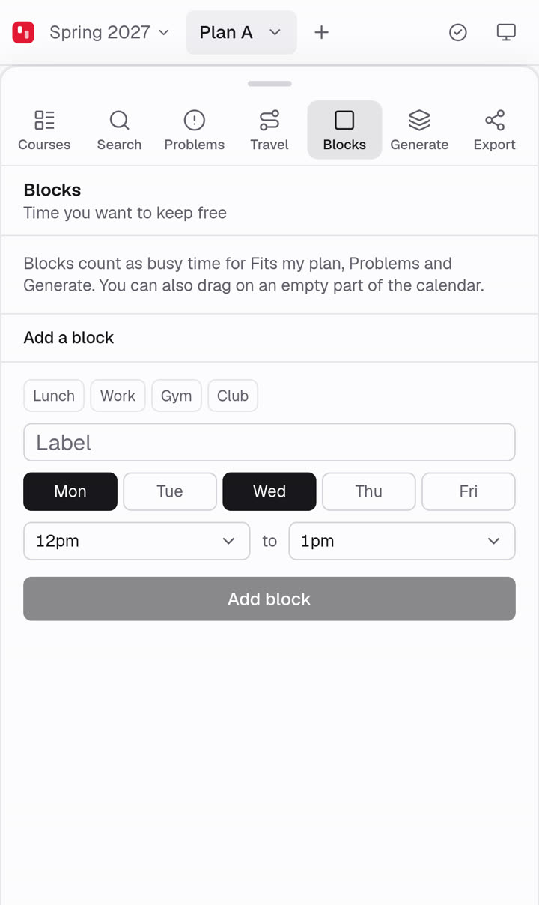
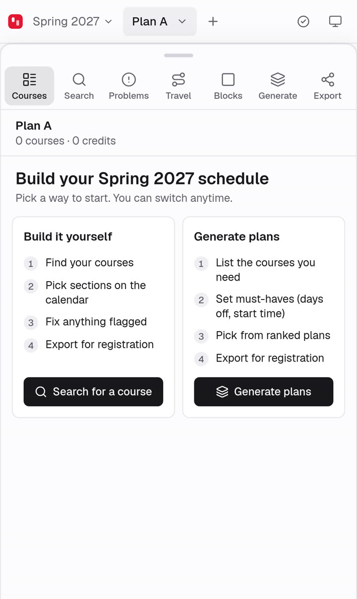
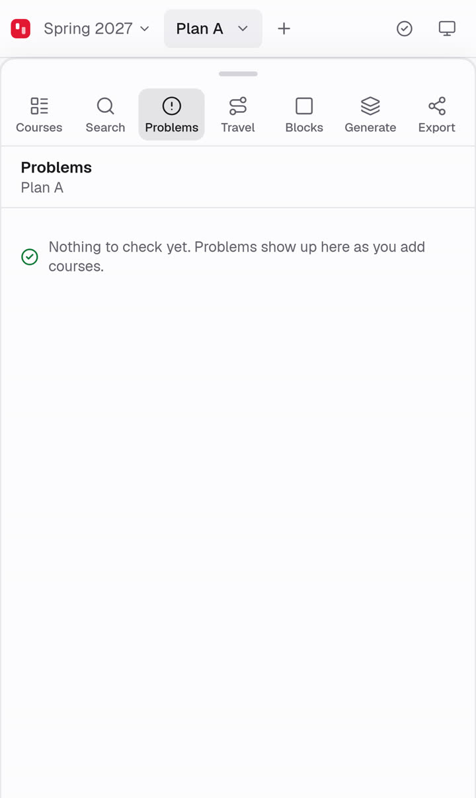
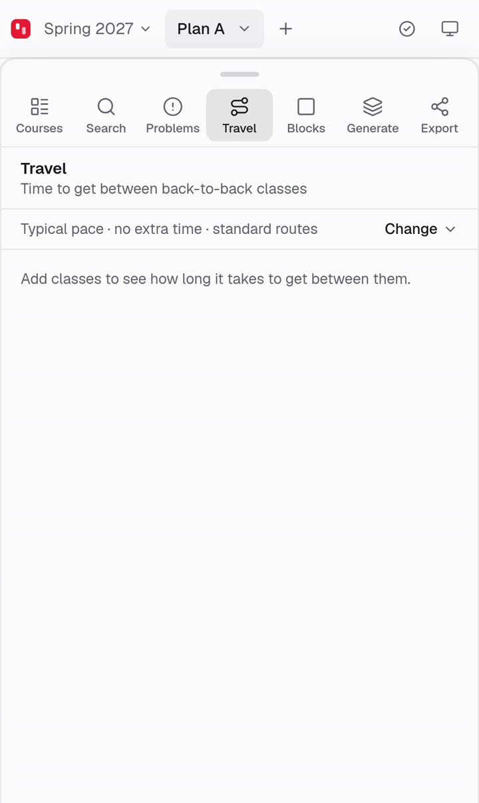
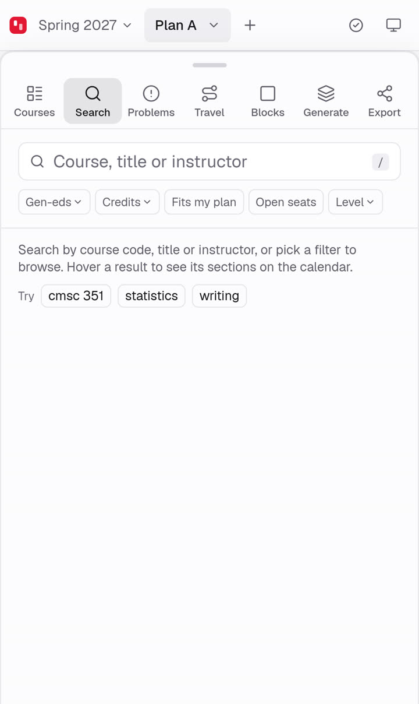
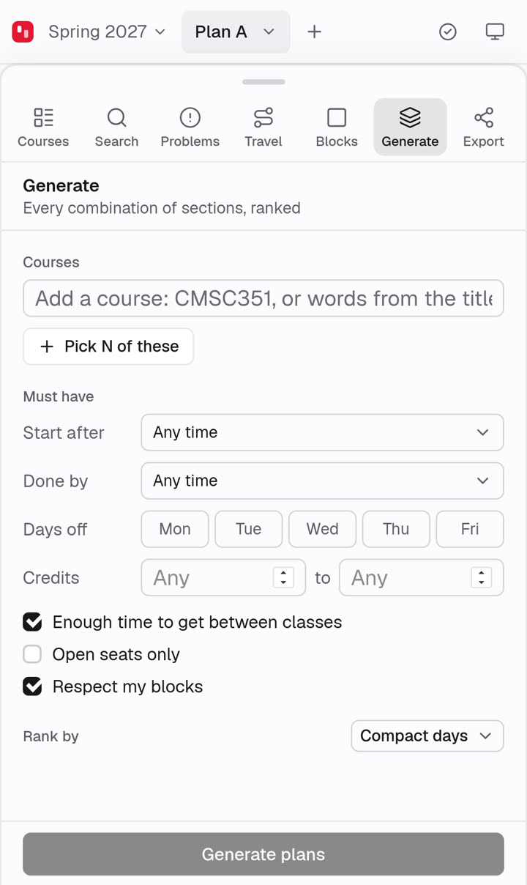
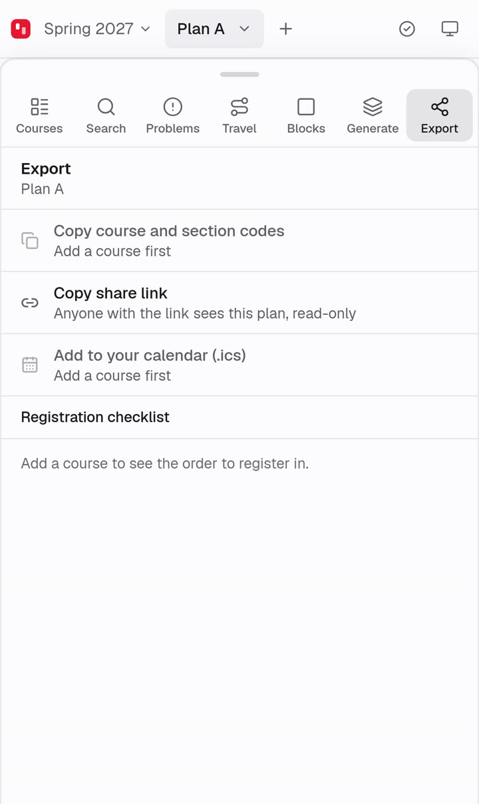
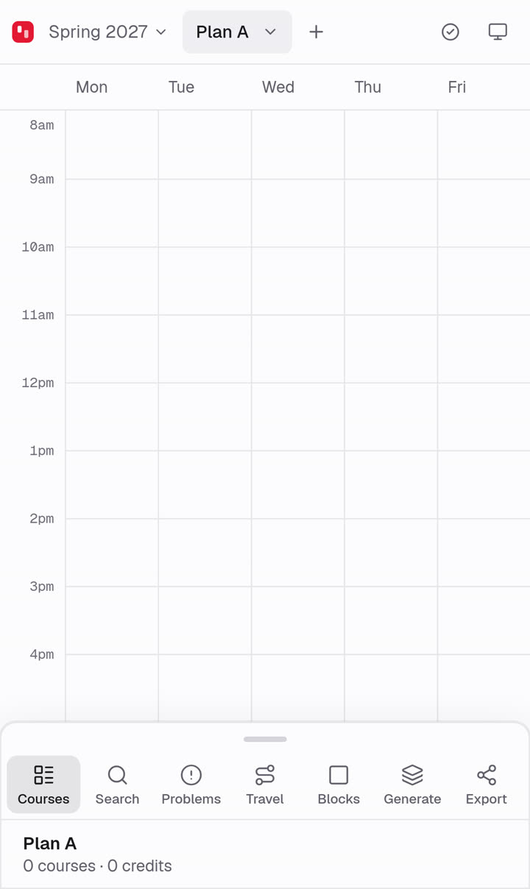

# Mobile lab: webkit

**Passed**: 0 failed check(s), 1 warning(s), 0 error(s).

- URL: https://terpsicle.com
- Device: Playwright webkit 26.6, iPhone 15 viewport (emulated touch, no keyboard)
- Started: 2026-09-26T15:42:22.897Z, took 316 s
- Workflow run: https://github.com/zsrobinson/terpsicle/actions/runs/36252798585
- Every step's full probe (viewport, drawer, focus, events, per-frame trace) is in `summary.json`.

| Scenario | Result | Steps | Time | Recording |
|---|---|---|---|---|
| [Tap each drawer tab, then the open one again](#tabs) | ok | 8 | 24 s | [video](tabs/video.webm) |
| [Tap each drawer tab, then the open one again (run 2)](#tabs-2) | ok | 8 | 15 s | [video](tabs-2/video.webm) |
| [Tap each drawer tab, then the open one again (run 3)](#tabs-3) | ok | 8 | 16 s | [video](tabs-3/video.webm) |
| [Tap each drawer tab, then the open one again (run 4)](#tabs-4) | warn | 8 | 15 s | [video](tabs-4/video.webm) |
| [Tap each drawer tab, then the open one again (run 5)](#tabs-5) | ok | 8 | 15 s | [video](tabs-5/video.webm) |
| [Tap each drawer tab, then the open one again (run 6)](#tabs-6) | ok | 8 | 15 s | [video](tabs-6/video.webm) |
| [Tap each drawer tab, then the open one again (run 7)](#tabs-7) | ok | 8 | 15 s | [video](tabs-7/video.webm) |
| [Tap each drawer tab, then the open one again (run 8)](#tabs-8) | ok | 8 | 15 s | [video](tabs-8/video.webm) |
| [Tap each drawer tab, then the open one again (run 9)](#tabs-9) | ok | 8 | 15 s | [video](tabs-9/video.webm) |
| [Tap each drawer tab, then the open one again (run 10)](#tabs-10) | ok | 8 | 15 s | [video](tabs-10/video.webm) |
| [Tap each drawer tab, then the open one again (run 11)](#tabs-11) | ok | 8 | 15 s | [video](tabs-11/video.webm) |
| [Tap each drawer tab, then the open one again (run 12)](#tabs-12) | ok | 8 | 15 s | [video](tabs-12/video.webm) |
| [Tap each drawer tab, then the open one again (run 13)](#tabs-13) | ok | 8 | 15 s | [video](tabs-13/video.webm) |
| [Tap each drawer tab, then the open one again (run 14)](#tabs-14) | ok | 8 | 15 s | [video](tabs-14/video.webm) |
| [Tap each drawer tab, then the open one again (run 15)](#tabs-15) | ok | 8 | 15 s | [video](tabs-15/video.webm) |
| [Tap each drawer tab, then the open one again (run 16)](#tabs-16) | ok | 8 | 15 s | [video](tabs-16/video.webm) |
| [Tap each drawer tab, then the open one again (run 17)](#tabs-17) | ok | 8 | 15 s | [video](tabs-17/video.webm) |
| [Tap each drawer tab, then the open one again (run 18)](#tabs-18) | ok | 8 | 15 s | [video](tabs-18/video.webm) |
| [Tap each drawer tab, then the open one again (run 19)](#tabs-19) | ok | 8 | 15 s | [video](tabs-19/video.webm) |
| [Tap each drawer tab, then the open one again (run 20)](#tabs-20) | ok | 8 | 15 s | [video](tabs-20/video.webm) |

## Tap each drawer tab, then the open one again

`tabs` · [recording](tabs/video.webm)

| Screen | Step |
|---|---|
|  | **1. Search tab** (ok, 12 s) after: tap {"target":"[data-vaul-drawer] nav[aria-label=\"Tabs\"] button \"Search\"","at":{"x":87,"y":95}} viewport 393×659, visual 659 tall at 0, scrollY 0 drawer full, top 48, inside 611px page processes 580 MB (1, largest 580 MB) focus button at y 73–116 panel "Search" events: installed |
|  | **2. Problems tab** (ok, 13 s) after: tap {"target":"[data-vaul-drawer] nav[aria-label=\"Tabs\"] button \"Problems\"","at":{"x":142,"y":95}} viewport 393×659, visual 659 tall at 0, scrollY 0 drawer full, top 48, inside 611px page processes 563 MB (1, largest 563 MB) focus button at y 73–116 panel "Problems" |
|  | **3. Travel tab** (ok, 16 s) after: tap {"target":"[data-vaul-drawer] nav[aria-label=\"Tabs\"] button \"Travel\"","at":{"x":197,"y":95}} viewport 393×659, visual 659 tall at 0, scrollY 0 drawer full, top 48, inside 611px page processes 567 MB (1, largest 567 MB) focus button at y 73–116 panel "Travel" |
|  | **4. Blocks tab** (ok, 17 s) after: tap {"target":"[data-vaul-drawer] nav[aria-label=\"Tabs\"] button \"Blocks\"","at":{"x":251,"y":95}} viewport 393×659, visual 659 tall at 0, scrollY 0 drawer full, top 48, inside 611px page processes 581 MB (1, largest 581 MB) focus button at y 73–116 panel "Blocks" |
|  | **5. Generate tab** (ok, 19 s) after: tap {"target":"[data-vaul-drawer] nav[aria-label=\"Tabs\"] button \"Generate\"","at":{"x":306,"y":95}} viewport 393×659, visual 659 tall at 0, scrollY 0 drawer full, top 48, inside 611px page processes 599 MB (1, largest 599 MB) focus button at y 73–116 panel "Generate" |
|  | **6. Export tab** (ok, 20 s) after: tap {"target":"[data-vaul-drawer] nav[aria-label=\"Tabs\"] button \"Export\"","at":{"x":361,"y":95}} viewport 393×659, visual 659 tall at 0, scrollY 0 drawer full, top 48, inside 611px page processes 590 MB (1, largest 590 MB) focus button at y 73–116 panel "Export" |
|  | **7. Courses tab** (ok, 21 s) after: tap {"target":"[data-vaul-drawer] nav[aria-label=\"Tabs\"] button \"Courses\"","at":{"x":32,"y":95}} viewport 393×659, visual 659 tall at 0, scrollY 0 drawer full, top 48, inside 611px page processes 591 MB (1, largest 591 MB) focus button at y 73–116 panel "Plan A" |
|  | **8. tapped the open tab** (ok, 22 s) after: tap {"target":"[data-vaul-drawer] nav[aria-label=\"Tabs\"] button \"Courses\"","at":{"x":32,"y":95}} viewport 393×659, visual 659 tall at 0, scrollY 0 drawer peek, top 535, inside 124px page processes 613 MB (1, largest 613 MB) focus button at y 560–603 panel "Plan A" |

## Tap each drawer tab, then the open one again (run 2)

`tabs-2` · [recording](tabs-2/video.webm)

| Screen | Step |
|---|---|
|  | **1. Search tab** (ok, 3 s) after: tap {"target":"[data-vaul-drawer] nav[aria-label=\"Tabs\"] button \"Search\"","at":{"x":87,"y":95}} viewport 393×659, visual 659 tall at 0, scrollY 0 drawer full, top 48, inside 611px page processes 1113 MB (2, largest 569 MB) focus button at y 73–116 panel "Search" events: installed |
|  | **2. Problems tab** (ok, 4 s) after: tap {"target":"[data-vaul-drawer] nav[aria-label=\"Tabs\"] button \"Problems\"","at":{"x":142,"y":95}} viewport 393×659, visual 659 tall at 0, scrollY 0 drawer full, top 48, inside 611px page processes 1116 MB (2, largest 572 MB) focus button at y 73–116 panel "Problems" |
|  | **3. Travel tab** (ok, 7 s) after: tap {"target":"[data-vaul-drawer] nav[aria-label=\"Tabs\"] button \"Travel\"","at":{"x":197,"y":95}} viewport 393×659, visual 659 tall at 0, scrollY 0 drawer full, top 48, inside 611px page processes 1095 MB (2, largest 551 MB) focus button at y 73–116 panel "Travel" |
|  | **4. Blocks tab** (ok, 8 s) after: tap {"target":"[data-vaul-drawer] nav[aria-label=\"Tabs\"] button \"Blocks\"","at":{"x":251,"y":95}} viewport 393×659, visual 659 tall at 0, scrollY 0 drawer full, top 48, inside 611px page processes 561 MB (1, largest 561 MB) focus button at y 73–116 panel "Blocks" |
|  | **5. Generate tab** (ok, 10 s) after: tap {"target":"[data-vaul-drawer] nav[aria-label=\"Tabs\"] button \"Generate\"","at":{"x":306,"y":95}} viewport 393×659, visual 659 tall at 0, scrollY 0 drawer full, top 48, inside 611px page processes 574 MB (1, largest 574 MB) focus button at y 73–116 panel "Generate" |
|  | **6. Export tab** (ok, 11 s) after: tap {"target":"[data-vaul-drawer] nav[aria-label=\"Tabs\"] button \"Export\"","at":{"x":361,"y":95}} viewport 393×659, visual 659 tall at 0, scrollY 0 drawer full, top 48, inside 611px page processes 568 MB (1, largest 568 MB) focus button at y 73–116 panel "Export" |
|  | **7. Courses tab** (ok, 12 s) after: tap {"target":"[data-vaul-drawer] nav[aria-label=\"Tabs\"] button \"Courses\"","at":{"x":32,"y":95}} viewport 393×659, visual 659 tall at 0, scrollY 0 drawer full, top 48, inside 611px page processes 573 MB (1, largest 573 MB) focus button at y 73–116 panel "Plan A" |
|  | **8. tapped the open tab** (ok, 13 s) after: tap {"target":"[data-vaul-drawer] nav[aria-label=\"Tabs\"] button \"Courses\"","at":{"x":32,"y":95}} viewport 393×659, visual 659 tall at 0, scrollY 0 drawer peek, top 535, inside 124px page processes 596 MB (1, largest 596 MB) focus button at y 560–603 panel "Plan A" |

## Tap each drawer tab, then the open one again (run 3)

`tabs-3` · [recording](tabs-3/video.webm)

| Screen | Step |
|---|---|
|  | **1. Search tab** (ok, 4 s) after: tap {"target":"[data-vaul-drawer] nav[aria-label=\"Tabs\"] button \"Search\"","at":{"x":87,"y":95}} viewport 393×659, visual 659 tall at 0, scrollY 0 drawer full, top 48, inside 611px page processes 1097 MB (2, largest 569 MB) focus button at y 73–116 panel "Search" events: installed |
|  | **2. Problems tab** (ok, 5 s) after: tap {"target":"[data-vaul-drawer] nav[aria-label=\"Tabs\"] button \"Problems\"","at":{"x":142,"y":95}} viewport 393×659, visual 659 tall at 0, scrollY 0 drawer full, top 48, inside 611px page processes 1106 MB (2, largest 578 MB) focus button at y 73–116 panel "Problems" |
|  | **3. Travel tab** (ok, 8 s) after: tap {"target":"[data-vaul-drawer] nav[aria-label=\"Tabs\"] button \"Travel\"","at":{"x":197,"y":95}} viewport 393×659, visual 659 tall at 0, scrollY 0 drawer full, top 48, inside 611px page processes 1086 MB (2, largest 562 MB) focus button at y 73–116 panel "Travel" |
|  | **4. Blocks tab** (ok, 9 s) after: tap {"target":"[data-vaul-drawer] nav[aria-label=\"Tabs\"] button \"Blocks\"","at":{"x":251,"y":95}} viewport 393×659, visual 659 tall at 0, scrollY 0 drawer full, top 48, inside 611px page processes 572 MB (1, largest 572 MB) focus button at y 73–116 panel "Blocks" |
|  | **5. Generate tab** (ok, 10 s) after: tap {"target":"[data-vaul-drawer] nav[aria-label=\"Tabs\"] button \"Generate\"","at":{"x":306,"y":95}} viewport 393×659, visual 659 tall at 0, scrollY 0 drawer full, top 48, inside 611px page processes 595 MB (1, largest 595 MB) focus button at y 73–116 panel "Generate" |
|  | **6. Export tab** (ok, 11 s) after: tap {"target":"[data-vaul-drawer] nav[aria-label=\"Tabs\"] button \"Export\"","at":{"x":361,"y":95}} viewport 393×659, visual 659 tall at 0, scrollY 0 drawer full, top 48, inside 611px page processes 581 MB (1, largest 581 MB) focus button at y 73–116 panel "Export" |
|  | **7. Courses tab** (ok, 12 s) after: tap {"target":"[data-vaul-drawer] nav[aria-label=\"Tabs\"] button \"Courses\"","at":{"x":32,"y":95}} viewport 393×659, visual 659 tall at 0, scrollY 0 drawer full, top 48, inside 611px page processes 583 MB (1, largest 583 MB) focus button at y 73–116 panel "Plan A" |
|  | **8. tapped the open tab** (ok, 14 s) after: tap {"target":"[data-vaul-drawer] nav[aria-label=\"Tabs\"] button \"Courses\"","at":{"x":32,"y":95}} viewport 393×659, visual 659 tall at 0, scrollY 0 drawer peek, top 535, inside 124px page processes 602 MB (1, largest 602 MB) focus button at y 560–603 panel "Plan A" |

## Tap each drawer tab, then the open one again (run 4)

`tabs-4` · [recording](tabs-4/video.webm)

| Screen | Step |
|---|---|
|  | **1. Search tab** (warn, 3 s) after: tap {"target":"[data-vaul-drawer] nav[aria-label=\"Tabs\"] button \"Search\"","at":{"x":87,"y":95}} viewport 393×659, visual 659 tall at 0, scrollY 0 drawer full, top 48, inside 611px page processes 1114 MB (2, largest 580 MB) focus button at y 73–116 panel "Search" events: installed **warn drawer-moves-one-way**: 2 reversal(s) over 31 frames (48–560) |
|  | **2. Problems tab** (ok, 4 s) after: tap {"target":"[data-vaul-drawer] nav[aria-label=\"Tabs\"] button \"Problems\"","at":{"x":142,"y":95}} viewport 393×659, visual 659 tall at 0, scrollY 0 drawer full, top 48, inside 611px page processes 1110 MB (2, largest 575 MB) focus button at y 73–116 panel "Problems" |
|  | **3. Travel tab** (ok, 7 s) after: tap {"target":"[data-vaul-drawer] nav[aria-label=\"Tabs\"] button \"Travel\"","at":{"x":197,"y":95}} viewport 393×659, visual 659 tall at 0, scrollY 0 drawer full, top 48, inside 611px page processes 1022 MB (2, largest 561 MB) focus button at y 73–116 panel "Travel" |
|  | **4. Blocks tab** (ok, 8 s) after: tap {"target":"[data-vaul-drawer] nav[aria-label=\"Tabs\"] button \"Blocks\"","at":{"x":251,"y":95}} viewport 393×659, visual 659 tall at 0, scrollY 0 drawer full, top 48, inside 611px page processes 569 MB (1, largest 569 MB) focus button at y 73–116 panel "Blocks" |
|  | **5. Generate tab** (ok, 10 s) after: tap {"target":"[data-vaul-drawer] nav[aria-label=\"Tabs\"] button \"Generate\"","at":{"x":306,"y":95}} viewport 393×659, visual 659 tall at 0, scrollY 0 drawer full, top 48, inside 611px page processes 576 MB (1, largest 576 MB) focus button at y 73–116 panel "Generate" |
|  | **6. Export tab** (ok, 11 s) after: tap {"target":"[data-vaul-drawer] nav[aria-label=\"Tabs\"] button \"Export\"","at":{"x":361,"y":95}} viewport 393×659, visual 659 tall at 0, scrollY 0 drawer full, top 48, inside 611px page processes 571 MB (1, largest 571 MB) focus button at y 73–116 panel "Export" |
|  | **7. Courses tab** (ok, 12 s) after: tap {"target":"[data-vaul-drawer] nav[aria-label=\"Tabs\"] button \"Courses\"","at":{"x":32,"y":95}} viewport 393×659, visual 659 tall at 0, scrollY 0 drawer full, top 48, inside 611px page processes 574 MB (1, largest 574 MB) focus button at y 73–116 panel "Plan A" |
|  | **8. tapped the open tab** (ok, 13 s) after: tap {"target":"[data-vaul-drawer] nav[aria-label=\"Tabs\"] button \"Courses\"","at":{"x":32,"y":95}} viewport 393×659, visual 659 tall at 0, scrollY 0 drawer peek, top 535, inside 124px page processes 594 MB (1, largest 594 MB) focus button at y 560–603 panel "Plan A" |

## Tap each drawer tab, then the open one again (run 5)

`tabs-5` · [recording](tabs-5/video.webm)

| Screen | Step |
|---|---|
|  | **1. Search tab** (ok, 3 s) after: tap {"target":"[data-vaul-drawer] nav[aria-label=\"Tabs\"] button \"Search\"","at":{"x":87,"y":95}} viewport 393×659, visual 659 tall at 0, scrollY 0 drawer full, top 48, inside 611px page processes 1105 MB (2, largest 580 MB) focus button at y 73–116 panel "Search" events: installed |
|  | **2. Problems tab** (ok, 4 s) after: tap {"target":"[data-vaul-drawer] nav[aria-label=\"Tabs\"] button \"Problems\"","at":{"x":142,"y":95}} viewport 393×659, visual 659 tall at 0, scrollY 0 drawer full, top 48, inside 611px page processes 1088 MB (2, largest 563 MB) focus button at y 73–116 panel "Problems" |
|  | **3. Travel tab** (ok, 7 s) after: tap {"target":"[data-vaul-drawer] nav[aria-label=\"Tabs\"] button \"Travel\"","at":{"x":197,"y":95}} viewport 393×659, visual 659 tall at 0, scrollY 0 drawer full, top 48, inside 611px page processes 1080 MB (2, largest 557 MB) focus button at y 73–116 panel "Travel" |
|  | **4. Blocks tab** (ok, 8 s) after: tap {"target":"[data-vaul-drawer] nav[aria-label=\"Tabs\"] button \"Blocks\"","at":{"x":251,"y":95}} viewport 393×659, visual 659 tall at 0, scrollY 0 drawer full, top 48, inside 611px page processes 566 MB (1, largest 566 MB) focus button at y 73–116 panel "Blocks" |
|  | **5. Generate tab** (ok, 10 s) after: tap {"target":"[data-vaul-drawer] nav[aria-label=\"Tabs\"] button \"Generate\"","at":{"x":306,"y":95}} viewport 393×659, visual 659 tall at 0, scrollY 0 drawer full, top 48, inside 611px page processes 579 MB (1, largest 579 MB) focus button at y 73–116 panel "Generate" |
|  | **6. Export tab** (ok, 11 s) after: tap {"target":"[data-vaul-drawer] nav[aria-label=\"Tabs\"] button \"Export\"","at":{"x":361,"y":95}} viewport 393×659, visual 659 tall at 0, scrollY 0 drawer full, top 48, inside 611px page processes 572 MB (1, largest 572 MB) focus button at y 73–116 panel "Export" |
|  | **7. Courses tab** (ok, 12 s) after: tap {"target":"[data-vaul-drawer] nav[aria-label=\"Tabs\"] button \"Courses\"","at":{"x":32,"y":95}} viewport 393×659, visual 659 tall at 0, scrollY 0 drawer full, top 48, inside 611px page processes 576 MB (1, largest 576 MB) focus button at y 73–116 panel "Plan A" |
|  | **8. tapped the open tab** (ok, 13 s) after: tap {"target":"[data-vaul-drawer] nav[aria-label=\"Tabs\"] button \"Courses\"","at":{"x":32,"y":95}} viewport 393×659, visual 659 tall at 0, scrollY 0 drawer peek, top 535, inside 124px page processes 598 MB (1, largest 598 MB) focus button at y 560–603 panel "Plan A" |

## Tap each drawer tab, then the open one again (run 6)

`tabs-6` · [recording](tabs-6/video.webm)

| Screen | Step |
|---|---|
|  | **1. Search tab** (ok, 3 s) after: tap {"target":"[data-vaul-drawer] nav[aria-label=\"Tabs\"] button \"Search\"","at":{"x":87,"y":95}} viewport 393×659, visual 659 tall at 0, scrollY 0 drawer full, top 48, inside 611px page processes 1035 MB (2, largest 568 MB) focus button at y 73–116 panel "Search" events: installed |
|  | **2. Problems tab** (ok, 4 s) after: tap {"target":"[data-vaul-drawer] nav[aria-label=\"Tabs\"] button \"Problems\"","at":{"x":142,"y":95}} viewport 393×659, visual 659 tall at 0, scrollY 0 drawer full, top 48, inside 611px page processes 1044 MB (2, largest 576 MB) focus button at y 73–116 panel "Problems" |
|  | **3. Travel tab** (ok, 7 s) after: tap {"target":"[data-vaul-drawer] nav[aria-label=\"Tabs\"] button \"Travel\"","at":{"x":197,"y":95}} viewport 393×659, visual 659 tall at 0, scrollY 0 drawer full, top 48, inside 611px page processes 1023 MB (2, largest 557 MB) focus button at y 73–116 panel "Travel" |
|  | **4. Blocks tab** (ok, 8 s) after: tap {"target":"[data-vaul-drawer] nav[aria-label=\"Tabs\"] button \"Blocks\"","at":{"x":251,"y":95}} viewport 393×659, visual 659 tall at 0, scrollY 0 drawer full, top 48, inside 611px page processes 564 MB (1, largest 564 MB) focus button at y 73–116 panel "Blocks" |
|  | **5. Generate tab** (ok, 10 s) after: tap {"target":"[data-vaul-drawer] nav[aria-label=\"Tabs\"] button \"Generate\"","at":{"x":306,"y":95}} viewport 393×659, visual 659 tall at 0, scrollY 0 drawer full, top 48, inside 611px page processes 577 MB (1, largest 577 MB) focus button at y 73–116 panel "Generate" |
|  | **6. Export tab** (ok, 11 s) after: tap {"target":"[data-vaul-drawer] nav[aria-label=\"Tabs\"] button \"Export\"","at":{"x":361,"y":95}} viewport 393×659, visual 659 tall at 0, scrollY 0 drawer full, top 48, inside 611px page processes 575 MB (1, largest 575 MB) focus button at y 73–116 panel "Export" |
|  | **7. Courses tab** (ok, 12 s) after: tap {"target":"[data-vaul-drawer] nav[aria-label=\"Tabs\"] button \"Courses\"","at":{"x":32,"y":95}} viewport 393×659, visual 659 tall at 0, scrollY 0 drawer full, top 48, inside 611px page processes 582 MB (1, largest 582 MB) focus button at y 73–116 panel "Plan A" |
|  | **8. tapped the open tab** (ok, 13 s) after: tap {"target":"[data-vaul-drawer] nav[aria-label=\"Tabs\"] button \"Courses\"","at":{"x":32,"y":95}} viewport 393×659, visual 659 tall at 0, scrollY 0 drawer peek, top 535, inside 124px page processes 603 MB (1, largest 603 MB) focus button at y 560–603 panel "Plan A" |

## Tap each drawer tab, then the open one again (run 7)

`tabs-7` · [recording](tabs-7/video.webm)

| Screen | Step |
|---|---|
|  | **1. Search tab** (ok, 3 s) after: tap {"target":"[data-vaul-drawer] nav[aria-label=\"Tabs\"] button \"Search\"","at":{"x":87,"y":95}} viewport 393×659, visual 659 tall at 0, scrollY 0 drawer full, top 48, inside 611px page processes 1035 MB (2, largest 569 MB) focus button at y 73–116 panel "Search" events: installed |
|  | **2. Problems tab** (ok, 4 s) after: tap {"target":"[data-vaul-drawer] nav[aria-label=\"Tabs\"] button \"Problems\"","at":{"x":142,"y":95}} viewport 393×659, visual 659 tall at 0, scrollY 0 drawer full, top 48, inside 611px page processes 1046 MB (2, largest 580 MB) focus button at y 73–116 panel "Problems" |
|  | **3. Travel tab** (ok, 7 s) after: tap {"target":"[data-vaul-drawer] nav[aria-label=\"Tabs\"] button \"Travel\"","at":{"x":197,"y":95}} viewport 393×659, visual 659 tall at 0, scrollY 0 drawer full, top 48, inside 611px page processes 1023 MB (2, largest 561 MB) focus button at y 73–116 panel "Travel" |
|  | **4. Blocks tab** (ok, 8 s) after: tap {"target":"[data-vaul-drawer] nav[aria-label=\"Tabs\"] button \"Blocks\"","at":{"x":251,"y":95}} viewport 393×659, visual 659 tall at 0, scrollY 0 drawer full, top 48, inside 611px page processes 570 MB (1, largest 570 MB) focus button at y 73–116 panel "Blocks" |
|  | **5. Generate tab** (ok, 10 s) after: tap {"target":"[data-vaul-drawer] nav[aria-label=\"Tabs\"] button \"Generate\"","at":{"x":306,"y":95}} viewport 393×659, visual 659 tall at 0, scrollY 0 drawer full, top 48, inside 611px page processes 581 MB (1, largest 581 MB) focus button at y 73–116 panel "Generate" |
|  | **6. Export tab** (ok, 11 s) after: tap {"target":"[data-vaul-drawer] nav[aria-label=\"Tabs\"] button \"Export\"","at":{"x":361,"y":95}} viewport 393×659, visual 659 tall at 0, scrollY 0 drawer full, top 48, inside 611px page processes 578 MB (1, largest 578 MB) focus button at y 73–116 panel "Export" |
|  | **7. Courses tab** (ok, 12 s) after: tap {"target":"[data-vaul-drawer] nav[aria-label=\"Tabs\"] button \"Courses\"","at":{"x":32,"y":95}} viewport 393×659, visual 659 tall at 0, scrollY 0 drawer full, top 48, inside 611px page processes 581 MB (1, largest 581 MB) focus button at y 73–116 panel "Plan A" |
|  | **8. tapped the open tab** (ok, 13 s) after: tap {"target":"[data-vaul-drawer] nav[aria-label=\"Tabs\"] button \"Courses\"","at":{"x":32,"y":95}} viewport 393×659, visual 659 tall at 0, scrollY 0 drawer peek, top 535, inside 124px page processes 599 MB (1, largest 599 MB) focus button at y 560–603 panel "Plan A" |

## Tap each drawer tab, then the open one again (run 8)

`tabs-8` · [recording](tabs-8/video.webm)

| Screen | Step |
|---|---|
|  | **1. Search tab** (ok, 3 s) after: tap {"target":"[data-vaul-drawer] nav[aria-label=\"Tabs\"] button \"Search\"","at":{"x":87,"y":95}} viewport 393×659, visual 659 tall at 0, scrollY 0 drawer full, top 48, inside 611px page processes 1099 MB (2, largest 570 MB) focus button at y 73–116 panel "Search" events: installed |
|  | **2. Problems tab** (ok, 4 s) after: tap {"target":"[data-vaul-drawer] nav[aria-label=\"Tabs\"] button \"Problems\"","at":{"x":142,"y":95}} viewport 393×659, visual 659 tall at 0, scrollY 0 drawer full, top 48, inside 611px page processes 1110 MB (2, largest 580 MB) focus button at y 73–116 panel "Problems" |
|  | **3. Travel tab** (ok, 7 s) after: tap {"target":"[data-vaul-drawer] nav[aria-label=\"Tabs\"] button \"Travel\"","at":{"x":197,"y":95}} viewport 393×659, visual 659 tall at 0, scrollY 0 drawer full, top 48, inside 611px page processes 1091 MB (2, largest 564 MB) focus button at y 73–116 panel "Travel" |
|  | **4. Blocks tab** (ok, 9 s) after: tap {"target":"[data-vaul-drawer] nav[aria-label=\"Tabs\"] button \"Blocks\"","at":{"x":251,"y":95}} viewport 393×659, visual 659 tall at 0, scrollY 0 drawer full, top 48, inside 611px page processes 570 MB (1, largest 570 MB) focus button at y 73–116 panel "Blocks" |
|  | **5. Generate tab** (ok, 10 s) after: tap {"target":"[data-vaul-drawer] nav[aria-label=\"Tabs\"] button \"Generate\"","at":{"x":306,"y":95}} viewport 393×659, visual 659 tall at 0, scrollY 0 drawer full, top 48, inside 611px page processes 580 MB (1, largest 580 MB) focus button at y 73–116 panel "Generate" |
|  | **6. Export tab** (ok, 11 s) after: tap {"target":"[data-vaul-drawer] nav[aria-label=\"Tabs\"] button \"Export\"","at":{"x":361,"y":95}} viewport 393×659, visual 659 tall at 0, scrollY 0 drawer full, top 48, inside 611px page processes 574 MB (1, largest 574 MB) focus button at y 73–116 panel "Export" |
|  | **7. Courses tab** (ok, 12 s) after: tap {"target":"[data-vaul-drawer] nav[aria-label=\"Tabs\"] button \"Courses\"","at":{"x":32,"y":95}} viewport 393×659, visual 659 tall at 0, scrollY 0 drawer full, top 48, inside 611px page processes 579 MB (1, largest 579 MB) focus button at y 73–116 panel "Plan A" |
|  | **8. tapped the open tab** (ok, 13 s) after: tap {"target":"[data-vaul-drawer] nav[aria-label=\"Tabs\"] button \"Courses\"","at":{"x":32,"y":95}} viewport 393×659, visual 659 tall at 0, scrollY 0 drawer peek, top 535, inside 124px page processes 601 MB (1, largest 601 MB) focus button at y 560–603 panel "Plan A" |

## Tap each drawer tab, then the open one again (run 9)

`tabs-9` · [recording](tabs-9/video.webm)

| Screen | Step |
|---|---|
|  | **1. Search tab** (ok, 3 s) after: tap {"target":"[data-vaul-drawer] nav[aria-label=\"Tabs\"] button \"Search\"","at":{"x":87,"y":95}} viewport 393×659, visual 659 tall at 0, scrollY 0 drawer full, top 48, inside 611px page processes 1027 MB (2, largest 561 MB) focus button at y 73–116 panel "Search" events: installed |
|  | **2. Problems tab** (ok, 4 s) after: tap {"target":"[data-vaul-drawer] nav[aria-label=\"Tabs\"] button \"Problems\"","at":{"x":142,"y":95}} viewport 393×659, visual 659 tall at 0, scrollY 0 drawer full, top 48, inside 611px page processes 1035 MB (2, largest 569 MB) focus button at y 73–116 panel "Problems" |
|  | **3. Travel tab** (ok, 7 s) after: tap {"target":"[data-vaul-drawer] nav[aria-label=\"Tabs\"] button \"Travel\"","at":{"x":197,"y":95}} viewport 393×659, visual 659 tall at 0, scrollY 0 drawer full, top 48, inside 611px page processes 1015 MB (2, largest 554 MB) focus button at y 73–116 panel "Travel" |
|  | **4. Blocks tab** (ok, 8 s) after: tap {"target":"[data-vaul-drawer] nav[aria-label=\"Tabs\"] button \"Blocks\"","at":{"x":251,"y":95}} viewport 393×659, visual 659 tall at 0, scrollY 0 drawer full, top 48, inside 611px page processes 558 MB (1, largest 558 MB) focus button at y 73–116 panel "Blocks" |
|  | **5. Generate tab** (ok, 10 s) after: tap {"target":"[data-vaul-drawer] nav[aria-label=\"Tabs\"] button \"Generate\"","at":{"x":306,"y":95}} viewport 393×659, visual 659 tall at 0, scrollY 0 drawer full, top 48, inside 611px page processes 576 MB (1, largest 576 MB) focus button at y 73–116 panel "Generate" |
|  | **6. Export tab** (ok, 11 s) after: tap {"target":"[data-vaul-drawer] nav[aria-label=\"Tabs\"] button \"Export\"","at":{"x":361,"y":95}} viewport 393×659, visual 659 tall at 0, scrollY 0 drawer full, top 48, inside 611px page processes 572 MB (1, largest 572 MB) focus button at y 73–116 panel "Export" |
|  | **7. Courses tab** (ok, 12 s) after: tap {"target":"[data-vaul-drawer] nav[aria-label=\"Tabs\"] button \"Courses\"","at":{"x":32,"y":95}} viewport 393×659, visual 659 tall at 0, scrollY 0 drawer full, top 48, inside 611px page processes 575 MB (1, largest 575 MB) focus button at y 73–116 panel "Plan A" |
|  | **8. tapped the open tab** (ok, 13 s) after: tap {"target":"[data-vaul-drawer] nav[aria-label=\"Tabs\"] button \"Courses\"","at":{"x":32,"y":95}} viewport 393×659, visual 659 tall at 0, scrollY 0 drawer peek, top 535, inside 124px page processes 594 MB (1, largest 594 MB) focus button at y 560–603 panel "Plan A" |

## Tap each drawer tab, then the open one again (run 10)

`tabs-10` · [recording](tabs-10/video.webm)

| Screen | Step |
|---|---|
|  | **1. Search tab** (ok, 3 s) after: tap {"target":"[data-vaul-drawer] nav[aria-label=\"Tabs\"] button \"Search\"","at":{"x":87,"y":95}} viewport 393×659, visual 659 tall at 0, scrollY 0 drawer full, top 48, inside 611px page processes 1083 MB (2, largest 558 MB) focus button at y 73–116 panel "Search" events: installed |
|  | **2. Problems tab** (ok, 4 s) after: tap {"target":"[data-vaul-drawer] nav[aria-label=\"Tabs\"] button \"Problems\"","at":{"x":142,"y":95}} viewport 393×659, visual 659 tall at 0, scrollY 0 drawer full, top 48, inside 611px page processes 1093 MB (2, largest 568 MB) focus button at y 73–116 panel "Problems" |
|  | **3. Travel tab** (ok, 7 s) after: tap {"target":"[data-vaul-drawer] nav[aria-label=\"Tabs\"] button \"Travel\"","at":{"x":197,"y":95}} viewport 393×659, visual 659 tall at 0, scrollY 0 drawer full, top 48, inside 611px page processes 1075 MB (2, largest 552 MB) focus button at y 73–116 panel "Travel" |
|  | **4. Blocks tab** (ok, 8 s) after: tap {"target":"[data-vaul-drawer] nav[aria-label=\"Tabs\"] button \"Blocks\"","at":{"x":251,"y":95}} viewport 393×659, visual 659 tall at 0, scrollY 0 drawer full, top 48, inside 611px page processes 563 MB (1, largest 563 MB) focus button at y 73–116 panel "Blocks" |
|  | **5. Generate tab** (ok, 10 s) after: tap {"target":"[data-vaul-drawer] nav[aria-label=\"Tabs\"] button \"Generate\"","at":{"x":306,"y":95}} viewport 393×659, visual 659 tall at 0, scrollY 0 drawer full, top 48, inside 611px page processes 581 MB (1, largest 581 MB) focus button at y 73–116 panel "Generate" |
|  | **6. Export tab** (ok, 11 s) after: tap {"target":"[data-vaul-drawer] nav[aria-label=\"Tabs\"] button \"Export\"","at":{"x":361,"y":95}} viewport 393×659, visual 659 tall at 0, scrollY 0 drawer full, top 48, inside 611px page processes 574 MB (1, largest 574 MB) focus button at y 73–116 panel "Export" |
|  | **7. Courses tab** (ok, 12 s) after: tap {"target":"[data-vaul-drawer] nav[aria-label=\"Tabs\"] button \"Courses\"","at":{"x":32,"y":95}} viewport 393×659, visual 659 tall at 0, scrollY 0 drawer full, top 48, inside 611px page processes 576 MB (1, largest 576 MB) focus button at y 73–116 panel "Plan A" |
|  | **8. tapped the open tab** (ok, 13 s) after: tap {"target":"[data-vaul-drawer] nav[aria-label=\"Tabs\"] button \"Courses\"","at":{"x":32,"y":95}} viewport 393×659, visual 659 tall at 0, scrollY 0 drawer peek, top 535, inside 124px page processes 597 MB (1, largest 597 MB) focus button at y 560–603 panel "Plan A" |

## Tap each drawer tab, then the open one again (run 11)

`tabs-11` · [recording](tabs-11/video.webm)

| Screen | Step |
|---|---|
|  | **1. Search tab** (ok, 3 s) after: tap {"target":"[data-vaul-drawer] nav[aria-label=\"Tabs\"] button \"Search\"","at":{"x":87,"y":95}} viewport 393×659, visual 659 tall at 0, scrollY 0 drawer full, top 48, inside 611px page processes 1047 MB (2, largest 577 MB) focus button at y 73–116 panel "Search" events: installed |
|  | **2. Problems tab** (ok, 4 s) after: tap {"target":"[data-vaul-drawer] nav[aria-label=\"Tabs\"] button \"Problems\"","at":{"x":142,"y":95}} viewport 393×659, visual 659 tall at 0, scrollY 0 drawer full, top 48, inside 611px page processes 1050 MB (2, largest 579 MB) focus button at y 73–116 panel "Problems" |
|  | **3. Travel tab** (ok, 7 s) after: tap {"target":"[data-vaul-drawer] nav[aria-label=\"Tabs\"] button \"Travel\"","at":{"x":197,"y":95}} viewport 393×659, visual 659 tall at 0, scrollY 0 drawer full, top 48, inside 611px page processes 1023 MB (2, largest 557 MB) focus button at y 73–116 panel "Travel" |
|  | **4. Blocks tab** (ok, 8 s) after: tap {"target":"[data-vaul-drawer] nav[aria-label=\"Tabs\"] button \"Blocks\"","at":{"x":251,"y":95}} viewport 393×659, visual 659 tall at 0, scrollY 0 drawer full, top 48, inside 611px page processes 570 MB (1, largest 570 MB) focus button at y 73–116 panel "Blocks" |
|  | **5. Generate tab** (ok, 10 s) after: tap {"target":"[data-vaul-drawer] nav[aria-label=\"Tabs\"] button \"Generate\"","at":{"x":306,"y":95}} viewport 393×659, visual 659 tall at 0, scrollY 0 drawer full, top 48, inside 611px page processes 585 MB (1, largest 585 MB) focus button at y 73–116 panel "Generate" |
|  | **6. Export tab** (ok, 11 s) after: tap {"target":"[data-vaul-drawer] nav[aria-label=\"Tabs\"] button \"Export\"","at":{"x":361,"y":95}} viewport 393×659, visual 659 tall at 0, scrollY 0 drawer full, top 48, inside 611px page processes 573 MB (1, largest 573 MB) focus button at y 73–116 panel "Export" |
|  | **7. Courses tab** (ok, 12 s) after: tap {"target":"[data-vaul-drawer] nav[aria-label=\"Tabs\"] button \"Courses\"","at":{"x":32,"y":95}} viewport 393×659, visual 659 tall at 0, scrollY 0 drawer full, top 48, inside 611px page processes 578 MB (1, largest 578 MB) focus button at y 73–116 panel "Plan A" |
|  | **8. tapped the open tab** (ok, 13 s) after: tap {"target":"[data-vaul-drawer] nav[aria-label=\"Tabs\"] button \"Courses\"","at":{"x":32,"y":95}} viewport 393×659, visual 659 tall at 0, scrollY 0 drawer peek, top 535, inside 124px page processes 597 MB (1, largest 597 MB) focus button at y 560–603 panel "Plan A" |

## Tap each drawer tab, then the open one again (run 12)

`tabs-12` · [recording](tabs-12/video.webm)

| Screen | Step |
|---|---|
|  | **1. Search tab** (ok, 3 s) after: tap {"target":"[data-vaul-drawer] nav[aria-label=\"Tabs\"] button \"Search\"","at":{"x":87,"y":95}} viewport 393×659, visual 659 tall at 0, scrollY 0 drawer full, top 48, inside 611px page processes 1034 MB (2, largest 567 MB) focus button at y 73–116 panel "Search" events: installed |
|  | **2. Problems tab** (ok, 4 s) after: tap {"target":"[data-vaul-drawer] nav[aria-label=\"Tabs\"] button \"Problems\"","at":{"x":142,"y":95}} viewport 393×659, visual 659 tall at 0, scrollY 0 drawer full, top 48, inside 611px page processes 1037 MB (2, largest 569 MB) focus button at y 73–116 panel "Problems" |
|  | **3. Travel tab** (ok, 7 s) after: tap {"target":"[data-vaul-drawer] nav[aria-label=\"Tabs\"] button \"Travel\"","at":{"x":197,"y":95}} viewport 393×659, visual 659 tall at 0, scrollY 0 drawer full, top 48, inside 611px page processes 1019 MB (2, largest 556 MB) focus button at y 73–116 panel "Travel" |
|  | **4. Blocks tab** (ok, 8 s) after: tap {"target":"[data-vaul-drawer] nav[aria-label=\"Tabs\"] button \"Blocks\"","at":{"x":251,"y":95}} viewport 393×659, visual 659 tall at 0, scrollY 0 drawer full, top 48, inside 611px page processes 561 MB (1, largest 561 MB) focus button at y 73–116 panel "Blocks" |
|  | **5. Generate tab** (ok, 10 s) after: tap {"target":"[data-vaul-drawer] nav[aria-label=\"Tabs\"] button \"Generate\"","at":{"x":306,"y":95}} viewport 393×659, visual 659 tall at 0, scrollY 0 drawer full, top 48, inside 611px page processes 583 MB (1, largest 583 MB) focus button at y 73–116 panel "Generate" |
|  | **6. Export tab** (ok, 11 s) after: tap {"target":"[data-vaul-drawer] nav[aria-label=\"Tabs\"] button \"Export\"","at":{"x":361,"y":95}} viewport 393×659, visual 659 tall at 0, scrollY 0 drawer full, top 48, inside 611px page processes 570 MB (1, largest 570 MB) focus button at y 73–116 panel "Export" |
|  | **7. Courses tab** (ok, 12 s) after: tap {"target":"[data-vaul-drawer] nav[aria-label=\"Tabs\"] button \"Courses\"","at":{"x":32,"y":95}} viewport 393×659, visual 659 tall at 0, scrollY 0 drawer full, top 48, inside 611px page processes 574 MB (1, largest 574 MB) focus button at y 73–116 panel "Plan A" |
|  | **8. tapped the open tab** (ok, 13 s) after: tap {"target":"[data-vaul-drawer] nav[aria-label=\"Tabs\"] button \"Courses\"","at":{"x":32,"y":95}} viewport 393×659, visual 659 tall at 0, scrollY 0 drawer peek, top 535, inside 124px page processes 595 MB (1, largest 595 MB) focus button at y 560–603 panel "Plan A" |

## Tap each drawer tab, then the open one again (run 13)

`tabs-13` · [recording](tabs-13/video.webm)

| Screen | Step |
|---|---|
|  | **1. Search tab** (ok, 3 s) after: tap {"target":"[data-vaul-drawer] nav[aria-label=\"Tabs\"] button \"Search\"","at":{"x":87,"y":95}} viewport 393×659, visual 659 tall at 0, scrollY 0 drawer full, top 48, inside 611px page processes 1090 MB (2, largest 564 MB) focus button at y 73–116 panel "Search" events: installed |
|  | **2. Problems tab** (ok, 4 s) after: tap {"target":"[data-vaul-drawer] nav[aria-label=\"Tabs\"] button \"Problems\"","at":{"x":142,"y":95}} viewport 393×659, visual 659 tall at 0, scrollY 0 drawer full, top 48, inside 611px page processes 1095 MB (2, largest 568 MB) focus button at y 73–116 panel "Problems" |
|  | **3. Travel tab** (ok, 7 s) after: tap {"target":"[data-vaul-drawer] nav[aria-label=\"Tabs\"] button \"Travel\"","at":{"x":197,"y":95}} viewport 393×659, visual 659 tall at 0, scrollY 0 drawer full, top 48, inside 611px page processes 1076 MB (2, largest 555 MB) focus button at y 73–116 panel "Travel" |
|  | **4. Blocks tab** (ok, 8 s) after: tap {"target":"[data-vaul-drawer] nav[aria-label=\"Tabs\"] button \"Blocks\"","at":{"x":251,"y":95}} viewport 393×659, visual 659 tall at 0, scrollY 0 drawer full, top 48, inside 611px page processes 560 MB (1, largest 560 MB) focus button at y 73–116 panel "Blocks" |
|  | **5. Generate tab** (ok, 10 s) after: tap {"target":"[data-vaul-drawer] nav[aria-label=\"Tabs\"] button \"Generate\"","at":{"x":306,"y":95}} viewport 393×659, visual 659 tall at 0, scrollY 0 drawer full, top 48, inside 611px page processes 576 MB (1, largest 576 MB) focus button at y 73–116 panel "Generate" |
|  | **6. Export tab** (ok, 11 s) after: tap {"target":"[data-vaul-drawer] nav[aria-label=\"Tabs\"] button \"Export\"","at":{"x":361,"y":95}} viewport 393×659, visual 659 tall at 0, scrollY 0 drawer full, top 48, inside 611px page processes 567 MB (1, largest 567 MB) focus button at y 73–116 panel "Export" |
|  | **7. Courses tab** (ok, 12 s) after: tap {"target":"[data-vaul-drawer] nav[aria-label=\"Tabs\"] button \"Courses\"","at":{"x":32,"y":95}} viewport 393×659, visual 659 tall at 0, scrollY 0 drawer full, top 48, inside 611px page processes 570 MB (1, largest 570 MB) focus button at y 73–116 panel "Plan A" |
|  | **8. tapped the open tab** (ok, 13 s) after: tap {"target":"[data-vaul-drawer] nav[aria-label=\"Tabs\"] button \"Courses\"","at":{"x":32,"y":95}} viewport 393×659, visual 659 tall at 0, scrollY 0 drawer peek, top 535, inside 124px page processes 592 MB (1, largest 592 MB) focus button at y 560–603 panel "Plan A" |

## Tap each drawer tab, then the open one again (run 14)

`tabs-14` · [recording](tabs-14/video.webm)

| Screen | Step |
|---|---|
|  | **1. Search tab** (ok, 3 s) after: tap {"target":"[data-vaul-drawer] nav[aria-label=\"Tabs\"] button \"Search\"","at":{"x":87,"y":95}} viewport 393×659, visual 659 tall at 0, scrollY 0 drawer full, top 48, inside 611px page processes 1091 MB (2, largest 568 MB) focus button at y 73–116 panel "Search" events: installed |
|  | **2. Problems tab** (ok, 4 s) after: tap {"target":"[data-vaul-drawer] nav[aria-label=\"Tabs\"] button \"Problems\"","at":{"x":142,"y":95}} viewport 393×659, visual 659 tall at 0, scrollY 0 drawer full, top 48, inside 611px page processes 1088 MB (2, largest 566 MB) focus button at y 73–116 panel "Problems" |
|  | **3. Travel tab** (ok, 7 s) after: tap {"target":"[data-vaul-drawer] nav[aria-label=\"Tabs\"] button \"Travel\"","at":{"x":197,"y":95}} viewport 393×659, visual 659 tall at 0, scrollY 0 drawer full, top 48, inside 611px page processes 1085 MB (2, largest 566 MB) focus button at y 73–116 panel "Travel" |
|  | **4. Blocks tab** (ok, 8 s) after: tap {"target":"[data-vaul-drawer] nav[aria-label=\"Tabs\"] button \"Blocks\"","at":{"x":251,"y":95}} viewport 393×659, visual 659 tall at 0, scrollY 0 drawer full, top 48, inside 611px page processes 560 MB (1, largest 560 MB) focus button at y 73–116 panel "Blocks" |
|  | **5. Generate tab** (ok, 10 s) after: tap {"target":"[data-vaul-drawer] nav[aria-label=\"Tabs\"] button \"Generate\"","at":{"x":306,"y":95}} viewport 393×659, visual 659 tall at 0, scrollY 0 drawer full, top 48, inside 611px page processes 577 MB (1, largest 577 MB) focus button at y 73–116 panel "Generate" |
|  | **6. Export tab** (ok, 11 s) after: tap {"target":"[data-vaul-drawer] nav[aria-label=\"Tabs\"] button \"Export\"","at":{"x":361,"y":95}} viewport 393×659, visual 659 tall at 0, scrollY 0 drawer full, top 48, inside 611px page processes 566 MB (1, largest 566 MB) focus button at y 73–116 panel "Export" |
|  | **7. Courses tab** (ok, 12 s) after: tap {"target":"[data-vaul-drawer] nav[aria-label=\"Tabs\"] button \"Courses\"","at":{"x":32,"y":95}} viewport 393×659, visual 659 tall at 0, scrollY 0 drawer full, top 48, inside 611px page processes 568 MB (1, largest 568 MB) focus button at y 73–116 panel "Plan A" |
|  | **8. tapped the open tab** (ok, 13 s) after: tap {"target":"[data-vaul-drawer] nav[aria-label=\"Tabs\"] button \"Courses\"","at":{"x":32,"y":95}} viewport 393×659, visual 659 tall at 0, scrollY 0 drawer peek, top 535, inside 124px page processes 592 MB (1, largest 592 MB) focus button at y 560–603 panel "Plan A" |

## Tap each drawer tab, then the open one again (run 15)

`tabs-15` · [recording](tabs-15/video.webm)

| Screen | Step |
|---|---|
|  | **1. Search tab** (ok, 3 s) after: tap {"target":"[data-vaul-drawer] nav[aria-label=\"Tabs\"] button \"Search\"","at":{"x":87,"y":95}} viewport 393×659, visual 659 tall at 0, scrollY 0 drawer full, top 48, inside 611px page processes 1030 MB (2, largest 563 MB) focus button at y 73–116 panel "Search" events: installed |
|  | **2. Problems tab** (ok, 4 s) after: tap {"target":"[data-vaul-drawer] nav[aria-label=\"Tabs\"] button \"Problems\"","at":{"x":142,"y":95}} viewport 393×659, visual 659 tall at 0, scrollY 0 drawer full, top 48, inside 611px page processes 1040 MB (2, largest 573 MB) focus button at y 73–116 panel "Problems" |
|  | **3. Travel tab** (ok, 7 s) after: tap {"target":"[data-vaul-drawer] nav[aria-label=\"Tabs\"] button \"Travel\"","at":{"x":197,"y":95}} viewport 393×659, visual 659 tall at 0, scrollY 0 drawer full, top 48, inside 611px page processes 1021 MB (2, largest 559 MB) focus button at y 73–116 panel "Travel" |
|  | **4. Blocks tab** (ok, 9 s) after: tap {"target":"[data-vaul-drawer] nav[aria-label=\"Tabs\"] button \"Blocks\"","at":{"x":251,"y":95}} viewport 393×659, visual 659 tall at 0, scrollY 0 drawer full, top 48, inside 611px page processes 568 MB (1, largest 568 MB) focus button at y 73–116 panel "Blocks" |
|  | **5. Generate tab** (ok, 10 s) after: tap {"target":"[data-vaul-drawer] nav[aria-label=\"Tabs\"] button \"Generate\"","at":{"x":306,"y":95}} viewport 393×659, visual 659 tall at 0, scrollY 0 drawer full, top 48, inside 611px page processes 581 MB (1, largest 581 MB) focus button at y 73–116 panel "Generate" |
|  | **6. Export tab** (ok, 11 s) after: tap {"target":"[data-vaul-drawer] nav[aria-label=\"Tabs\"] button \"Export\"","at":{"x":361,"y":95}} viewport 393×659, visual 659 tall at 0, scrollY 0 drawer full, top 48, inside 611px page processes 571 MB (1, largest 571 MB) focus button at y 73–116 panel "Export" |
|  | **7. Courses tab** (ok, 12 s) after: tap {"target":"[data-vaul-drawer] nav[aria-label=\"Tabs\"] button \"Courses\"","at":{"x":32,"y":95}} viewport 393×659, visual 659 tall at 0, scrollY 0 drawer full, top 48, inside 611px page processes 573 MB (1, largest 573 MB) focus button at y 73–116 panel "Plan A" |
|  | **8. tapped the open tab** (ok, 13 s) after: tap {"target":"[data-vaul-drawer] nav[aria-label=\"Tabs\"] button \"Courses\"","at":{"x":32,"y":95}} viewport 393×659, visual 659 tall at 0, scrollY 0 drawer peek, top 535, inside 124px page processes 597 MB (1, largest 597 MB) focus button at y 560–603 panel "Plan A" |

## Tap each drawer tab, then the open one again (run 16)

`tabs-16` · [recording](tabs-16/video.webm)

| Screen | Step |
|---|---|
|  | **1. Search tab** (ok, 3 s) after: tap {"target":"[data-vaul-drawer] nav[aria-label=\"Tabs\"] button \"Search\"","at":{"x":87,"y":95}} viewport 393×659, visual 659 tall at 0, scrollY 0 drawer full, top 48, inside 611px page processes 1026 MB (2, largest 559 MB) focus button at y 73–116 panel "Search" events: installed |
|  | **2. Problems tab** (ok, 4 s) after: tap {"target":"[data-vaul-drawer] nav[aria-label=\"Tabs\"] button \"Problems\"","at":{"x":142,"y":95}} viewport 393×659, visual 659 tall at 0, scrollY 0 drawer full, top 48, inside 611px page processes 1035 MB (2, largest 568 MB) focus button at y 73–116 panel "Problems" |
|  | **3. Travel tab** (ok, 7 s) after: tap {"target":"[data-vaul-drawer] nav[aria-label=\"Tabs\"] button \"Travel\"","at":{"x":197,"y":95}} viewport 393×659, visual 659 tall at 0, scrollY 0 drawer full, top 48, inside 611px page processes 1014 MB (2, largest 551 MB) focus button at y 73–116 panel "Travel" |
|  | **4. Blocks tab** (ok, 8 s) after: tap {"target":"[data-vaul-drawer] nav[aria-label=\"Tabs\"] button \"Blocks\"","at":{"x":251,"y":95}} viewport 393×659, visual 659 tall at 0, scrollY 0 drawer full, top 48, inside 611px page processes 561 MB (1, largest 561 MB) focus button at y 73–116 panel "Blocks" |
|  | **5. Generate tab** (ok, 10 s) after: tap {"target":"[data-vaul-drawer] nav[aria-label=\"Tabs\"] button \"Generate\"","at":{"x":306,"y":95}} viewport 393×659, visual 659 tall at 0, scrollY 0 drawer full, top 48, inside 611px page processes 571 MB (1, largest 571 MB) focus button at y 73–116 panel "Generate" |
|  | **6. Export tab** (ok, 11 s) after: tap {"target":"[data-vaul-drawer] nav[aria-label=\"Tabs\"] button \"Export\"","at":{"x":361,"y":95}} viewport 393×659, visual 659 tall at 0, scrollY 0 drawer full, top 48, inside 611px page processes 569 MB (1, largest 569 MB) focus button at y 73–116 panel "Export" |
|  | **7. Courses tab** (ok, 12 s) after: tap {"target":"[data-vaul-drawer] nav[aria-label=\"Tabs\"] button \"Courses\"","at":{"x":32,"y":95}} viewport 393×659, visual 659 tall at 0, scrollY 0 drawer full, top 48, inside 611px page processes 570 MB (1, largest 570 MB) focus button at y 73–116 panel "Plan A" |
|  | **8. tapped the open tab** (ok, 13 s) after: tap {"target":"[data-vaul-drawer] nav[aria-label=\"Tabs\"] button \"Courses\"","at":{"x":32,"y":95}} viewport 393×659, visual 659 tall at 0, scrollY 0 drawer peek, top 535, inside 124px page processes 594 MB (1, largest 594 MB) focus button at y 560–603 panel "Plan A" |

## Tap each drawer tab, then the open one again (run 17)

`tabs-17` · [recording](tabs-17/video.webm)

| Screen | Step |
|---|---|
|  | **1. Search tab** (ok, 3 s) after: tap {"target":"[data-vaul-drawer] nav[aria-label=\"Tabs\"] button \"Search\"","at":{"x":87,"y":95}} viewport 393×659, visual 659 tall at 0, scrollY 0 drawer full, top 48, inside 611px page processes 1092 MB (2, largest 566 MB) focus button at y 73–116 panel "Search" events: installed |
|  | **2. Problems tab** (ok, 4 s) after: tap {"target":"[data-vaul-drawer] nav[aria-label=\"Tabs\"] button \"Problems\"","at":{"x":142,"y":95}} viewport 393×659, visual 659 tall at 0, scrollY 0 drawer full, top 48, inside 611px page processes 1100 MB (2, largest 574 MB) focus button at y 73–116 panel "Problems" |
|  | **3. Travel tab** (ok, 7 s) after: tap {"target":"[data-vaul-drawer] nav[aria-label=\"Tabs\"] button \"Travel\"","at":{"x":197,"y":95}} viewport 393×659, visual 659 tall at 0, scrollY 0 drawer full, top 48, inside 611px page processes 1081 MB (2, largest 559 MB) focus button at y 73–116 panel "Travel" |
|  | **4. Blocks tab** (ok, 8 s) after: tap {"target":"[data-vaul-drawer] nav[aria-label=\"Tabs\"] button \"Blocks\"","at":{"x":251,"y":95}} viewport 393×659, visual 659 tall at 0, scrollY 0 drawer full, top 48, inside 611px page processes 566 MB (1, largest 566 MB) focus button at y 73–116 panel "Blocks" |
|  | **5. Generate tab** (ok, 10 s) after: tap {"target":"[data-vaul-drawer] nav[aria-label=\"Tabs\"] button \"Generate\"","at":{"x":306,"y":95}} viewport 393×659, visual 659 tall at 0, scrollY 0 drawer full, top 48, inside 611px page processes 582 MB (1, largest 582 MB) focus button at y 73–116 panel "Generate" |
|  | **6. Export tab** (ok, 11 s) after: tap {"target":"[data-vaul-drawer] nav[aria-label=\"Tabs\"] button \"Export\"","at":{"x":361,"y":95}} viewport 393×659, visual 659 tall at 0, scrollY 0 drawer full, top 48, inside 611px page processes 573 MB (1, largest 573 MB) focus button at y 73–116 panel "Export" |
|  | **7. Courses tab** (ok, 12 s) after: tap {"target":"[data-vaul-drawer] nav[aria-label=\"Tabs\"] button \"Courses\"","at":{"x":32,"y":95}} viewport 393×659, visual 659 tall at 0, scrollY 0 drawer full, top 48, inside 611px page processes 581 MB (1, largest 581 MB) focus button at y 73–116 panel "Plan A" |
|  | **8. tapped the open tab** (ok, 13 s) after: tap {"target":"[data-vaul-drawer] nav[aria-label=\"Tabs\"] button \"Courses\"","at":{"x":32,"y":95}} viewport 393×659, visual 659 tall at 0, scrollY 0 drawer peek, top 535, inside 124px page processes 603 MB (1, largest 603 MB) focus button at y 560–603 panel "Plan A" |

## Tap each drawer tab, then the open one again (run 18)

`tabs-18` · [recording](tabs-18/video.webm)

| Screen | Step |
|---|---|
|  | **1. Search tab** (ok, 3 s) after: tap {"target":"[data-vaul-drawer] nav[aria-label=\"Tabs\"] button \"Search\"","at":{"x":87,"y":95}} viewport 393×659, visual 659 tall at 0, scrollY 0 drawer full, top 48, inside 611px page processes 1091 MB (2, largest 556 MB) focus button at y 73–116 panel "Search" events: installed |
|  | **2. Problems tab** (ok, 4 s) after: tap {"target":"[data-vaul-drawer] nav[aria-label=\"Tabs\"] button \"Problems\"","at":{"x":142,"y":95}} viewport 393×659, visual 659 tall at 0, scrollY 0 drawer full, top 48, inside 611px page processes 1099 MB (2, largest 564 MB) focus button at y 73–116 panel "Problems" |
|  | **3. Travel tab** (ok, 7 s) after: tap {"target":"[data-vaul-drawer] nav[aria-label=\"Tabs\"] button \"Travel\"","at":{"x":197,"y":95}} viewport 393×659, visual 659 tall at 0, scrollY 0 drawer full, top 48, inside 611px page processes 1079 MB (2, largest 548 MB) focus button at y 73–116 panel "Travel" |
|  | **4. Blocks tab** (ok, 8 s) after: tap {"target":"[data-vaul-drawer] nav[aria-label=\"Tabs\"] button \"Blocks\"","at":{"x":251,"y":95}} viewport 393×659, visual 659 tall at 0, scrollY 0 drawer full, top 48, inside 611px page processes 557 MB (1, largest 557 MB) focus button at y 73–116 panel "Blocks" |
|  | **5. Generate tab** (ok, 10 s) after: tap {"target":"[data-vaul-drawer] nav[aria-label=\"Tabs\"] button \"Generate\"","at":{"x":306,"y":95}} viewport 393×659, visual 659 tall at 0, scrollY 0 drawer full, top 48, inside 611px page processes 574 MB (1, largest 574 MB) focus button at y 73–116 panel "Generate" |
|  | **6. Export tab** (ok, 11 s) after: tap {"target":"[data-vaul-drawer] nav[aria-label=\"Tabs\"] button \"Export\"","at":{"x":361,"y":95}} viewport 393×659, visual 659 tall at 0, scrollY 0 drawer full, top 48, inside 611px page processes 567 MB (1, largest 567 MB) focus button at y 73–116 panel "Export" |
|  | **7. Courses tab** (ok, 12 s) after: tap {"target":"[data-vaul-drawer] nav[aria-label=\"Tabs\"] button \"Courses\"","at":{"x":32,"y":95}} viewport 393×659, visual 659 tall at 0, scrollY 0 drawer full, top 48, inside 611px page processes 570 MB (1, largest 570 MB) focus button at y 73–116 panel "Plan A" |
|  | **8. tapped the open tab** (ok, 13 s) after: tap {"target":"[data-vaul-drawer] nav[aria-label=\"Tabs\"] button \"Courses\"","at":{"x":32,"y":95}} viewport 393×659, visual 659 tall at 0, scrollY 0 drawer peek, top 535, inside 124px page processes 591 MB (1, largest 591 MB) focus button at y 560–603 panel "Plan A" |

## Tap each drawer tab, then the open one again (run 19)

`tabs-19` · [recording](tabs-19/video.webm)

| Screen | Step |
|---|---|
|  | **1. Search tab** (ok, 3 s) after: tap {"target":"[data-vaul-drawer] nav[aria-label=\"Tabs\"] button \"Search\"","at":{"x":87,"y":95}} viewport 393×659, visual 659 tall at 0, scrollY 0 drawer full, top 48, inside 611px page processes 1027 MB (2, largest 561 MB) focus button at y 73–116 panel "Search" events: installed |
|  | **2. Problems tab** (ok, 5 s) after: tap {"target":"[data-vaul-drawer] nav[aria-label=\"Tabs\"] button \"Problems\"","at":{"x":142,"y":95}} viewport 393×659, visual 659 tall at 0, scrollY 0 drawer full, top 48, inside 611px page processes 1039 MB (2, largest 574 MB) focus button at y 73–116 panel "Problems" |
|  | **3. Travel tab** (ok, 7 s) after: tap {"target":"[data-vaul-drawer] nav[aria-label=\"Tabs\"] button \"Travel\"","at":{"x":197,"y":95}} viewport 393×659, visual 659 tall at 0, scrollY 0 drawer full, top 48, inside 611px page processes 1022 MB (2, largest 559 MB) focus button at y 73–116 panel "Travel" |
|  | **4. Blocks tab** (ok, 9 s) after: tap {"target":"[data-vaul-drawer] nav[aria-label=\"Tabs\"] button \"Blocks\"","at":{"x":251,"y":95}} viewport 393×659, visual 659 tall at 0, scrollY 0 drawer full, top 48, inside 611px page processes 564 MB (1, largest 564 MB) focus button at y 73–116 panel "Blocks" |
|  | **5. Generate tab** (ok, 10 s) after: tap {"target":"[data-vaul-drawer] nav[aria-label=\"Tabs\"] button \"Generate\"","at":{"x":306,"y":95}} viewport 393×659, visual 659 tall at 0, scrollY 0 drawer full, top 48, inside 611px page processes 574 MB (1, largest 574 MB) focus button at y 73–116 panel "Generate" |
|  | **6. Export tab** (ok, 11 s) after: tap {"target":"[data-vaul-drawer] nav[aria-label=\"Tabs\"] button \"Export\"","at":{"x":361,"y":95}} viewport 393×659, visual 659 tall at 0, scrollY 0 drawer full, top 48, inside 611px page processes 568 MB (1, largest 568 MB) focus button at y 73–116 panel "Export" |
|  | **7. Courses tab** (ok, 12 s) after: tap {"target":"[data-vaul-drawer] nav[aria-label=\"Tabs\"] button \"Courses\"","at":{"x":32,"y":95}} viewport 393×659, visual 659 tall at 0, scrollY 0 drawer full, top 48, inside 611px page processes 571 MB (1, largest 571 MB) focus button at y 73–116 panel "Plan A" |
|  | **8. tapped the open tab** (ok, 13 s) after: tap {"target":"[data-vaul-drawer] nav[aria-label=\"Tabs\"] button \"Courses\"","at":{"x":32,"y":95}} viewport 393×659, visual 659 tall at 0, scrollY 0 drawer peek, top 535, inside 124px page processes 591 MB (1, largest 591 MB) focus button at y 560–603 panel "Plan A" |

## Tap each drawer tab, then the open one again (run 20)

`tabs-20` · [recording](tabs-20/video.webm)

| Screen | Step |
|---|---|
|  | **1. Search tab** (ok, 3 s) after: tap {"target":"[data-vaul-drawer] nav[aria-label=\"Tabs\"] button \"Search\"","at":{"x":87,"y":95}} viewport 393×659, visual 659 tall at 0, scrollY 0 drawer full, top 48, inside 611px page processes 1085 MB (2, largest 563 MB) focus button at y 73–116 panel "Search" events: installed |
|  | **2. Problems tab** (ok, 4 s) after: tap {"target":"[data-vaul-drawer] nav[aria-label=\"Tabs\"] button \"Problems\"","at":{"x":142,"y":95}} viewport 393×659, visual 659 tall at 0, scrollY 0 drawer full, top 48, inside 611px page processes 1094 MB (2, largest 571 MB) focus button at y 73–116 panel "Problems" |
|  | **3. Travel tab** (ok, 7 s) after: tap {"target":"[data-vaul-drawer] nav[aria-label=\"Tabs\"] button \"Travel\"","at":{"x":197,"y":95}} viewport 393×659, visual 659 tall at 0, scrollY 0 drawer full, top 48, inside 611px page processes 1077 MB (2, largest 556 MB) focus button at y 73–116 panel "Travel" |
|  | **4. Blocks tab** (ok, 8 s) after: tap {"target":"[data-vaul-drawer] nav[aria-label=\"Tabs\"] button \"Blocks\"","at":{"x":251,"y":95}} viewport 393×659, visual 659 tall at 0, scrollY 0 drawer full, top 48, inside 611px page processes 563 MB (1, largest 563 MB) focus button at y 73–116 panel "Blocks" |
|  | **5. Generate tab** (ok, 10 s) after: tap {"target":"[data-vaul-drawer] nav[aria-label=\"Tabs\"] button \"Generate\"","at":{"x":306,"y":95}} viewport 393×659, visual 659 tall at 0, scrollY 0 drawer full, top 48, inside 611px page processes 578 MB (1, largest 578 MB) focus button at y 73–116 panel "Generate" |
|  | **6. Export tab** (ok, 11 s) after: tap {"target":"[data-vaul-drawer] nav[aria-label=\"Tabs\"] button \"Export\"","at":{"x":361,"y":95}} viewport 393×659, visual 659 tall at 0, scrollY 0 drawer full, top 48, inside 611px page processes 571 MB (1, largest 571 MB) focus button at y 73–116 panel "Export" |
|  | **7. Courses tab** (ok, 12 s) after: tap {"target":"[data-vaul-drawer] nav[aria-label=\"Tabs\"] button \"Courses\"","at":{"x":32,"y":95}} viewport 393×659, visual 659 tall at 0, scrollY 0 drawer full, top 48, inside 611px page processes 574 MB (1, largest 574 MB) focus button at y 73–116 panel "Plan A" |
|  | **8. tapped the open tab** (ok, 13 s) after: tap {"target":"[data-vaul-drawer] nav[aria-label=\"Tabs\"] button \"Courses\"","at":{"x":32,"y":95}} viewport 393×659, visual 659 tall at 0, scrollY 0 drawer peek, top 535, inside 124px page processes 593 MB (1, largest 593 MB) focus button at y 560–603 panel "Plan A" |
