# Mobile lab: webkit

**Passed**: 0 failed check(s), 3 warning(s), 0 error(s).

- URL: https://pr-55-terpsicle.zsrobinson.workers.dev/schedule
- Device: Playwright webkit 26.6, iPhone 15 viewport (emulated touch, no keyboard)
- Started: 2026-09-26T19:30:07.732Z, took 218 s
- Workflow run: https://github.com/zsrobinson/terpsicle/actions/runs/36265426772
- Every step's full probe (viewport, drawer, focus, events, per-frame trace) is in `summary.json`.

| Scenario | Result | Steps | Time | Recording |
|---|---|---|---|---|
| [Search with the on-screen keyboard from half: tap the box, type, scroll, put the keyboard away, open a result](#keyboard-at-half) | warn | 3 | 10 s | [video](keyboard-at-half/video.webm) |
| [Search with the on-screen keyboard from full: tap the box, type, scroll, put the keyboard away, open a result](#keyboard-at-full) | ok | 10 | 16 s | [video](keyboard-at-full/video.webm) |
| [Search with the on-screen keyboard from peek: tap the box, type, scroll, put the keyboard away, open a result](#keyboard-at-peek) | ok | 10 | 16 s | [video](keyboard-at-peek/video.webm) |
| [First load](#first-load) | ok | 2 | 5 s | [video](first-load/video.webm) |
| [Tap each drawer tab, then the open one again](#tabs) | ok | 8 | 16 s | [video](tabs/video.webm) |
| [Drag the grabber peek → half → full → peek](#grabber-drag) | skipped | 0 | 0 s | none |
| [Pull down on a list at its top, at each snap](#pull-lists) | ok | 7 | 24 s | [video](pull-lists/video.webm) |
| [Scroll a long list down, then back up: the drawer stays](#scroll-list-back) | ok | 2 | 10 s | [video](scroll-list-back/video.webm) |
| [Scroll the calendar, then pull down at its top](#calendar-pull) | ok | 2 | 8 s | [video](calendar-pull/video.webm) |
| [Rotate to landscape and back](#rotate) | ok | 4 | 11 s | [video](rotate/video.webm) |
| [Scroll to collapse and expand the browser's toolbar](#url-bar) | ok | 5 | 14 s | [video](url-bar/video.webm) |
| [A long course (ENGL101, 90+ sections) scrolled to the bottom](#long-course) | ok | 3 | 21 s | [video](long-course/video.webm) |
| [Search, scroll, put the keyboard away and open a result, six times](#open-results) | warn | 6 | 47 s | [video](open-results/video.webm) |
| [Add a section from course details, then switch it three times](#add-sections) | warn | 4 | 20 s | [video](add-sections/video.webm) |

## Search with the on-screen keyboard from half: tap the box, type, scroll, put the keyboard away, open a result

`keyboard-at-half` · [recording](keyboard-at-half/video.webm)

| Screen | Step |
|---|---|
|  | **1. loaded** (warn, 7 s) viewport 393×659, visual 659 tall at 0, scrollY 0 drawer half, top 535, inside 330px page processes 468 MB (1, largest 468 MB) panel "Plan A" events: installed **warn drawer-rests-at-snap**: half: top 535, expected 329 |
|  | **2. Search tab at half** (ok, 8 s) after: tap {"target":"[data-vaul-drawer] nav[aria-label=\"Tabs\"] button \"Search\"","at":{"x":87,"y":582}} viewport 393×659, visual 659 tall at 0, scrollY 0 drawer half, top 329, inside 330px page processes 511 MB (1, largest 511 MB) focus section at y 402–660 panel "Plan A" |
|  | **3. the search box isn't on screen** (ok, 8 s) viewport 393×659, visual 659 tall at 0, scrollY 0 drawer full, top 59.1, inside 611px page processes 525 MB (1, largest 525 MB) focus section at y 132.1–671.1 panel "Plan A" |

## Search with the on-screen keyboard from full: tap the box, type, scroll, put the keyboard away, open a result

`keyboard-at-full` · [recording](keyboard-at-full/video.webm)

| Screen | Step |
|---|---|
|  | **1. loaded** (ok, 2 s) viewport 393×659, visual 659 tall at 0, scrollY 0 drawer full, top 48, inside 611px page processes 561 MB (1, largest 561 MB) panel "Plan A" events: installed |
| 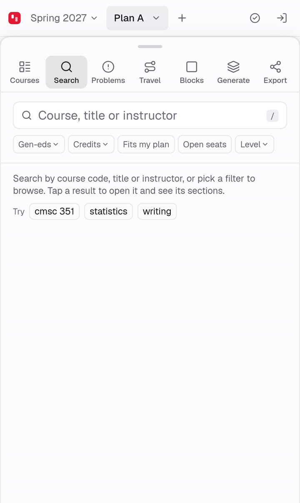 | **2. Search tab at full** (ok, 4 s) after: tap {"target":"[data-vaul-drawer] nav[aria-label=\"Tabs\"] button \"Search\"","at":{"x":87,"y":95}} viewport 393×659, visual 659 tall at 0, scrollY 0 drawer full, top 48, inside 611px page processes 551 MB (1, largest 551 MB) focus button at y 73–116 panel "Search" |
|  | **3. tapped the search box (+150 ms)** (ok, 4 s) after: tap {"target":"input[aria-label=\"Search courses\"]","at":{"x":196,"y":151}} viewport 393×659, visual 659 tall at 0, scrollY 0 drawer full, top 48, inside 611px page processes 551 MB (1, largest 551 MB) focus input[aria-label="Search courses"] at y 134–168 panel "Search" |
|  | **4. tapped the search box (+500 ms)** (ok, 5 s) viewport 393×659, visual 659 tall at 0, scrollY 0 drawer full, top 48, inside 611px page processes 552 MB (1, largest 552 MB) focus input[aria-label="Search courses"] at y 134–168 panel "Search" |
|  | **5. tapped the search box (+1000 ms)** (ok, 6 s) viewport 393×659, visual 659 tall at 0, scrollY 0 drawer full, top 48, inside 611px page processes 551 MB (1, largest 551 MB) focus input[aria-label="Search courses"] at y 134–168 panel "Search" |
|  | **6. tapped the search box (+2000 ms)** (ok, 7 s) viewport 393×659, visual 659 tall at 0, scrollY 0 drawer full, top 48, inside 611px page processes 552 MB (1, largest 552 MB) focus input[aria-label="Search courses"] at y 134–168 panel "Search" |
| 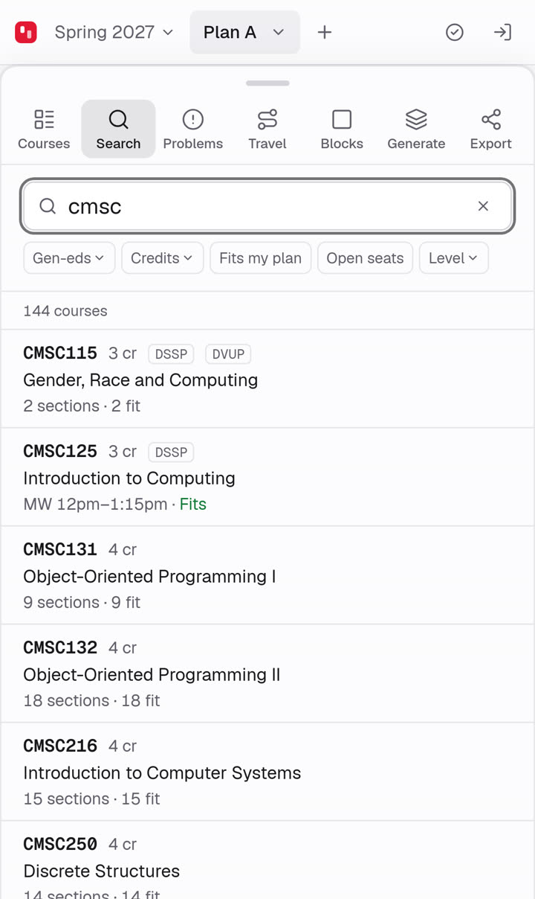 | **7. typed "cmsc"** (ok, 9 s) after: type {"text":"cmsc"} viewport 393×659, visual 659 tall at 0, scrollY 0 drawer full, top 48, inside 611px page processes 583 MB (1, largest 583 MB) focus input[aria-label="Search courses"] at y 134–168 panel "Search" |
| 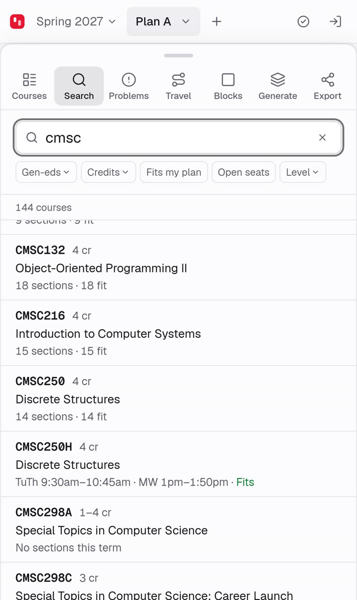 | **8. scrolled the results** (ok, 10 s) after: swipe {"from":null,"start":{"x":197,"y":576},"end":{"x":197,"y":376},"ms":500,"intent":"scroll"} viewport 393×659, visual 659 tall at 0, scrollY 0 drawer full, top 48, inside 611px page processes 580 MB (1, largest 580 MB) focus input[aria-label="Search courses"] at y 134–168 panel "Search" |
|  | **9. put the keyboard away** (ok, 11 s) after: hide keyboard {} viewport 393×659, visual 659 tall at 0, scrollY 0 drawer full, top 48, inside 611px page processes 580 MB (1, largest 580 MB) panel "Search" |
| 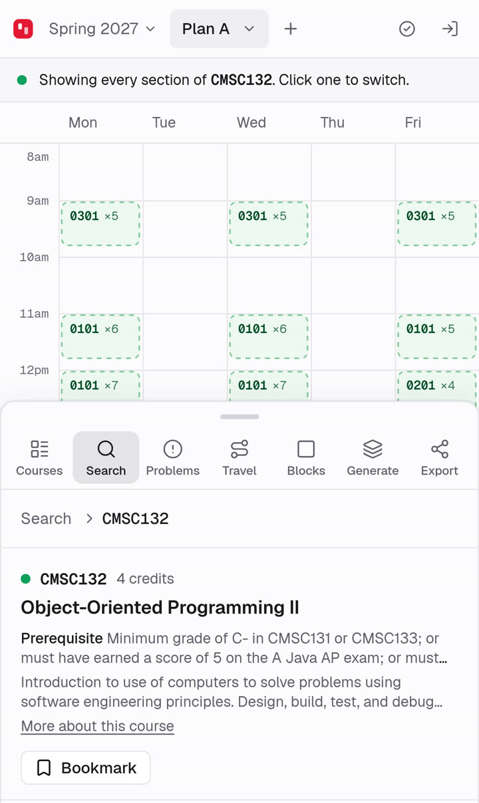 | **10. opened a result** (ok, 13 s) after: tap {"target":"#search-results [data-course-result]","at":{"x":197,"y":294}} viewport 393×659, visual 659 tall at 0, scrollY 0 drawer half, top 329, inside 330px page processes 640 MB (1, largest 640 MB) focus section[aria-label="CMSC132"] at y 402–660 panel "Object-Oriented Programming II" |

## Search with the on-screen keyboard from peek: tap the box, type, scroll, put the keyboard away, open a result

`keyboard-at-peek` · [recording](keyboard-at-peek/video.webm)

| Screen | Step |
|---|---|
|  | **1. loaded** (ok, 2 s) viewport 393×659, visual 659 tall at 0, scrollY 0 drawer full, top 48, inside 611px page processes 561 MB (1, largest 561 MB) panel "Plan A" events: installed |
| 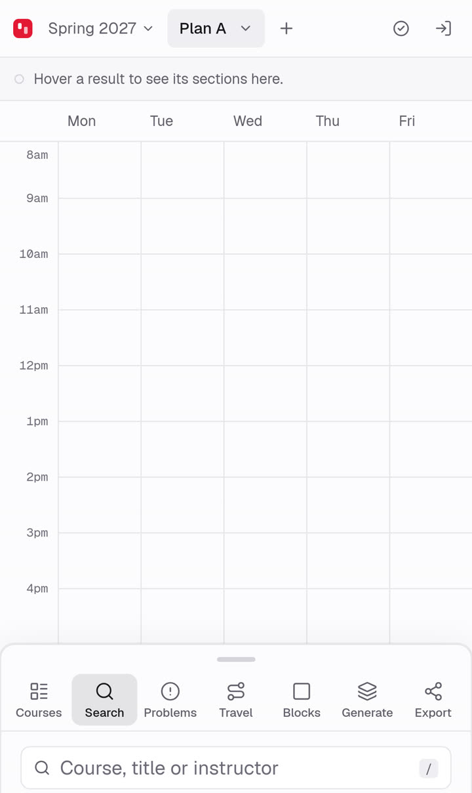 | **2. Search tab at peek** (ok, 4 s) after: tap {"target":"[data-vaul-drawer] nav[aria-label=\"Tabs\"] button \"Search\"","at":{"x":87,"y":95}} after: tap {"target":"[data-vaul-drawer] button[aria-label$=\"the panel\"]","at":{"x":197,"y":61}} viewport 393×659, visual 659 tall at 0, scrollY 0 drawer peek, top 535, inside 124px page processes 562 MB (1, largest 562 MB) focus button[aria-label="Raise the panel"] at y 536–560 panel "Search" |
|  | **3. tapped the search box (+150 ms)** (ok, 5 s) after: tap {"target":"input[aria-label=\"Search courses\"]","at":{"x":196,"y":638}} viewport 393×659, visual 659 tall at 0, scrollY 0 drawer full, top 48, inside 611px page processes 571 MB (1, largest 571 MB) focus input[aria-label="Search courses"] at y 134–168 panel "Search" |
|  | **4. tapped the search box (+500 ms)** (ok, 6 s) viewport 393×659, visual 659 tall at 0, scrollY 0 drawer full, top 48, inside 611px page processes 571 MB (1, largest 571 MB) focus input[aria-label="Search courses"] at y 134–168 panel "Search" |
| 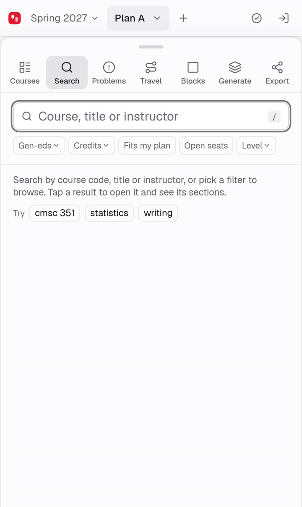 | **5. tapped the search box (+1000 ms)** (ok, 6 s) viewport 393×659, visual 659 tall at 0, scrollY 0 drawer full, top 48, inside 611px page processes 572 MB (1, largest 572 MB) focus input[aria-label="Search courses"] at y 134–168 panel "Search" |
|  | **6. tapped the search box (+2000 ms)** (ok, 8 s) viewport 393×659, visual 659 tall at 0, scrollY 0 drawer full, top 48, inside 611px page processes 573 MB (1, largest 573 MB) focus input[aria-label="Search courses"] at y 134–168 panel "Search" |
|  | **7. typed "cmsc"** (ok, 9 s) after: type {"text":"cmsc"} viewport 393×659, visual 659 tall at 0, scrollY 0 drawer full, top 48, inside 611px page processes 597 MB (1, largest 597 MB) focus input[aria-label="Search courses"] at y 134–168 panel "Search" |
|  | **8. scrolled the results** (ok, 11 s) after: swipe {"from":null,"start":{"x":197,"y":576},"end":{"x":197,"y":376},"ms":500,"intent":"scroll"} viewport 393×659, visual 659 tall at 0, scrollY 0 drawer full, top 48, inside 611px page processes 598 MB (1, largest 598 MB) focus input[aria-label="Search courses"] at y 134–168 panel "Search" |
| 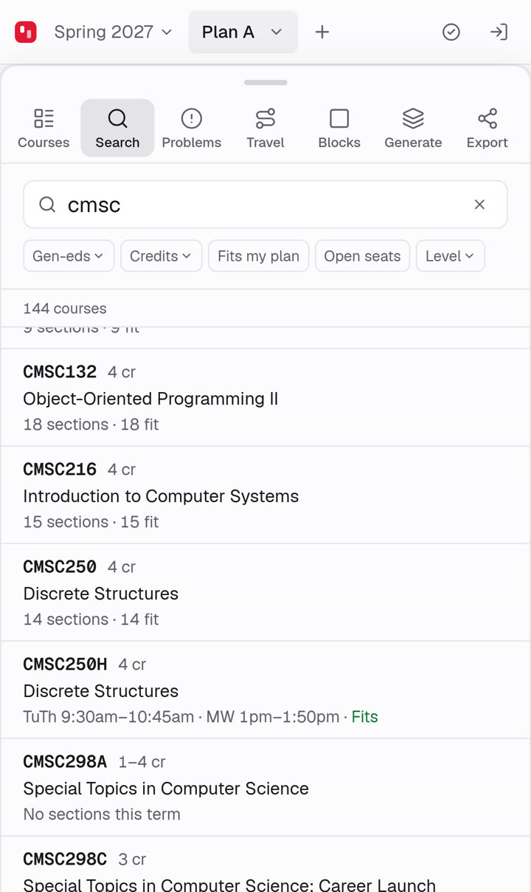 | **9. put the keyboard away** (ok, 12 s) after: hide keyboard {} viewport 393×659, visual 659 tall at 0, scrollY 0 drawer full, top 48, inside 611px page processes 598 MB (1, largest 598 MB) panel "Search" |
|  | **10. opened a result** (ok, 14 s) after: tap {"target":"#search-results [data-course-result]","at":{"x":197,"y":294}} viewport 393×659, visual 659 tall at 0, scrollY 0 drawer half, top 329, inside 330px page processes 645 MB (1, largest 645 MB) focus section[aria-label="CMSC132"] at y 402–660 panel "Object-Oriented Programming II" |

## First load

`first-load` · [recording](first-load/video.webm)

| Screen | Step |
|---|---|
| 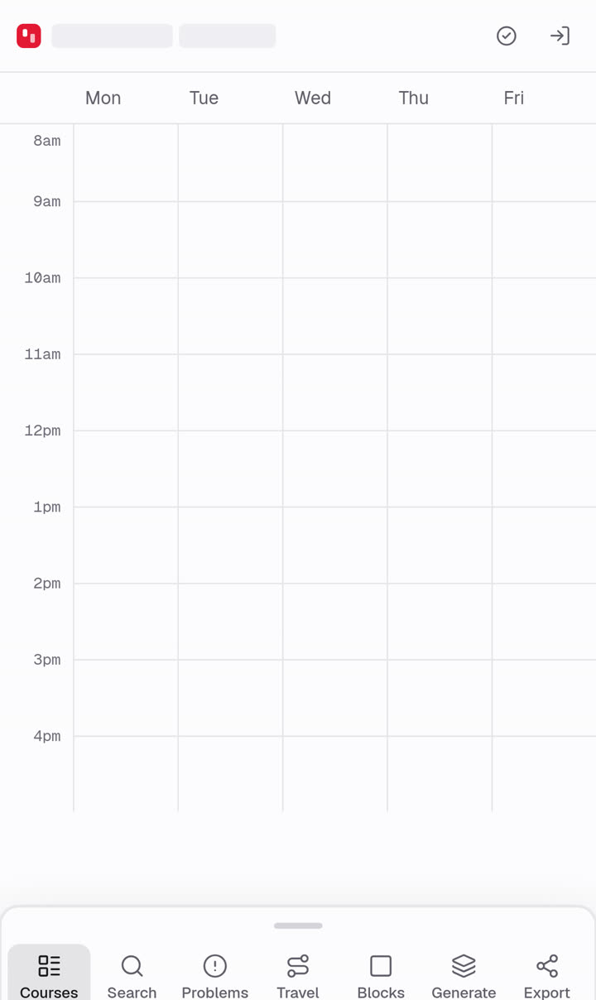 | **1. shell up** (ok, 1 s) viewport 393×659, visual 659 tall at 0, scrollY 0 drawer half, top 446.5, inside 330px page processes 454 MB (1, largest 454 MB) panel "Plan A" events: installed |
|  | **2. settled** (ok, 4 s) viewport 393×659, visual 659 tall at 0, scrollY 0 drawer full, top 48, inside 611px page processes 545 MB (1, largest 545 MB) panel "Plan A" |

## Tap each drawer tab, then the open one again

`tabs` · [recording](tabs/video.webm)

| Screen | Step |
|---|---|
|  | **1. Search tab** (ok, 3 s) after: tap {"target":"[data-vaul-drawer] nav[aria-label=\"Tabs\"] button \"Search\"","at":{"x":87,"y":95}} viewport 393×659, visual 659 tall at 0, scrollY 0 drawer full, top 48, inside 611px page processes 553 MB (1, largest 553 MB) focus button at y 73–116 panel "Search" events: installed |
| 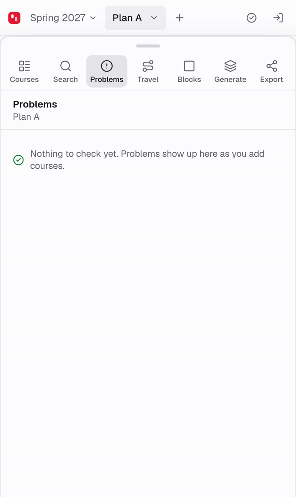 | **2. Problems tab** (ok, 5 s) after: tap {"target":"[data-vaul-drawer] nav[aria-label=\"Tabs\"] button \"Problems\"","at":{"x":142,"y":95}} viewport 393×659, visual 659 tall at 0, scrollY 0 drawer full, top 48, inside 611px page processes 561 MB (1, largest 561 MB) focus button at y 73–116 panel "Problems" |
| 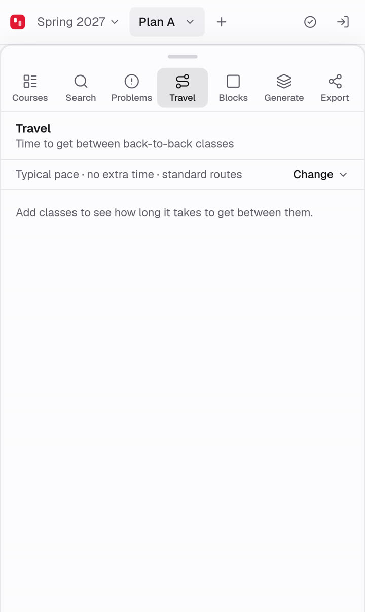 | **3. Travel tab** (ok, 7 s) after: tap {"target":"[data-vaul-drawer] nav[aria-label=\"Tabs\"] button \"Travel\"","at":{"x":197,"y":95}} viewport 393×659, visual 659 tall at 0, scrollY 0 drawer full, top 48, inside 611px page processes 545 MB (1, largest 545 MB) focus button at y 73–116 panel "Travel" |
| 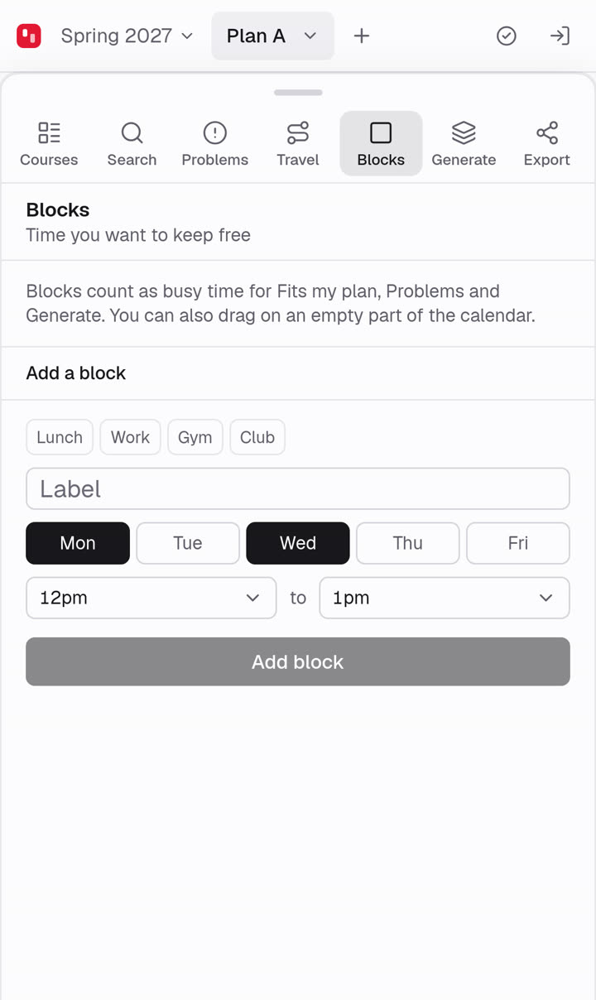 | **4. Blocks tab** (ok, 9 s) after: tap {"target":"[data-vaul-drawer] nav[aria-label=\"Tabs\"] button \"Blocks\"","at":{"x":251,"y":95}} viewport 393×659, visual 659 tall at 0, scrollY 0 drawer full, top 48, inside 611px page processes 556 MB (1, largest 556 MB) focus button at y 73–116 panel "Blocks" |
| 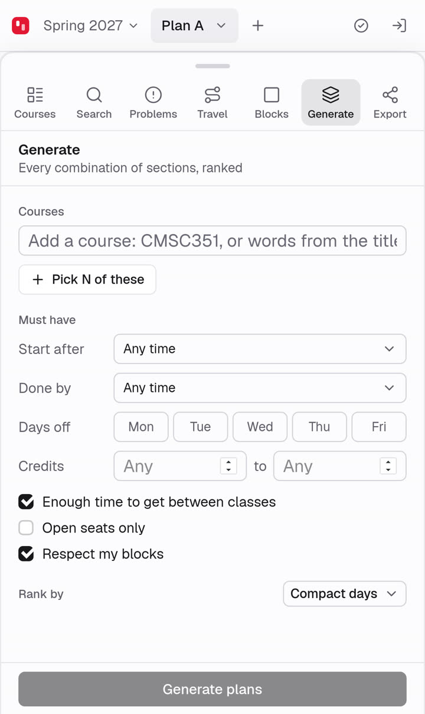 | **5. Generate tab** (ok, 10 s) after: tap {"target":"[data-vaul-drawer] nav[aria-label=\"Tabs\"] button \"Generate\"","at":{"x":306,"y":95}} viewport 393×659, visual 659 tall at 0, scrollY 0 drawer full, top 48, inside 611px page processes 566 MB (1, largest 566 MB) focus button at y 73–116 panel "Generate" |
| 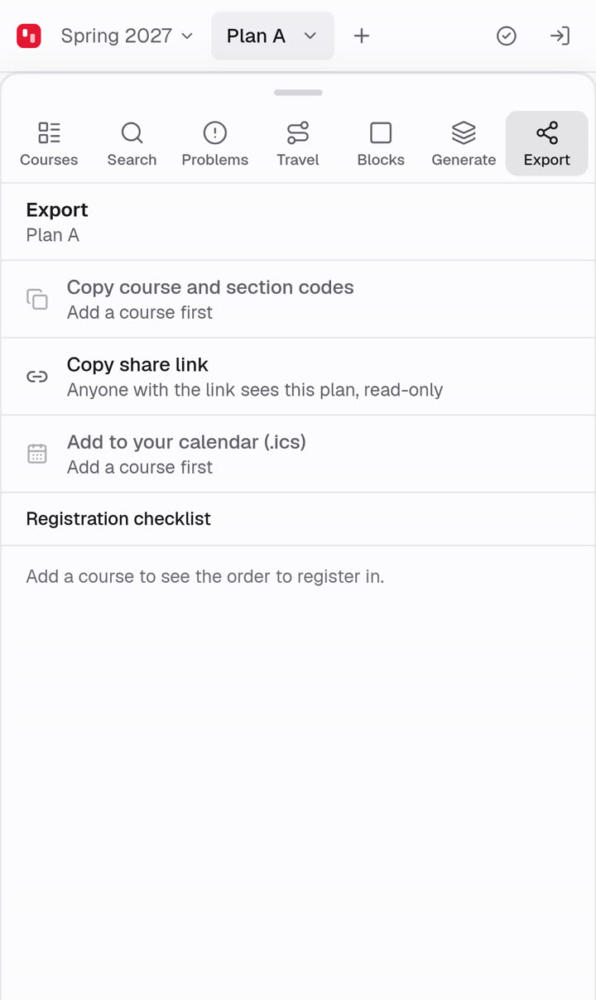 | **6. Export tab** (ok, 11 s) after: tap {"target":"[data-vaul-drawer] nav[aria-label=\"Tabs\"] button \"Export\"","at":{"x":361,"y":95}} viewport 393×659, visual 659 tall at 0, scrollY 0 drawer full, top 48, inside 611px page processes 556 MB (1, largest 556 MB) focus button at y 73–116 panel "Export" |
| 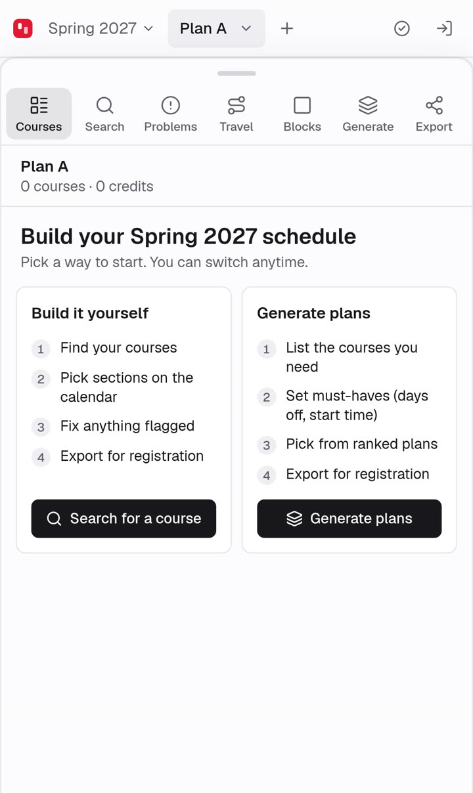 | **7. Courses tab** (ok, 12 s) after: tap {"target":"[data-vaul-drawer] nav[aria-label=\"Tabs\"] button \"Courses\"","at":{"x":32,"y":95}} viewport 393×659, visual 659 tall at 0, scrollY 0 drawer full, top 48, inside 611px page processes 560 MB (1, largest 560 MB) focus button at y 73–116 panel "Plan A" |
|  | **8. tapped the open tab** (ok, 14 s) after: tap {"target":"[data-vaul-drawer] nav[aria-label=\"Tabs\"] button \"Courses\"","at":{"x":32,"y":95}} viewport 393×659, visual 659 tall at 0, scrollY 0 drawer peek, top 535, inside 124px page processes 583 MB (1, largest 583 MB) focus button at y 560–603 panel "Plan A" |

## Drag the grabber peek → half → full → peek

`grabber-drag`

Skipped on this engine: Playwright can't send WebKit a touch drag, and vaul doesn't follow its mouse drags as a finger's.

## Pull down on a list at its top, at each snap

`pull-lists` · [recording](pull-lists/video.webm)

| Screen | Step |
|---|---|
| 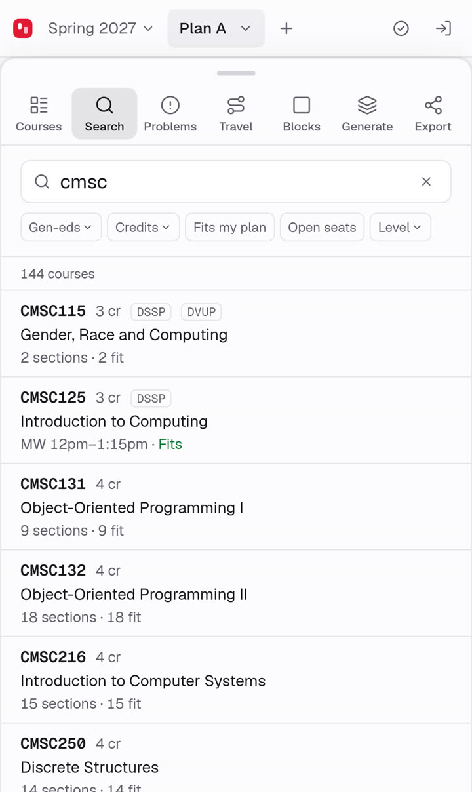 | **1. results at full** (ok, 6 s) after: tap {"target":"[data-vaul-drawer] nav[aria-label=\"Tabs\"] button \"Search\"","at":{"x":87,"y":95}} after: tap {"target":"input[aria-label=\"Search courses\"]","at":{"x":196,"y":151}} after: type {"text":"cmsc"} after: hide keyboard {} viewport 393×659, visual 659 tall at 0, scrollY 0 drawer full, top 48, inside 611px page processes 581 MB (1, largest 581 MB) panel "Search" events: installed |
| 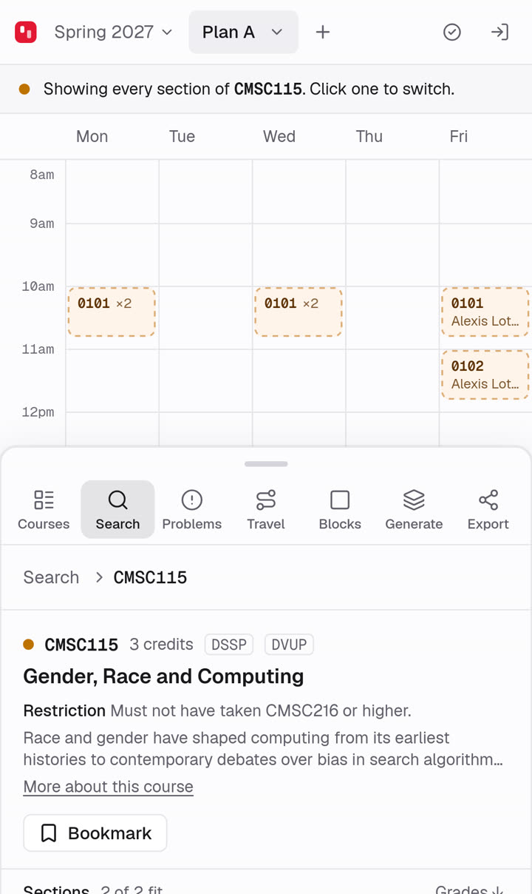 | **2. pulled down at full** (ok, 9 s) after: swipe {"from":null,"start":{"x":197,"y":262},"end":{"x":197,"y":562},"ms":600,"intent":"drag"} viewport 393×659, visual 659 tall at 0, scrollY 0 drawer half, top 329, inside 330px page processes 619 MB (1, largest 619 MB) focus section[aria-label="CMSC115"] at y 402–660 panel "Gender, Race and Computing" |
|  | **3. results at half** (ok, 10 s) viewport 393×659, visual 659 tall at 0, scrollY 0 drawer half, top 329, inside 330px page processes 619 MB (1, largest 619 MB) focus section[aria-label="CMSC115"] at y 402–660 panel "Gender, Race and Computing" |
|  | **4. pulled down at half** (ok, 12 s) after: swipe {"from":null,"start":{"x":197,"y":362},"end":{"x":197,"y":662},"ms":600,"intent":"drag"} viewport 393×659, visual 659 tall at 0, scrollY 0 drawer half, top 329, inside 330px page processes 627 MB (1, largest 627 MB) focus button at y 354–397 panel "Travel" |
| 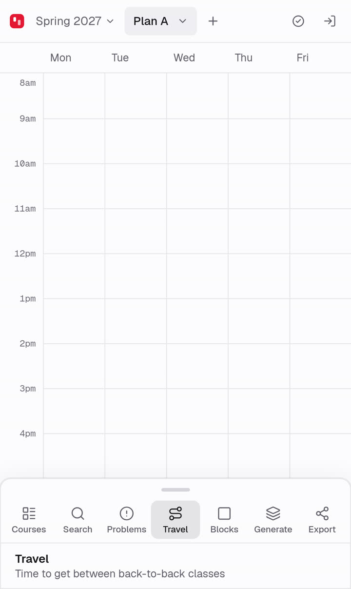 | **5. results at peek** (ok, 14 s) after: tap {"target":"[data-vaul-drawer] button[aria-label$=\"the panel\"]","at":{"x":197,"y":342}} after: tap {"target":"[data-vaul-drawer] button[aria-label$=\"the panel\"]","at":{"x":197,"y":61}} viewport 393×659, visual 659 tall at 0, scrollY 0 drawer peek, top 535, inside 124px page processes 631 MB (1, largest 631 MB) focus button[aria-label="Raise the panel"] at y 536–560 panel "Travel" |
| 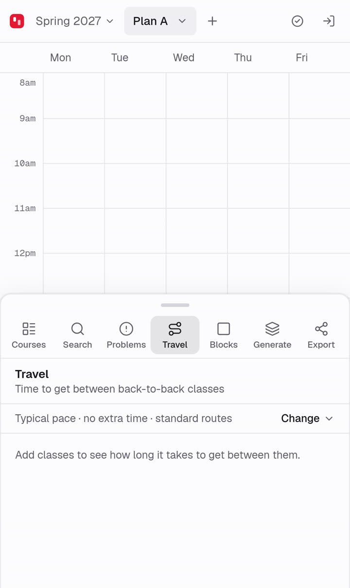 | **6. pulled down at peek** (ok, 17 s) after: swipe {"from":null,"start":{"x":197,"y":568},"end":{"x":197,"y":868},"ms":600,"intent":"drag"} viewport 393×659, visual 659 tall at 0, scrollY 0 drawer half, top 329, inside 330px page processes 631 MB (1, largest 631 MB) focus button at y 354–397 panel "Travel" |
| 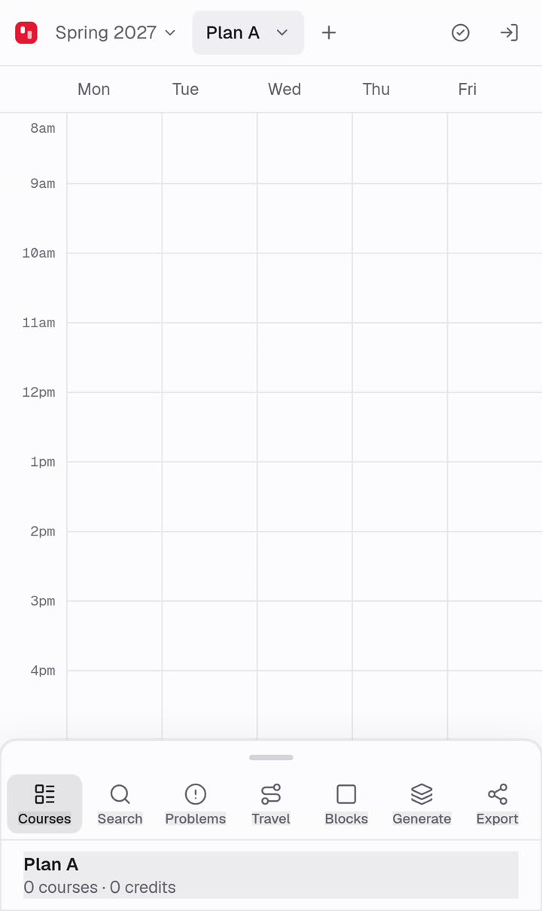 | **7. pulled down on Courses at half** (ok, 20 s) after: tap {"target":"[data-vaul-drawer] nav[aria-label=\"Tabs\"] button \"Courses\"","at":{"x":32,"y":376}} after: swipe {"from":null,"start":{"x":197,"y":474},"end":{"x":197,"y":774},"ms":600,"intent":"drag"} viewport 393×659, visual 659 tall at 0, scrollY 0 drawer peek, top 535, inside 124px page processes 635 MB (1, largest 635 MB) focus section at y 608–660 panel "Plan A" |

## Scroll a long list down, then back up: the drawer stays

`scroll-list-back` · [recording](scroll-list-back/video.webm)

| Screen | Step |
|---|---|
| 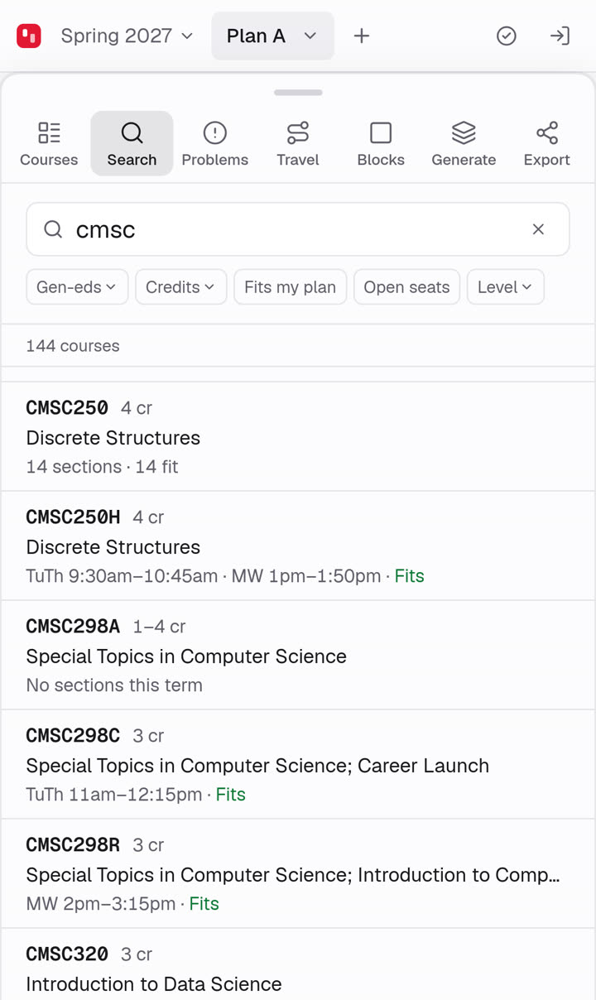 | **1. scrolled down** (ok, 7 s) after: tap {"target":"[data-vaul-drawer] nav[aria-label=\"Tabs\"] button \"Search\"","at":{"x":87,"y":95}} after: tap {"target":"input[aria-label=\"Search courses\"]","at":{"x":196,"y":151}} after: type {"text":"cmsc"} after: hide keyboard {} after: swipe {"from":null,"start":{"x":197,"y":556},"end":{"x":197,"y":206},"ms":400,"intent":"scroll"} viewport 393×659, visual 659 tall at 0, scrollY 0 drawer full, top 48, inside 611px page processes 580 MB (1, largest 580 MB) panel "Search" events: installed |
| 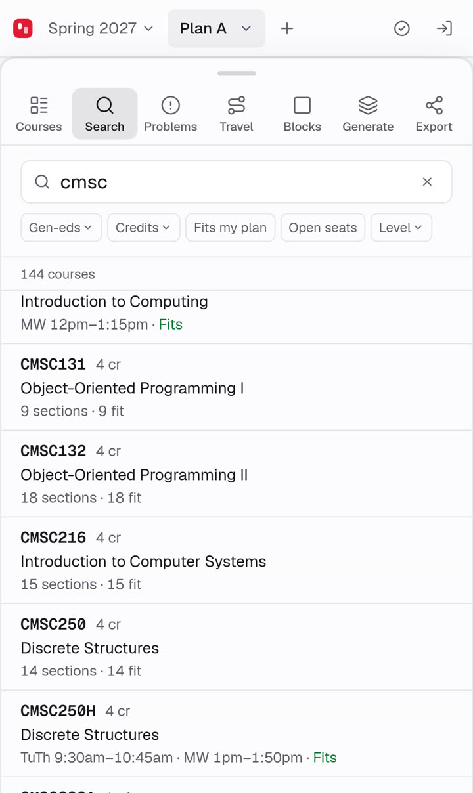 | **2. scrolled back up** (ok, 8 s) after: swipe {"from":null,"start":{"x":197,"y":367},"end":{"x":197,"y":617},"ms":400,"intent":"scroll"} viewport 393×659, visual 659 tall at 0, scrollY 0 drawer full, top 48, inside 611px page processes 592 MB (1, largest 592 MB) panel "Search" |

## Scroll the calendar, then pull down at its top

`calendar-pull` · [recording](calendar-pull/video.webm)

| Screen | Step |
|---|---|
|  | **1. scrolled the calendar down** (ok, 4 s) after: tap {"target":"[data-vaul-drawer] button[aria-label$=\"the panel\"]","at":{"x":197,"y":61}} after: swipe {"from":null,"start":{"x":197,"y":340},"end":{"x":197,"y":90},"ms":500,"intent":"scroll"} viewport 393×659, visual 659 tall at 0, scrollY 0 drawer peek, top 535, inside 124px page processes 539 MB (1, largest 539 MB) focus button[aria-label="Raise the panel"] at y 536–560 panel "Plan A" events: installed |
|  | **2. pulled down at the top** (ok, 7 s) after: swipe {"from":null,"start":{"x":197,"y":121},"end":{"x":197,"y":471},"ms":500,"intent":"scroll"} after: swipe {"from":null,"start":{"x":197,"y":121},"end":{"x":197,"y":471},"ms":500,"intent":"scroll"} viewport 393×659, visual 659 tall at 0, scrollY 0 drawer peek, top 535, inside 124px page processes 555 MB (1, largest 555 MB) focus button[aria-label="Raise the panel"] at y 536–560 panel "Plan A" |

## Rotate to landscape and back

`rotate` · [recording](rotate/video.webm)

| Screen | Step |
|---|---|
|  | **1. portrait** (ok, 2 s) viewport 393×659, visual 659 tall at 0, scrollY 0 drawer full, top 48, inside 611px page processes 549 MB (1, largest 549 MB) panel "Plan A" events: installed |
| 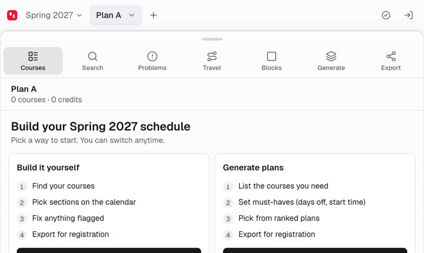 | **2. landscape** (ok, 5 s) after: rotate {"orientation":"landscape"} viewport 659×393, visual 393 tall at 0, scrollY 0 drawer full, top 48, inside 345px page processes 611 MB (1, largest 611 MB) panel "Plan A" events: orientationchange, resize, vv-resize |
|  | **3. landscape, half** (ok, 7 s) after: tap {"target":"[data-vaul-drawer] button[aria-label$=\"the panel\"]","at":{"x":330,"y":61}} after: tap {"target":"[data-vaul-drawer] button[aria-label$=\"the panel\"]","at":{"x":330,"y":282}} viewport 659×393, visual 393 tall at 0, scrollY 0 drawer half, top 48, inside 345px page processes 638 MB (1, largest 638 MB) focus button[aria-label="Raise the panel"] at y 49–73 panel "Plan A" |
| 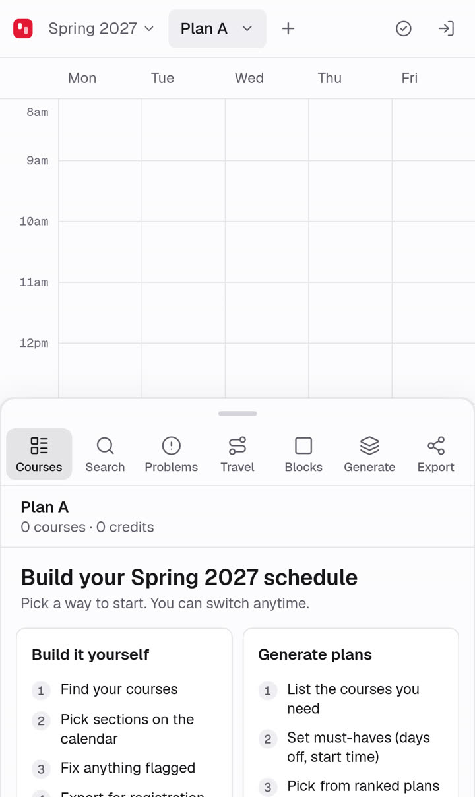 | **4. portrait again** (ok, 9 s) after: rotate {"orientation":"portrait"} viewport 393×659, visual 659 tall at 0, scrollY 0 drawer half, top 329, inside 330px page processes 665 MB (1, largest 665 MB) focus button[aria-label="Raise the panel"] at y 330–354 panel "Plan A" events: orientationchange, resize, vv-resize |

## Scroll to collapse and expand the browser's toolbar

`url-bar` · [recording](url-bar/video.webm)

| Screen | Step |
|---|---|
| 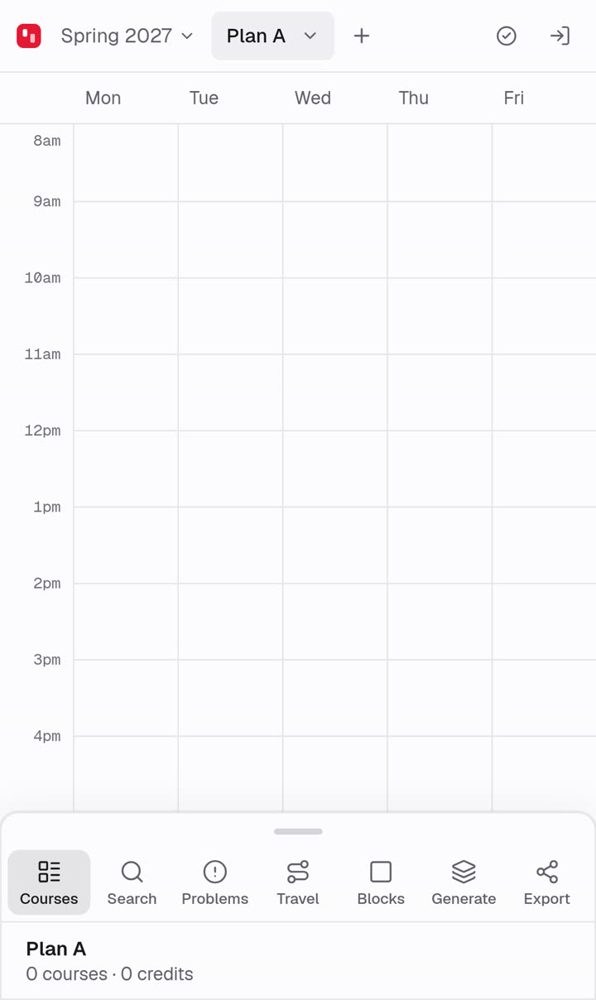 | **1. start** (ok, 3 s) after: tap {"target":"[data-vaul-drawer] button[aria-label$=\"the panel\"]","at":{"x":197,"y":61}} viewport 393×659, visual 659 tall at 0, scrollY 0 drawer peek, top 535, inside 124px page processes 556 MB (1, largest 556 MB) focus button[aria-label="Raise the panel"] at y 536–560 panel "Plan A" events: installed |
|  | **2. scrolled the calendar up (toolbar may hide)** (ok, 4 s) after: swipe {"from":null,"start":{"x":197,"y":389},"end":{"x":197,"y":89},"ms":400,"intent":"scroll"} viewport 393×659, visual 659 tall at 0, scrollY 0 drawer peek, top 535, inside 124px page processes 555 MB (1, largest 555 MB) focus button[aria-label="Raise the panel"] at y 536–560 panel "Plan A" |
|  | **3. scrolled it back (toolbar may show)** (ok, 6 s) after: swipe {"from":null,"start":{"x":197,"y":389},"end":{"x":197,"y":689},"ms":400,"intent":"scroll"} viewport 393×659, visual 659 tall at 0, scrollY 0 drawer peek, top 535, inside 124px page processes 556 MB (1, largest 556 MB) focus button[aria-label="Raise the panel"] at y 536–560 panel "Plan A" |
| 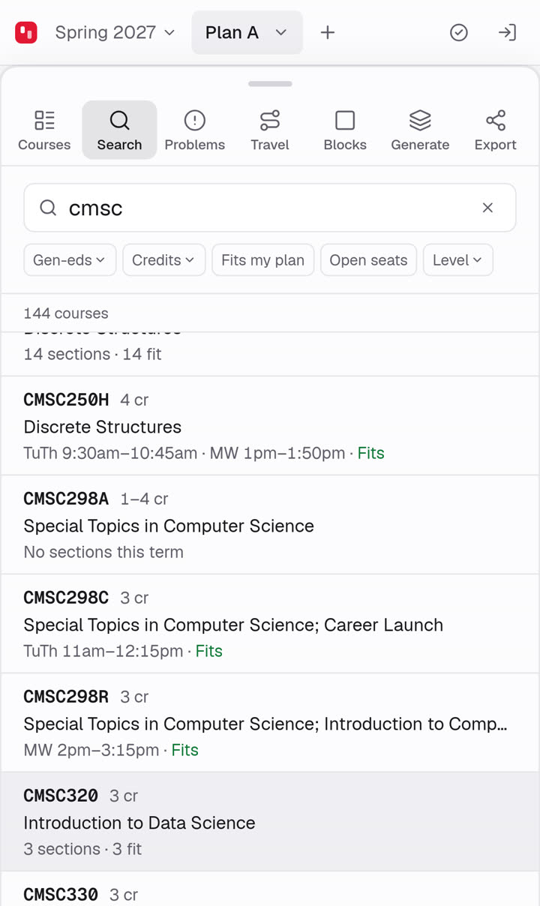 | **4. scrolled the results** (ok, 10 s) after: tap {"target":"[data-vaul-drawer] nav[aria-label=\"Tabs\"] button \"Search\"","at":{"x":87,"y":582}} after: tap {"target":"input[aria-label=\"Search courses\"]","at":{"x":196,"y":432}} after: type {"text":"cmsc"} after: hide keyboard {} after: swipe {"from":null,"start":{"x":197,"y":576},"end":{"x":197,"y":176},"ms":400,"intent":"scroll"} viewport 393×659, visual 659 tall at 0, scrollY 0 drawer full, top 48, inside 611px page processes 604 MB (1, largest 604 MB) panel "Search" |
| 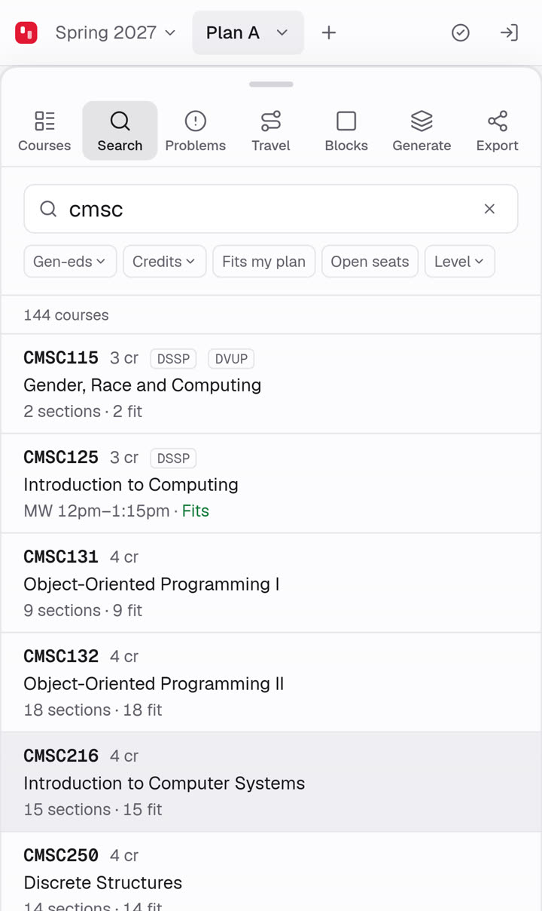 | **5. scrolled them back** (ok, 12 s) after: swipe {"from":null,"start":{"x":197,"y":576},"end":{"x":197,"y":976},"ms":400,"intent":"scroll"} viewport 393×659, visual 659 tall at 0, scrollY 0 drawer full, top 48, inside 611px page processes 593 MB (1, largest 593 MB) panel "Search" |

## A long course (ENGL101, 90+ sections) scrolled to the bottom

`long-course` · [recording](long-course/video.webm)

| Screen | Step |
|---|---|
| 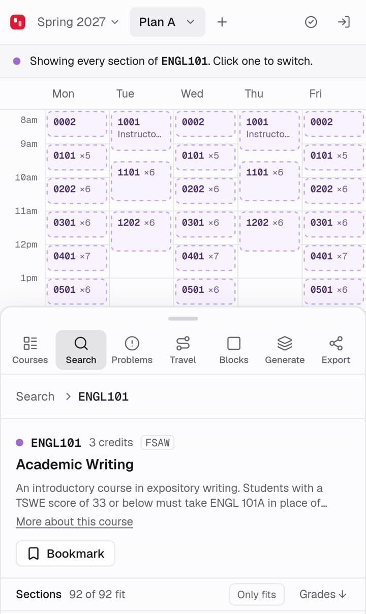 | **1. ENGL101** (ok, 9 s) after: tap {"target":"[data-vaul-drawer] nav[aria-label=\"Tabs\"] button \"Search\"","at":{"x":87,"y":95}} after: tap {"target":"input[aria-label=\"Search courses\"]","at":{"x":196,"y":151}} after: type {"text":"engl101"} after: hide keyboard {} after: tap {"target":"[data-course-result=\"ENGL101\"]","at":{"x":197,"y":278}} viewport 393×659, visual 659 tall at 0, scrollY 0 drawer half, top 329, inside 330px page processes 655 MB (1, largest 655 MB) focus section[aria-label="ENGL101"] at y 402–660 panel "Academic Writing" events: installed |
| 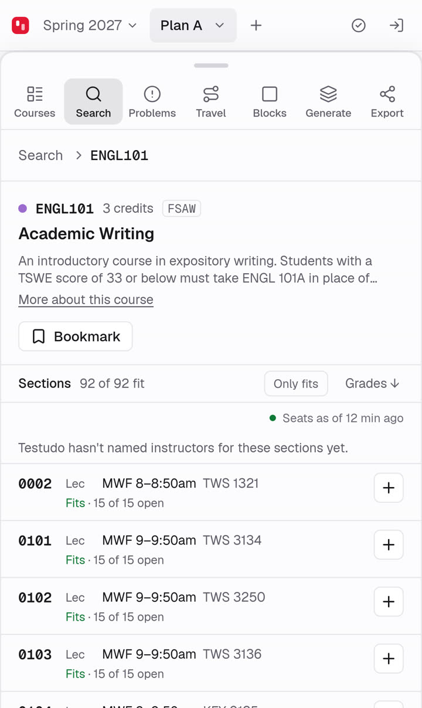 | **2. ENGL101 at full** (ok, 10 s) after: tap {"target":"[data-vaul-drawer] button[aria-label$=\"the panel\"]","at":{"x":197,"y":342}} viewport 393×659, visual 659 tall at 0, scrollY 0 drawer full, top 48, inside 611px page processes 659 MB (1, largest 659 MB) focus button[aria-label="Lower the panel"] at y 49–73 panel "Academic Writing" |
| 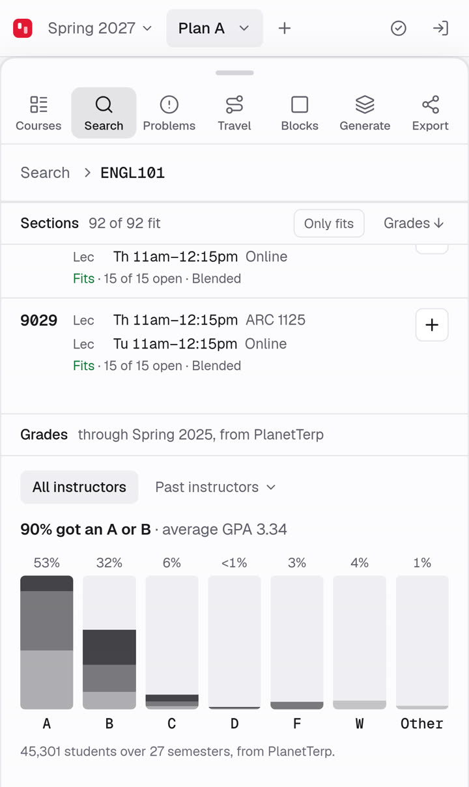 | **3. scrolled to the bottom** (ok, 17 s) after: swipe {"from":null,"start":{"x":197,"y":562},"end":{"x":197,"y":112},"ms":300,"intent":"scroll"} after: swipe {"from":null,"start":{"x":197,"y":562},"end":{"x":197,"y":112},"ms":300,"intent":"scroll"} after: swipe {"from":null,"start":{"x":197,"y":562},"end":{"x":197,"y":112},"ms":300,"intent":"scroll"} after: swipe {"from":null,"start":{"x":197,"y":562},"end":{"x":197,"y":112},"ms":300,"intent":"scroll"} after: swipe {"from":null,"start":{"x":197,"y":562},"end":{"x":197,"y":112},"ms":300,"intent":"scroll"} after: swipe {"from":null,"start":{"x":197,"y":562},"end":{"x":197,"y":112},"ms":300,"intent":"scroll"} after: swipe {"from":null,"start":{"x":197,"y":562},"end":{"x":197,"y":112},"ms":300,"intent":"scroll"} after: swipe {"from":null,"start":{"x":197,"y":562},"end":{"x":197,"y":112},"ms":300,"intent":"scroll"} after: swipe {"from":null,"start":{"x":197,"y":562},"end":{"x":197,"y":112},"ms":300,"intent":"scroll"} after: swipe {"from":null,"start":{"x":197,"y":562},"end":{"x":197,"y":112},"ms":300,"intent":"scroll"} after: swipe {"from":null,"start":{"x":197,"y":562},"end":{"x":197,"y":112},"ms":300,"intent":"scroll"} after: swipe {"from":null,"start":{"x":197,"y":562},"end":{"x":197,"y":112},"ms":300,"intent":"scroll"} after: swipe {"from":null,"start":{"x":197,"y":562},"end":{"x":197,"y":112},"ms":300,"intent":"scroll"} viewport 393×659, visual 659 tall at 0, scrollY 0 drawer full, top 48, inside 611px page processes 698 MB (1, largest 698 MB) focus button[aria-label="Lower the panel"] at y 49–73 panel "Academic Writing" |

## Search, scroll, put the keyboard away and open a result, six times

`open-results` · [recording](open-results/video.webm)

| Screen | Step |
|---|---|
|  | **1. opened a result (1)** (warn, 9 s) after: tap {"target":"[data-vaul-drawer] nav[aria-label=\"Tabs\"] button \"Search\"","at":{"x":87,"y":95}} after: tap {"target":"input[aria-label=\"Search courses\"]","at":{"x":196,"y":151}} after: type {"text":"cmsc"} after: tap {"target":"input[aria-label=\"Search courses\"]","at":{"x":194,"y":151}} after: swipe {"from":null,"start":{"x":197,"y":576},"end":{"x":197,"y":416},"ms":400,"intent":"scroll"} after: hide keyboard {} after: tap {"target":"#search-results [data-course-result]","at":{"x":197,"y":262}} viewport 393×659, visual 659 tall at 0, scrollY 0 drawer half, top 329, inside 330px page processes 618 MB (1, largest 618 MB) focus section[aria-label="CMSC131"] at y 402–660 panel "Object-Oriented Programming I" events: installed **warn drawer-moves-one-way**: 3 reversal(s) over 43 frames (48–569) |
|  | **2. opened a result (2)** (ok, 15 s) after: tap {"target":"nav[aria-label=\"Breadcrumb\"] button \"Search\"","at":{"x":38,"y":426}} after: tap {"target":"[data-vaul-drawer] button[aria-label$=\"the panel\"]","at":{"x":197,"y":342}} after: tap {"target":"input[aria-label=\"Search courses\"]","at":{"x":194,"y":151}} after: swipe {"from":null,"start":{"x":197,"y":576},"end":{"x":197,"y":416},"ms":400,"intent":"scroll"} after: hide keyboard {} after: tap {"target":"#search-results [data-course-result]","at":{"x":197,"y":262}} viewport 393×659, visual 659 tall at 0, scrollY 0 drawer half, top 329, inside 330px page processes 620 MB (1, largest 620 MB) focus section[aria-label="CMSC131"] at y 402–660 panel "Object-Oriented Programming I" |
|  | **3. opened a result (3)** (ok, 22 s) after: tap {"target":"nav[aria-label=\"Breadcrumb\"] button \"Search\"","at":{"x":38,"y":426}} after: tap {"target":"[data-vaul-drawer] button[aria-label$=\"the panel\"]","at":{"x":197,"y":342}} after: tap {"target":"input[aria-label=\"Search courses\"]","at":{"x":194,"y":151}} after: swipe {"from":null,"start":{"x":197,"y":576},"end":{"x":197,"y":416},"ms":400,"intent":"scroll"} after: hide keyboard {} after: tap {"target":"#search-results [data-course-result]","at":{"x":197,"y":262}} viewport 393×659, visual 659 tall at 0, scrollY 0 drawer half, top 329, inside 330px page processes 627 MB (1, largest 627 MB) focus section[aria-label="CMSC131"] at y 402–660 panel "Object-Oriented Programming I" |
|  | **4. opened a result (4)** (ok, 28 s) after: tap {"target":"nav[aria-label=\"Breadcrumb\"] button \"Search\"","at":{"x":38,"y":426}} after: tap {"target":"[data-vaul-drawer] button[aria-label$=\"the panel\"]","at":{"x":197,"y":342}} after: tap {"target":"input[aria-label=\"Search courses\"]","at":{"x":194,"y":151}} after: swipe {"from":null,"start":{"x":197,"y":576},"end":{"x":197,"y":416},"ms":400,"intent":"scroll"} after: hide keyboard {} after: tap {"target":"#search-results [data-course-result]","at":{"x":197,"y":262}} viewport 393×659, visual 659 tall at 0, scrollY 0 drawer half, top 329, inside 330px page processes 633 MB (1, largest 633 MB) focus section[aria-label="CMSC131"] at y 402–660 panel "Object-Oriented Programming I" |
| 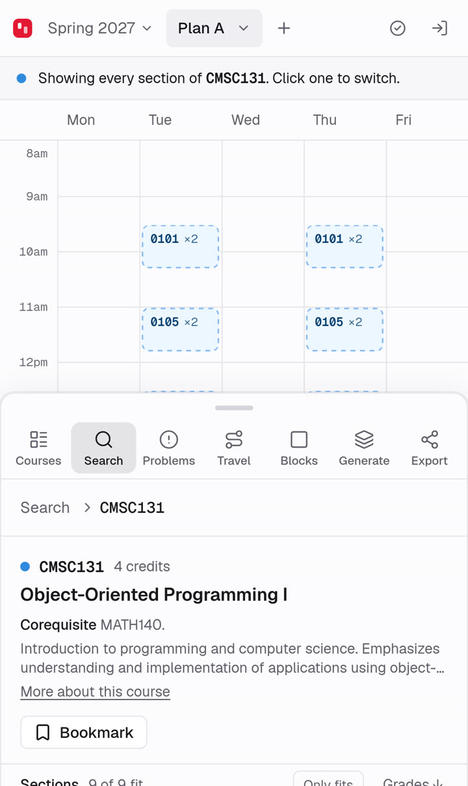 | **5. opened a result (5)** (ok, 34 s) after: tap {"target":"nav[aria-label=\"Breadcrumb\"] button \"Search\"","at":{"x":38,"y":426}} after: tap {"target":"[data-vaul-drawer] button[aria-label$=\"the panel\"]","at":{"x":197,"y":342}} after: tap {"target":"input[aria-label=\"Search courses\"]","at":{"x":194,"y":151}} after: swipe {"from":null,"start":{"x":197,"y":576},"end":{"x":197,"y":416},"ms":400,"intent":"scroll"} after: hide keyboard {} after: tap {"target":"#search-results [data-course-result]","at":{"x":197,"y":262}} viewport 393×659, visual 659 tall at 0, scrollY 0 drawer half, top 329, inside 330px page processes 643 MB (1, largest 643 MB) focus section[aria-label="CMSC131"] at y 402–660 panel "Object-Oriented Programming I" |
|  | **6. opened a result (6)** (ok, 40 s) after: tap {"target":"nav[aria-label=\"Breadcrumb\"] button \"Search\"","at":{"x":38,"y":426}} after: tap {"target":"[data-vaul-drawer] button[aria-label$=\"the panel\"]","at":{"x":197,"y":342}} after: tap {"target":"input[aria-label=\"Search courses\"]","at":{"x":194,"y":151}} after: swipe {"from":null,"start":{"x":197,"y":576},"end":{"x":197,"y":416},"ms":400,"intent":"scroll"} after: hide keyboard {} after: tap {"target":"#search-results [data-course-result]","at":{"x":197,"y":262}} viewport 393×659, visual 659 tall at 0, scrollY 0 drawer half, top 329, inside 330px page processes 637 MB (1, largest 637 MB) focus section[aria-label="CMSC131"] at y 402–660 panel "Object-Oriented Programming I" |

## Add a section from course details, then switch it three times

`add-sections` · [recording](add-sections/video.webm)

| Screen | Step |
|---|---|
| 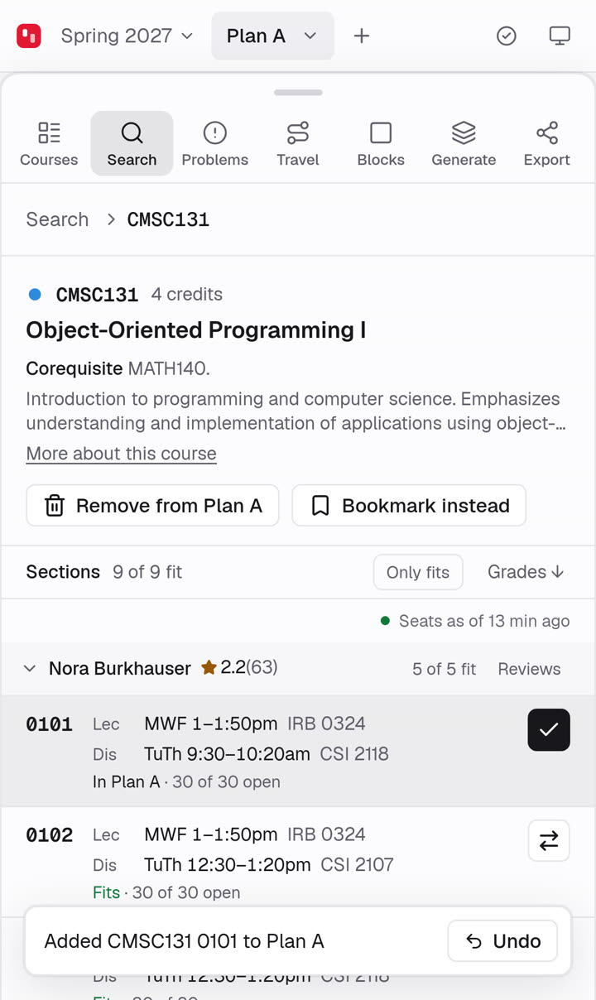 | **1. tapped Add 0101** (warn, 11 s) after: tap {"target":"[data-vaul-drawer] nav[aria-label=\"Tabs\"] button \"Search\"","at":{"x":87,"y":95}} after: tap {"target":"input[aria-label=\"Search courses\"]","at":{"x":196,"y":151}} after: type {"text":"cmsc131"} after: hide keyboard {} after: tap {"target":"[data-course-result=\"CMSC131\"]","at":{"x":197,"y":278}} after: tap {"target":"[data-vaul-drawer] button[aria-label$=\"the panel\"]","at":{"x":197,"y":342}} after: tap {"target":"[data-section] button[aria-label^=\"Add \"], [data-section] button[aria-label^=\"Switch to \"]","at":{"x":362,"y":481}} viewport 393×659, visual 659 tall at 0, scrollY 0 drawer full, top 48, inside 611px page processes 654 MB (1, largest 654 MB) focus button[aria-label="Remove 0101 from Plan A"] at y 467–495 panel "Object-Oriented Programming I" events: installed **warn drawer-moves-one-way**: 2 reversal(s) over 46 frames (48–540) |
| 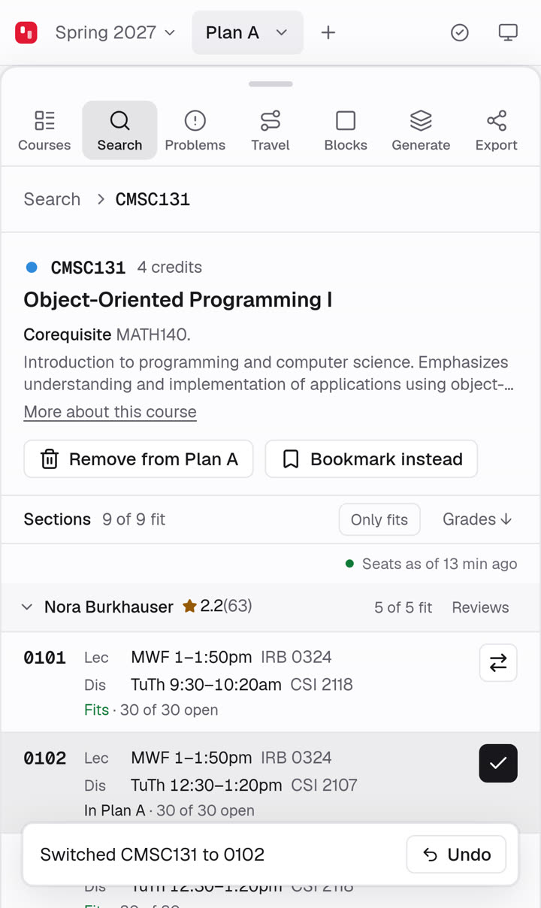 | **2. tapped Switch to 0102** (ok, 13 s) after: tap {"target":"[data-section] button[aria-label^=\"Add \"], [data-section] button[aria-label^=\"Switch to \"]","at":{"x":362,"y":554}} viewport 393×659, visual 659 tall at 0, scrollY 0 drawer full, top 48, inside 611px page processes 641 MB (1, largest 641 MB) focus button[aria-label="Remove 0102 from Plan A"] at y 540–568 panel "Object-Oriented Programming I" |
| 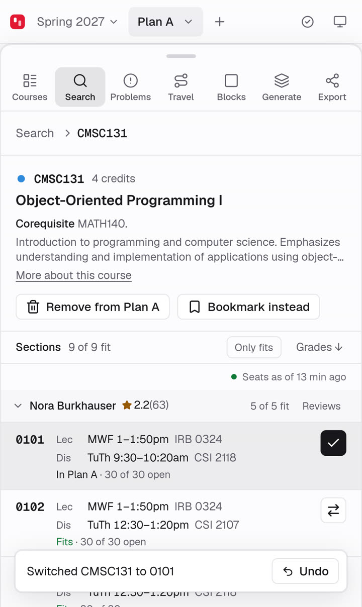 | **3. tapped Switch to 0101** (ok, 15 s) after: tap {"target":"[data-section] button[aria-label^=\"Add \"], [data-section] button[aria-label^=\"Switch to \"]","at":{"x":362,"y":481}} viewport 393×659, visual 659 tall at 0, scrollY 0 drawer full, top 48, inside 611px page processes 652 MB (1, largest 652 MB) focus button[aria-label="Remove 0101 from Plan A"] at y 467–495 panel "Object-Oriented Programming I" |
|  | **4. tapped Switch to 0102** (ok, 17 s) after: tap {"target":"[data-section] button[aria-label^=\"Add \"], [data-section] button[aria-label^=\"Switch to \"]","at":{"x":362,"y":554}} viewport 393×659, visual 659 tall at 0, scrollY 0 drawer full, top 48, inside 611px page processes 649 MB (1, largest 649 MB) focus button[aria-label="Remove 0102 from Plan A"] at y 540–568 panel "Object-Oriented Programming I" |
