# Mobile lab: ios

**Failed**: 1 failed check(s), 3 warning(s), 0 error(s).

- URL: https://pr-215-terpsicle.zsrobinson.workers.dev/schedule
- Device: iPhone 16 Simulator, iOS 18.5, Safari (XCUITest touches, software keyboard)
- Started: 2026-09-29T04:00:37.381Z, took 1188 s
- Workflow run: https://github.com/zsrobinson/terpsicle/actions/runs/36519223077
- Every step's full probe (viewport, drawer, focus, events, per-frame trace) is in `summary.json`.

| Scenario | Result | Steps | Time | Recording |
|---|---|---|---|---|
| [Search with the on-screen keyboard from half: tap the box, type, scroll, put the keyboard away, open a result](#keyboard-at-half) | ok | 10 | 127 s | [video](keyboard-at-half/video.mp4) |
| [Search with the on-screen keyboard from full: tap the box, type, scroll, put the keyboard away, open a result](#keyboard-at-full) | ok | 10 | 72 s | [video](keyboard-at-full/video.mp4) |
| [Search with the on-screen keyboard from peek: tap the box, type, scroll, put the keyboard away, open a result](#keyboard-at-peek) | ok | 10 | 77 s | [video](keyboard-at-peek/video.mp4) |
| [First load](#first-load) | ok | 2 | 16 s | [video](first-load/video.mp4) |
| [Tap each drawer tab, then the open one again](#tabs) | ok | 8 | 42 s | [video](tabs/video.mp4) |
| [Drag the grabber peek → half → full → peek](#grabber-drag) | ok | 4 | 42 s | [video](grabber-drag/video.mp4) |
| [Pull down on a list at its top, at each snap](#pull-lists) | warn | 7 | 55 s | [video](pull-lists/video.mp4) |
| [Scroll a long list down, then back up: the drawer stays](#scroll-list-back) | ok | 2 | 38 s | [video](scroll-list-back/video.mp4) |
| [Scroll the calendar, then pull down at its top](#calendar-pull) | ok | 2 | 28 s | [video](calendar-pull/video.mp4) |
| [Rotate to landscape and back](#rotate) | ok | 3 | 23 s | [video](rotate/video.mp4) |
| [Scroll to collapse and expand the browser's toolbar](#url-bar) | ok | 5 | 52 s | [video](url-bar/video.mp4) |
| [A long course (ENGL101, 90+ sections) scrolled to the bottom](#long-course) | warn | 3 | 82 s | [video](long-course/video.mp4) |
| [Search, scroll, put the keyboard away and open a result, six times](#open-results) | FAIL | 6 | 179 s | [video](open-results/video.mp4) |
| [Add a section from course details, then switch it three times](#add-sections) | warn | 4 | 67 s | [video](add-sections/video.mp4) |
| [Open a course, then swipe back from the screen's left edge: the page moves once](#swipe-back) | ok | 4 | 58 s | [video](swipe-back/video.mp4) |

## Search with the on-screen keyboard from half: tap the box, type, scroll, put the keyboard away, open a result

`keyboard-at-half` · [recording](keyboard-at-half/video.mp4)

| Screen | Step |
|---|---|
| 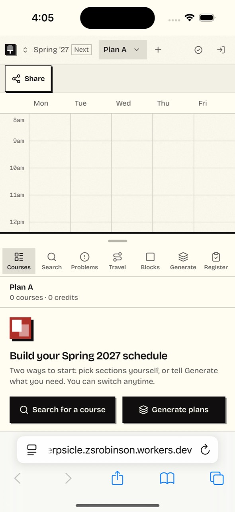 | **1. loaded** (ok, 33 s) viewport 393×659, visual 659 tall at 0, scrollY 0 drawer half, top 329, inside 330px keyboard down page processes 186 MB (2, largest 133 MB) panel "Plan A" events: installed |
|  | **2. Search tab at half** (ok, 45 s) after: tap {"target":"[data-workbench-drawer] nav[aria-label=\"Tabs\"] button \"Search\"","at":{"x":87,"y":376}} viewport 393×659, visual 659 tall at 0, scrollY 0 drawer half, top 329, inside 330px keyboard down page processes 284 MB (2, largest 236 MB) focus div#_r_p_ at y 329–940 panel "Search" |
|  | **3. tapped the search box (+150 ms)** (ok, 51 s) after: tap {"target":"input[aria-label=\"Search courses\"]","at":{"x":208,"y":436}} viewport 393×659, visual 435.7 tall at 0, scrollY 0 drawer full, top 48, inside 387px keyboard up page processes 278 MB (2, largest 232 MB) focus input#base-ui-_r_32_[aria-label="Search courses"] at y 134–176 panel "Search" events: vv-resize |
|  | **4. tapped the search box (+500 ms)** (ok, 58 s) viewport 393×659, visual 435.7 tall at 0, scrollY 0 drawer full, top 48, inside 387px keyboard up page processes 276 MB (2, largest 230 MB) focus input#base-ui-_r_32_[aria-label="Search courses"] at y 134–176 panel "Search" |
|  | **5. tapped the search box (+1000 ms)** (ok, 61 s) viewport 393×659, visual 435.7 tall at 0, scrollY 0 drawer full, top 48, inside 387px keyboard up page processes 241 MB (2, largest 195 MB) focus input#base-ui-_r_32_[aria-label="Search courses"] at y 134–176 panel "Search" |
|  | **6. tapped the search box (+2000 ms)** (ok, 66 s) viewport 393×659, visual 435.7 tall at 0, scrollY 0 drawer full, top 48, inside 387px keyboard up page processes 284 MB (2, largest 240 MB) focus input#base-ui-_r_32_[aria-label="Search courses"] at y 134–176 panel "Search" |
| 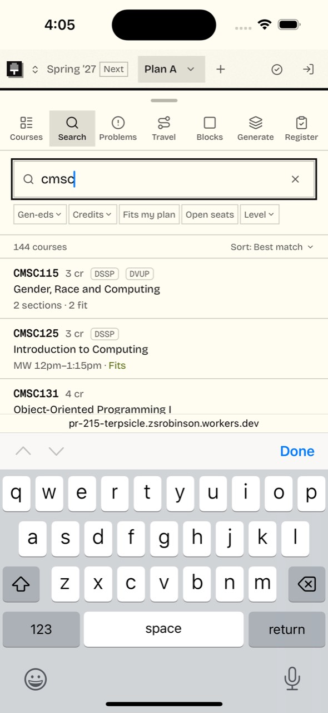 | **7. typed "cmsc"** (ok, 80 s) after: type {"text":"cmsc"} viewport 393×659, visual 435.7 tall at 0, scrollY 0 drawer full, top 48, inside 387px keyboard up page processes 307 MB (2, largest 271 MB) focus input#base-ui-_r_32_[aria-label="Search courses"] at y 134–176 panel "Search" |
|  | **8. scrolled the results** (ok, 95 s) after: swipe {"from":null,"start":{"x":197,"y":399},"end":{"x":197,"y":199},"ms":500,"intent":"scroll"} viewport 393×659, visual 435.7 tall at 0, scrollY 0 drawer full, top 48, inside 387px keyboard up page processes 323 MB (2, largest 287 MB) focus input#base-ui-_r_32_[aria-label="Search courses"] at y 134–176 panel "Search" events: pointercancel |
| 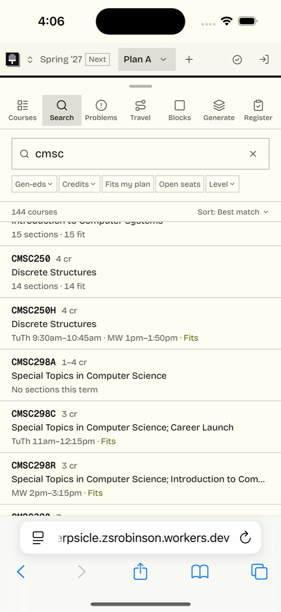 | **9. put the keyboard away** (ok, 100 s) after: hide keyboard {} viewport 393×659, visual 659 tall at 0, scrollY 0 drawer full, top 48, inside 611px keyboard down page processes 252 MB (2, largest 221 MB) panel "Search" events: vv-resize |
|  | **10. opened a result** (ok, 106 s) after: tap {"target":"#search-results [data-course-result]","at":{"x":197,"y":320}} viewport 393×659, visual 659 tall at 0, scrollY 0 drawer half, top 329, inside 330px keyboard down page processes 361 MB (2, largest 333 MB) focus section[aria-label="CMSC250"] at y 402–660 panel "Discrete Structures" |

## Search with the on-screen keyboard from full: tap the box, type, scroll, put the keyboard away, open a result

`keyboard-at-full` · [recording](keyboard-at-full/video.mp4)

| Screen | Step |
|---|---|
|  | **1. loaded** (ok, 6 s) viewport 393×659, visual 659 tall at 0, scrollY 0 drawer half, top 329, inside 330px keyboard down page processes 401 MB (2, largest 374 MB) panel "Discrete Structures" events: installed |
| 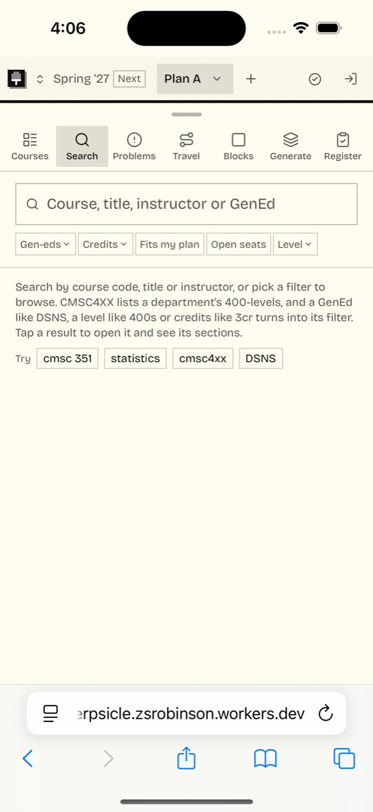 | **2. Search tab at full** (ok, 14 s) after: tap {"target":"[data-workbench-drawer] nav[aria-label=\"Tabs\"] button \"Search\"","at":{"x":87,"y":376}} after: tap {"target":"[data-workbench-drawer] button[aria-label$=\"the panel\"]","at":{"x":197,"y":342}} viewport 393×659, visual 659 tall at 0, scrollY 0 drawer full, top 48, inside 611px keyboard down page processes 376 MB (2, largest 348 MB) focus div#_r_p_ at y 48–659 panel "Search" |
|  | **3. tapped the search box (+150 ms)** (ok, 17 s) after: tap {"target":"input[aria-label=\"Search courses\"]","at":{"x":208,"y":155}} viewport 393×659, visual 435.7 tall at 0, scrollY 0 drawer full, top 48, inside 387px keyboard up page processes 369 MB (2, largest 344 MB) focus input#base-ui-_r_32_[aria-label="Search courses"] at y 134–176 panel "Search" events: vv-resize |
| 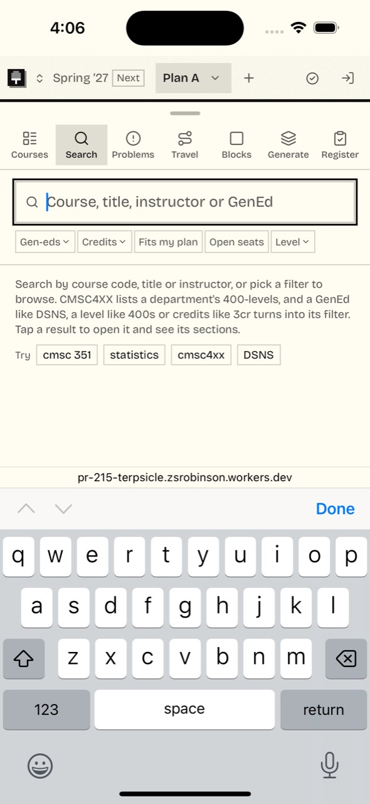 | **4. tapped the search box (+500 ms)** (ok, 21 s) viewport 393×659, visual 435.7 tall at 0, scrollY 0 drawer full, top 48, inside 387px keyboard up page processes 335 MB (2, largest 309 MB) focus input#base-ui-_r_32_[aria-label="Search courses"] at y 134–176 panel "Search" |
|  | **5. tapped the search box (+1000 ms)** (ok, 25 s) viewport 393×659, visual 435.7 tall at 0, scrollY 0 drawer full, top 48, inside 387px keyboard up page processes 319 MB (2, largest 293 MB) focus input#base-ui-_r_32_[aria-label="Search courses"] at y 134–176 panel "Search" |
|  | **6. tapped the search box (+2000 ms)** (ok, 29 s) viewport 393×659, visual 435.7 tall at 0, scrollY 0 drawer full, top 48, inside 387px keyboard up page processes 260 MB (2, largest 234 MB) focus input#base-ui-_r_32_[aria-label="Search courses"] at y 134–176 panel "Search" |
|  | **7. typed "cmsc"** (ok, 39 s) after: type {"text":"cmsc"} viewport 393×659, visual 435.7 tall at 0, scrollY 0 drawer full, top 48, inside 387px keyboard up page processes 444 MB (2, largest 425 MB) focus input#base-ui-_r_32_[aria-label="Search courses"] at y 134–176 panel "Search" |
| 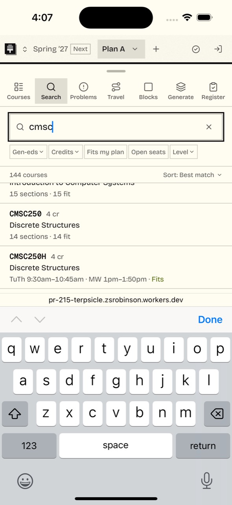 | **8. scrolled the results** (ok, 47 s) after: swipe {"from":null,"start":{"x":197,"y":399},"end":{"x":197,"y":199},"ms":500,"intent":"scroll"} viewport 393×659, visual 435.7 tall at 0, scrollY 0 drawer full, top 48, inside 387px keyboard up page processes 205 MB (2, largest 194 MB) focus input#base-ui-_r_32_[aria-label="Search courses"] at y 134–176 panel "Search" events: pointercancel |
| 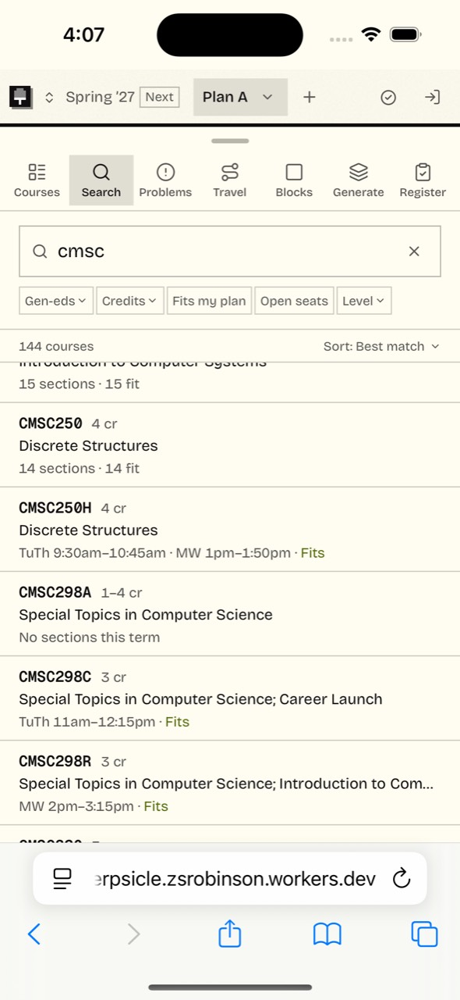 | **9. put the keyboard away** (ok, 54 s) after: hide keyboard {} viewport 393×659, visual 659 tall at 0, scrollY 0 drawer full, top 48, inside 611px keyboard down page processes 168 MB (2, largest 158 MB) panel "Search" events: vv-resize |
|  | **10. opened a result** (ok, 60 s) after: tap {"target":"#search-results [data-course-result]","at":{"x":197,"y":320}} viewport 393×659, visual 659 tall at 0, scrollY 0 drawer half, top 329, inside 330px keyboard down page processes 343 MB (2, largest 336 MB) focus section[aria-label="CMSC250"] at y 402–660 panel "Discrete Structures" |

## Search with the on-screen keyboard from peek: tap the box, type, scroll, put the keyboard away, open a result

`keyboard-at-peek` · [recording](keyboard-at-peek/video.mp4)

| Screen | Step |
|---|---|
| 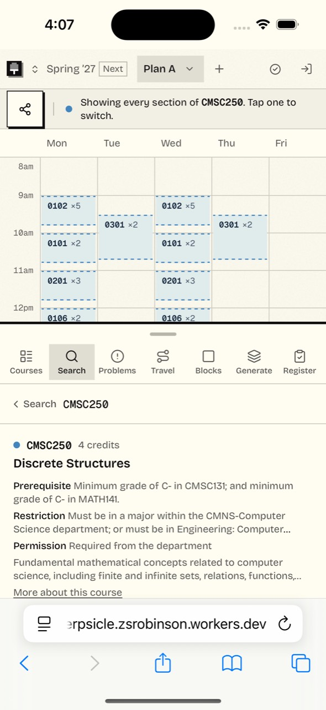 | **1. loaded** (ok, 7 s) viewport 393×659, visual 659 tall at 0, scrollY 0 drawer half, top 329, inside 330px keyboard down page processes 420 MB (2, largest 412 MB) panel "Discrete Structures" events: installed |
|  | **2. Search tab at peek** (ok, 18 s) after: tap {"target":"[data-workbench-drawer] nav[aria-label=\"Tabs\"] button \"Search\"","at":{"x":87,"y":376}} after: tap {"target":"[data-workbench-drawer] button[aria-label$=\"the panel\"]","at":{"x":197,"y":342}} after: tap {"target":"[data-workbench-drawer] button[aria-label$=\"the panel\"]","at":{"x":197,"y":61}} viewport 393×659, visual 659 tall at 0, scrollY 0 drawer peek, top 535, inside 124px keyboard down page processes 252 MB (2, largest 239 MB) focus div#_r_p_ at y 535–1146 panel "Search" |
|  | **3. tapped the search box (+150 ms)** (ok, 23 s) after: tap {"target":"input[aria-label=\"Search courses\"]","at":{"x":208,"y":642}} viewport 393×659, visual 435.7 tall at 0, scrollY 0 drawer full, top 48, inside 387px keyboard up page processes 453 MB (2, largest 439 MB) focus input#base-ui-_r_2v_[aria-label="Search courses"] at y 134–176 panel "Search" events: vv-resize |
|  | **4. tapped the search box (+500 ms)** (ok, 27 s) viewport 393×659, visual 435.7 tall at 0, scrollY 0 drawer full, top 48, inside 387px keyboard up page processes 412 MB (2, largest 396 MB) focus input#base-ui-_r_2v_[aria-label="Search courses"] at y 134–176 panel "Search" |
|  | **5. tapped the search box (+1000 ms)** (ok, 31 s) viewport 393×659, visual 435.7 tall at 0, scrollY 0 drawer full, top 48, inside 387px keyboard up page processes 333 MB (2, largest 315 MB) focus input#base-ui-_r_2v_[aria-label="Search courses"] at y 134–176 panel "Search" |
|  | **6. tapped the search box (+2000 ms)** (ok, 36 s) viewport 393×659, visual 435.7 tall at 0, scrollY 0 drawer full, top 48, inside 387px keyboard up page processes 308 MB (2, largest 289 MB) focus input#base-ui-_r_2v_[aria-label="Search courses"] at y 134–176 panel "Search" |
|  | **7. typed "cmsc"** (ok, 43 s) after: type {"text":"cmsc"} viewport 393×659, visual 435.7 tall at 0, scrollY 0 drawer full, top 48, inside 387px keyboard up page processes 456 MB (2, largest 437 MB) focus input#base-ui-_r_2v_[aria-label="Search courses"] at y 134–176 panel "Search" |
| 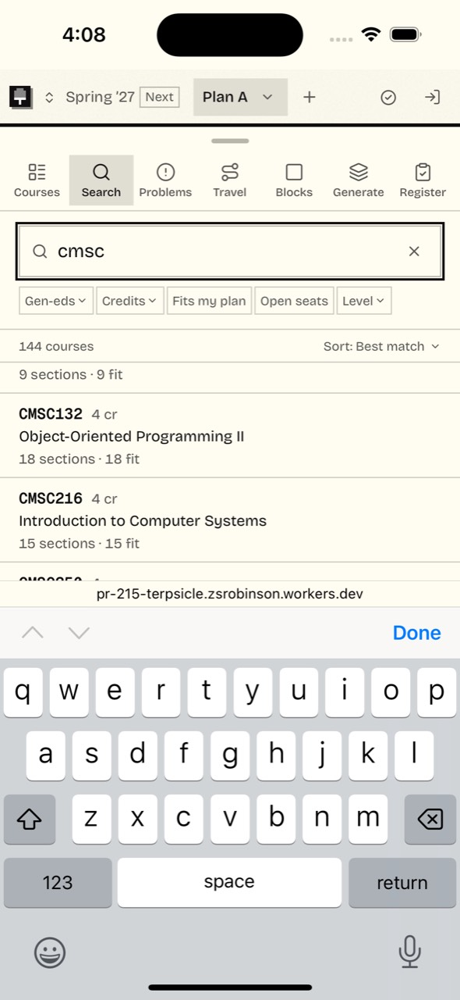 | **8. scrolled the results** (ok, 49 s) after: swipe {"from":null,"start":{"x":197,"y":399},"end":{"x":197,"y":199},"ms":500,"intent":"scroll"} viewport 393×659, visual 435.7 tall at 0, scrollY 0 drawer full, top 48, inside 387px keyboard up page processes 423 MB (2, largest 406 MB) focus input#base-ui-_r_2v_[aria-label="Search courses"] at y 134–176 panel "Search" events: pointercancel |
| 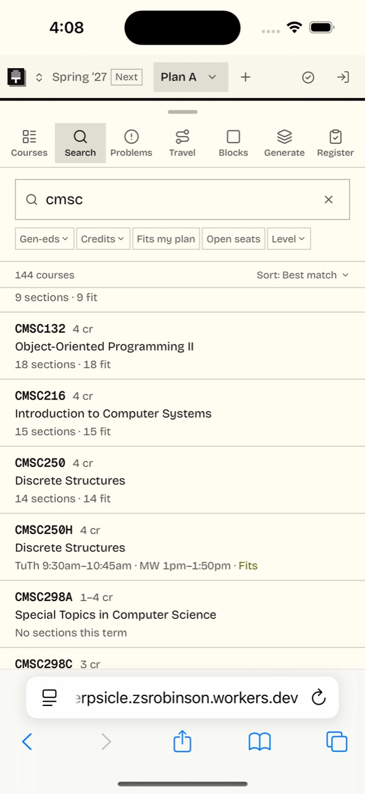 | **9. put the keyboard away** (ok, 56 s) after: hide keyboard {} viewport 393×659, visual 659 tall at 0, scrollY 0 drawer full, top 48, inside 611px keyboard down page processes 229 MB (2, largest 208 MB) panel "Search" events: vv-resize |
| 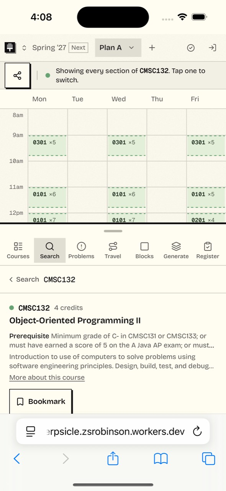 | **10. opened a result** (ok, 63 s) after: tap {"target":"#search-results [data-course-result]","at":{"x":197,"y":312}} viewport 393×659, visual 659 tall at 0, scrollY 0 drawer half, top 329, inside 330px keyboard down page processes 449 MB (2, largest 429 MB) focus section[aria-label="CMSC132"] at y 402–660 panel "Object-Oriented Programming II" |

## First load

`first-load` · [recording](first-load/video.mp4)

| Screen | Step |
|---|---|
|  | **1. shell up** (ok, 6 s) viewport 393×659, visual 659 tall at 0, scrollY 0 drawer half, top 329, inside 330px keyboard down page processes 561 MB (2, largest 549 MB) panel "Object-Oriented Programming II" events: installed |
|  | **2. settled** (ok, 12 s) viewport 393×659, visual 659 tall at 0, scrollY 0 drawer half, top 329, inside 330px keyboard down page processes 319 MB (2, largest 308 MB) panel "Object-Oriented Programming II" |

## Tap each drawer tab, then the open one again

`tabs` · [recording](tabs/video.mp4)

| Screen | Step |
|---|---|
|  | **1. Search tab** (ok, 9 s) after: tap {"target":"[data-workbench-drawer] nav[aria-label=\"Tabs\"] button \"Search\"","at":{"x":87,"y":376}} viewport 393×659, visual 659 tall at 0, scrollY 0 drawer half, top 329, inside 330px keyboard down page processes 529 MB (2, largest 504 MB) focus div#_r_p_ at y 329–940 panel "Search" events: installed |
| 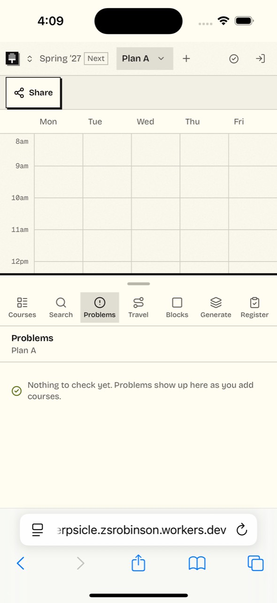 | **2. Problems tab** (ok, 13 s) after: tap {"target":"[data-workbench-drawer] nav[aria-label=\"Tabs\"] button \"Problems\"","at":{"x":142,"y":376}} viewport 393×659, visual 659 tall at 0, scrollY 0 drawer half, top 329, inside 330px keyboard down page processes 513 MB (2, largest 489 MB) focus div#_r_p_ at y 329–940 panel "Problems" |
| 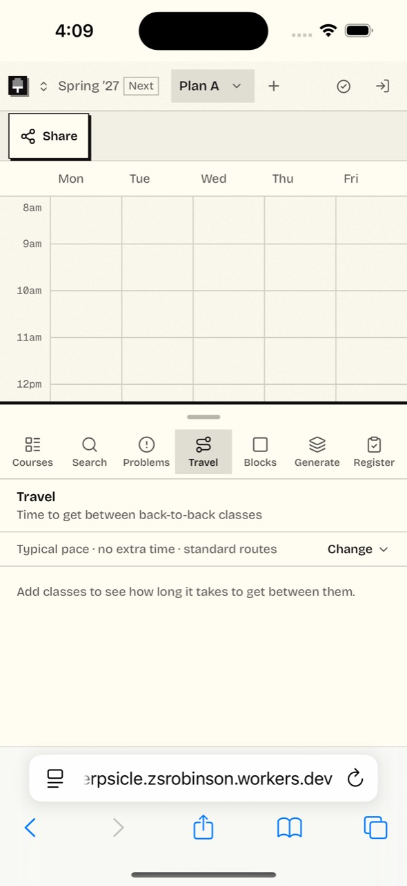 | **3. Travel tab** (ok, 18 s) after: tap {"target":"[data-workbench-drawer] nav[aria-label=\"Tabs\"] button \"Travel\"","at":{"x":197,"y":376}} viewport 393×659, visual 659 tall at 0, scrollY 0 drawer half, top 329, inside 330px keyboard down page processes 417 MB (2, largest 388 MB) focus div#_r_p_ at y 329–940 panel "Travel" |
| 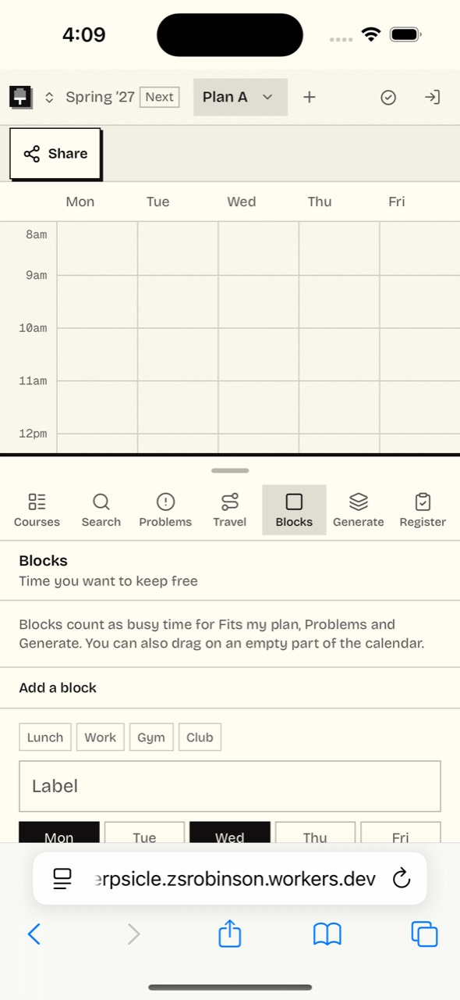 | **4. Blocks tab** (ok, 21 s) after: tap {"target":"[data-workbench-drawer] nav[aria-label=\"Tabs\"] button \"Blocks\"","at":{"x":252,"y":376}} viewport 393×659, visual 659 tall at 0, scrollY 0 drawer half, top 329, inside 330px keyboard down page processes 519 MB (2, largest 488 MB) focus div#_r_p_ at y 329–940 panel "Blocks" |
| 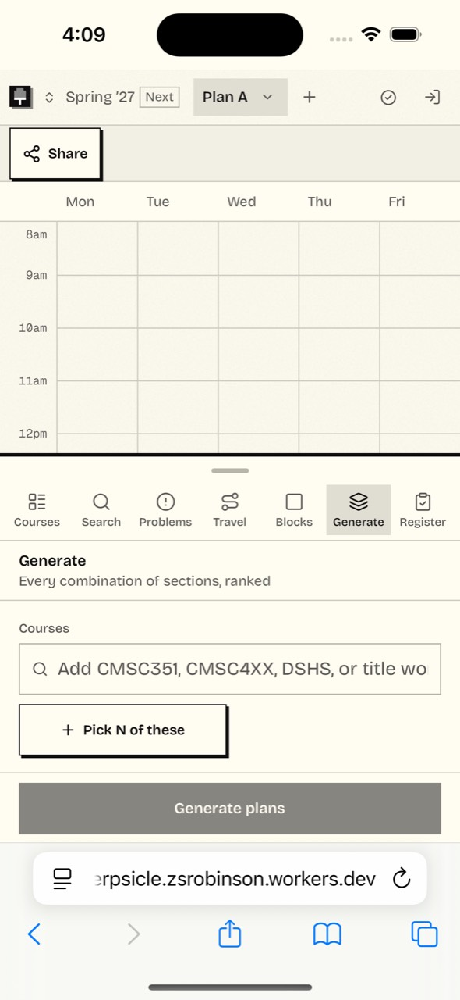 | **5. Generate tab** (ok, 25 s) after: tap {"target":"[data-workbench-drawer] nav[aria-label=\"Tabs\"] button \"Generate\"","at":{"x":307,"y":376}} viewport 393×659, visual 659 tall at 0, scrollY 0 drawer half, top 329, inside 330px keyboard down page processes 505 MB (2, largest 474 MB) focus div#_r_p_ at y 329–940 panel "Generate" |
| 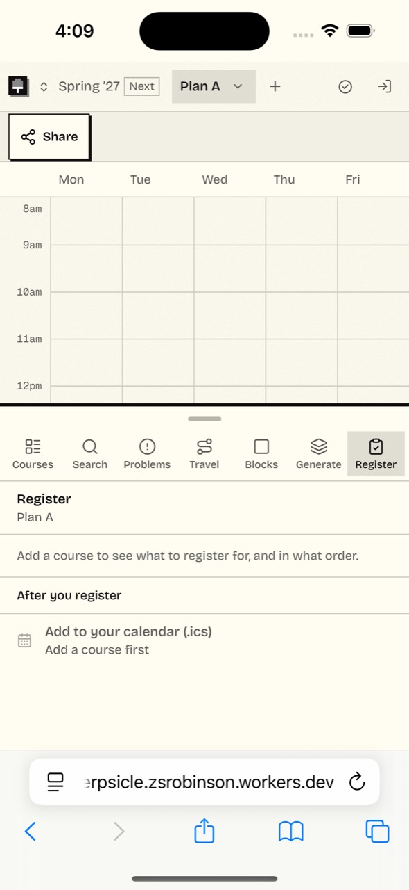 | **6. Register tab** (ok, 28 s) after: tap {"target":"[data-workbench-drawer] nav[aria-label=\"Tabs\"] button \"Register\"","at":{"x":362,"y":376}} viewport 393×659, visual 659 tall at 0, scrollY 0 drawer half, top 329, inside 330px keyboard down page processes 565 MB (2, largest 535 MB) focus div#_r_p_ at y 329–940 panel "Register" |
|  | **7. Courses tab** (ok, 31 s) after: tap {"target":"[data-workbench-drawer] nav[aria-label=\"Tabs\"] button \"Courses\"","at":{"x":32,"y":376}} viewport 393×659, visual 659 tall at 0, scrollY 0 drawer half, top 329, inside 330px keyboard down page processes 536 MB (2, largest 503 MB) focus div#_r_p_ at y 329–940 panel "Plan A" |
| 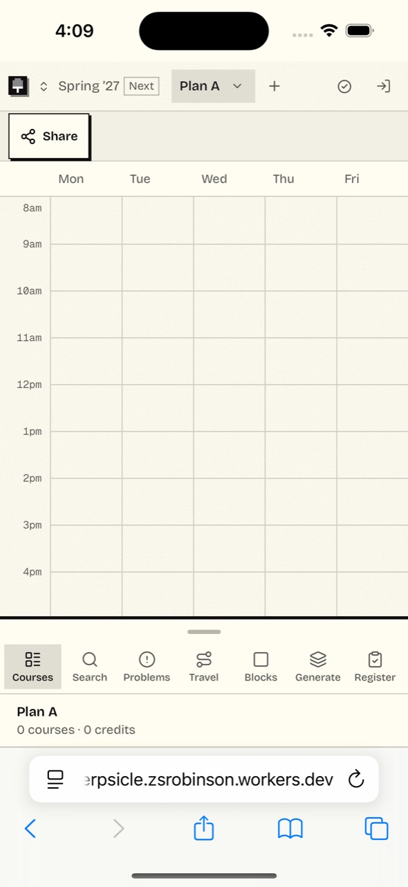 | **8. tapped the open tab** (ok, 34 s) after: tap {"target":"[data-workbench-drawer] nav[aria-label=\"Tabs\"] button \"Courses\"","at":{"x":32,"y":376}} viewport 393×659, visual 659 tall at 0, scrollY 0 drawer peek, top 535, inside 124px keyboard down page processes 332 MB (2, largest 301 MB) focus div#_r_p_ at y 535–1146 panel "Plan A" |

## Drag the grabber peek → half → full → peek

`grabber-drag` · [recording](grabber-drag/video.mp4)

| Screen | Step |
|---|---|
|  | **1. peek** (ok, 11 s) after: tap {"target":"[data-workbench-drawer] button[aria-label$=\"the panel\"]","at":{"x":197,"y":342}} after: tap {"target":"[data-workbench-drawer] button[aria-label$=\"the panel\"]","at":{"x":197,"y":61}} viewport 393×659, visual 659 tall at 0, scrollY 0 drawer peek, top 535, inside 124px keyboard down page processes 347 MB (2, largest 320 MB) focus div#_r_p_ at y 535–1146 panel "Plan A" events: installed |
| 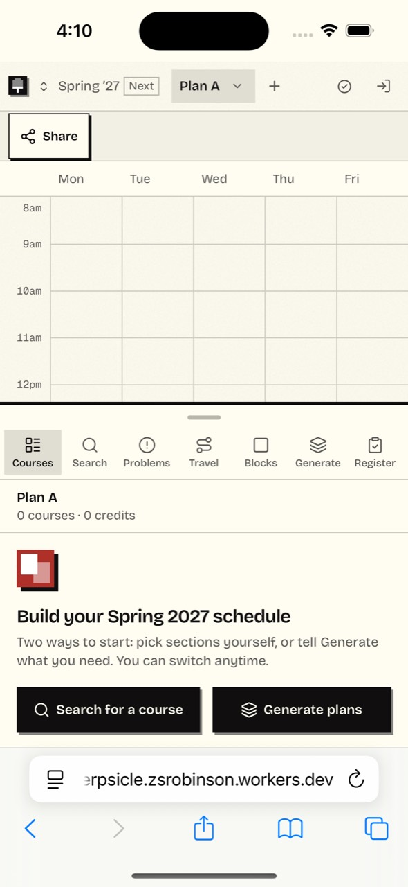 | **2. dragged to half** (ok, 25 s) after: swipe {"from":"[data-workbench-drawer] button[aria-label$=\"the panel\"]","start":{"x":197,"y":548},"end":{"x":197,"y":342},"ms":900,"intent":"drag"} viewport 393×659, visual 659 tall at 0, scrollY 0 drawer half, top 329, inside 330px keyboard down page processes 534 MB (2, largest 508 MB) focus div#_r_p_ at y 329–940 panel "Plan A" |
| 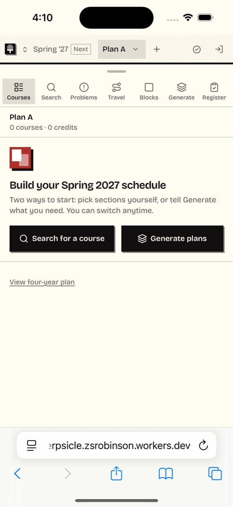 | **3. dragged to full** (ok, 30 s) after: swipe {"from":"[data-workbench-drawer] button[aria-label$=\"the panel\"]","start":{"x":197,"y":342},"end":{"x":197,"y":61},"ms":900,"intent":"drag"} viewport 393×659, visual 659 tall at 0, scrollY 0 drawer full, top 48, inside 611px keyboard down page processes 396 MB (2, largest 369 MB) focus div#_r_p_ at y 48–659 panel "Plan A" |
|  | **4. dragged to peek** (ok, 33 s) after: swipe {"from":"[data-workbench-drawer] button[aria-label$=\"the panel\"]","start":{"x":197,"y":61},"end":{"x":197,"y":548},"ms":900,"intent":"drag"} viewport 393×659, visual 659 tall at 0, scrollY 0 drawer peek, top 535, inside 124px keyboard down page processes 337 MB (2, largest 311 MB) focus div#_r_p_ at y 535–1146 panel "Plan A" |

## Pull down on a list at its top, at each snap

`pull-lists` · [recording](pull-lists/video.mp4)

| Screen | Step |
|---|---|
|  | **1. results at full** (ok, 17 s) after: tap {"target":"[data-workbench-drawer] nav[aria-label=\"Tabs\"] button \"Search\"","at":{"x":87,"y":376}} after: tap {"target":"input[aria-label=\"Search courses\"]","at":{"x":208,"y":436}} after: type {"text":"cmsc"} after: hide keyboard {} viewport 393×659, visual 659 tall at 0, scrollY 0 drawer full, top 48, inside 611px keyboard down page processes 451 MB (2, largest 433 MB) panel "Search" events: installed, vv-resize ×2 |
| 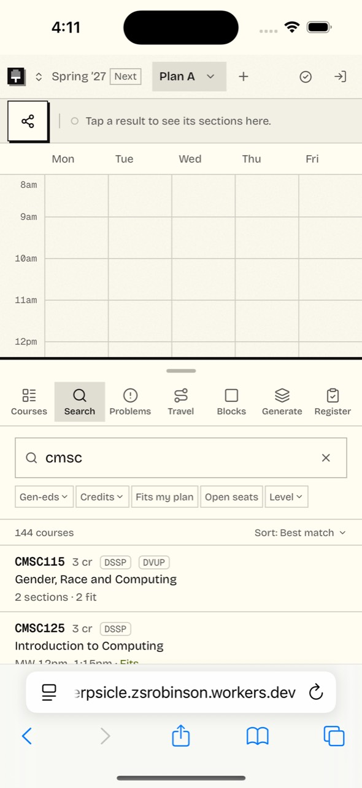 | **2. pulled down at full** (ok, 26 s) after: swipe {"from":null,"start":{"x":197,"y":270},"end":{"x":197,"y":570},"ms":600,"intent":"drag"} viewport 393×659, visual 659 tall at 0, scrollY 0 drawer half, top 329, inside 330px keyboard down page processes 316 MB (2, largest 288 MB) panel "Search" |
|  | **3. results at half** (ok, 28 s) viewport 393×659, visual 659 tall at 0, scrollY 0 drawer half, top 329, inside 330px keyboard down page processes 292 MB (2, largest 257 MB) panel "Search" |
|  | **4. pulled down at half** (ok, 32 s) after: swipe {"from":null,"start":{"x":197,"y":551},"end":{"x":197,"y":851},"ms":600,"intent":"drag"} viewport 393×659, visual 659 tall at 0, scrollY 0 drawer peek, top 535, inside 124px keyboard down page processes 222 MB (2, largest 190 MB) panel "Search" |
|  | **5. results at peek** (ok, 34 s) viewport 393×659, visual 659 tall at 0, scrollY 0 drawer peek, top 535, inside 124px keyboard down page processes 189 MB (2, largest 157 MB) panel "Search" |
| 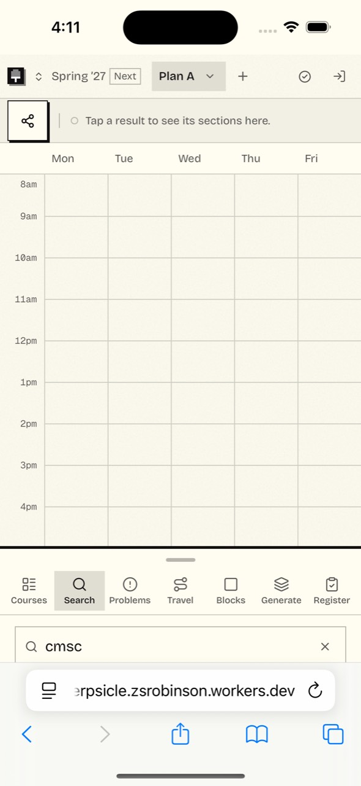 | **6. pulled down at peek** (ok, 39 s) after: swipe {"from":null,"start":{"x":197,"y":568},"end":{"x":197,"y":868},"ms":600,"intent":"drag"} viewport 393×659, visual 659 tall at 0, scrollY 0 drawer peek, top 535, inside 124px keyboard down page processes 195 MB (2, largest 163 MB) panel "Search" |
|  | **7. pulled down on Courses at half** (warn, 47 s) after: tap {"target":"[data-workbench-drawer] nav[aria-label=\"Tabs\"] button \"Courses\"","at":{"x":32,"y":582}} after: swipe {"from":null,"start":{"x":197,"y":474},"end":{"x":197,"y":774},"ms":600,"intent":"drag"} viewport 393×659, visual 659 tall at 0, scrollY 0 drawer peek, top 535, inside 124px keyboard down page processes 461 MB (2, largest 433 MB) focus div#_r_p_ at y 535–1146 panel "Plan A" **warn drawer-moves-one-way**: 2 reversal(s) over 47 frames (329–629) |

## Scroll a long list down, then back up: the drawer stays

`scroll-list-back` · [recording](scroll-list-back/video.mp4)

| Screen | Step |
|---|---|
| 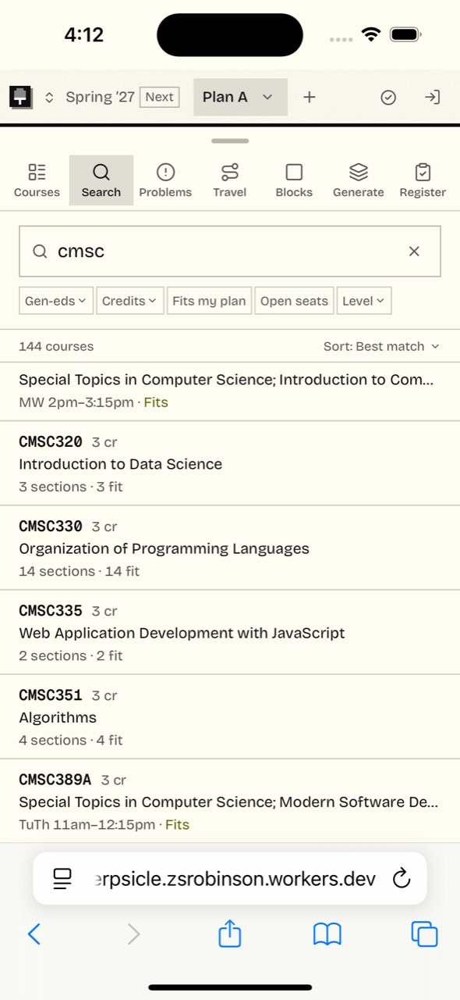 | **1. scrolled down** (ok, 23 s) after: tap {"target":"[data-workbench-drawer] nav[aria-label=\"Tabs\"] button \"Search\"","at":{"x":87,"y":376}} after: tap {"target":"input[aria-label=\"Search courses\"]","at":{"x":208,"y":436}} after: type {"text":"cmsc"} after: hide keyboard {} after: swipe {"from":null,"start":{"x":197,"y":558},"end":{"x":197,"y":208},"ms":400,"intent":"scroll"} viewport 393×659, visual 659 tall at 0, scrollY 0 drawer full, top 48, inside 611px keyboard down page processes 313 MB (2, largest 278 MB) panel "Search" events: installed, vv-resize ×2, pointercancel |
|  | **2. scrolled back up** (ok, 30 s) after: swipe {"from":null,"start":{"x":197,"y":373},"end":{"x":197,"y":623},"ms":400,"intent":"scroll"} viewport 393×659, visual 659 tall at 0, scrollY 0 drawer full, top 48, inside 611px keyboard down page processes 402 MB (2, largest 364 MB) panel "Search" events: pointercancel |

## Scroll the calendar, then pull down at its top

`calendar-pull` · [recording](calendar-pull/video.mp4)

| Screen | Step |
|---|---|
|  | **1. scrolled the calendar down** (ok, 14 s) after: tap {"target":"[data-workbench-drawer] button[aria-label$=\"the panel\"]","at":{"x":197,"y":342}} after: tap {"target":"[data-workbench-drawer] button[aria-label$=\"the panel\"]","at":{"x":197,"y":61}} after: swipe {"from":null,"start":{"x":197,"y":359},"end":{"x":197,"y":109},"ms":500,"intent":"scroll"} viewport 393×659, visual 659 tall at 0, scrollY 0 drawer peek, top 535, inside 124px keyboard down page processes 181 MB (2, largest 150 MB) focus div#_r_p_ at y 535–1146 panel "Search" events: installed |
| 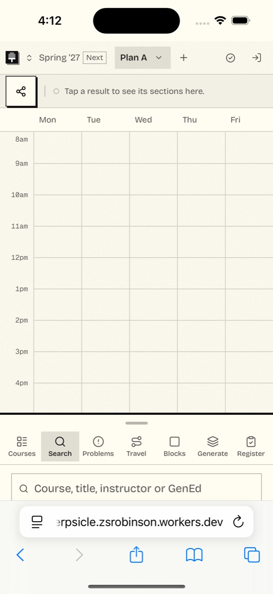 | **2. pulled down at the top** (ok, 22 s) after: swipe {"from":null,"start":{"x":197,"y":162},"end":{"x":197,"y":512},"ms":500,"intent":"scroll"} after: swipe {"from":null,"start":{"x":197,"y":162},"end":{"x":197,"y":512},"ms":500,"intent":"scroll"} viewport 393×659, visual 659 tall at 0, scrollY 0 drawer peek, top 535, inside 124px keyboard down page processes 129 MB (2, largest 77 MB) focus div#_r_p_ at y 535–1146 panel "Search" |

## Rotate to landscape and back

`rotate` · [recording](rotate/video.mp4)

| Screen | Step |
|---|---|
| 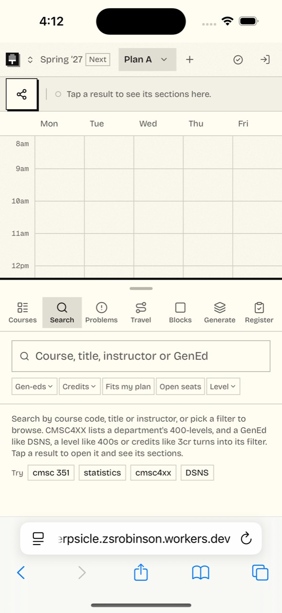 | **1. portrait** (ok, 6 s) viewport 393×659, visual 659 tall at 0, scrollY 0 drawer half, top 329, inside 330px keyboard down page processes 454 MB (2, largest 400 MB) panel "Search" events: installed |
| 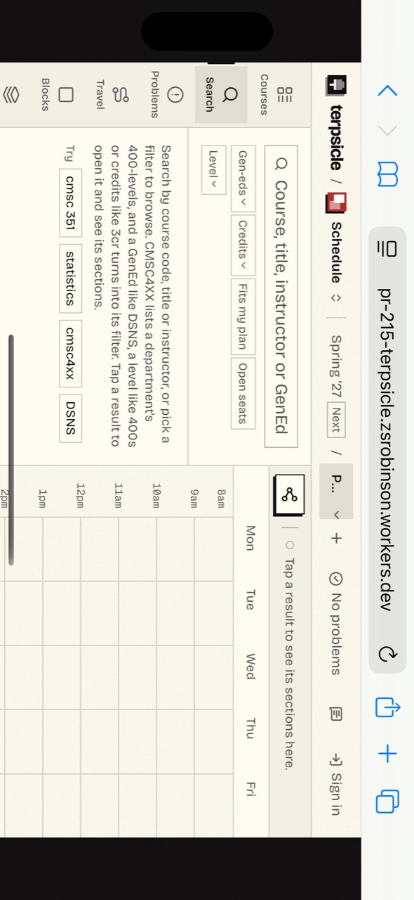 | **2. landscape** (ok, 12 s) after: rotate {"orientation":"landscape"} viewport 852×343, visual 343 tall at 0, scrollY 0 keyboard down page processes 547 MB (2, largest 499 MB) panel "Search" events: orientationchange, resize, vv-resize |
|  | **3. portrait again** (ok, 17 s) after: rotate {"orientation":"portrait"} viewport 393×659, visual 659 tall at 0, scrollY 0 drawer half, top 329, inside 330px keyboard down page processes 214 MB (2, largest 166 MB) panel "Search" events: orientationchange, resize, vv-resize |

## Scroll to collapse and expand the browser's toolbar

`url-bar` · [recording](url-bar/video.mp4)

| Screen | Step |
|---|---|
|  | **1. start** (ok, 10 s) after: tap {"target":"[data-workbench-drawer] button[aria-label$=\"the panel\"]","at":{"x":197,"y":342}} after: tap {"target":"[data-workbench-drawer] button[aria-label$=\"the panel\"]","at":{"x":197,"y":61}} viewport 393×659, visual 659 tall at 0, scrollY 0 drawer peek, top 535, inside 124px keyboard down page processes 554 MB (2, largest 520 MB) focus div#_r_p_ at y 535–1146 panel "Search" events: installed |
|  | **2. scrolled the calendar up (toolbar may hide)** (ok, 15 s) after: swipe {"from":null,"start":{"x":197,"y":403},"end":{"x":197,"y":103},"ms":400,"intent":"scroll"} viewport 393×659, visual 659 tall at 0, scrollY 0 drawer peek, top 535, inside 124px keyboard down page processes 177 MB (2, largest 146 MB) focus div#_r_p_ at y 535–1146 panel "Search" |
|  | **3. scrolled it back (toolbar may show)** (ok, 19 s) after: swipe {"from":null,"start":{"x":197,"y":403},"end":{"x":197,"y":703},"ms":400,"intent":"scroll"} viewport 393×659, visual 659 tall at 0, scrollY 0 drawer peek, top 535, inside 124px keyboard down page processes 158 MB (2, largest 125 MB) focus div#_r_p_ at y 535–1146 panel "Search" |
| 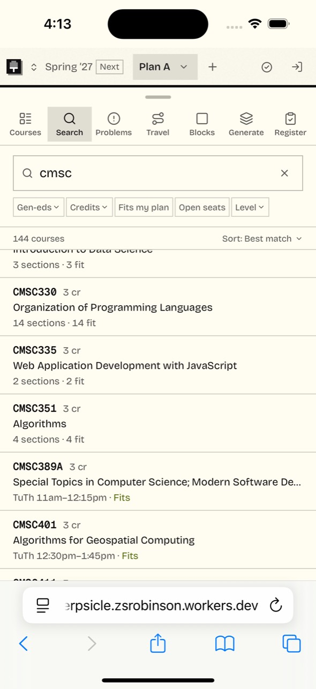 | **4. scrolled the results** (ok, 35 s) after: tap {"target":"[data-workbench-drawer] nav[aria-label=\"Tabs\"] button \"Search\"","at":{"x":87,"y":582}} after: tap {"target":"input[aria-label=\"Search courses\"]","at":{"x":208,"y":436}} after: type {"text":"cmsc"} after: hide keyboard {} after: swipe {"from":null,"start":{"x":197,"y":578},"end":{"x":197,"y":178},"ms":400,"intent":"scroll"} viewport 393×659, visual 659 tall at 0, scrollY 0 drawer full, top 48, inside 611px keyboard down page processes 436 MB (2, largest 400 MB) panel "Search" events: vv-resize ×2, pointercancel |
| 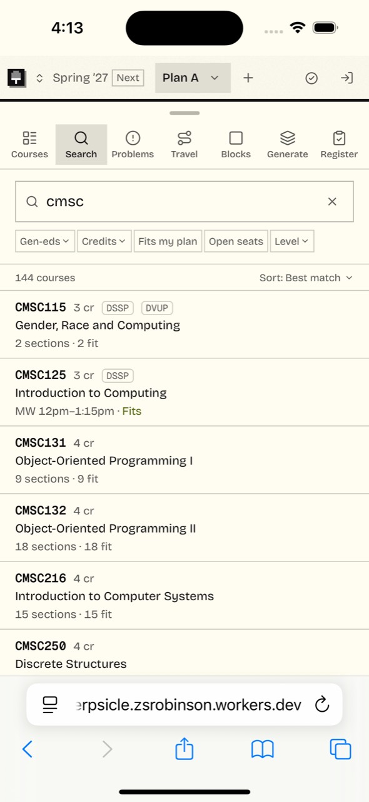 | **5. scrolled them back** (ok, 42 s) after: swipe {"from":null,"start":{"x":197,"y":578},"end":{"x":197,"y":978},"ms":400,"intent":"scroll"} viewport 393×659, visual 659 tall at 0, scrollY 0 drawer full, top 48, inside 611px keyboard down page processes 224 MB (2, largest 185 MB) panel "Search" events: pointercancel |

## A long course (ENGL101, 90+ sections) scrolled to the bottom

`long-course` · [recording](long-course/video.mp4)

| Screen | Step |
|---|---|
| 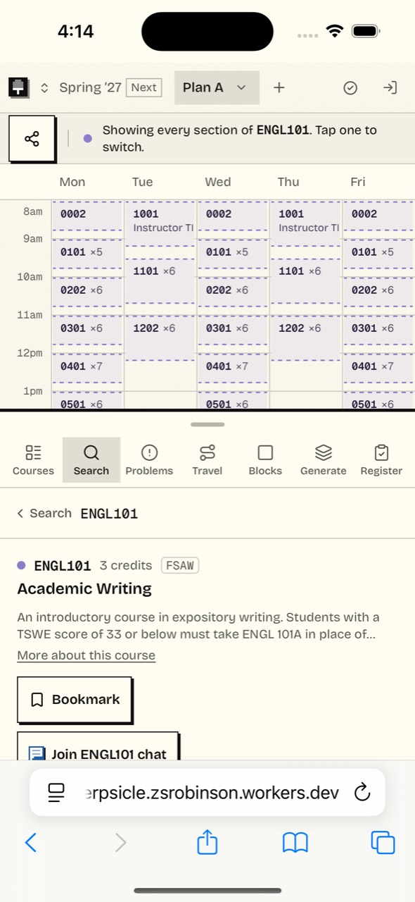 | **1. ENGL101** (warn, 34 s) after: tap {"target":"[data-workbench-drawer] nav[aria-label=\"Tabs\"] button \"Search\"","at":{"x":87,"y":376}} after: tap {"target":"input[aria-label=\"Search courses\"]","at":{"x":208,"y":642}} after: type {"text":"engl101"} after: hide keyboard {} after: tap {"target":"[data-course-result=\"ENGL101\"]","at":{"x":197,"y":286}} viewport 393×659, visual 659 tall at 0, scrollY 0 drawer half, top 329, inside 330px keyboard down page processes 591 MB (2, largest 559 MB) focus section[aria-label="ENGL101"] at y 402–660 panel "Academic Writing" events: installed, vv-resize ×2 **warn drawer-moves-one-way**: 3 reversal(s) over 34 frames (48–535) |
| 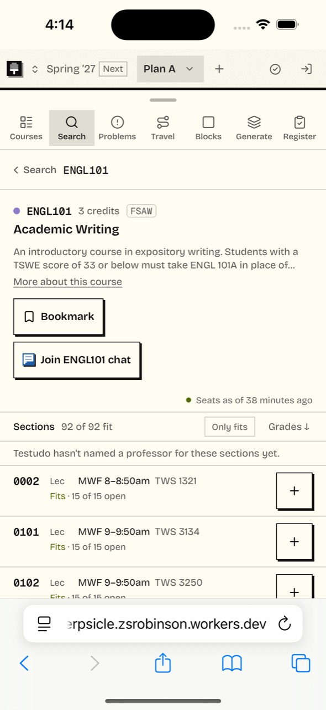 | **2. ENGL101 at full** (ok, 42 s) after: tap {"target":"[data-workbench-drawer] button[aria-label$=\"the panel\"]","at":{"x":197,"y":342}} viewport 393×659, visual 659 tall at 0, scrollY 0 drawer full, top 48, inside 611px keyboard down page processes 541 MB (2, largest 508 MB) focus div#_r_p_ at y 48–659 panel "Academic Writing" |
| 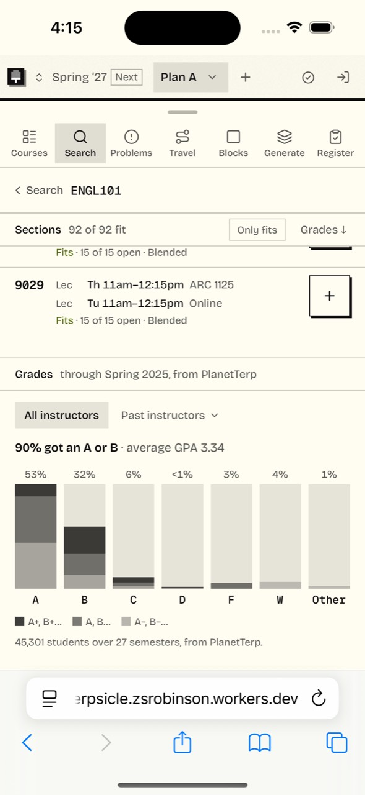 | **3. scrolled to the bottom** (ok, 70 s) after: swipe {"from":null,"start":{"x":197,"y":562},"end":{"x":197,"y":112},"ms":300,"intent":"scroll"} after: swipe {"from":null,"start":{"x":197,"y":562},"end":{"x":197,"y":112},"ms":300,"intent":"scroll"} after: swipe {"from":null,"start":{"x":197,"y":562},"end":{"x":197,"y":112},"ms":300,"intent":"scroll"} after: swipe {"from":null,"start":{"x":197,"y":562},"end":{"x":197,"y":112},"ms":300,"intent":"scroll"} after: swipe {"from":null,"start":{"x":197,"y":562},"end":{"x":197,"y":112},"ms":300,"intent":"scroll"} after: swipe {"from":null,"start":{"x":197,"y":562},"end":{"x":197,"y":112},"ms":300,"intent":"scroll"} viewport 393×659, visual 659 tall at 0, scrollY 0 drawer full, top 48, inside 611px keyboard down page processes 323 MB (2, largest 291 MB) focus div#_r_p_ at y 48–659 panel "Academic Writing" events: pointercancel ×6 |

## Search, scroll, put the keyboard away and open a result, six times

`open-results` · [recording](open-results/video.mp4)

| Screen | Step |
|---|---|
|  | **1. opened a result (1)** (FAIL, 40 s) after: tap {"target":"[data-workbench-drawer] nav[aria-label=\"Tabs\"] button \"Search\"","at":{"x":87,"y":376}} after: tap {"target":"input[aria-label=\"Search courses\"]","at":{"x":208,"y":436}} after: type {"text":"cmsc"} after: tap {"target":"input[aria-label=\"Search courses\"]","at":{"x":187,"y":155}} after: swipe {"from":null,"start":{"x":197,"y":399},"end":{"x":197,"y":239},"ms":400,"intent":"scroll"} after: hide keyboard {} after: tap {"target":"#search-results [data-course-result]","at":{"x":197,"y":273}} viewport 393×659, visual 659 tall at 0, scrollY 0 drawer half, top 329, inside 330px keyboard down page processes 540 MB (2, largest 515 MB) focus section[aria-label="CMSC216"] at y 402–660 panel "Introduction to Computer Systems" events: installed, vv-resize ×2, pointercancel **FAIL no-page-errors**: unhandled rejection: Skipping view transition because skipTransition() was called. |
|  | **2. opened a result (2)** (ok, 69 s) after: tap {"target":"[data-workbench-drawer] [data-layer][data-active] button \"Back to Search\"","at":{"x":40,"y":426}} after: tap {"target":"[data-workbench-drawer] button[aria-label$=\"the panel\"]","at":{"x":197,"y":342}} after: tap {"target":"input[aria-label=\"Search courses\"]","at":{"x":187,"y":155}} after: swipe {"from":null,"start":{"x":197,"y":399},"end":{"x":197,"y":239},"ms":400,"intent":"scroll"} after: hide keyboard {} after: tap {"target":"#search-results [data-course-result]","at":{"x":197,"y":273}} viewport 393×659, visual 659 tall at 0, scrollY 0 drawer half, top 329, inside 330px keyboard down page processes 586 MB (2, largest 562 MB) focus section[aria-label="CMSC216"] at y 402–660 panel "Introduction to Computer Systems" events: vv-resize ×2, pointercancel |
|  | **3. opened a result (3)** (ok, 89 s) after: tap {"target":"[data-workbench-drawer] [data-layer][data-active] button \"Back to Search\"","at":{"x":40,"y":426}} after: tap {"target":"[data-workbench-drawer] button[aria-label$=\"the panel\"]","at":{"x":197,"y":342}} after: tap {"target":"input[aria-label=\"Search courses\"]","at":{"x":187,"y":155}} after: swipe {"from":null,"start":{"x":197,"y":399},"end":{"x":197,"y":239},"ms":400,"intent":"scroll"} after: hide keyboard {} after: tap {"target":"#search-results [data-course-result]","at":{"x":197,"y":273}} viewport 393×659, visual 659 tall at 0, scrollY 0 drawer half, top 329, inside 330px keyboard down page processes 653 MB (2, largest 629 MB) focus section[aria-label="CMSC216"] at y 402–660 panel "Introduction to Computer Systems" events: vv-resize ×2, pointercancel |
|  | **4. opened a result (4)** (ok, 111 s) after: tap {"target":"[data-workbench-drawer] [data-layer][data-active] button \"Back to Search\"","at":{"x":40,"y":426}} after: tap {"target":"[data-workbench-drawer] button[aria-label$=\"the panel\"]","at":{"x":197,"y":342}} after: tap {"target":"input[aria-label=\"Search courses\"]","at":{"x":187,"y":155}} after: swipe {"from":null,"start":{"x":197,"y":399},"end":{"x":197,"y":239},"ms":400,"intent":"scroll"} after: hide keyboard {} after: tap {"target":"#search-results [data-course-result]","at":{"x":197,"y":273}} viewport 393×659, visual 659 tall at 0, scrollY 0 drawer half, top 329, inside 330px keyboard down page processes 570 MB (2, largest 549 MB) focus section[aria-label="CMSC216"] at y 402–660 panel "Introduction to Computer Systems" events: vv-resize ×2, pointercancel |
|  | **5. opened a result (5)** (ok, 131 s) after: tap {"target":"[data-workbench-drawer] [data-layer][data-active] button \"Back to Search\"","at":{"x":40,"y":426}} after: tap {"target":"[data-workbench-drawer] button[aria-label$=\"the panel\"]","at":{"x":197,"y":342}} after: tap {"target":"input[aria-label=\"Search courses\"]","at":{"x":187,"y":155}} after: swipe {"from":null,"start":{"x":197,"y":399},"end":{"x":197,"y":239},"ms":400,"intent":"scroll"} after: hide keyboard {} after: tap {"target":"#search-results [data-course-result]","at":{"x":197,"y":280}} viewport 393×659, visual 659 tall at 0, scrollY 0 drawer half, top 329, inside 330px keyboard down page processes 651 MB (2, largest 629 MB) focus section[aria-label="CMSC216"] at y 402–660 panel "Introduction to Computer Systems" events: vv-resize ×2, pointercancel |
| 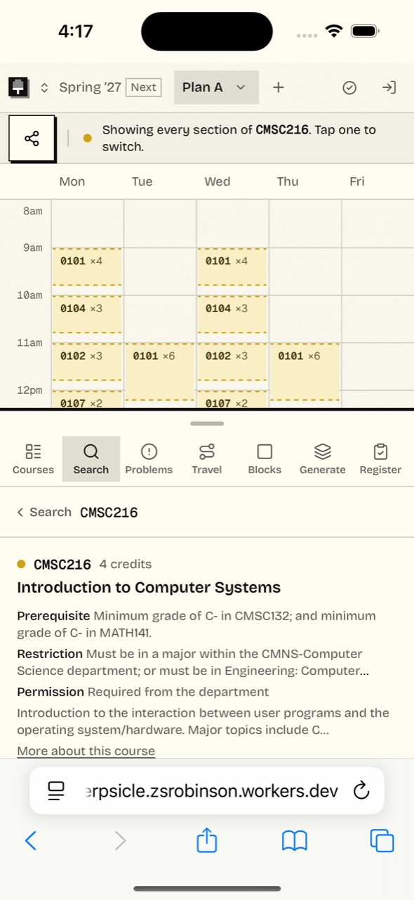 | **6. opened a result (6)** (ok, 151 s) after: tap {"target":"[data-workbench-drawer] [data-layer][data-active] button \"Back to Search\"","at":{"x":40,"y":426}} after: tap {"target":"[data-workbench-drawer] button[aria-label$=\"the panel\"]","at":{"x":197,"y":342}} after: tap {"target":"input[aria-label=\"Search courses\"]","at":{"x":187,"y":155}} after: swipe {"from":null,"start":{"x":197,"y":399},"end":{"x":197,"y":239},"ms":400,"intent":"scroll"} after: hide keyboard {} after: tap {"target":"#search-results [data-course-result]","at":{"x":197,"y":273}} viewport 393×659, visual 659 tall at 0, scrollY 0 drawer half, top 329, inside 330px keyboard down page processes 692 MB (2, largest 671 MB) focus section[aria-label="CMSC216"] at y 402–660 panel "Introduction to Computer Systems" events: vv-resize ×2, pointercancel |

## Add a section from course details, then switch it three times

`add-sections` · [recording](add-sections/video.mp4)

| Screen | Step |
|---|---|
| 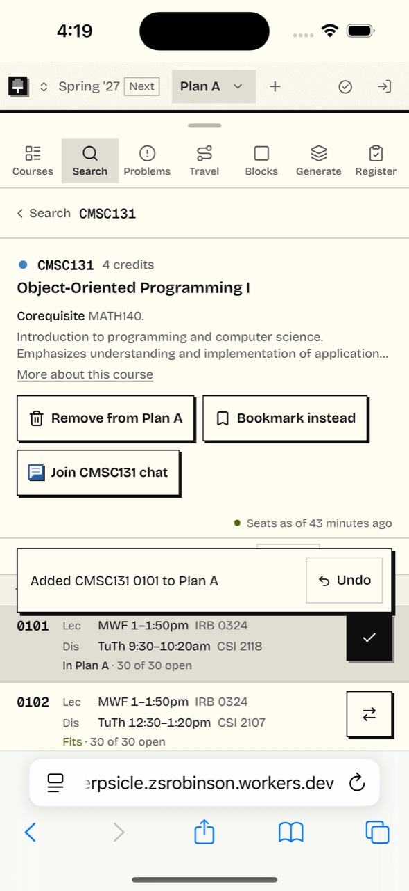 | **1. tapped Add 0101** (warn, 40 s) after: tap {"target":"[data-workbench-drawer] nav[aria-label=\"Tabs\"] button \"Search\"","at":{"x":87,"y":376}} after: tap {"target":"input[aria-label=\"Search courses\"]","at":{"x":208,"y":642}} after: type {"text":"cmsc131"} after: hide keyboard {} after: tap {"target":"[data-course-result=\"CMSC131\"]","at":{"x":197,"y":286}} after: tap {"target":"[data-workbench-drawer] button[aria-label$=\"the panel\"]","at":{"x":197,"y":342}} after: tap {"target":"[data-section] button[aria-label^=\"Add \"], [data-section] button[aria-label^=\"Switch to \"] \"Add 0101\"","at":{"x":355,"y":551}} viewport 393×659, visual 659 tall at 0, scrollY 0 drawer full, top 48, inside 611px keyboard down page processes 173 MB (2, largest 168 MB) focus section[aria-label="CMSC131"] at y 121–660 panel "Object-Oriented Programming I" events: installed, vv-resize ×2 **warn drawer-moves-one-way**: 3 reversal(s) over 47 frames (48–535) |
|  | **2. tapped Switch to 0102** (ok, 51 s) after: tap {"target":"[data-section] button[aria-label^=\"Add \"], [data-section] button[aria-label^=\"Switch to \"] \"Switch to 0102\"","at":{"x":355,"y":450}} viewport 393×659, visual 659 tall at 0, scrollY 0 drawer full, top 48, inside 611px keyboard down page processes 313 MB (2, largest 309 MB) focus section[aria-label="CMSC131"] at y 121–660 panel "Object-Oriented Programming I" |
| 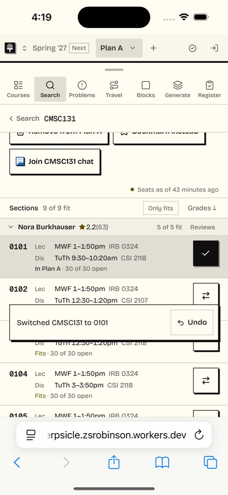 | **3. tapped Switch to 0101** (ok, 56 s) after: tap {"target":"[data-section] button[aria-label^=\"Add \"], [data-section] button[aria-label^=\"Switch to \"] \"Switch to 0101\"","at":{"x":355,"y":377}} viewport 393×659, visual 659 tall at 0, scrollY 0 drawer full, top 48, inside 611px keyboard down page processes 276 MB (2, largest 272 MB) focus section[aria-label="CMSC131"] at y 121–660 panel "Object-Oriented Programming I" |
| 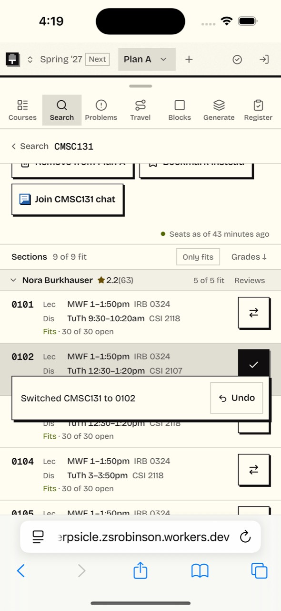 | **4. tapped Switch to 0102** (ok, 59 s) after: tap {"target":"[data-section] button[aria-label^=\"Add \"], [data-section] button[aria-label^=\"Switch to \"] \"Switch to 0102\"","at":{"x":355,"y":450}} viewport 393×659, visual 659 tall at 0, scrollY 0 drawer full, top 48, inside 611px keyboard down page processes 275 MB (2, largest 270 MB) focus section[aria-label="CMSC131"] at y 121–660 panel "Object-Oriented Programming I" |

## Open a course, then swipe back from the screen's left edge: the page moves once

`swipe-back` · [recording](swipe-back/video.mp4)

| Screen | Step |
|---|---|
| 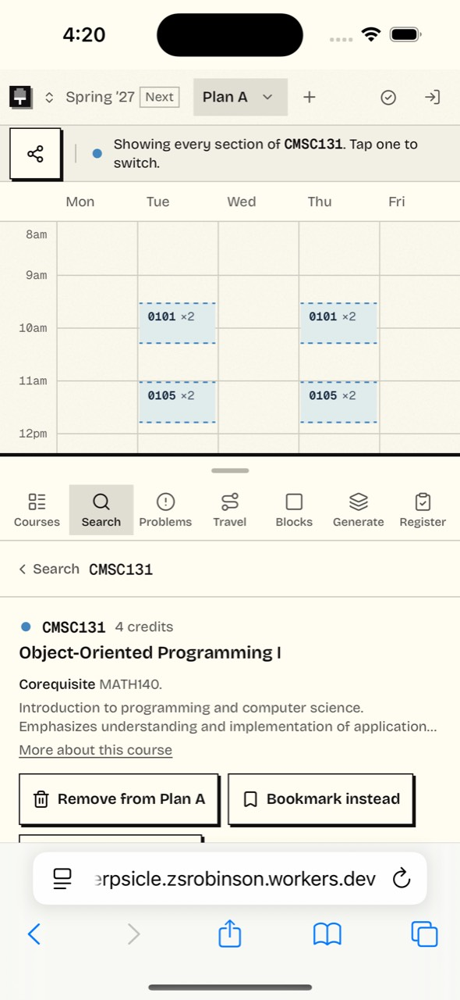 | **1. CMSC131 open** (ok, 37 s) after: tap {"target":"[data-workbench-drawer] nav[aria-label=\"Tabs\"] button \"Search\"","at":{"x":87,"y":376}} after: tap {"target":"input[aria-label=\"Search courses\"]","at":{"x":208,"y":436}} after: type {"text":"cmsc131"} after: hide keyboard {} after: tap {"target":"[data-course-result=\"CMSC131\"]","at":{"x":197,"y":286}} viewport 393×659, visual 659 tall at 0, scrollY 0 drawer half, top 329, inside 330px keyboard down page processes 324 MB (2, largest 319 MB) focus section[aria-label="CMSC131"] at y 402–660 panel "Object-Oriented Programming I" events: installed, vv-resize ×2 |
|  | **2. swiping back (+100 ms)** (ok, 44 s) after: swipe {"from":null,"start":{"x":1,"y":198},"end":{"x":281,"y":198},"ms":350,"intent":"drag"} viewport 393×659, visual 659 tall at 0, scrollY 0 drawer half, top 329, inside 330px keyboard down page processes 659 MB (2, largest 655 MB) focus div#search-result-0 at y 531–603 panel "Search" |
| 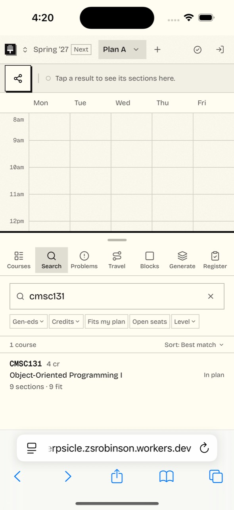 | **3. swiping back (+250 ms)** (ok, 48 s) viewport 393×659, visual 659 tall at 0, scrollY 0 drawer half, top 329, inside 330px keyboard down page processes 410 MB (2, largest 406 MB) focus div#search-result-0 at y 531–603 panel "Search" |
|  | **4. swiped back** (ok, 51 s) viewport 393×659, visual 659 tall at 0, scrollY 0 drawer half, top 329, inside 330px keyboard down page processes 324 MB (2, largest 320 MB) focus div#search-result-0 at y 531–603 panel "Search" |
