# Mobile lab: ios

**Passed**: 0 failed check(s), 3 warning(s), 0 error(s).

- URL: https://pr-216-terpsicle.zsrobinson.workers.dev/schedule
- Device: iPhone 16 Simulator, iOS 18.5, Safari (XCUITest touches, software keyboard)
- Started: 2026-09-29T04:30:14.927Z, took 1003 s
- Workflow run: https://github.com/zsrobinson/terpsicle/actions/runs/36521479505
- Every step's full probe (viewport, drawer, focus, events, per-frame trace) is in `summary.json`.

| Scenario | Result | Steps | Time | Recording |
|---|---|---|---|---|
| [Search with the on-screen keyboard from half: tap the box, type, scroll, put the keyboard away, open a result](#keyboard-at-half) | ok | 10 | 130 s | [video](keyboard-at-half/video.mp4) |
| [Search with the on-screen keyboard from full: tap the box, type, scroll, put the keyboard away, open a result](#keyboard-at-full) | ok | 10 | 67 s | [video](keyboard-at-full/video.mp4) |
| [Search with the on-screen keyboard from peek: tap the box, type, scroll, put the keyboard away, open a result](#keyboard-at-peek) | ok | 10 | 52 s | [video](keyboard-at-peek/video.mp4) |
| [First load](#first-load) | ok | 2 | 12 s | [video](first-load/video.mp4) |
| [Tap each drawer tab, then the open one again](#tabs) | ok | 8 | 46 s | [video](tabs/video.mp4) |
| [Drag the grabber peek → half → full → peek](#grabber-drag) | ok | 4 | 32 s | [video](grabber-drag/video.mp4) |
| [Pull down on a list at its top, at each snap](#pull-lists) | warn | 7 | 47 s | [video](pull-lists/video.mp4) |
| [Scroll a long list down, then back up: the drawer stays](#scroll-list-back) | ok | 2 | 38 s | [video](scroll-list-back/video.mp4) |
| [Scroll the calendar, then pull down at its top](#calendar-pull) | ok | 2 | 29 s | [video](calendar-pull/video.mp4) |
| [Rotate to landscape and back](#rotate) | ok | 3 | 27 s | [video](rotate/video.mp4) |
| [Scroll to collapse and expand the browser's toolbar](#url-bar) | ok | 5 | 63 s | [video](url-bar/video.mp4) |
| [A long course (ENGL101, 90+ sections) scrolled to the bottom](#long-course) | warn | 3 | 84 s | [video](long-course/video.mp4) |
| [Search, scroll, put the keyboard away and open a result, six times](#open-results) | ok | 6 | 144 s | [video](open-results/video.mp4) |
| [Add a section from course details, then switch it three times](#add-sections) | warn | 4 | 49 s | [video](add-sections/video.mp4) |

## Search with the on-screen keyboard from half: tap the box, type, scroll, put the keyboard away, open a result

`keyboard-at-half` · [recording](keyboard-at-half/video.mp4)

| Screen | Step |
|---|---|
| 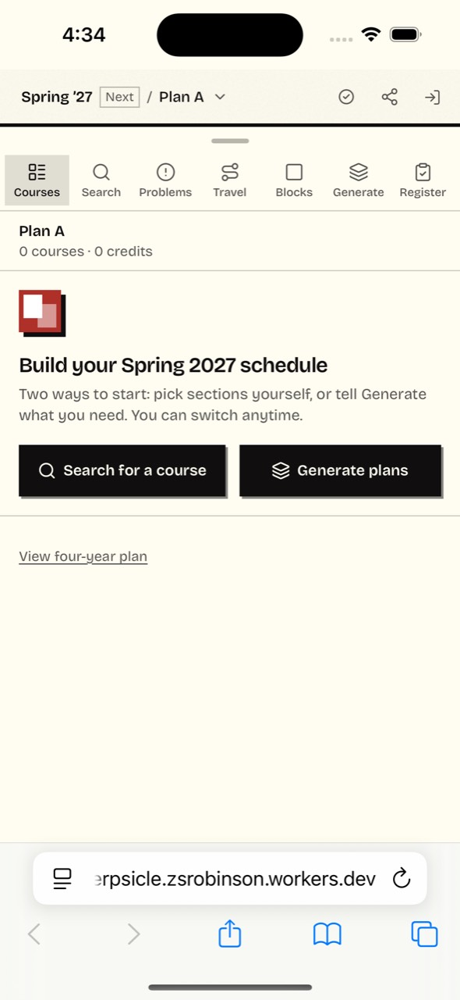 | **1. loaded** (ok, 56 s) viewport 393×659, visual 659 tall at 0, scrollY 0 drawer full, top 48, inside 611px keyboard down page processes 268 MB (2, largest 210 MB) panel "Plan A" events: installed |
| 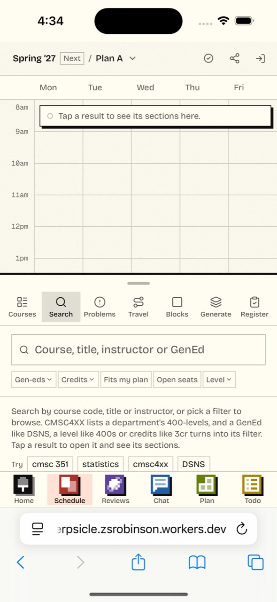 | **2. Search tab at half** (ok, 76 s) after: tap {"target":"[data-workbench-drawer] nav[aria-label=\"Tabs\"] button \"Search\"","at":{"x":87,"y":95}} after: tap {"target":"[data-workbench-drawer] button[aria-label$=\"the panel\"]","at":{"x":197,"y":61}} after: tap {"target":"[data-workbench-drawer] button[aria-label$=\"the panel\"]","at":{"x":197,"y":498}} viewport 393×659, visual 659 tall at 0, scrollY 0 drawer half, top 329, inside 280px keyboard down page processes 298 MB (2, largest 249 MB) focus div#_r_k_ at y 329–940 panel "Search" |
|  | **3. tapped the search box (+150 ms)** (ok, 83 s) after: tap {"target":"input[aria-label=\"Search courses\"]","at":{"x":208,"y":436}} viewport 393×659, visual 435.7 tall at 0, scrollY 0 drawer full, top 48, inside 387px keyboard up page processes 262 MB (2, largest 213 MB) focus input#base-ui-_r_2e_[aria-label="Search courses"] at y 134–176 panel "Search" events: vv-resize |
| 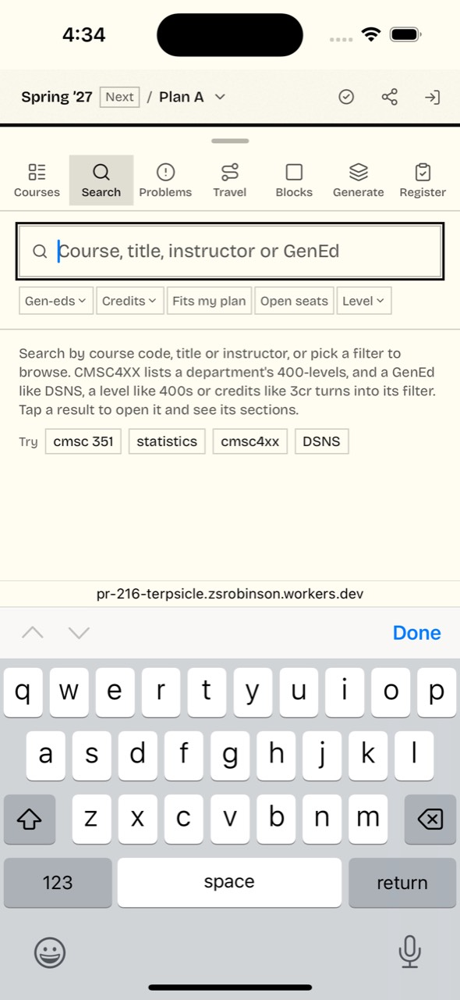 | **4. tapped the search box (+500 ms)** (ok, 90 s) viewport 393×659, visual 435.7 tall at 0, scrollY 0 drawer full, top 48, inside 387px keyboard up page processes 264 MB (2, largest 216 MB) focus input#base-ui-_r_2e_[aria-label="Search courses"] at y 134–176 panel "Search" |
|  | **5. tapped the search box (+1000 ms)** (ok, 94 s) viewport 393×659, visual 435.7 tall at 0, scrollY 0 drawer full, top 48, inside 387px keyboard up page processes 240 MB (2, largest 191 MB) focus input#base-ui-_r_2e_[aria-label="Search courses"] at y 134–176 panel "Search" |
|  | **6. tapped the search box (+2000 ms)** (ok, 98 s) viewport 393×659, visual 435.7 tall at 0, scrollY 0 drawer full, top 48, inside 387px keyboard up page processes 236 MB (2, largest 187 MB) focus input#base-ui-_r_2e_[aria-label="Search courses"] at y 134–176 panel "Search" |
| 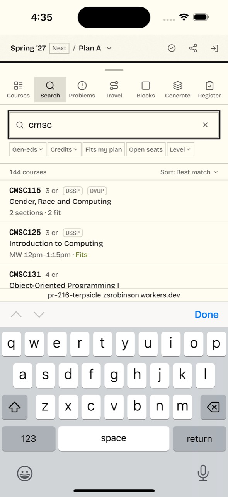 | **7. typed "cmsc"** (ok, 105 s) after: type {"text":"cmsc"} viewport 393×659, visual 435.7 tall at 0, scrollY 0 drawer full, top 48, inside 387px keyboard up page processes 327 MB (2, largest 281 MB) focus input#base-ui-_r_2e_[aria-label="Search courses"] at y 134–176 panel "Search" |
| 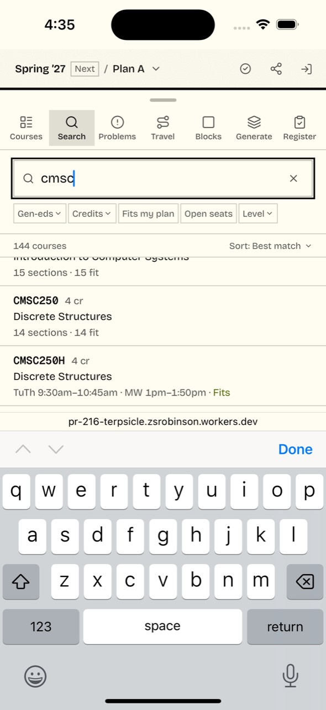 | **8. scrolled the results** (ok, 111 s) after: swipe {"from":null,"start":{"x":197,"y":399},"end":{"x":197,"y":199},"ms":500,"intent":"scroll"} viewport 393×659, visual 435.7 tall at 0, scrollY 0 drawer full, top 48, inside 387px keyboard up page processes 346 MB (2, largest 298 MB) focus input#base-ui-_r_2e_[aria-label="Search courses"] at y 134–176 panel "Search" events: pointercancel |
|  | **9. put the keyboard away** (ok, 115 s) after: hide keyboard {} viewport 393×659, visual 659 tall at 0, scrollY 0 drawer full, top 48, inside 611px keyboard down page processes 256 MB (2, largest 208 MB) panel "Search" events: vv-resize |
|  | **10. opened a result** (ok, 121 s) after: tap {"target":"#search-results [data-course-result]","at":{"x":197,"y":320}} viewport 393×659, visual 659 tall at 0, scrollY 0 drawer half, top 329, inside 280px keyboard down page processes 346 MB (2, largest 298 MB) focus section[aria-label="CMSC250"] at y 402–610 panel "Discrete Structures" |

## Search with the on-screen keyboard from full: tap the box, type, scroll, put the keyboard away, open a result

`keyboard-at-full` · [recording](keyboard-at-full/video.mp4)

| Screen | Step |
|---|---|
|  | **1. loaded** (ok, 6 s) viewport 393×659, visual 659 tall at 0, scrollY 0 drawer half, top 329, inside 280px keyboard down page processes 492 MB (2, largest 447 MB) panel "Discrete Structures" events: installed |
| 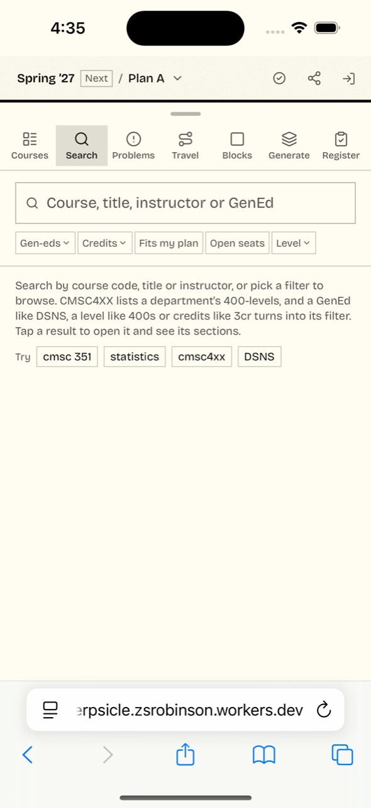 | **2. Search tab at full** (ok, 14 s) after: tap {"target":"[data-workbench-drawer] nav[aria-label=\"Tabs\"] button \"Search\"","at":{"x":87,"y":376}} after: tap {"target":"[data-workbench-drawer] button[aria-label$=\"the panel\"]","at":{"x":197,"y":342}} viewport 393×659, visual 659 tall at 0, scrollY 0 drawer full, top 48, inside 611px keyboard down page processes 497 MB (2, largest 452 MB) focus div#_r_k_ at y 48–659 panel "Search" |
|  | **3. tapped the search box (+150 ms)** (ok, 18 s) after: tap {"target":"input[aria-label=\"Search courses\"]","at":{"x":208,"y":155}} viewport 393×659, visual 435.7 tall at 0, scrollY 0 drawer full, top 48, inside 387px keyboard up page processes 422 MB (2, largest 382 MB) focus input#base-ui-_r_2a_[aria-label="Search courses"] at y 134–176 panel "Search" events: vv-resize |
|  | **4. tapped the search box (+500 ms)** (ok, 20 s) viewport 393×659, visual 435.7 tall at 0, scrollY 0 drawer full, top 48, inside 387px keyboard up page processes 419 MB (2, largest 379 MB) focus input#base-ui-_r_2a_[aria-label="Search courses"] at y 134–176 panel "Search" |
|  | **5. tapped the search box (+1000 ms)** (ok, 23 s) viewport 393×659, visual 435.7 tall at 0, scrollY 0 drawer full, top 48, inside 387px keyboard up page processes 419 MB (2, largest 378 MB) focus input#base-ui-_r_2a_[aria-label="Search courses"] at y 134–176 panel "Search" |
|  | **6. tapped the search box (+2000 ms)** (ok, 25 s) viewport 393×659, visual 435.7 tall at 0, scrollY 0 drawer full, top 48, inside 387px keyboard up page processes 418 MB (2, largest 378 MB) focus input#base-ui-_r_2a_[aria-label="Search courses"] at y 134–176 panel "Search" |
|  | **7. typed "cmsc"** (ok, 32 s) after: type {"text":"cmsc"} viewport 393×659, visual 435.7 tall at 0, scrollY 0 drawer full, top 48, inside 387px keyboard up page processes 379 MB (2, largest 347 MB) focus input#base-ui-_r_2a_[aria-label="Search courses"] at y 134–176 panel "Search" |
| 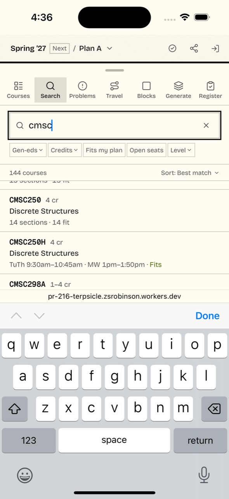 | **8. scrolled the results** (ok, 42 s) after: swipe {"from":null,"start":{"x":197,"y":399},"end":{"x":197,"y":199},"ms":500,"intent":"scroll"} viewport 393×659, visual 435.7 tall at 0, scrollY 0 drawer full, top 48, inside 387px keyboard up page processes 421 MB (2, largest 388 MB) focus input#base-ui-_r_2a_[aria-label="Search courses"] at y 134–176 panel "Search" events: pointercancel |
|  | **9. put the keyboard away** (ok, 48 s) after: hide keyboard {} viewport 393×659, visual 659 tall at 0, scrollY 0 drawer full, top 48, inside 611px keyboard down page processes 294 MB (2, largest 272 MB) panel "Search" events: vv-resize |
| 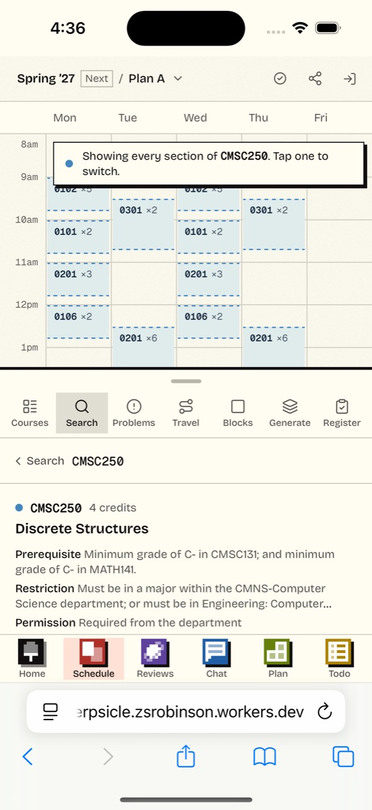 | **10. opened a result** (ok, 55 s) after: tap {"target":"#search-results [data-course-result]","at":{"x":197,"y":301}} viewport 393×659, visual 659 tall at 0, scrollY 0 drawer half, top 329, inside 280px keyboard down page processes 402 MB (2, largest 382 MB) focus section[aria-label="CMSC250"] at y 402–610 panel "Discrete Structures" |

## Search with the on-screen keyboard from peek: tap the box, type, scroll, put the keyboard away, open a result

`keyboard-at-peek` · [recording](keyboard-at-peek/video.mp4)

| Screen | Step |
|---|---|
|  | **1. loaded** (ok, 6 s) viewport 393×659, visual 659 tall at 0, scrollY 0 drawer half, top 329, inside 280px keyboard down page processes 437 MB (2, largest 418 MB) panel "Discrete Structures" events: installed |
|  | **2. Search tab at peek** (ok, 16 s) after: tap {"target":"[data-workbench-drawer] nav[aria-label=\"Tabs\"] button \"Search\"","at":{"x":87,"y":376}} after: tap {"target":"[data-workbench-drawer] button[aria-label$=\"the panel\"]","at":{"x":197,"y":342}} after: tap {"target":"[data-workbench-drawer] button[aria-label$=\"the panel\"]","at":{"x":197,"y":61}} viewport 393×659, visual 659 tall at 0, scrollY 0 drawer peek, top 485, inside 124px keyboard down page processes 395 MB (2, largest 375 MB) focus div#_r_k_ at y 485–1096 panel "Search" |
|  | **3. tapped the search box (+150 ms)** (ok, 20 s) after: tap {"target":"input[aria-label=\"Search courses\"]","at":{"x":208,"y":592}} viewport 393×659, visual 435.7 tall at 0, scrollY 0 drawer full, top 48, inside 387px keyboard up page processes 430 MB (2, largest 411 MB) focus input#base-ui-_r_2a_[aria-label="Search courses"] at y 134–176 panel "Search" events: vv-resize |
|  | **4. tapped the search box (+500 ms)** (ok, 22 s) viewport 393×659, visual 435.7 tall at 0, scrollY 0 drawer full, top 48, inside 387px keyboard up page processes 407 MB (2, largest 389 MB) focus input#base-ui-_r_2a_[aria-label="Search courses"] at y 134–176 panel "Search" |
|  | **5. tapped the search box (+1000 ms)** (ok, 24 s) viewport 393×659, visual 435.7 tall at 0, scrollY 0 drawer full, top 48, inside 387px keyboard up page processes 386 MB (2, largest 368 MB) focus input#base-ui-_r_2a_[aria-label="Search courses"] at y 134–176 panel "Search" |
|  | **6. tapped the search box (+2000 ms)** (ok, 26 s) viewport 393×659, visual 435.7 tall at 0, scrollY 0 drawer full, top 48, inside 387px keyboard up page processes 506 MB (2, largest 488 MB) focus input#base-ui-_r_2a_[aria-label="Search courses"] at y 134–176 panel "Search" |
| 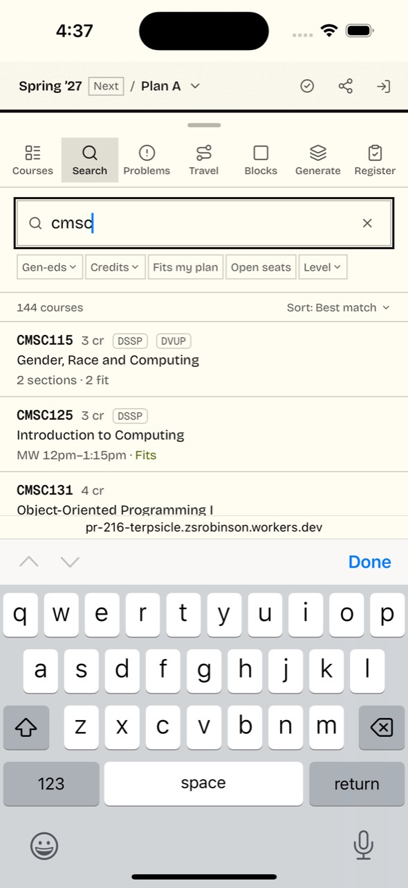 | **7. typed "cmsc"** (ok, 32 s) after: type {"text":"cmsc"} viewport 393×659, visual 435.7 tall at 0, scrollY 0 drawer full, top 48, inside 387px keyboard up page processes 537 MB (2, largest 520 MB) focus input#base-ui-_r_2a_[aria-label="Search courses"] at y 134–176 panel "Search" |
| 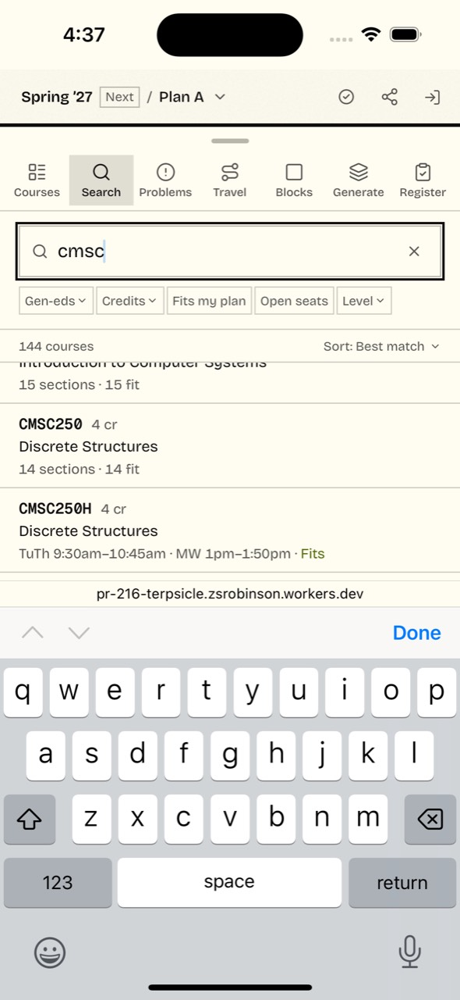 | **8. scrolled the results** (ok, 37 s) after: swipe {"from":null,"start":{"x":197,"y":399},"end":{"x":197,"y":199},"ms":500,"intent":"scroll"} viewport 393×659, visual 435.7 tall at 0, scrollY 0 drawer full, top 48, inside 387px keyboard up page processes 469 MB (2, largest 459 MB) focus input#base-ui-_r_2a_[aria-label="Search courses"] at y 134–176 panel "Search" events: pointercancel |
| 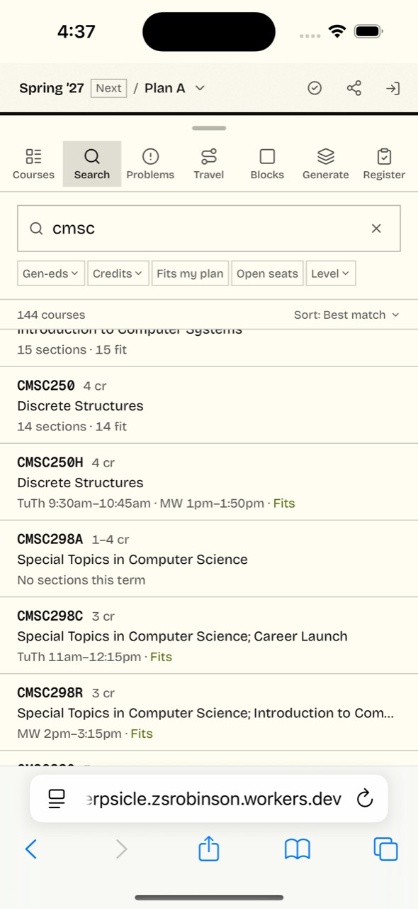 | **9. put the keyboard away** (ok, 41 s) after: hide keyboard {} viewport 393×659, visual 659 tall at 0, scrollY 0 drawer full, top 48, inside 611px keyboard down page processes 389 MB (2, largest 380 MB) panel "Search" events: vv-resize |
|  | **10. opened a result** (ok, 44 s) after: tap {"target":"#search-results [data-course-result]","at":{"x":197,"y":321}} viewport 393×659, visual 659 tall at 0, scrollY 0 drawer half, top 329, inside 280px keyboard down page processes 479 MB (2, largest 470 MB) focus section[aria-label="CMSC250"] at y 402–610 panel "Discrete Structures" |

## First load

`first-load` · [recording](first-load/video.mp4)

| Screen | Step |
|---|---|
|  | **1. shell up** (ok, 4 s) viewport 393×659, visual 659 tall at 0, scrollY 0 drawer half, top 329, inside 280px keyboard down page processes 547 MB (2, largest 535 MB) panel "Discrete Structures" events: installed |
|  | **2. settled** (ok, 8 s) viewport 393×659, visual 659 tall at 0, scrollY 0 drawer half, top 329, inside 280px keyboard down page processes 456 MB (2, largest 445 MB) panel "Discrete Structures" |

## Tap each drawer tab, then the open one again

`tabs` · [recording](tabs/video.mp4)

| Screen | Step |
|---|---|
|  | **1. Search tab** (ok, 9 s) after: tap {"target":"[data-workbench-drawer] nav[aria-label=\"Tabs\"] button \"Search\"","at":{"x":87,"y":376}} viewport 393×659, visual 659 tall at 0, scrollY 0 drawer half, top 329, inside 280px keyboard down page processes 508 MB (2, largest 496 MB) focus div#_r_k_ at y 329–940 panel "Search" events: installed |
| 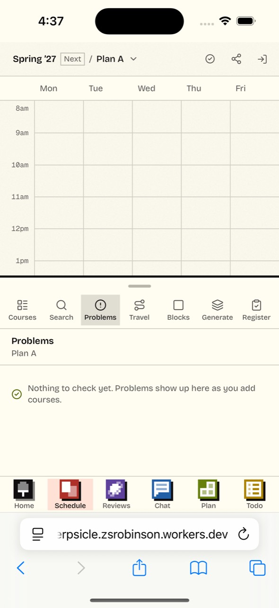 | **2. Problems tab** (ok, 13 s) after: tap {"target":"[data-workbench-drawer] nav[aria-label=\"Tabs\"] button \"Problems\"","at":{"x":142,"y":376}} viewport 393×659, visual 659 tall at 0, scrollY 0 drawer half, top 329, inside 280px keyboard down page processes 608 MB (2, largest 596 MB) focus div#_r_k_ at y 329–940 panel "Problems" |
| 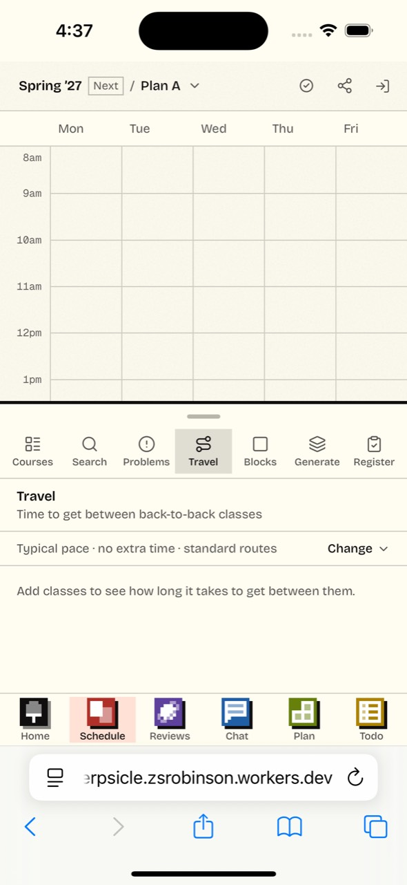 | **3. Travel tab** (ok, 17 s) after: tap {"target":"[data-workbench-drawer] nav[aria-label=\"Tabs\"] button \"Travel\"","at":{"x":197,"y":376}} viewport 393×659, visual 659 tall at 0, scrollY 0 drawer half, top 329, inside 280px keyboard down page processes 557 MB (2, largest 546 MB) focus div#_r_k_ at y 329–940 panel "Travel" |
| 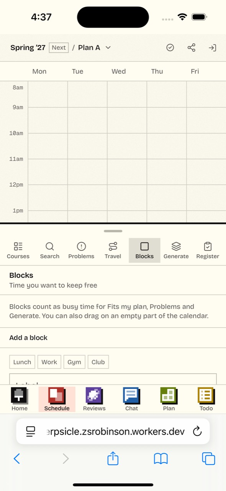 | **4. Blocks tab** (ok, 20 s) after: tap {"target":"[data-workbench-drawer] nav[aria-label=\"Tabs\"] button \"Blocks\"","at":{"x":252,"y":376}} viewport 393×659, visual 659 tall at 0, scrollY 0 drawer half, top 329, inside 280px keyboard down page processes 520 MB (2, largest 508 MB) focus div#_r_k_ at y 329–940 panel "Blocks" |
| 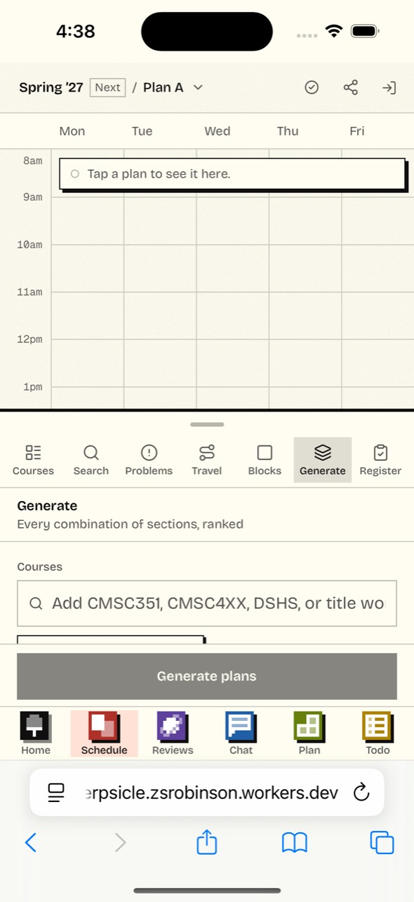 | **5. Generate tab** (ok, 23 s) after: tap {"target":"[data-workbench-drawer] nav[aria-label=\"Tabs\"] button \"Generate\"","at":{"x":307,"y":376}} viewport 393×659, visual 659 tall at 0, scrollY 0 drawer half, top 329, inside 280px keyboard down page processes 511 MB (2, largest 499 MB) focus div#_r_k_ at y 329–940 panel "Generate" |
| 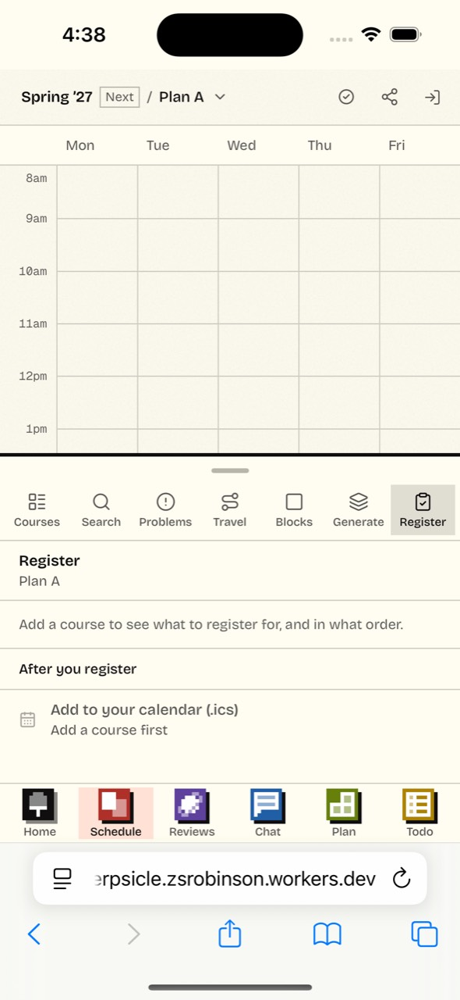 | **6. Register tab** (ok, 27 s) after: tap {"target":"[data-workbench-drawer] nav[aria-label=\"Tabs\"] button \"Register\"","at":{"x":362,"y":376}} viewport 393×659, visual 659 tall at 0, scrollY 0 drawer half, top 329, inside 280px keyboard down page processes 572 MB (2, largest 558 MB) focus div#_r_k_ at y 329–940 panel "Register" |
| 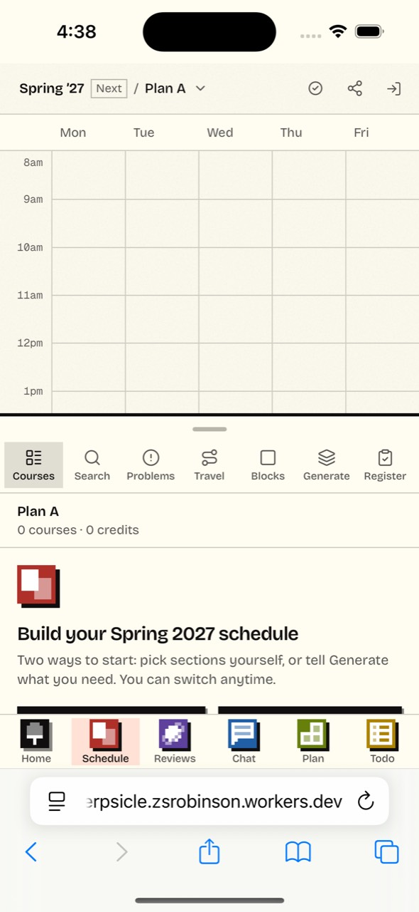 | **7. Courses tab** (ok, 33 s) after: tap {"target":"[data-workbench-drawer] nav[aria-label=\"Tabs\"] button \"Courses\"","at":{"x":32,"y":376}} viewport 393×659, visual 659 tall at 0, scrollY 0 drawer half, top 329, inside 280px keyboard down page processes 578 MB (2, largest 565 MB) focus div#_r_k_ at y 329–940 panel "Plan A" |
|  | **8. tapped the open tab** (ok, 38 s) after: tap {"target":"[data-workbench-drawer] nav[aria-label=\"Tabs\"] button \"Courses\"","at":{"x":32,"y":376}} viewport 393×659, visual 659 tall at 0, scrollY 0 drawer peek, top 485, inside 124px keyboard down page processes 571 MB (2, largest 558 MB) focus div#_r_k_ at y 485–1096 panel "Plan A" |

## Drag the grabber peek → half → full → peek

`grabber-drag` · [recording](grabber-drag/video.mp4)

| Screen | Step |
|---|---|
| 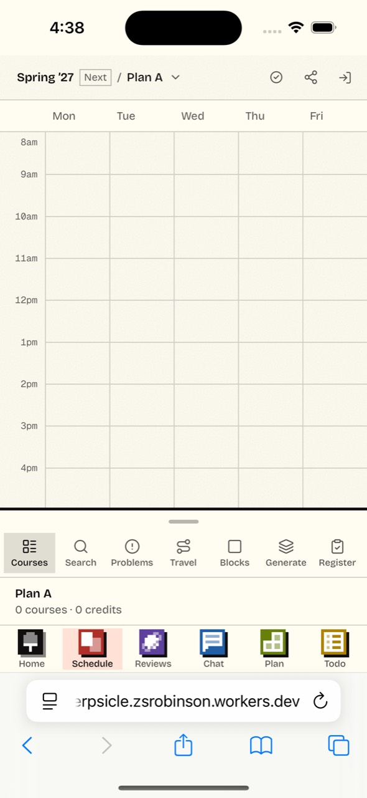 | **1. peek** (ok, 10 s) after: tap {"target":"[data-workbench-drawer] button[aria-label$=\"the panel\"]","at":{"x":197,"y":61}} viewport 393×659, visual 659 tall at 0, scrollY 0 drawer peek, top 485, inside 124px keyboard down page processes 528 MB (2, largest 514 MB) focus div#_r_k_ at y 485–1096 panel "Plan A" events: installed |
|  | **2. dragged to half** (ok, 17 s) after: swipe {"from":"[data-workbench-drawer] button[aria-label$=\"the panel\"]","start":{"x":197,"y":498},"end":{"x":197,"y":342},"ms":900,"intent":"drag"} viewport 393×659, visual 659 tall at 0, scrollY 0 drawer half, top 329, inside 280px keyboard down page processes 454 MB (2, largest 440 MB) focus div#_r_k_ at y 329–940 panel "Plan A" |
| 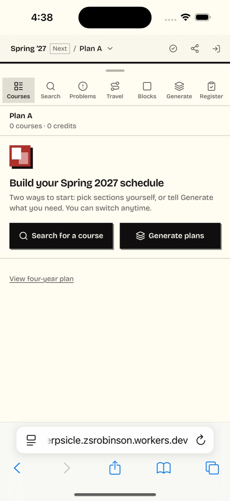 | **3. dragged to full** (ok, 22 s) after: swipe {"from":"[data-workbench-drawer] button[aria-label$=\"the panel\"]","start":{"x":197,"y":342},"end":{"x":197,"y":61},"ms":900,"intent":"drag"} viewport 393×659, visual 659 tall at 0, scrollY 0 drawer full, top 48, inside 611px keyboard down page processes 359 MB (2, largest 344 MB) focus div#_r_k_ at y 48–659 panel "Plan A" |
|  | **4. dragged to peek** (ok, 26 s) after: swipe {"from":"[data-workbench-drawer] button[aria-label$=\"the panel\"]","start":{"x":197,"y":61},"end":{"x":197,"y":498},"ms":900,"intent":"drag"} viewport 393×659, visual 659 tall at 0, scrollY 0 drawer peek, top 485, inside 124px keyboard down page processes 349 MB (2, largest 334 MB) focus div#_r_k_ at y 485–1096 panel "Plan A" |

## Pull down on a list at its top, at each snap

`pull-lists` · [recording](pull-lists/video.mp4)

| Screen | Step |
|---|---|
| 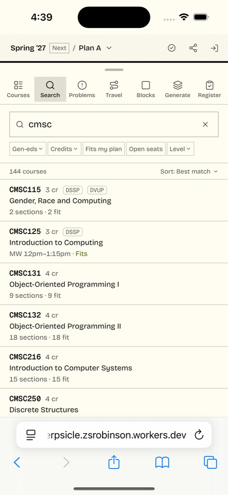 | **1. results at full** (ok, 18 s) after: tap {"target":"[data-workbench-drawer] nav[aria-label=\"Tabs\"] button \"Search\"","at":{"x":87,"y":95}} after: tap {"target":"input[aria-label=\"Search courses\"]","at":{"x":208,"y":155}} after: type {"text":"cmsc"} after: hide keyboard {} viewport 393×659, visual 659 tall at 0, scrollY 0 drawer full, top 48, inside 611px keyboard down page processes 463 MB (2, largest 448 MB) panel "Search" events: installed, vv-resize ×2 |
| 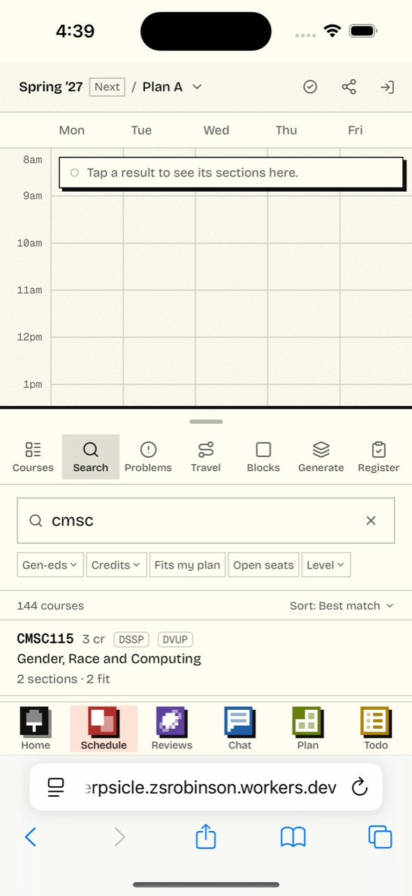 | **2. pulled down at full** (ok, 24 s) after: swipe {"from":null,"start":{"x":197,"y":270},"end":{"x":197,"y":570},"ms":600,"intent":"drag"} viewport 393×659, visual 659 tall at 0, scrollY 0 drawer half, top 329, inside 280px keyboard down page processes 516 MB (2, largest 500 MB) panel "Search" |
|  | **3. results at half** (ok, 25 s) viewport 393×659, visual 659 tall at 0, scrollY 0 drawer half, top 329, inside 280px keyboard down page processes 519 MB (2, largest 504 MB) panel "Search" |
|  | **4. pulled down at half** (ok, 29 s) after: swipe {"from":null,"start":{"x":197,"y":551},"end":{"x":197,"y":851},"ms":600,"intent":"drag"} viewport 393×659, visual 659 tall at 0, scrollY 0 drawer peek, top 485, inside 124px keyboard down page processes 519 MB (2, largest 504 MB) panel "Search" |
|  | **5. results at peek** (ok, 30 s) viewport 393×659, visual 659 tall at 0, scrollY 0 drawer peek, top 485, inside 124px keyboard down page processes 519 MB (2, largest 504 MB) panel "Search" |
|  | **6. pulled down at peek** (ok, 34 s) after: swipe {"from":null,"start":{"x":197,"y":518},"end":{"x":197,"y":818},"ms":600,"intent":"drag"} viewport 393×659, visual 659 tall at 0, scrollY 0 drawer peek, top 485, inside 124px keyboard down page processes 634 MB (2, largest 619 MB) panel "Search" |
|  | **7. pulled down on Courses at half** (warn, 41 s) after: tap {"target":"[data-workbench-drawer] nav[aria-label=\"Tabs\"] button \"Courses\"","at":{"x":32,"y":532}} after: swipe {"from":null,"start":{"x":197,"y":469},"end":{"x":197,"y":769},"ms":600,"intent":"drag"} viewport 393×659, visual 659 tall at 0, scrollY 0 drawer peek, top 485, inside 124px keyboard down page processes 623 MB (2, largest 607 MB) focus div#_r_k_ at y 485–1096 panel "Plan A" **warn drawer-moves-one-way**: 2 reversal(s) over 64 frames (329–629) |

## Scroll a long list down, then back up: the drawer stays

`scroll-list-back` · [recording](scroll-list-back/video.mp4)

| Screen | Step |
|---|---|
| 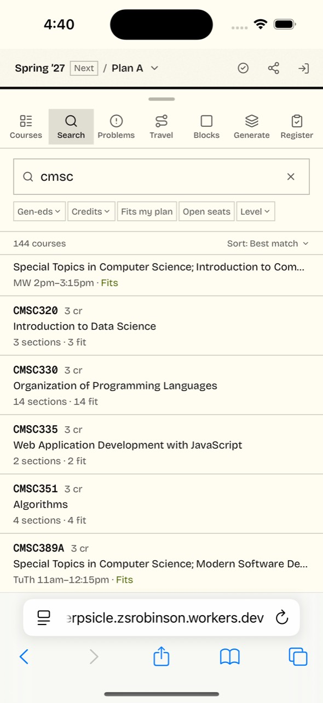 | **1. scrolled down** (ok, 23 s) after: tap {"target":"[data-workbench-drawer] nav[aria-label=\"Tabs\"] button \"Search\"","at":{"x":87,"y":95}} after: tap {"target":"input[aria-label=\"Search courses\"]","at":{"x":208,"y":155}} after: type {"text":"cmsc"} after: hide keyboard {} after: swipe {"from":null,"start":{"x":197,"y":558},"end":{"x":197,"y":208},"ms":400,"intent":"scroll"} viewport 393×659, visual 659 tall at 0, scrollY 0 drawer full, top 48, inside 611px keyboard down page processes 348 MB (2, largest 331 MB) panel "Search" events: installed, vv-resize ×2, pointercancel |
| 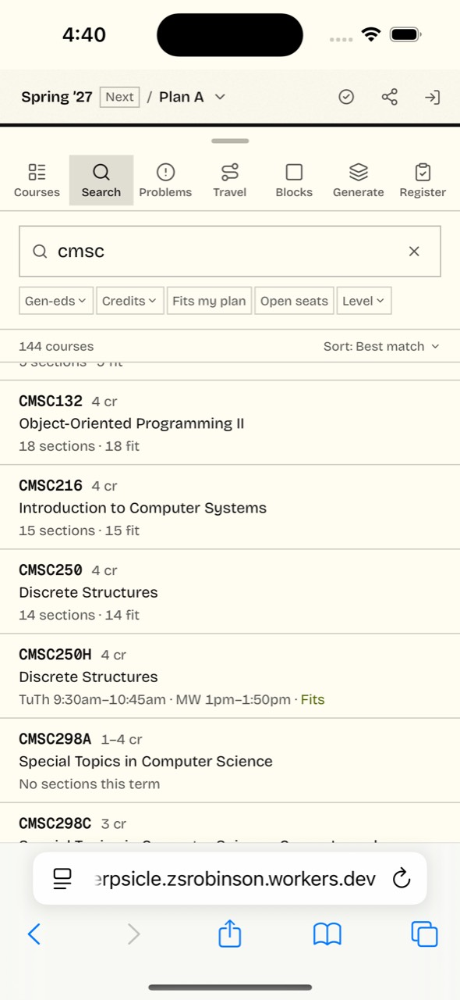 | **2. scrolled back up** (ok, 31 s) after: swipe {"from":null,"start":{"x":197,"y":373},"end":{"x":197,"y":623},"ms":400,"intent":"scroll"} viewport 393×659, visual 659 tall at 0, scrollY 0 drawer full, top 48, inside 611px keyboard down page processes 296 MB (2, largest 276 MB) panel "Search" events: pointercancel |

## Scroll the calendar, then pull down at its top

`calendar-pull` · [recording](calendar-pull/video.mp4)

| Screen | Step |
|---|---|
|  | **1. scrolled the calendar down** (ok, 15 s) after: tap {"target":"[data-workbench-drawer] button[aria-label$=\"the panel\"]","at":{"x":197,"y":342}} after: tap {"target":"[data-workbench-drawer] button[aria-label$=\"the panel\"]","at":{"x":197,"y":62}} after: swipe {"from":null,"start":{"x":197,"y":310},"end":{"x":197,"y":60},"ms":500,"intent":"scroll"} viewport 393×659, visual 659 tall at 0, scrollY 0 drawer peek, top 485, inside 124px keyboard down page processes 654 MB (2, largest 637 MB) focus div#_r_k_ at y 485–1096 panel "Search" events: installed |
|  | **2. pulled down at the top** (ok, 23 s) after: swipe {"from":null,"start":{"x":197,"y":114},"end":{"x":197,"y":464},"ms":500,"intent":"scroll"} after: swipe {"from":null,"start":{"x":197,"y":114},"end":{"x":197,"y":464},"ms":500,"intent":"scroll"} viewport 393×659, visual 659 tall at 0, scrollY 0 drawer peek, top 485, inside 124px keyboard down page processes 464 MB (2, largest 447 MB) focus div#_r_k_ at y 485–1096 panel "Search" |

## Rotate to landscape and back

`rotate` · [recording](rotate/video.mp4)

| Screen | Step |
|---|---|
|  | **1. portrait** (ok, 6 s) viewport 393×659, visual 659 tall at 0, scrollY 0 drawer half, top 329, inside 280px keyboard down page processes 766 MB (2, largest 749 MB) panel "Search" events: installed |
| 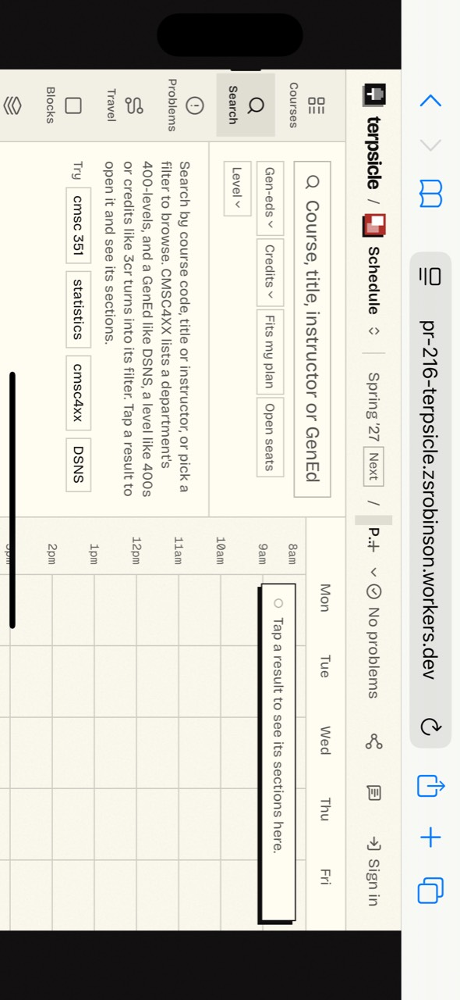 | **2. landscape** (ok, 15 s) after: rotate {"orientation":"landscape"} viewport 852×343, visual 343 tall at 0, scrollY 0 keyboard down page processes 342 MB (2, largest 325 MB) panel "Search" events: orientationchange, resize, vv-resize |
| 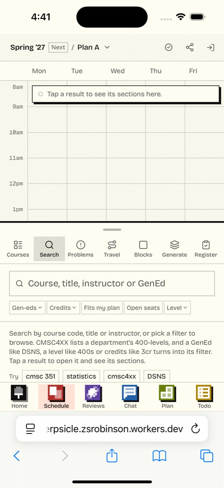 | **3. portrait again** (ok, 22 s) after: rotate {"orientation":"portrait"} viewport 393×659, visual 659 tall at 0, scrollY 0 drawer half, top 329, inside 280px keyboard down page processes 298 MB (2, largest 281 MB) panel "Search" events: orientationchange, resize, vv-resize |

## Scroll to collapse and expand the browser's toolbar

`url-bar` · [recording](url-bar/video.mp4)

| Screen | Step |
|---|---|
|  | **1. start** (ok, 11 s) after: tap {"target":"[data-workbench-drawer] button[aria-label$=\"the panel\"]","at":{"x":197,"y":342}} after: tap {"target":"[data-workbench-drawer] button[aria-label$=\"the panel\"]","at":{"x":197,"y":61}} viewport 393×659, visual 659 tall at 0, scrollY 0 drawer peek, top 485, inside 124px keyboard down page processes 548 MB (2, largest 532 MB) focus div#_r_k_ at y 485–1096 panel "Search" events: installed |
|  | **2. scrolled the calendar up (toolbar may hide)** (ok, 18 s) after: swipe {"from":null,"start":{"x":197,"y":354},"end":{"x":197,"y":54},"ms":400,"intent":"scroll"} viewport 393×659, visual 659 tall at 0, scrollY 0 drawer peek, top 485, inside 124px keyboard down page processes 448 MB (2, largest 432 MB) focus div#_r_k_ at y 485–1096 panel "Search" |
| 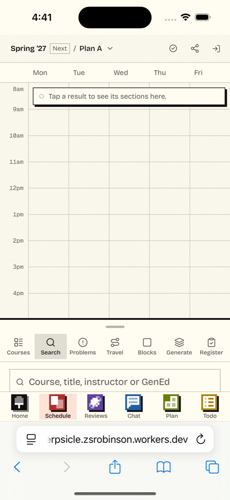 | **3. scrolled it back (toolbar may show)** (ok, 23 s) after: swipe {"from":null,"start":{"x":197,"y":354},"end":{"x":197,"y":654},"ms":400,"intent":"scroll"} viewport 393×659, visual 659 tall at 0, scrollY 0 drawer peek, top 485, inside 124px keyboard down page processes 244 MB (2, largest 228 MB) focus div#_r_k_ at y 485–1096 panel "Search" |
| 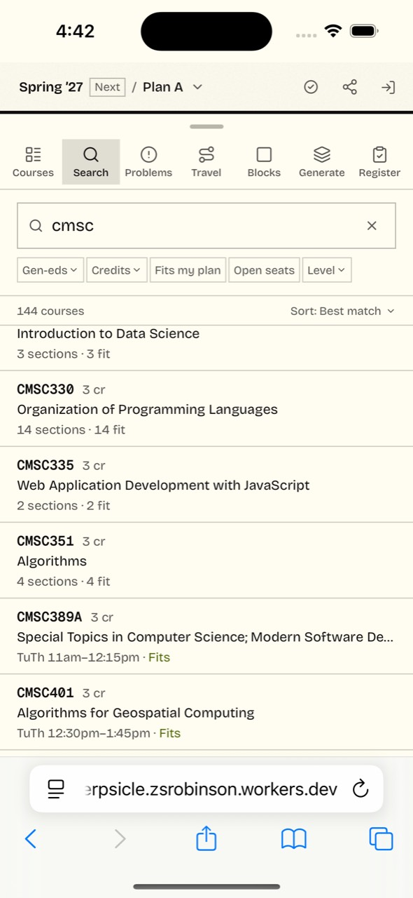 | **4. scrolled the results** (ok, 44 s) after: tap {"target":"[data-workbench-drawer] nav[aria-label=\"Tabs\"] button \"Search\"","at":{"x":87,"y":532}} after: tap {"target":"input[aria-label=\"Search courses\"]","at":{"x":208,"y":436}} after: type {"text":"cmsc"} after: hide keyboard {} after: swipe {"from":null,"start":{"x":197,"y":578},"end":{"x":197,"y":178},"ms":400,"intent":"scroll"} viewport 393×659, visual 659 tall at 0, scrollY 0 drawer full, top 48, inside 611px keyboard down page processes 282 MB (2, largest 265 MB) panel "Search" events: vv-resize ×2, pointercancel |
|  | **5. scrolled them back** (ok, 53 s) after: swipe {"from":null,"start":{"x":197,"y":578},"end":{"x":197,"y":978},"ms":400,"intent":"scroll"} viewport 393×659, visual 659 tall at 0, scrollY 0 drawer full, top 48, inside 611px keyboard down page processes 738 MB (2, largest 722 MB) panel "Search" events: pointercancel |

## A long course (ENGL101, 90+ sections) scrolled to the bottom

`long-course` · [recording](long-course/video.mp4)

| Screen | Step |
|---|---|
| 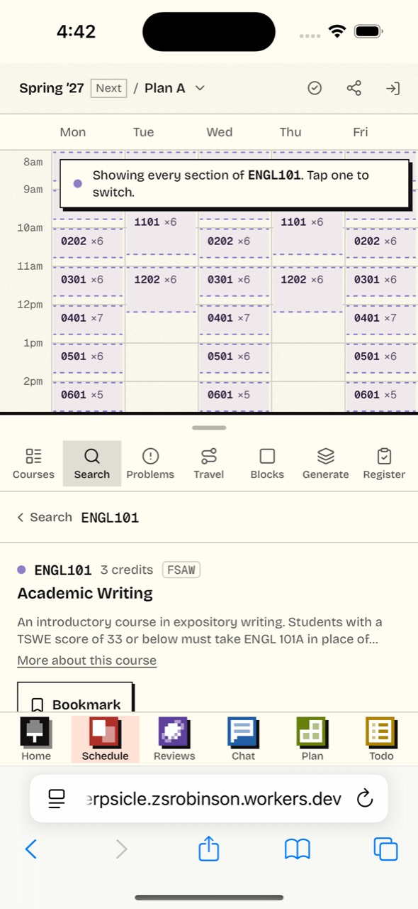 | **1. ENGL101** (warn, 35 s) after: tap {"target":"[data-workbench-drawer] nav[aria-label=\"Tabs\"] button \"Search\"","at":{"x":87,"y":376}} after: tap {"target":"input[aria-label=\"Search courses\"]","at":{"x":208,"y":592}} after: type {"text":"engl101"} after: hide keyboard {} after: tap {"target":"[data-course-result=\"ENGL101\"]","at":{"x":197,"y":286}} viewport 393×659, visual 659 tall at 0, scrollY 0 drawer half, top 329, inside 280px keyboard down page processes 761 MB (2, largest 746 MB) focus section[aria-label="ENGL101"] at y 402–610 panel "Academic Writing" events: installed, vv-resize ×2 **warn drawer-moves-one-way**: 2 reversal(s) over 26 frames (48–485) |
| 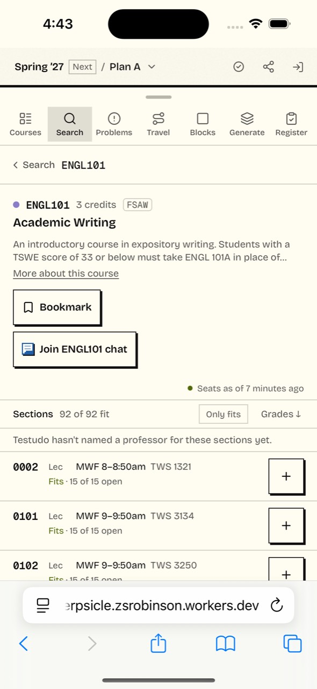 | **2. ENGL101 at full** (ok, 42 s) after: tap {"target":"[data-workbench-drawer] button[aria-label$=\"the panel\"]","at":{"x":197,"y":342}} viewport 393×659, visual 659 tall at 0, scrollY 0 drawer full, top 48, inside 611px keyboard down page processes 693 MB (2, largest 678 MB) focus div#_r_k_ at y 48–659 panel "Academic Writing" |
| 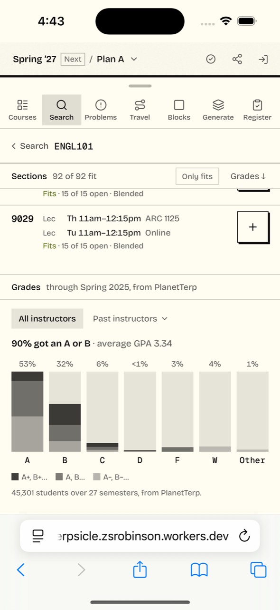 | **3. scrolled to the bottom** (ok, 70 s) after: swipe {"from":null,"start":{"x":197,"y":562},"end":{"x":197,"y":112},"ms":300,"intent":"scroll"} after: swipe {"from":null,"start":{"x":197,"y":562},"end":{"x":197,"y":112},"ms":300,"intent":"scroll"} after: swipe {"from":null,"start":{"x":197,"y":562},"end":{"x":197,"y":112},"ms":300,"intent":"scroll"} after: swipe {"from":null,"start":{"x":197,"y":562},"end":{"x":197,"y":112},"ms":300,"intent":"scroll"} after: swipe {"from":null,"start":{"x":197,"y":562},"end":{"x":197,"y":112},"ms":300,"intent":"scroll"} after: swipe {"from":null,"start":{"x":197,"y":562},"end":{"x":197,"y":112},"ms":300,"intent":"scroll"} viewport 393×659, visual 659 tall at 0, scrollY 0 drawer full, top 48, inside 611px keyboard down page processes 623 MB (2, largest 608 MB) focus div#_r_k_ at y 48–659 panel "Academic Writing" events: pointercancel ×6 |

## Search, scroll, put the keyboard away and open a result, six times

`open-results` · [recording](open-results/video.mp4)

| Screen | Step |
|---|---|
|  | **1. opened a result (1)** (ok, 28 s) after: tap {"target":"[data-workbench-drawer] nav[aria-label=\"Tabs\"] button \"Search\"","at":{"x":87,"y":376}} after: tap {"target":"input[aria-label=\"Search courses\"]","at":{"x":208,"y":436}} after: type {"text":"cmsc"} after: tap {"target":"input[aria-label=\"Search courses\"]","at":{"x":187,"y":155}} after: swipe {"from":null,"start":{"x":197,"y":399},"end":{"x":197,"y":239},"ms":400,"intent":"scroll"} after: hide keyboard {} after: tap {"target":"#search-results [data-course-result]","at":{"x":197,"y":273}} viewport 393×659, visual 659 tall at 0, scrollY 0 drawer half, top 329, inside 280px keyboard down page processes 826 MB (2, largest 812 MB) focus section[aria-label="CMSC216"] at y 402–610 panel "Introduction to Computer Systems" events: installed, vv-resize ×2, pointercancel |
|  | **2. opened a result (2)** (ok, 49 s) after: tap {"target":"[data-workbench-drawer] [data-layer][data-active] button \"Back to Search\"","at":{"x":40,"y":426}} after: tap {"target":"[data-workbench-drawer] button[aria-label$=\"the panel\"]","at":{"x":197,"y":342}} after: tap {"target":"input[aria-label=\"Search courses\"]","at":{"x":187,"y":155}} after: swipe {"from":null,"start":{"x":197,"y":399},"end":{"x":197,"y":239},"ms":400,"intent":"scroll"} after: hide keyboard {} after: tap {"target":"#search-results [data-course-result]","at":{"x":197,"y":277}} viewport 393×659, visual 659 tall at 0, scrollY 0 drawer half, top 329, inside 280px keyboard down page processes 753 MB (2, largest 739 MB) focus section[aria-label="CMSC216"] at y 402–610 panel "Introduction to Computer Systems" events: vv-resize ×2, pointercancel |
| 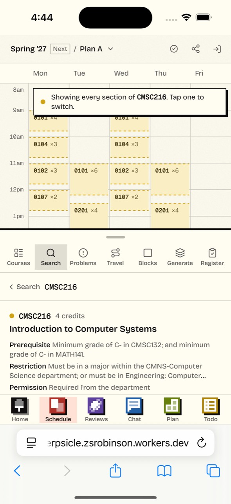 | **3. opened a result (3)** (ok, 71 s) after: tap {"target":"[data-workbench-drawer] [data-layer][data-active] button \"Back to Search\"","at":{"x":40,"y":426}} after: tap {"target":"[data-workbench-drawer] button[aria-label$=\"the panel\"]","at":{"x":197,"y":342}} after: tap {"target":"input[aria-label=\"Search courses\"]","at":{"x":187,"y":155}} after: swipe {"from":null,"start":{"x":197,"y":399},"end":{"x":197,"y":239},"ms":400,"intent":"scroll"} after: hide keyboard {} after: tap {"target":"#search-results [data-course-result]","at":{"x":197,"y":273}} viewport 393×659, visual 659 tall at 0, scrollY 0 drawer half, top 329, inside 280px keyboard down page processes 775 MB (2, largest 761 MB) focus section[aria-label="CMSC216"] at y 402–610 panel "Introduction to Computer Systems" events: vv-resize ×2, pointercancel |
|  | **4. opened a result (4)** (ok, 88 s) after: tap {"target":"[data-workbench-drawer] [data-layer][data-active] button \"Back to Search\"","at":{"x":40,"y":426}} after: tap {"target":"[data-workbench-drawer] button[aria-label$=\"the panel\"]","at":{"x":197,"y":342}} after: tap {"target":"input[aria-label=\"Search courses\"]","at":{"x":187,"y":155}} after: swipe {"from":null,"start":{"x":197,"y":399},"end":{"x":197,"y":239},"ms":400,"intent":"scroll"} after: hide keyboard {} after: tap {"target":"#search-results [data-course-result]","at":{"x":197,"y":273}} viewport 393×659, visual 659 tall at 0, scrollY 0 drawer half, top 329, inside 280px keyboard down page processes 770 MB (2, largest 756 MB) focus section[aria-label="CMSC216"] at y 402–610 panel "Introduction to Computer Systems" events: vv-resize ×2, pointercancel |
|  | **5. opened a result (5)** (ok, 104 s) after: tap {"target":"[data-workbench-drawer] [data-layer][data-active] button \"Back to Search\"","at":{"x":40,"y":426}} after: tap {"target":"[data-workbench-drawer] button[aria-label$=\"the panel\"]","at":{"x":197,"y":342}} after: tap {"target":"input[aria-label=\"Search courses\"]","at":{"x":187,"y":155}} after: swipe {"from":null,"start":{"x":197,"y":399},"end":{"x":197,"y":239},"ms":400,"intent":"scroll"} after: hide keyboard {} after: tap {"target":"#search-results [data-course-result]","at":{"x":197,"y":273}} viewport 393×659, visual 659 tall at 0, scrollY 0 drawer half, top 329, inside 280px keyboard down page processes 611 MB (2, largest 601 MB) focus section[aria-label="CMSC216"] at y 402–610 panel "Introduction to Computer Systems" events: vv-resize ×2, pointercancel |
|  | **6. opened a result (6)** (ok, 123 s) after: tap {"target":"[data-workbench-drawer] [data-layer][data-active] button \"Back to Search\"","at":{"x":40,"y":426}} after: tap {"target":"[data-workbench-drawer] button[aria-label$=\"the panel\"]","at":{"x":197,"y":342}} after: tap {"target":"input[aria-label=\"Search courses\"]","at":{"x":187,"y":155}} after: swipe {"from":null,"start":{"x":197,"y":399},"end":{"x":197,"y":239},"ms":400,"intent":"scroll"} after: hide keyboard {} after: tap {"target":"#search-results [data-course-result]","at":{"x":197,"y":273}} viewport 393×659, visual 659 tall at 0, scrollY 0 drawer half, top 329, inside 280px keyboard down page processes 932 MB (2, largest 922 MB) focus section[aria-label="CMSC216"] at y 402–610 panel "Introduction to Computer Systems" events: vv-resize ×2, pointercancel |

## Add a section from course details, then switch it three times

`add-sections` · [recording](add-sections/video.mp4)

| Screen | Step |
|---|---|
| 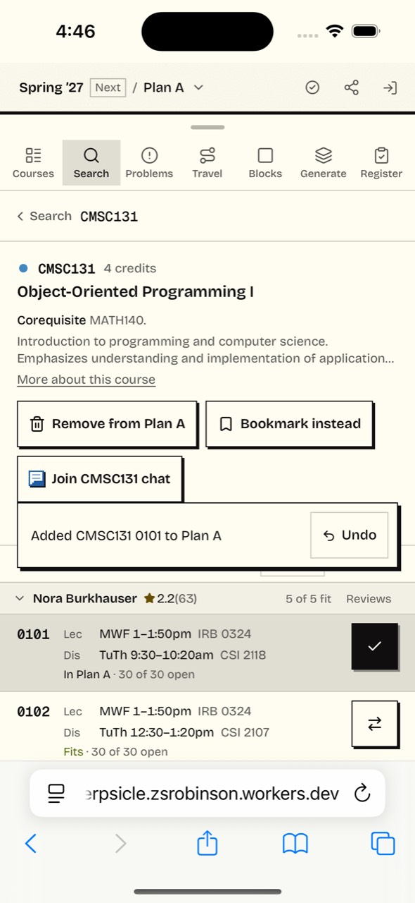 | **1. tapped Add 0101** (warn, 31 s) after: tap {"target":"[data-workbench-drawer] nav[aria-label=\"Tabs\"] button \"Search\"","at":{"x":87,"y":376}} after: tap {"target":"input[aria-label=\"Search courses\"]","at":{"x":208,"y":592}} after: type {"text":"cmsc131"} after: hide keyboard {} after: tap {"target":"[data-course-result=\"CMSC131\"]","at":{"x":197,"y":286}} after: tap {"target":"[data-workbench-drawer] button[aria-label$=\"the panel\"]","at":{"x":197,"y":342}} after: tap {"target":"[data-section] button[aria-label^=\"Add \"], [data-section] button[aria-label^=\"Switch to \"] \"Add 0101\"","at":{"x":355,"y":551}} viewport 393×659, visual 659 tall at 0, scrollY 0 drawer full, top 48, inside 611px keyboard down page processes 714 MB (2, largest 703 MB) focus section[aria-label="CMSC131"] at y 121–660 panel "Object-Oriented Programming I" events: installed, vv-resize ×2 **warn drawer-moves-one-way**: 3 reversal(s) over 52 frames (48–485) |
|  | **2. tapped Switch to 0103** (ok, 36 s) after: tap {"target":"[data-section] button[aria-label^=\"Add \"], [data-section] button[aria-label^=\"Switch to \"] \"Switch to 0103\"","at":{"x":355,"y":523}} viewport 393×659, visual 659 tall at 0, scrollY 0 drawer full, top 48, inside 611px keyboard down page processes 595 MB (2, largest 585 MB) focus section[aria-label="CMSC131"] at y 121–660 panel "Object-Oriented Programming I" |
| 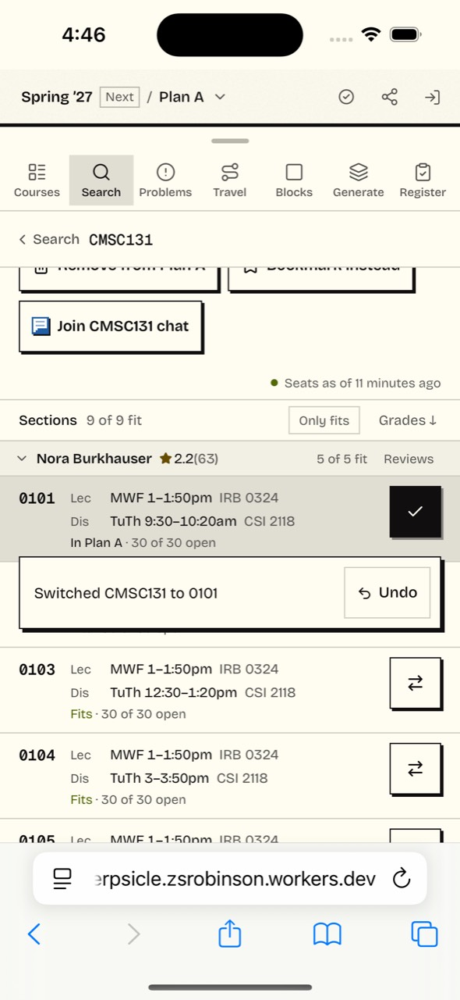 | **3. tapped Switch to 0101** (ok, 40 s) after: tap {"target":"[data-section] button[aria-label^=\"Add \"], [data-section] button[aria-label^=\"Switch to \"] \"Switch to 0101\"","at":{"x":355,"y":377}} viewport 393×659, visual 659 tall at 0, scrollY 0 drawer full, top 48, inside 611px keyboard down page processes 513 MB (2, largest 502 MB) focus section[aria-label="CMSC131"] at y 121–660 panel "Object-Oriented Programming I" |
| 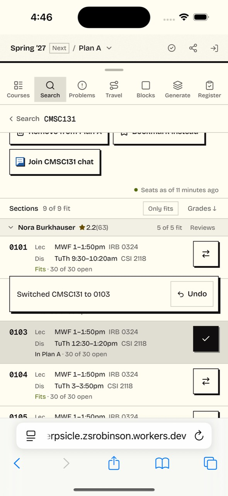 | **4. tapped Switch to 0103** (ok, 43 s) after: tap {"target":"[data-section] button[aria-label^=\"Add \"], [data-section] button[aria-label^=\"Switch to \"] \"Switch to 0103\"","at":{"x":355,"y":523}} viewport 393×659, visual 659 tall at 0, scrollY 0 drawer full, top 48, inside 611px keyboard down page processes 399 MB (2, largest 389 MB) focus section[aria-label="CMSC131"] at y 121–660 panel "Object-Oriented Programming I" |
