# Mobile lab: webkit

**Passed**: 0 failed check(s), 1 warning(s), 0 error(s).

- URL: https://pr-214-terpsicle.zsrobinson.workers.dev/schedule
- Device: Playwright webkit 26.6, iPhone 15 viewport (emulated touch, no keyboard)
- Started: 2026-09-29T12:47:23.270Z, took 244 s
- Workflow run: https://github.com/zsrobinson/terpsicle/actions/runs/36569777420
- Every step's full probe (viewport, drawer, focus, events, per-frame trace) is in `summary.json`.

| Scenario | Result | Steps | Time | Recording |
|---|---|---|---|---|
| [Search with the on-screen keyboard from half: tap the box, type, scroll, put the keyboard away, open a result](#keyboard-at-half) | ok | 10 | 21 s | [video](keyboard-at-half/video.webm) |
| [Search with the on-screen keyboard from full: tap the box, type, scroll, put the keyboard away, open a result](#keyboard-at-full) | ok | 10 | 16 s | [video](keyboard-at-full/video.webm) |
| [Search with the on-screen keyboard from peek: tap the box, type, scroll, put the keyboard away, open a result](#keyboard-at-peek) | ok | 10 | 18 s | [video](keyboard-at-peek/video.webm) |
| [First load](#first-load) | ok | 2 | 6 s | [video](first-load/video.webm) |
| [Tap each drawer tab, then the open one again](#tabs) | ok | 8 | 17 s | [video](tabs/video.webm) |
| [Drag the grabber peek → half → full → peek](#grabber-drag) | skipped | 0 | 0 s | none |
| [Pull down on a list at its top, at each snap](#pull-lists) | ok | 7 | 27 s | [video](pull-lists/video.webm) |
| [Scroll a long list down, then back up: the drawer stays](#scroll-list-back) | ok | 2 | 11 s | [video](scroll-list-back/video.webm) |
| [Scroll the calendar, then pull down at its top](#calendar-pull) | ok | 2 | 10 s | [video](calendar-pull/video.webm) |
| [Rotate to landscape and back](#rotate) | ok | 4 | 11 s | [video](rotate/video.webm) |
| [Scroll to collapse and expand the browser's toolbar](#url-bar) | ok | 5 | 15 s | [video](url-bar/video.webm) |
| [A long course (ENGL101, 90+ sections) scrolled to the bottom](#long-course) | ok | 3 | 21 s | [video](long-course/video.webm) |
| [Search, scroll, put the keyboard away and open a result, six times](#open-results) | ok | 6 | 49 s | [video](open-results/video.webm) |
| [Add a section from course details, then switch it three times](#add-sections) | warn | 4 | 22 s | [video](add-sections/video.webm) |

## Search with the on-screen keyboard from half: tap the box, type, scroll, put the keyboard away, open a result

`keyboard-at-half` · [recording](keyboard-at-half/video.webm)

| Screen | Step |
|---|---|
|  | **1. loaded** (ok, 7 s) viewport 393×659, visual 659 tall at 0, scrollY 0 drawer full, top 48, inside 611px page processes 872 MB (2, largest 612 MB) panel "Plan A" events: installed |
| 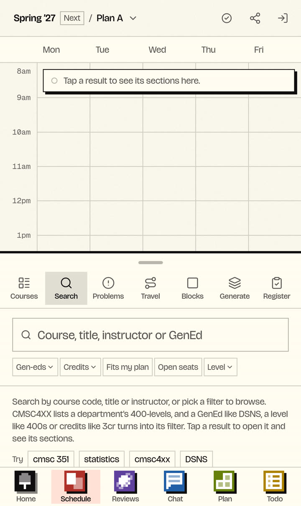 | **2. Search tab at half** (ok, 10 s) after: tap {"target":"[data-workbench-drawer] nav[aria-label=\"Tabs\"] button \"Search\"","at":{"x":87,"y":95}} after: tap {"target":"[data-workbench-drawer] button[aria-label$=\"the panel\"]","at":{"x":197,"y":61}} after: tap {"target":"[data-workbench-drawer] button[aria-label$=\"the panel\"]","at":{"x":197,"y":498}} viewport 393×659, visual 659 tall at 0, scrollY 0 drawer half, top 329, inside 280px page processes 903 MB (2, largest 643 MB) focus button#base-ui-_r_40_[aria-label="Raise the panel"] at y 330–354 panel "Search" |
|  | **3. tapped the search box (+150 ms)** (ok, 10 s) after: tap {"target":"input[aria-label=\"Search courses\"]","at":{"x":208,"y":436}} viewport 393×659, visual 659 tall at 0, scrollY 0 drawer full, top 48, inside 611px page processes 904 MB (2, largest 644 MB) focus input#base-ui-_r_5l_[aria-label="Search courses"] at y 134–176 panel "Search" |
|  | **4. tapped the search box (+500 ms)** (ok, 11 s) viewport 393×659, visual 659 tall at 0, scrollY 0 drawer full, top 48, inside 611px page processes 901 MB (2, largest 641 MB) focus input#base-ui-_r_5l_[aria-label="Search courses"] at y 134–176 panel "Search" |
|  | **5. tapped the search box (+1000 ms)** (ok, 12 s) viewport 393×659, visual 659 tall at 0, scrollY 0 drawer full, top 48, inside 611px page processes 901 MB (2, largest 641 MB) focus input#base-ui-_r_5l_[aria-label="Search courses"] at y 134–176 panel "Search" |
|  | **6. tapped the search box (+2000 ms)** (ok, 13 s) viewport 393×659, visual 659 tall at 0, scrollY 0 drawer full, top 48, inside 611px page processes 899 MB (2, largest 640 MB) focus input#base-ui-_r_5l_[aria-label="Search courses"] at y 134–176 panel "Search" |
|  | **7. typed "cmsc"** (ok, 15 s) after: type {"text":"cmsc"} viewport 393×659, visual 659 tall at 0, scrollY 0 drawer full, top 48, inside 611px page processes 906 MB (2, largest 676 MB) focus input#base-ui-_r_5l_[aria-label="Search courses"] at y 134–176 panel "Search" |
| 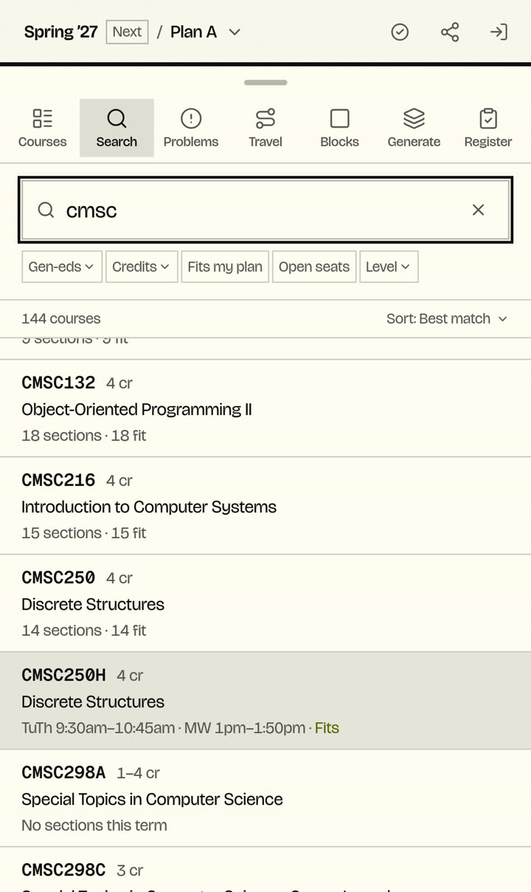 | **8. scrolled the results** (ok, 16 s) after: swipe {"from":null,"start":{"x":197,"y":578},"end":{"x":197,"y":378},"ms":500,"intent":"scroll"} viewport 393×659, visual 659 tall at 0, scrollY 0 drawer full, top 48, inside 611px page processes 910 MB (2, largest 680 MB) focus input#base-ui-_r_5l_[aria-label="Search courses"] at y 134–176 panel "Search" |
| 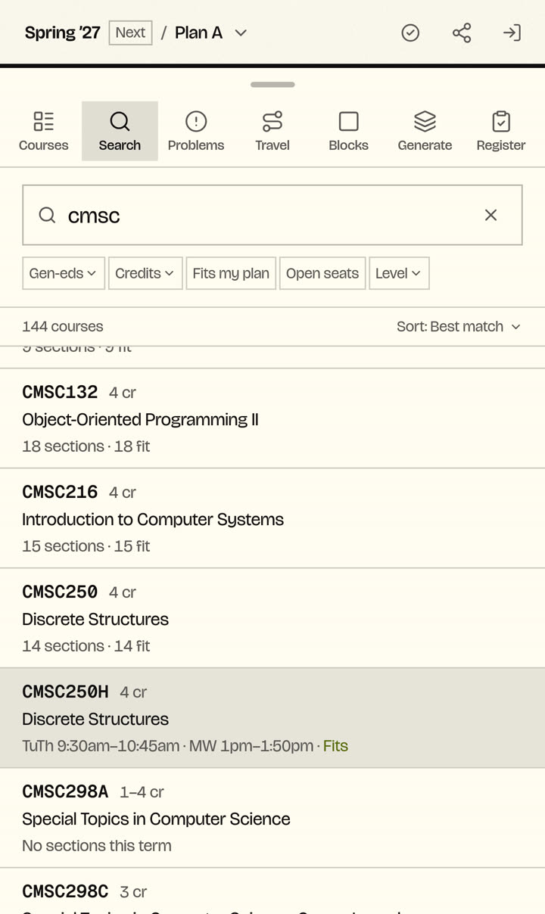 | **9. put the keyboard away** (ok, 17 s) after: hide keyboard {} viewport 393×659, visual 659 tall at 0, scrollY 0 drawer full, top 48, inside 611px page processes 910 MB (2, largest 679 MB) panel "Search" |
| 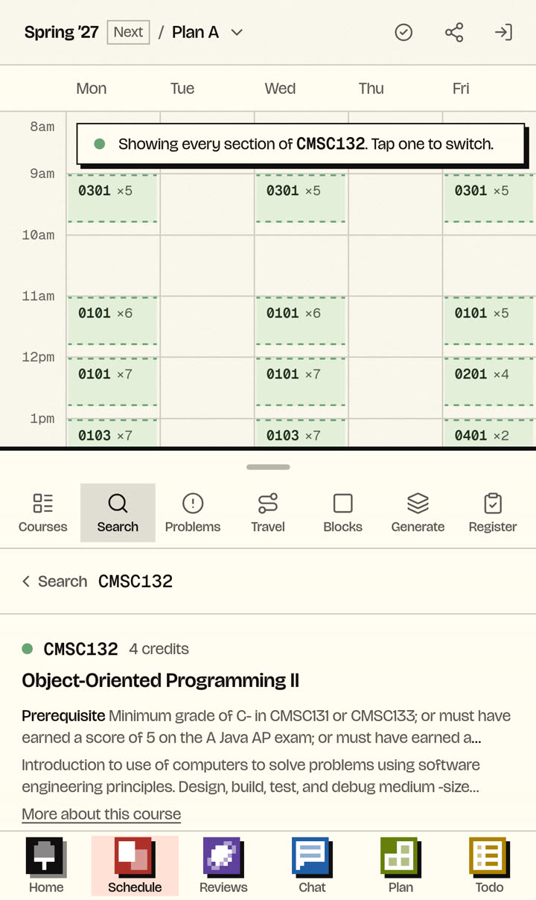 | **10. opened a result** (ok, 19 s) after: tap {"target":"#search-results [data-course-result]","at":{"x":197,"y":302}} viewport 393×659, visual 659 tall at 0, scrollY 0 drawer half, top 329, inside 280px page processes 962 MB (2, largest 731 MB) focus section[aria-label="CMSC132"] at y 402–610 panel "Object-Oriented Programming II" |

## Search with the on-screen keyboard from full: tap the box, type, scroll, put the keyboard away, open a result

`keyboard-at-full` · [recording](keyboard-at-full/video.webm)

| Screen | Step |
|---|---|
| 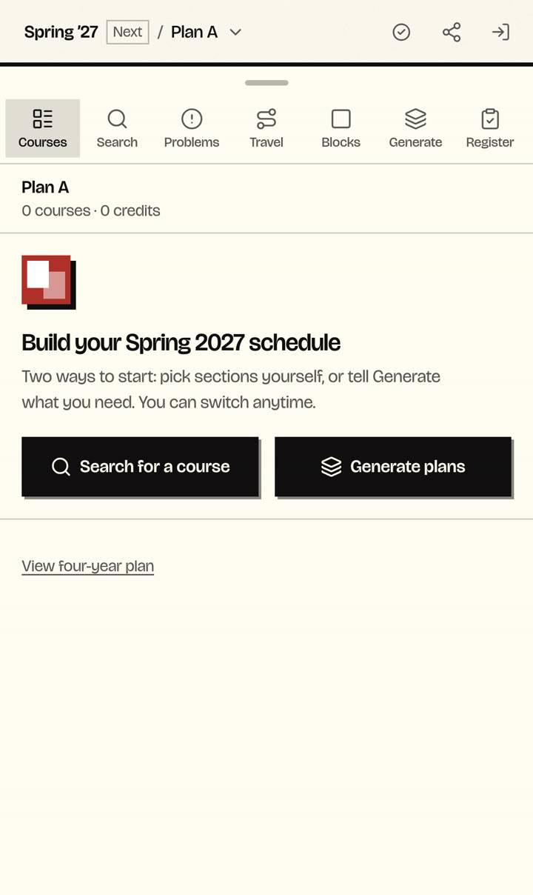 | **1. loaded** (ok, 4 s) viewport 393×659, visual 659 tall at 0, scrollY 0 drawer full, top 48, inside 611px page processes 830 MB (2, largest 597 MB) panel "Plan A" events: installed |
| 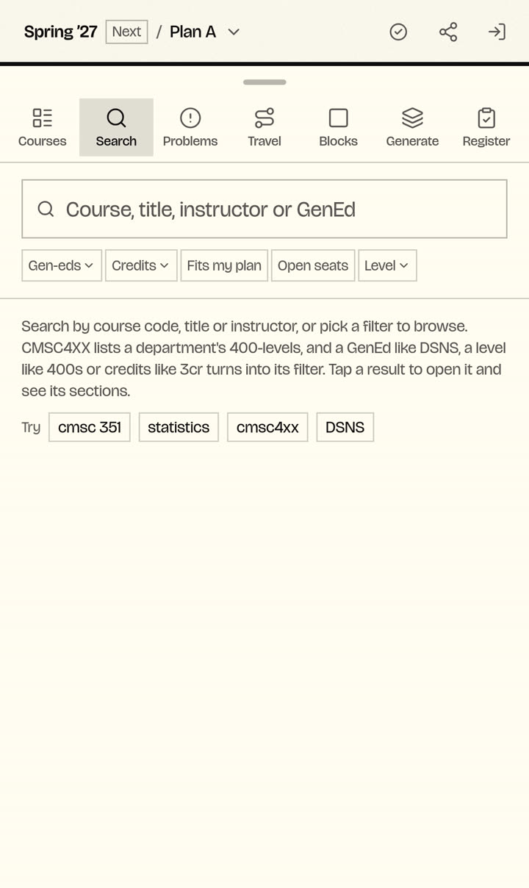 | **2. Search tab at full** (ok, 5 s) after: tap {"target":"[data-workbench-drawer] nav[aria-label=\"Tabs\"] button \"Search\"","at":{"x":87,"y":95}} viewport 393×659, visual 659 tall at 0, scrollY 0 drawer full, top 48, inside 611px page processes 858 MB (2, largest 626 MB) focus button#base-ui-_r_35_ at y 73–116 panel "Search" |
|  | **3. tapped the search box (+150 ms)** (ok, 5 s) after: tap {"target":"input[aria-label=\"Search courses\"]","at":{"x":208,"y":155}} viewport 393×659, visual 659 tall at 0, scrollY 0 drawer full, top 48, inside 611px page processes 869 MB (2, largest 636 MB) focus input#base-ui-_r_4k_[aria-label="Search courses"] at y 134–176 panel "Search" |
|  | **4. tapped the search box (+500 ms)** (ok, 6 s) viewport 393×659, visual 659 tall at 0, scrollY 0 drawer full, top 48, inside 611px page processes 869 MB (2, largest 636 MB) focus input#base-ui-_r_4k_[aria-label="Search courses"] at y 134–176 panel "Search" |
|  | **5. tapped the search box (+1000 ms)** (ok, 7 s) viewport 393×659, visual 659 tall at 0, scrollY 0 drawer full, top 48, inside 611px page processes 868 MB (2, largest 635 MB) focus input#base-ui-_r_4k_[aria-label="Search courses"] at y 134–176 panel "Search" |
|  | **6. tapped the search box (+2000 ms)** (ok, 8 s) viewport 393×659, visual 659 tall at 0, scrollY 0 drawer full, top 48, inside 611px page processes 868 MB (2, largest 635 MB) focus input#base-ui-_r_4k_[aria-label="Search courses"] at y 134–176 panel "Search" |
| 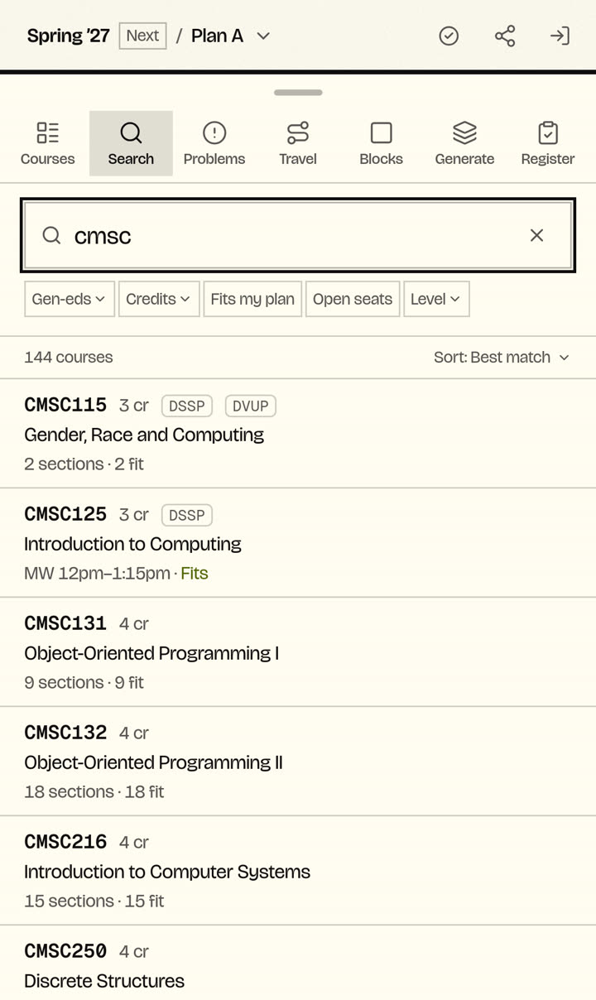 | **7. typed "cmsc"** (ok, 10 s) after: type {"text":"cmsc"} viewport 393×659, visual 659 tall at 0, scrollY 0 drawer full, top 48, inside 611px page processes 908 MB (2, largest 675 MB) focus input#base-ui-_r_4k_[aria-label="Search courses"] at y 134–176 panel "Search" |
| 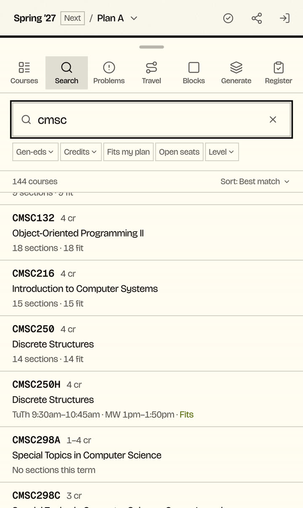 | **8. scrolled the results** (ok, 11 s) after: swipe {"from":null,"start":{"x":197,"y":578},"end":{"x":197,"y":378},"ms":500,"intent":"scroll"} viewport 393×659, visual 659 tall at 0, scrollY 0 drawer full, top 48, inside 611px page processes 888 MB (2, largest 674 MB) focus input#base-ui-_r_4k_[aria-label="Search courses"] at y 134–176 panel "Search" |
|  | **9. put the keyboard away** (ok, 12 s) after: hide keyboard {} viewport 393×659, visual 659 tall at 0, scrollY 0 drawer full, top 48, inside 611px page processes 887 MB (2, largest 673 MB) panel "Search" |
|  | **10. opened a result** (ok, 14 s) after: tap {"target":"#search-results [data-course-result]","at":{"x":197,"y":302}} viewport 393×659, visual 659 tall at 0, scrollY 0 drawer half, top 329, inside 280px page processes 952 MB (2, largest 738 MB) focus section[aria-label="CMSC132"] at y 402–610 panel "Object-Oriented Programming II" |

## Search with the on-screen keyboard from peek: tap the box, type, scroll, put the keyboard away, open a result

`keyboard-at-peek` · [recording](keyboard-at-peek/video.webm)

| Screen | Step |
|---|---|
| 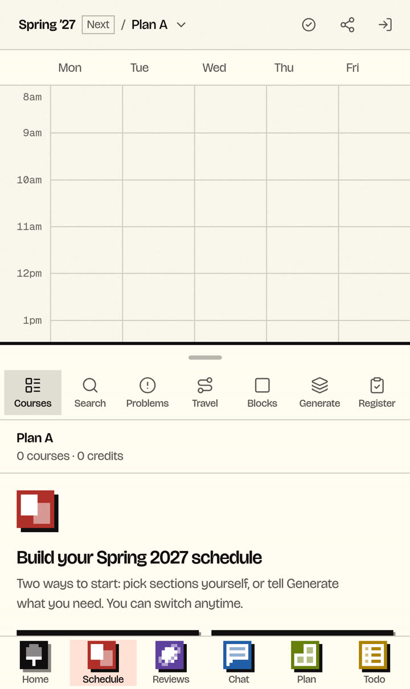 | **1. loaded** (ok, 3 s) viewport 393×659, visual 659 tall at 0, scrollY 0 drawer half, top 329, inside 280px page processes 864 MB (2, largest 609 MB) panel "Plan A" events: installed |
| 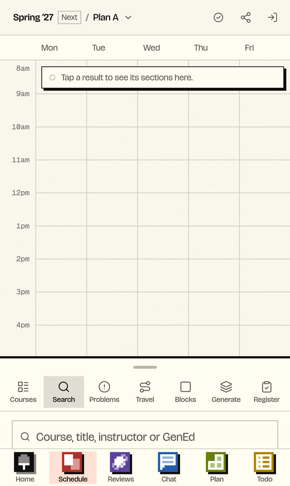 | **2. Search tab at peek** (ok, 6 s) after: tap {"target":"[data-workbench-drawer] nav[aria-label=\"Tabs\"] button \"Search\"","at":{"x":87,"y":376}} after: tap {"target":"[data-workbench-drawer] button[aria-label$=\"the panel\"]","at":{"x":197,"y":342}} after: tap {"target":"[data-workbench-drawer] button[aria-label$=\"the panel\"]","at":{"x":197,"y":61}} viewport 393×659, visual 659 tall at 0, scrollY 0 drawer peek, top 485, inside 124px page processes 881 MB (2, largest 626 MB) focus button#base-ui-_r_2a_[aria-label="Raise the panel"] at y 486–510 panel "Search" |
|  | **3. tapped the search box (+150 ms)** (ok, 7 s) after: tap {"target":"input[aria-label=\"Search courses\"]","at":{"x":208,"y":592}} viewport 393×659, visual 659 tall at 0, scrollY 0 drawer full, top 48, inside 611px page processes 875 MB (2, largest 621 MB) focus input#base-ui-_r_5j_[aria-label="Search courses"] at y 134–176 panel "Search" |
|  | **4. tapped the search box (+500 ms)** (ok, 8 s) viewport 393×659, visual 659 tall at 0, scrollY 0 drawer full, top 48, inside 611px page processes 874 MB (2, largest 620 MB) focus input#base-ui-_r_5j_[aria-label="Search courses"] at y 134–176 panel "Search" |
| 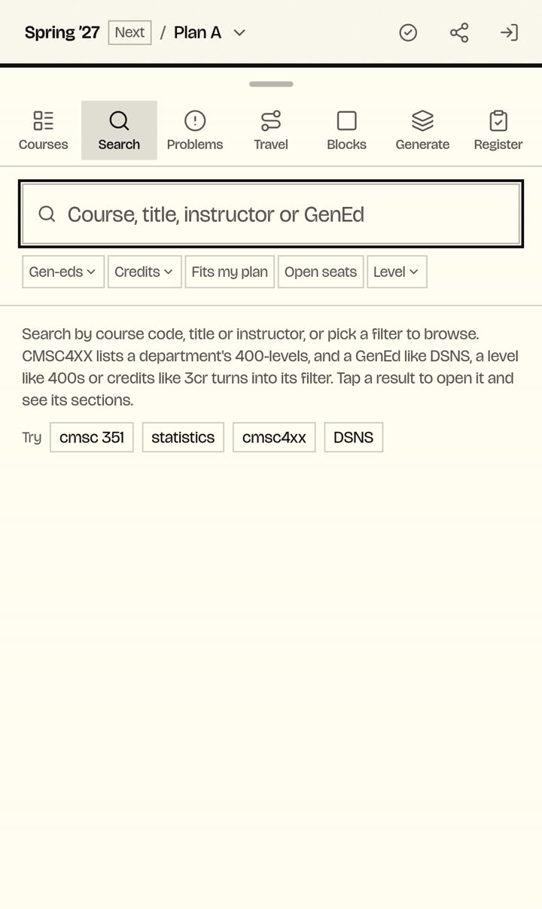 | **5. tapped the search box (+1000 ms)** (ok, 8 s) viewport 393×659, visual 659 tall at 0, scrollY 0 drawer full, top 48, inside 611px page processes 874 MB (2, largest 620 MB) focus input#base-ui-_r_5j_[aria-label="Search courses"] at y 134–176 panel "Search" |
|  | **6. tapped the search box (+2000 ms)** (ok, 10 s) viewport 393×659, visual 659 tall at 0, scrollY 0 drawer full, top 48, inside 611px page processes 874 MB (2, largest 620 MB) focus input#base-ui-_r_5j_[aria-label="Search courses"] at y 134–176 panel "Search" |
|  | **7. typed "cmsc"** (ok, 11 s) after: type {"text":"cmsc"} viewport 393×659, visual 659 tall at 0, scrollY 0 drawer full, top 48, inside 611px page processes 892 MB (2, largest 666 MB) focus input#base-ui-_r_5j_[aria-label="Search courses"] at y 134–176 panel "Search" |
|  | **8. scrolled the results** (ok, 12 s) after: swipe {"from":null,"start":{"x":197,"y":578},"end":{"x":197,"y":378},"ms":500,"intent":"scroll"} viewport 393×659, visual 659 tall at 0, scrollY 0 drawer full, top 48, inside 611px page processes 893 MB (2, largest 667 MB) focus input#base-ui-_r_5j_[aria-label="Search courses"] at y 134–176 panel "Search" |
| 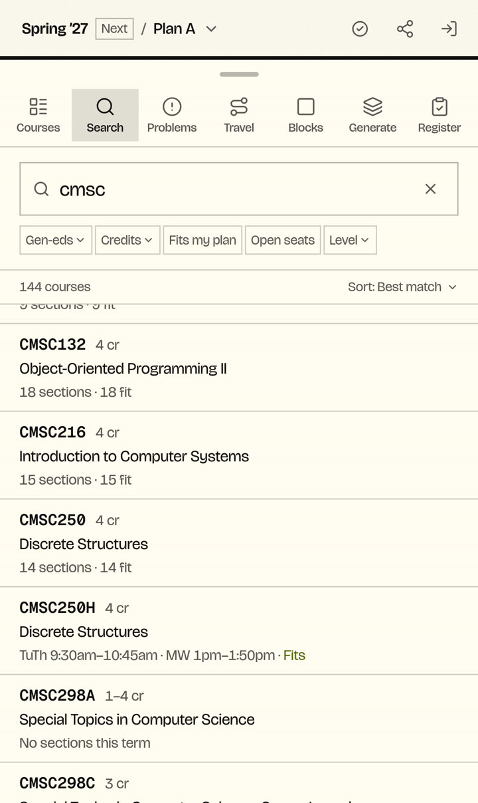 | **9. put the keyboard away** (ok, 13 s) after: hide keyboard {} viewport 393×659, visual 659 tall at 0, scrollY 0 drawer full, top 48, inside 611px page processes 893 MB (2, largest 667 MB) panel "Search" |
|  | **10. opened a result** (ok, 15 s) after: tap {"target":"#search-results [data-course-result]","at":{"x":197,"y":302}} viewport 393×659, visual 659 tall at 0, scrollY 0 drawer half, top 329, inside 280px page processes 936 MB (2, largest 710 MB) focus section[aria-label="CMSC132"] at y 402–610 panel "Object-Oriented Programming II" |

## First load

`first-load` · [recording](first-load/video.webm)

| Screen | Step |
|---|---|
|  | **1. shell up** (ok, 2 s) viewport 393×659, visual 659 tall at 0, scrollY 0 drawer full, top 60.4, inside 611px page processes 844 MB (2, largest 590 MB) panel "Plan A" events: installed |
|  | **2. settled** (ok, 5 s) viewport 393×659, visual 659 tall at 0, scrollY 0 drawer full, top 48, inside 611px page processes 872 MB (2, largest 618 MB) panel "Plan A" |

## Tap each drawer tab, then the open one again

`tabs` · [recording](tabs/video.webm)

| Screen | Step |
|---|---|
|  | **1. Search tab** (ok, 5 s) after: tap {"target":"[data-workbench-drawer] nav[aria-label=\"Tabs\"] button \"Search\"","at":{"x":87,"y":95}} viewport 393×659, visual 659 tall at 0, scrollY 0 drawer full, top 48, inside 611px page processes 860 MB (2, largest 627 MB) focus button#base-ui-_r_1c_ at y 73–116 panel "Search" events: installed |
| 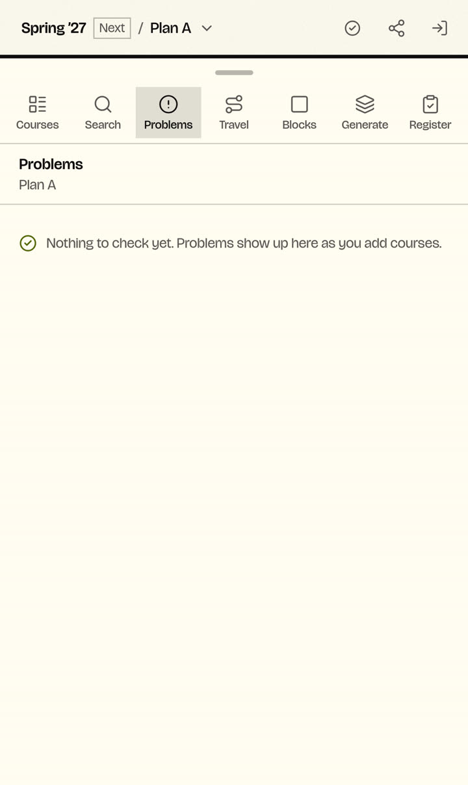 | **2. Problems tab** (ok, 6 s) after: tap {"target":"[data-workbench-drawer] nav[aria-label=\"Tabs\"] button \"Problems\"","at":{"x":142,"y":95}} viewport 393×659, visual 659 tall at 0, scrollY 0 drawer full, top 48, inside 611px page processes 860 MB (2, largest 628 MB) focus button#base-ui-_r_1f_ at y 73–116 panel "Problems" |
| 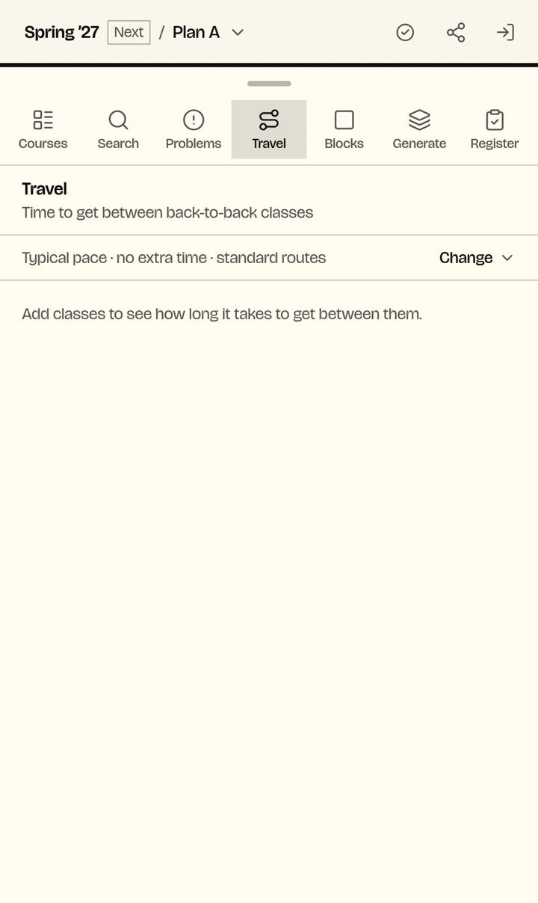 | **3. Travel tab** (ok, 9 s) after: tap {"target":"[data-workbench-drawer] nav[aria-label=\"Tabs\"] button \"Travel\"","at":{"x":197,"y":95}} viewport 393×659, visual 659 tall at 0, scrollY 0 drawer full, top 48, inside 611px page processes 870 MB (2, largest 637 MB) focus button#base-ui-_r_1i_ at y 73–116 panel "Travel" |
| 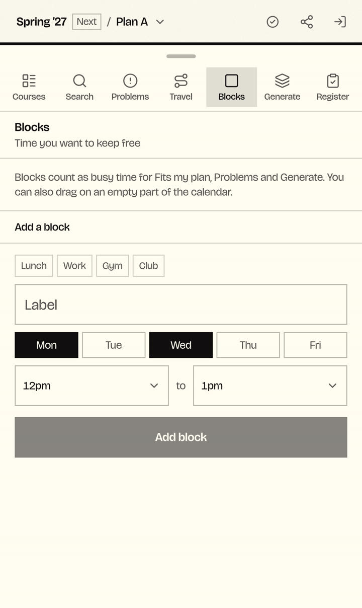 | **4. Blocks tab** (ok, 10 s) after: tap {"target":"[data-workbench-drawer] nav[aria-label=\"Tabs\"] button \"Blocks\"","at":{"x":252,"y":95}} viewport 393×659, visual 659 tall at 0, scrollY 0 drawer full, top 48, inside 611px page processes 871 MB (2, largest 638 MB) focus button#base-ui-_r_1l_ at y 73–116 panel "Blocks" |
| 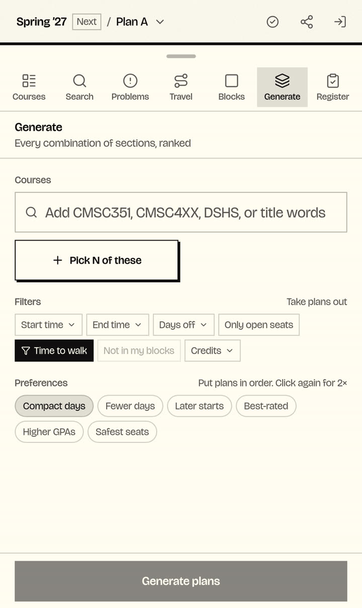 | **5. Generate tab** (ok, 11 s) after: tap {"target":"[data-workbench-drawer] nav[aria-label=\"Tabs\"] button \"Generate\"","at":{"x":307,"y":95}} viewport 393×659, visual 659 tall at 0, scrollY 0 drawer full, top 48, inside 611px page processes 862 MB (2, largest 649 MB) focus button#base-ui-_r_1o_ at y 73–116 panel "Generate" |
| 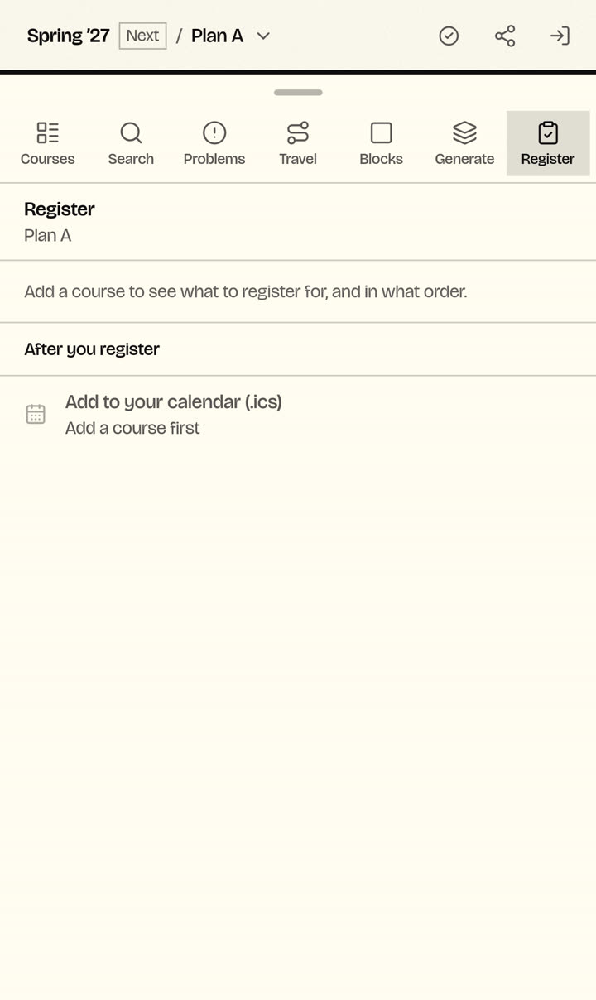 | **6. Register tab** (ok, 13 s) after: tap {"target":"[data-workbench-drawer] nav[aria-label=\"Tabs\"] button \"Register\"","at":{"x":362,"y":95}} viewport 393×659, visual 659 tall at 0, scrollY 0 drawer full, top 48, inside 611px page processes 862 MB (2, largest 648 MB) focus button#base-ui-_r_1r_ at y 73–116 panel "Register" |
|  | **7. Courses tab** (ok, 14 s) after: tap {"target":"[data-workbench-drawer] nav[aria-label=\"Tabs\"] button \"Courses\"","at":{"x":32,"y":95}} viewport 393×659, visual 659 tall at 0, scrollY 0 drawer full, top 48, inside 611px page processes 865 MB (2, largest 651 MB) focus button#base-ui-_r_19_ at y 73–116 panel "Plan A" |
|  | **8. tapped the open tab** (ok, 15 s) after: tap {"target":"[data-workbench-drawer] nav[aria-label=\"Tabs\"] button \"Courses\"","at":{"x":32,"y":95}} viewport 393×659, visual 659 tall at 0, scrollY 0 drawer peek, top 485, inside 124px page processes 870 MB (2, largest 656 MB) focus button#base-ui-_r_19_ at y 510–553 panel "Plan A" |

## Drag the grabber peek → half → full → peek

`grabber-drag`

Skipped on this engine: Playwright can't send WebKit a touch drag, and Base UI's drawer takes no mouse drag that starts on a button (the grabber).

## Pull down on a list at its top, at each snap

`pull-lists` · [recording](pull-lists/video.webm)

| Screen | Step |
|---|---|
| 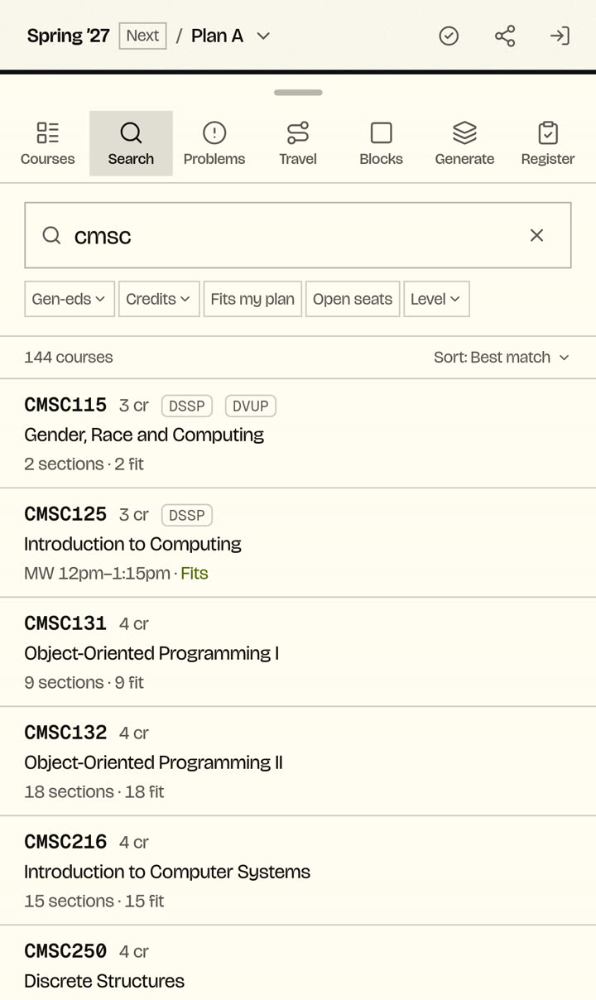 | **1. results at full** (ok, 8 s) after: tap {"target":"[data-workbench-drawer] nav[aria-label=\"Tabs\"] button \"Search\"","at":{"x":87,"y":95}} after: tap {"target":"input[aria-label=\"Search courses\"]","at":{"x":208,"y":155}} after: type {"text":"cmsc"} after: hide keyboard {} viewport 393×659, visual 659 tall at 0, scrollY 0 drawer full, top 48, inside 611px page processes 920 MB (2, largest 667 MB) panel "Search" events: installed |
| 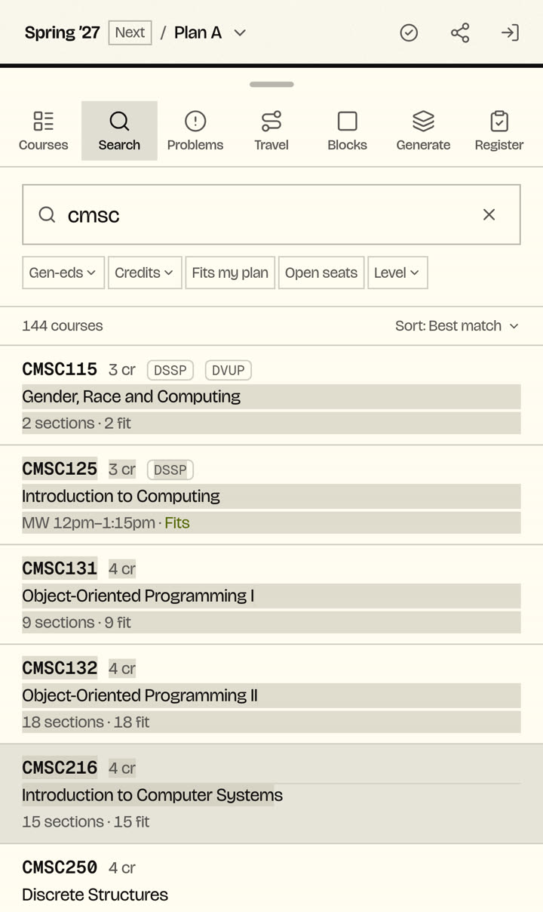 | **2. pulled down at full** (ok, 10 s) after: swipe {"from":null,"start":{"x":197,"y":270},"end":{"x":197,"y":570},"ms":600,"intent":"drag"} viewport 393×659, visual 659 tall at 0, scrollY 0 drawer full, top 48, inside 611px page processes 937 MB (2, largest 682 MB) focus div#search-result-0 at y 250–322 panel "Search" |
| 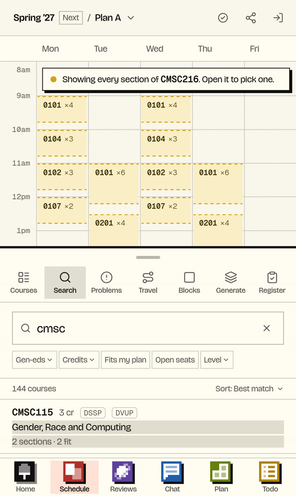 | **3. results at half** (ok, 12 s) after: tap {"target":"[data-workbench-drawer] button[aria-label$=\"the panel\"]","at":{"x":197,"y":61}} after: tap {"target":"[data-workbench-drawer] button[aria-label$=\"the panel\"]","at":{"x":197,"y":498}} viewport 393×659, visual 659 tall at 0, scrollY 0 drawer half, top 329, inside 280px page processes 910 MB (2, largest 684 MB) focus button#base-ui-_r_21_[aria-label="Raise the panel"] at y 330–354 panel "Search" |
| 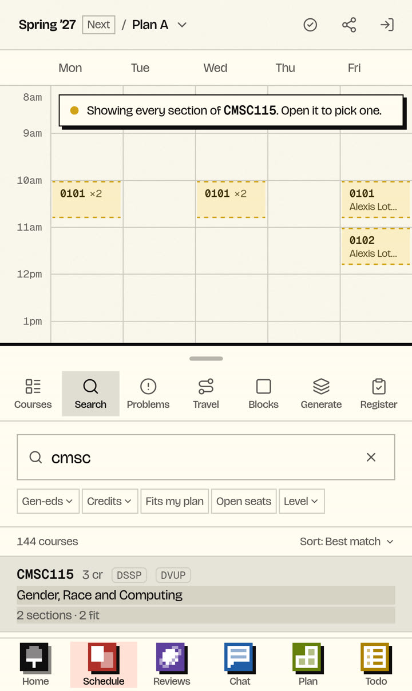 | **4. pulled down at half** (ok, 15 s) after: swipe {"from":null,"start":{"x":197,"y":551},"end":{"x":197,"y":851},"ms":600,"intent":"drag"} viewport 393×659, visual 659 tall at 0, scrollY 0 drawer half, top 329, inside 280px page processes 910 MB (2, largest 684 MB) focus div#search-result-0 at y 531–603 panel "Search" |
| 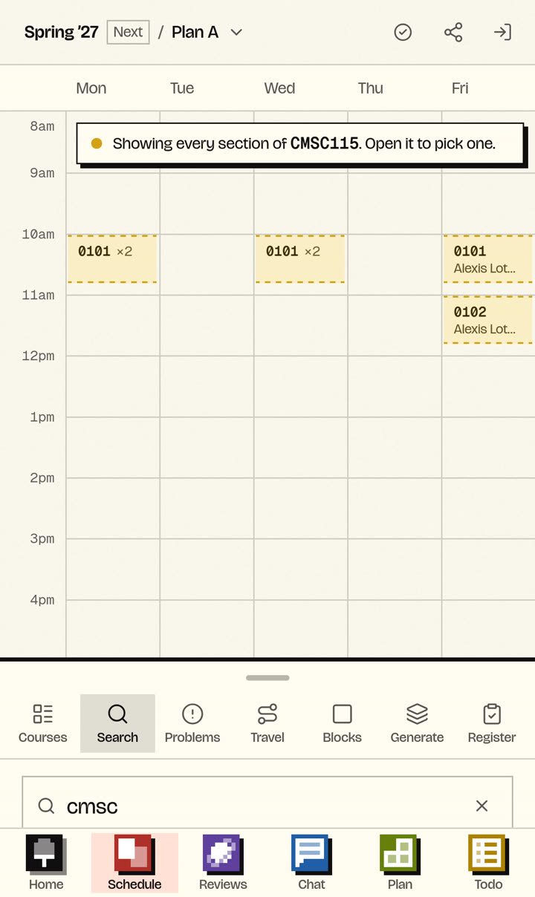 | **5. results at peek** (ok, 17 s) after: tap {"target":"[data-workbench-drawer] button[aria-label$=\"the panel\"]","at":{"x":197,"y":342}} after: tap {"target":"[data-workbench-drawer] button[aria-label$=\"the panel\"]","at":{"x":197,"y":61}} viewport 393×659, visual 659 tall at 0, scrollY 0 drawer peek, top 485, inside 124px page processes 908 MB (2, largest 682 MB) focus button#base-ui-_r_21_[aria-label="Raise the panel"] at y 486–510 panel "Search" |
|  | **6. pulled down at peek** (ok, 20 s) after: swipe {"from":null,"start":{"x":197,"y":518},"end":{"x":197,"y":818},"ms":600,"intent":"drag"} viewport 393×659, visual 659 tall at 0, scrollY 0 drawer peek, top 485, inside 124px page processes 908 MB (2, largest 683 MB) focus button#base-ui-_r_2d_ at y 510–553 panel "Search" |
| 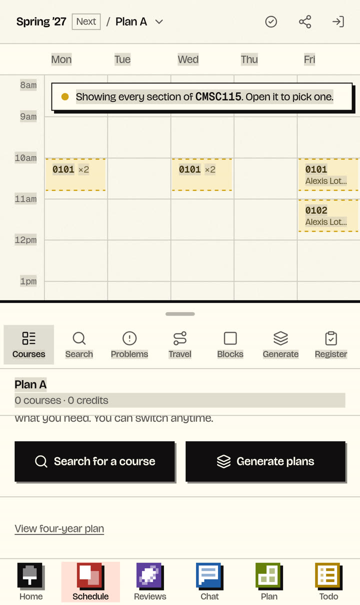 | **7. pulled down on Courses at half** (ok, 24 s) after: tap {"target":"[data-workbench-drawer] nav[aria-label=\"Tabs\"] button \"Courses\"","at":{"x":32,"y":532}} after: swipe {"from":null,"start":{"x":197,"y":469},"end":{"x":197,"y":769},"ms":600,"intent":"drag"} viewport 393×659, visual 659 tall at 0, scrollY 0 drawer half, top 329, inside 280px page processes 908 MB (2, largest 683 MB) focus section at y 402–610 panel "Plan A" |

## Scroll a long list down, then back up: the drawer stays

`scroll-list-back` · [recording](scroll-list-back/video.webm)

| Screen | Step |
|---|---|
| 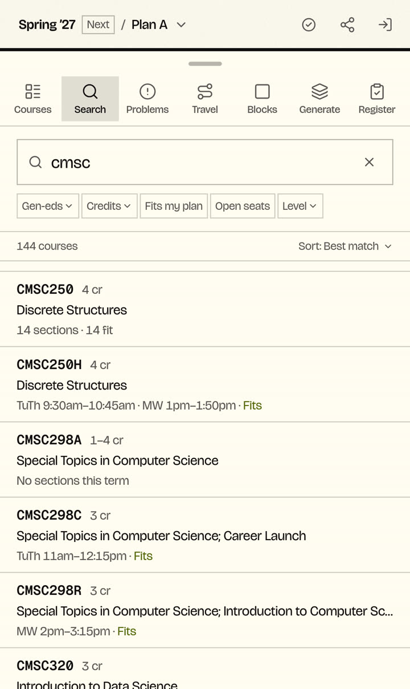 | **1. scrolled down** (ok, 8 s) after: tap {"target":"[data-workbench-drawer] nav[aria-label=\"Tabs\"] button \"Search\"","at":{"x":87,"y":95}} after: tap {"target":"input[aria-label=\"Search courses\"]","at":{"x":208,"y":155}} after: type {"text":"cmsc"} after: hide keyboard {} after: swipe {"from":null,"start":{"x":197,"y":558},"end":{"x":197,"y":208},"ms":400,"intent":"scroll"} viewport 393×659, visual 659 tall at 0, scrollY 0 drawer full, top 48, inside 611px page processes 913 MB (2, largest 661 MB) panel "Search" events: installed |
| 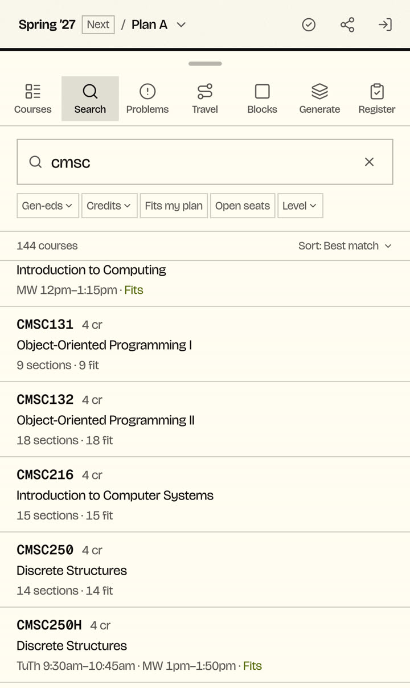 | **2. scrolled back up** (ok, 9 s) after: swipe {"from":null,"start":{"x":197,"y":373},"end":{"x":197,"y":623},"ms":400,"intent":"scroll"} viewport 393×659, visual 659 tall at 0, scrollY 0 drawer full, top 48, inside 611px page processes 913 MB (2, largest 661 MB) panel "Search" |

## Scroll the calendar, then pull down at its top

`calendar-pull` · [recording](calendar-pull/video.webm)

| Screen | Step |
|---|---|
|  | **1. scrolled the calendar down** (ok, 5 s) after: tap {"target":"[data-workbench-drawer] button[aria-label$=\"the panel\"]","at":{"x":197,"y":61}} after: swipe {"from":null,"start":{"x":197,"y":310},"end":{"x":197,"y":60},"ms":500,"intent":"scroll"} viewport 393×659, visual 659 tall at 0, scrollY 0 drawer peek, top 485, inside 124px page processes 877 MB (2, largest 625 MB) focus button#base-ui-_r_14_[aria-label="Raise the panel"] at y 486–510 panel "Plan A" events: installed |
|  | **2. pulled down at the top** (ok, 8 s) after: swipe {"from":null,"start":{"x":197,"y":114},"end":{"x":197,"y":464},"ms":500,"intent":"scroll"} after: swipe {"from":null,"start":{"x":197,"y":114},"end":{"x":197,"y":464},"ms":500,"intent":"scroll"} viewport 393×659, visual 659 tall at 0, scrollY 0 drawer peek, top 485, inside 124px page processes 877 MB (2, largest 624 MB) focus button#base-ui-_r_14_[aria-label="Raise the panel"] at y 486–510 panel "Plan A" |

## Rotate to landscape and back

`rotate` · [recording](rotate/video.webm)

| Screen | Step |
|---|---|
|  | **1. portrait** (ok, 3 s) viewport 393×659, visual 659 tall at 0, scrollY 0 drawer full, top 48, inside 611px page processes 854 MB (2, largest 624 MB) panel "Plan A" events: installed |
| 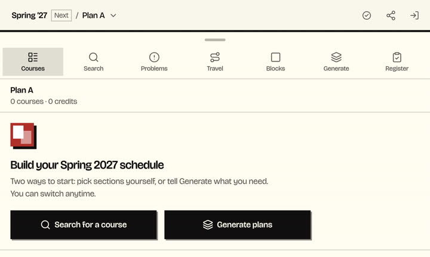 | **2. landscape** (ok, 5 s) after: rotate {"orientation":"landscape"} viewport 659×393, visual 393 tall at 0, scrollY 0 drawer full, top 48, inside 345px page processes 959 MB (2, largest 729 MB) panel "Plan A" events: orientationchange, resize, vv-resize |
| 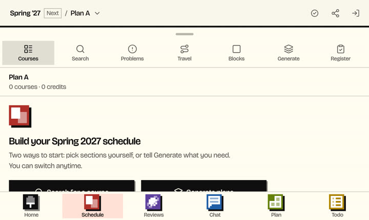 | **3. landscape, half** (ok, 7 s) after: tap {"target":"[data-workbench-drawer] button[aria-label$=\"the panel\"]","at":{"x":330,"y":61}} after: tap {"target":"[data-workbench-drawer] button[aria-label$=\"the panel\"]","at":{"x":330,"y":232}} viewport 659×393, visual 393 tall at 0, scrollY 0 drawer half, top 48, inside 295px page processes 974 MB (2, largest 743 MB) focus button#base-ui-_r_15_[aria-label="Raise the panel"] at y 49–73 panel "Plan A" |
|  | **4. portrait again** (ok, 10 s) after: rotate {"orientation":"portrait"} viewport 393×659, visual 659 tall at 0, scrollY 0 drawer half, top 329, inside 280px page processes 978 MB (2, largest 748 MB) focus button#base-ui-_r_15_[aria-label="Raise the panel"] at y 330–354 panel "Plan A" events: orientationchange, resize, vv-resize |

## Scroll to collapse and expand the browser's toolbar

`url-bar` · [recording](url-bar/video.webm)

| Screen | Step |
|---|---|
|  | **1. start** (ok, 4 s) after: tap {"target":"[data-workbench-drawer] button[aria-label$=\"the panel\"]","at":{"x":197,"y":61}} viewport 393×659, visual 659 tall at 0, scrollY 0 drawer peek, top 485, inside 124px page processes 860 MB (2, largest 630 MB) focus button#base-ui-_r_17_[aria-label="Raise the panel"] at y 486–510 panel "Plan A" events: installed |
|  | **2. scrolled the calendar up (toolbar may hide)** (ok, 5 s) after: swipe {"from":null,"start":{"x":197,"y":354},"end":{"x":197,"y":54},"ms":400,"intent":"scroll"} viewport 393×659, visual 659 tall at 0, scrollY 0 drawer peek, top 485, inside 124px page processes 857 MB (2, largest 627 MB) focus button#base-ui-_r_17_[aria-label="Raise the panel"] at y 486–510 panel "Plan A" |
| 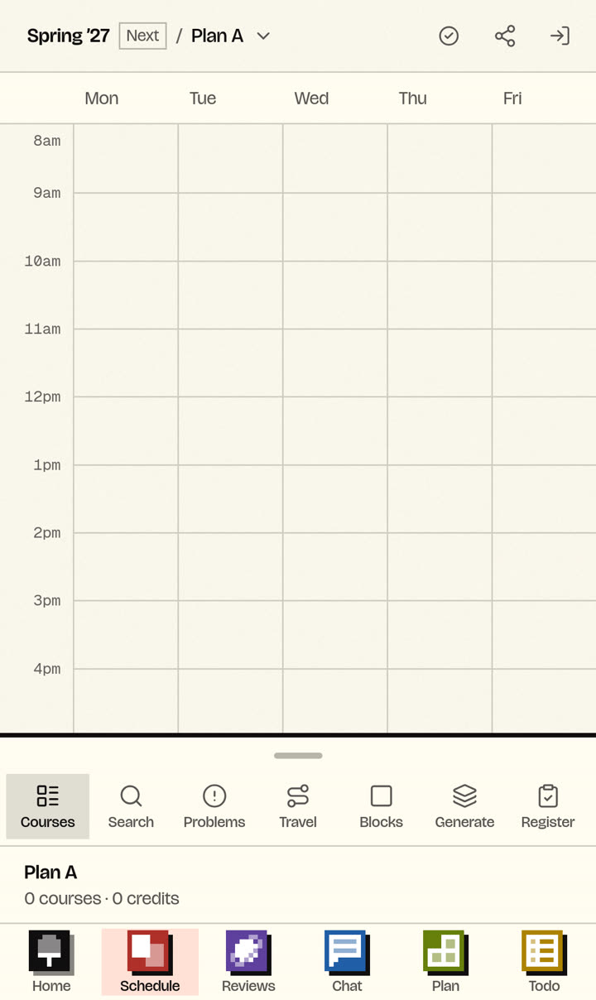 | **3. scrolled it back (toolbar may show)** (ok, 7 s) after: swipe {"from":null,"start":{"x":197,"y":354},"end":{"x":197,"y":654},"ms":400,"intent":"scroll"} viewport 393×659, visual 659 tall at 0, scrollY 0 drawer peek, top 485, inside 124px page processes 857 MB (2, largest 627 MB) focus button#base-ui-_r_17_[aria-label="Raise the panel"] at y 486–510 panel "Plan A" |
| 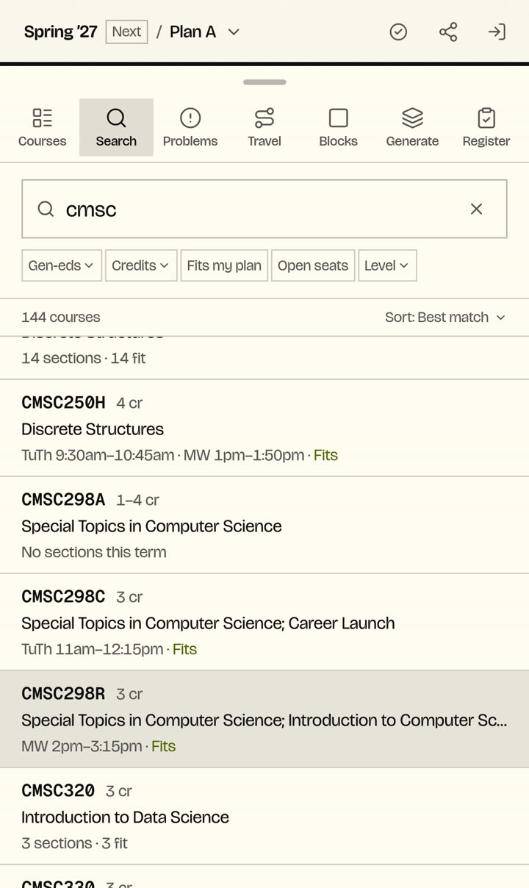 | **4. scrolled the results** (ok, 12 s) after: tap {"target":"[data-workbench-drawer] nav[aria-label=\"Tabs\"] button \"Search\"","at":{"x":87,"y":532}} after: tap {"target":"input[aria-label=\"Search courses\"]","at":{"x":208,"y":436}} after: type {"text":"cmsc"} after: hide keyboard {} after: swipe {"from":null,"start":{"x":197,"y":578},"end":{"x":197,"y":178},"ms":400,"intent":"scroll"} viewport 393×659, visual 659 tall at 0, scrollY 0 drawer full, top 48, inside 611px page processes 885 MB (2, largest 671 MB) panel "Search" |
| 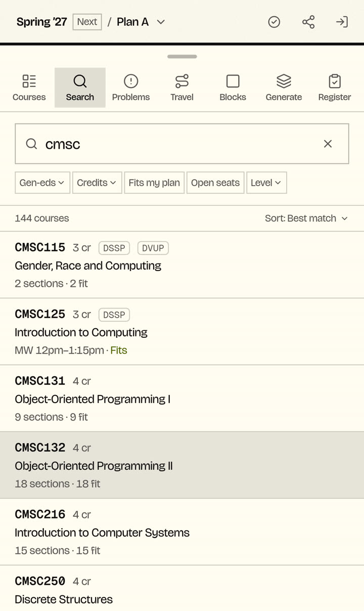 | **5. scrolled them back** (ok, 13 s) after: swipe {"from":null,"start":{"x":197,"y":578},"end":{"x":197,"y":978},"ms":400,"intent":"scroll"} viewport 393×659, visual 659 tall at 0, scrollY 0 drawer full, top 48, inside 611px page processes 887 MB (2, largest 673 MB) panel "Search" |

## A long course (ENGL101, 90+ sections) scrolled to the bottom

`long-course` · [recording](long-course/video.webm)

| Screen | Step |
|---|---|
| 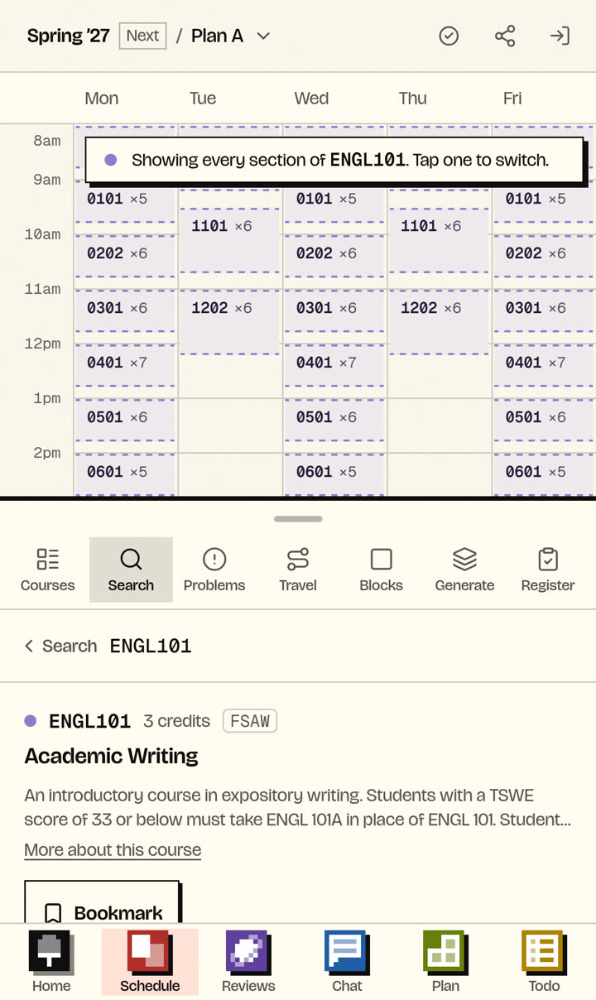 | **1. ENGL101** (ok, 10 s) after: tap {"target":"[data-workbench-drawer] nav[aria-label=\"Tabs\"] button \"Search\"","at":{"x":87,"y":95}} after: tap {"target":"input[aria-label=\"Search courses\"]","at":{"x":208,"y":155}} after: type {"text":"engl101"} after: hide keyboard {} after: tap {"target":"[data-course-result=\"ENGL101\"]","at":{"x":197,"y":286}} viewport 393×659, visual 659 tall at 0, scrollY 0 drawer half, top 329, inside 280px page processes 964 MB (2, largest 732 MB) focus section[aria-label="ENGL101"] at y 402–610 panel "Academic Writing" events: installed |
| 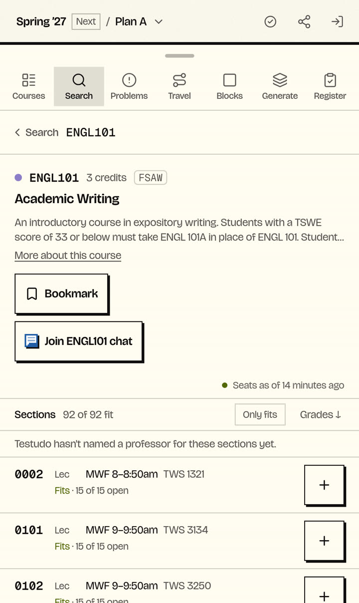 | **2. ENGL101 at full** (ok, 11 s) after: tap {"target":"[data-workbench-drawer] button[aria-label$=\"the panel\"]","at":{"x":197,"y":342}} viewport 393×659, visual 659 tall at 0, scrollY 0 drawer full, top 48, inside 611px page processes 957 MB (2, largest 743 MB) focus button#base-ui-_r_1f_[aria-label="Lower the panel"] at y 49–73 panel "Academic Writing" |
| 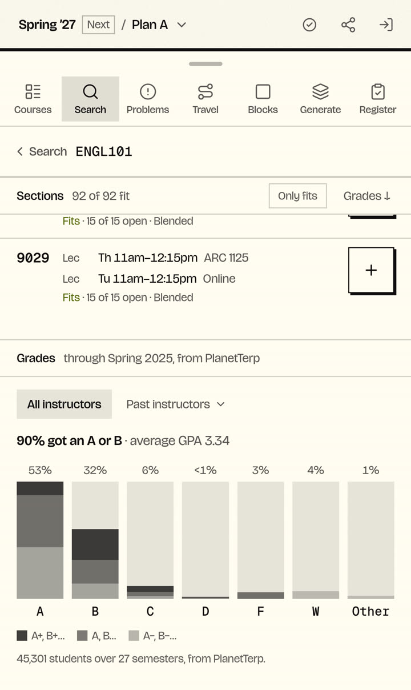 | **3. scrolled to the bottom** (ok, 18 s) after: swipe {"from":null,"start":{"x":197,"y":562},"end":{"x":197,"y":112},"ms":300,"intent":"scroll"} after: swipe {"from":null,"start":{"x":197,"y":562},"end":{"x":197,"y":112},"ms":300,"intent":"scroll"} after: swipe {"from":null,"start":{"x":197,"y":562},"end":{"x":197,"y":112},"ms":300,"intent":"scroll"} after: swipe {"from":null,"start":{"x":197,"y":562},"end":{"x":197,"y":112},"ms":300,"intent":"scroll"} after: swipe {"from":null,"start":{"x":197,"y":562},"end":{"x":197,"y":112},"ms":300,"intent":"scroll"} after: swipe {"from":null,"start":{"x":197,"y":562},"end":{"x":197,"y":112},"ms":300,"intent":"scroll"} after: swipe {"from":null,"start":{"x":197,"y":562},"end":{"x":197,"y":112},"ms":300,"intent":"scroll"} after: swipe {"from":null,"start":{"x":197,"y":562},"end":{"x":197,"y":112},"ms":300,"intent":"scroll"} after: swipe {"from":null,"start":{"x":197,"y":562},"end":{"x":197,"y":112},"ms":300,"intent":"scroll"} after: swipe {"from":null,"start":{"x":197,"y":562},"end":{"x":197,"y":112},"ms":300,"intent":"scroll"} after: swipe {"from":null,"start":{"x":197,"y":562},"end":{"x":197,"y":112},"ms":300,"intent":"scroll"} after: swipe {"from":null,"start":{"x":197,"y":562},"end":{"x":197,"y":112},"ms":300,"intent":"scroll"} after: swipe {"from":null,"start":{"x":197,"y":562},"end":{"x":197,"y":112},"ms":300,"intent":"scroll"} after: swipe {"from":null,"start":{"x":197,"y":562},"end":{"x":197,"y":112},"ms":300,"intent":"scroll"} viewport 393×659, visual 659 tall at 0, scrollY 0 drawer full, top 48, inside 611px page processes 982 MB (2, largest 769 MB) focus button#base-ui-_r_1f_[aria-label="Lower the panel"] at y 49–73 panel "Academic Writing" |

## Search, scroll, put the keyboard away and open a result, six times

`open-results` · [recording](open-results/video.webm)

| Screen | Step |
|---|---|
|  | **1. opened a result (1)** (ok, 11 s) after: tap {"target":"[data-workbench-drawer] nav[aria-label=\"Tabs\"] button \"Search\"","at":{"x":87,"y":95}} after: tap {"target":"input[aria-label=\"Search courses\"]","at":{"x":208,"y":155}} after: type {"text":"cmsc"} after: tap {"target":"input[aria-label=\"Search courses\"]","at":{"x":187,"y":155}} after: swipe {"from":null,"start":{"x":197,"y":578},"end":{"x":197,"y":418},"ms":400,"intent":"scroll"} after: hide keyboard {} after: tap {"target":"#search-results [data-course-result]","at":{"x":197,"y":270}} viewport 393×659, visual 659 tall at 0, scrollY 0 drawer half, top 329, inside 280px page processes 905 MB (2, largest 692 MB) focus section[aria-label="CMSC131"] at y 402–610 panel "Object-Oriented Programming I" events: installed |
|  | **2. opened a result (2)** (ok, 17 s) after: tap {"target":"[data-workbench-drawer] [data-layer][data-active] button \"Back to Search\"","at":{"x":38,"y":426}} after: tap {"target":"[data-workbench-drawer] button[aria-label$=\"the panel\"]","at":{"x":197,"y":342}} after: tap {"target":"input[aria-label=\"Search courses\"]","at":{"x":187,"y":155}} after: swipe {"from":null,"start":{"x":197,"y":578},"end":{"x":197,"y":418},"ms":400,"intent":"scroll"} after: hide keyboard {} after: tap {"target":"#search-results [data-course-result]","at":{"x":197,"y":270}} viewport 393×659, visual 659 tall at 0, scrollY 0 drawer half, top 329, inside 280px page processes 931 MB (2, largest 717 MB) focus section[aria-label="CMSC131"] at y 402–610 panel "Object-Oriented Programming I" |
|  | **3. opened a result (3)** (ok, 23 s) after: tap {"target":"[data-workbench-drawer] [data-layer][data-active] button \"Back to Search\"","at":{"x":38,"y":426}} after: tap {"target":"[data-workbench-drawer] button[aria-label$=\"the panel\"]","at":{"x":197,"y":342}} after: tap {"target":"input[aria-label=\"Search courses\"]","at":{"x":187,"y":155}} after: swipe {"from":null,"start":{"x":197,"y":578},"end":{"x":197,"y":418},"ms":400,"intent":"scroll"} after: hide keyboard {} after: tap {"target":"#search-results [data-course-result]","at":{"x":197,"y":270}} viewport 393×659, visual 659 tall at 0, scrollY 0 drawer half, top 329, inside 280px page processes 950 MB (2, largest 736 MB) focus section[aria-label="CMSC131"] at y 402–610 panel "Object-Oriented Programming I" |
| 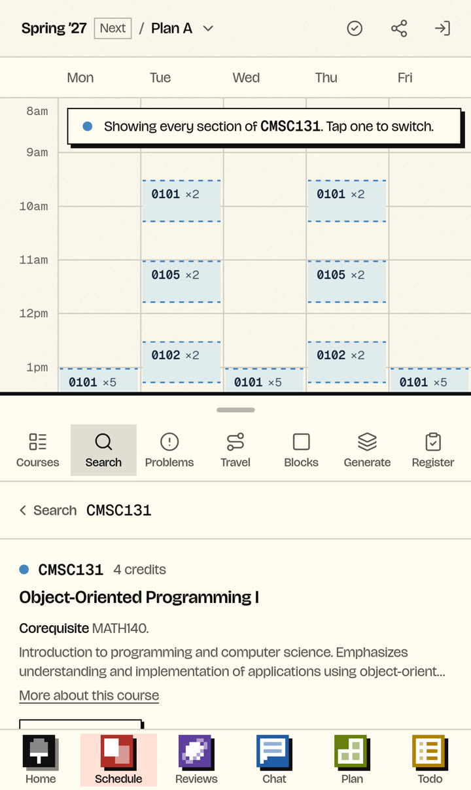 | **4. opened a result (4)** (ok, 30 s) after: tap {"target":"[data-workbench-drawer] [data-layer][data-active] button \"Back to Search\"","at":{"x":38,"y":426}} after: tap {"target":"[data-workbench-drawer] button[aria-label$=\"the panel\"]","at":{"x":197,"y":342}} after: tap {"target":"input[aria-label=\"Search courses\"]","at":{"x":187,"y":155}} after: swipe {"from":null,"start":{"x":197,"y":578},"end":{"x":197,"y":418},"ms":400,"intent":"scroll"} after: hide keyboard {} after: tap {"target":"#search-results [data-course-result]","at":{"x":197,"y":270}} viewport 393×659, visual 659 tall at 0, scrollY 0 drawer half, top 329, inside 280px page processes 967 MB (2, largest 754 MB) focus section[aria-label="CMSC131"] at y 402–610 panel "Object-Oriented Programming I" |
|  | **5. opened a result (5)** (ok, 36 s) after: tap {"target":"[data-workbench-drawer] [data-layer][data-active] button \"Back to Search\"","at":{"x":38,"y":426}} after: tap {"target":"[data-workbench-drawer] button[aria-label$=\"the panel\"]","at":{"x":197,"y":342}} after: tap {"target":"input[aria-label=\"Search courses\"]","at":{"x":187,"y":155}} after: swipe {"from":null,"start":{"x":197,"y":578},"end":{"x":197,"y":418},"ms":400,"intent":"scroll"} after: hide keyboard {} after: tap {"target":"#search-results [data-course-result]","at":{"x":197,"y":270}} viewport 393×659, visual 659 tall at 0, scrollY 0 drawer half, top 329, inside 280px page processes 976 MB (2, largest 762 MB) focus section[aria-label="CMSC131"] at y 402–610 panel "Object-Oriented Programming I" |
|  | **6. opened a result (6)** (ok, 42 s) after: tap {"target":"[data-workbench-drawer] [data-layer][data-active] button \"Back to Search\"","at":{"x":38,"y":426}} after: tap {"target":"[data-workbench-drawer] button[aria-label$=\"the panel\"]","at":{"x":197,"y":342}} after: tap {"target":"input[aria-label=\"Search courses\"]","at":{"x":187,"y":155}} after: swipe {"from":null,"start":{"x":197,"y":578},"end":{"x":197,"y":418},"ms":400,"intent":"scroll"} after: hide keyboard {} after: tap {"target":"#search-results [data-course-result]","at":{"x":197,"y":270}} viewport 393×659, visual 659 tall at 0, scrollY 0 drawer half, top 329, inside 280px page processes 972 MB (2, largest 758 MB) focus section[aria-label="CMSC131"] at y 402–610 panel "Object-Oriented Programming I" |

## Add a section from course details, then switch it three times

`add-sections` · [recording](add-sections/video.webm)

| Screen | Step |
|---|---|
| 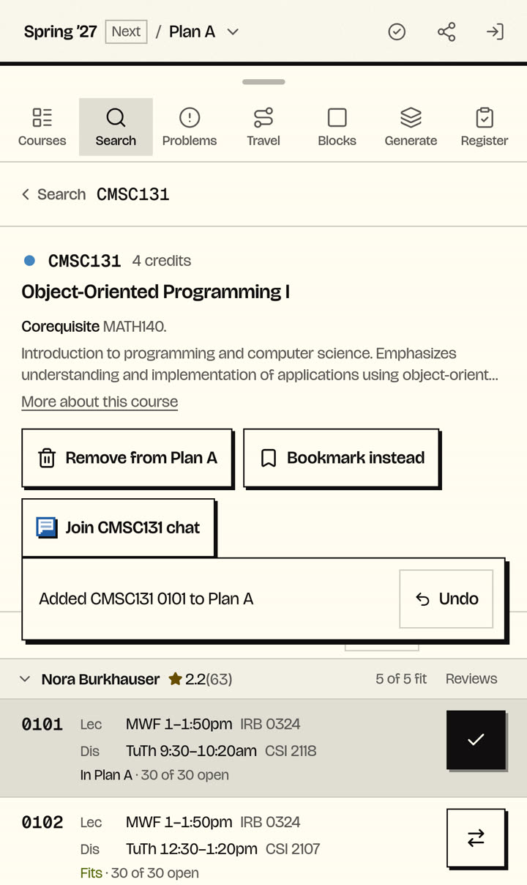 | **1. tapped Add 0101** (warn, 13 s) after: tap {"target":"[data-workbench-drawer] nav[aria-label=\"Tabs\"] button \"Search\"","at":{"x":87,"y":95}} after: tap {"target":"input[aria-label=\"Search courses\"]","at":{"x":208,"y":155}} after: type {"text":"cmsc131"} after: hide keyboard {} after: tap {"target":"[data-course-result=\"CMSC131\"]","at":{"x":197,"y":286}} after: tap {"target":"[data-workbench-drawer] button[aria-label$=\"the panel\"]","at":{"x":197,"y":342}} after: tap {"target":"[data-section] button[aria-label^=\"Add \"], [data-section] button[aria-label^=\"Switch to \"] \"Add 0101\"","at":{"x":355,"y":551}} viewport 393×659, visual 659 tall at 0, scrollY 0 drawer full, top 48, inside 611px page processes 943 MB (2, largest 729 MB) focus button#base-ui-_r_83_[aria-label="Remove 0101 from Plan A"] at y 529–573 panel "Object-Oriented Programming I" events: installed **warn drawer-moves-one-way**: 2 reversal(s) over 34 frames (48–329) |
|  | **2. tapped Switch to 0103** (ok, 15 s) after: tap {"target":"[data-section] button[aria-label^=\"Add \"], [data-section] button[aria-label^=\"Switch to \"] \"Switch to 0103\"","at":{"x":355,"y":523}} viewport 393×659, visual 659 tall at 0, scrollY 0 drawer full, top 48, inside 611px page processes 959 MB (2, largest 745 MB) focus button#base-ui-_r_8l_[aria-label="Remove 0103 from Plan A"] at y 501–545 panel "Object-Oriented Programming I" |
| 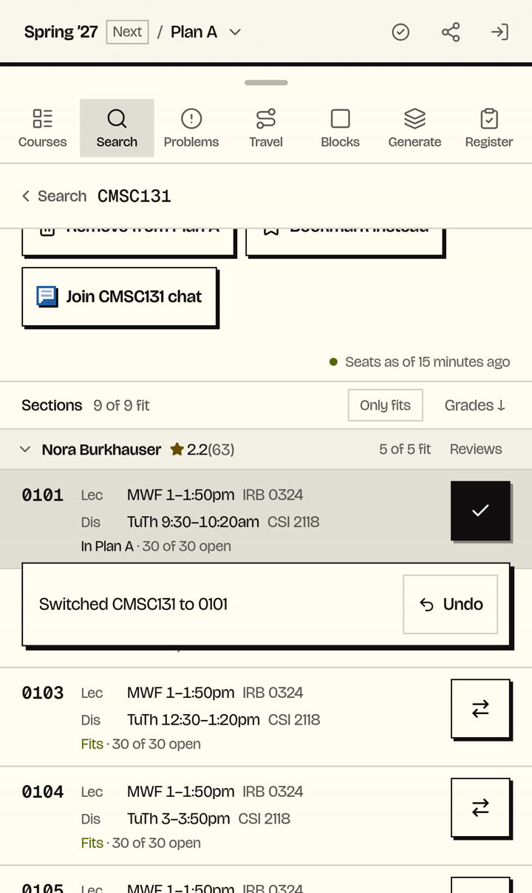 | **3. tapped Switch to 0101** (ok, 17 s) after: tap {"target":"[data-section] button[aria-label^=\"Add \"], [data-section] button[aria-label^=\"Switch to \"] \"Switch to 0101\"","at":{"x":355,"y":377}} viewport 393×659, visual 659 tall at 0, scrollY 0 drawer full, top 48, inside 611px page processes 951 MB (2, largest 737 MB) focus button#base-ui-_r_83_[aria-label="Remove 0101 from Plan A"] at y 355–399 panel "Object-Oriented Programming I" |
| 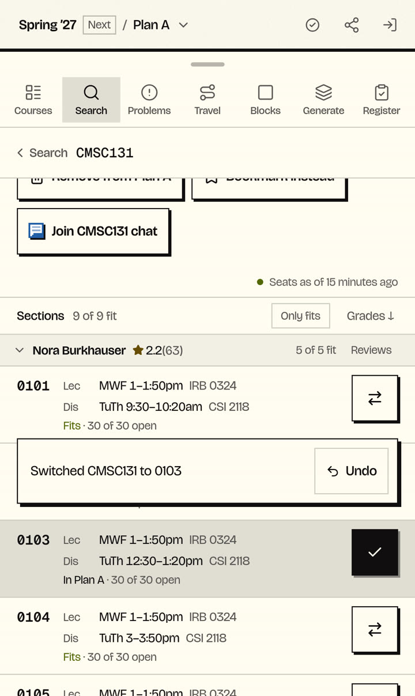 | **4. tapped Switch to 0103** (ok, 19 s) after: tap {"target":"[data-section] button[aria-label^=\"Add \"], [data-section] button[aria-label^=\"Switch to \"] \"Switch to 0103\"","at":{"x":355,"y":523}} viewport 393×659, visual 659 tall at 0, scrollY 0 drawer full, top 48, inside 611px page processes 952 MB (2, largest 738 MB) focus button#base-ui-_r_8l_[aria-label="Remove 0103 from Plan A"] at y 501–545 panel "Object-Oriented Programming I" |
