# Mobile lab: ios

**Passed**: 0 failed check(s), 3 warning(s), 0 error(s).

- URL: https://terpsicle.com/schedule
- Device: iPhone 16 Simulator, iOS 18.5, Safari (XCUITest touches, software keyboard)
- Started: 2026-09-29T14:55:11.021Z, took 1168 s
- Workflow run: https://github.com/zsrobinson/terpsicle/actions/runs/36586042700
- Every step's full probe (viewport, drawer, focus, events, per-frame trace) is in `summary.json`.

| Scenario | Result | Steps | Time | Recording |
|---|---|---|---|---|
| [Search with the on-screen keyboard from half: tap the box, type, scroll, put the keyboard away, open a result](#keyboard-at-half) | ok | 10 | 146 s | [video](keyboard-at-half/video.mp4) |
| [Search with the on-screen keyboard from full: tap the box, type, scroll, put the keyboard away, open a result](#keyboard-at-full) | ok | 10 | 47 s | [video](keyboard-at-full/video.mp4) |
| [Search with the on-screen keyboard from peek: tap the box, type, scroll, put the keyboard away, open a result](#keyboard-at-peek) | ok | 10 | 54 s | [video](keyboard-at-peek/video.mp4) |
| [First load](#first-load) | ok | 2 | 11 s | [video](first-load/video.mp4) |
| [Tap each drawer tab, then the open one again](#tabs) | ok | 8 | 37 s | [video](tabs/video.mp4) |
| [Drag the grabber peek → half → full → peek](#grabber-drag) | ok | 4 | 28 s | [video](grabber-drag/video.mp4) |
| [Pull down on a list at its top, at each snap](#pull-lists) | warn | 7 | 67 s | [video](pull-lists/video.mp4) |
| [Scroll a long list down, then back up: the drawer stays](#scroll-list-back) | ok | 2 | 41 s | [video](scroll-list-back/video.mp4) |
| [Scroll the calendar, then pull down at its top](#calendar-pull) | ok | 2 | 34 s | [video](calendar-pull/video.mp4) |
| [Rotate to landscape and back](#rotate) | ok | 3 | 34 s | [video](rotate/video.mp4) |
| [Scroll to collapse and expand the browser's toolbar](#url-bar) | ok | 5 | 56 s | [video](url-bar/video.mp4) |
| [A long course (ENGL101, 90+ sections) scrolled to the bottom](#long-course) | warn | 3 | 81 s | [video](long-course/video.mp4) |
| [Search, scroll, put the keyboard away and open a result, six times](#open-results) | ok | 6 | 143 s | [video](open-results/video.mp4) |
| [Add a section from course details, then switch it three times](#add-sections) | warn | 4 | 75 s | [video](add-sections/video.mp4) |

## Search with the on-screen keyboard from half: tap the box, type, scroll, put the keyboard away, open a result

`keyboard-at-half` · [recording](keyboard-at-half/video.mp4)

| Screen | Step |
|---|---|
| 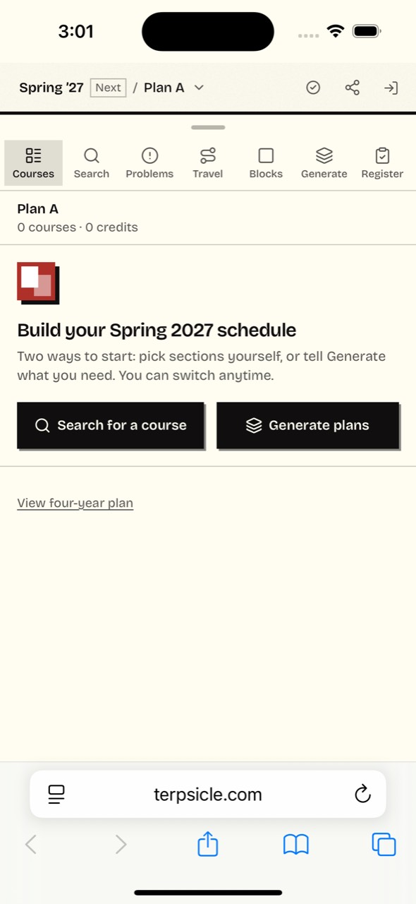 | **1. loaded** (ok, 31 s) viewport 393×659, visual 659 tall at 0, scrollY 0 drawer full, top 48, inside 611px keyboard down page processes 471 MB (3, largest 245 MB) panel "Plan A" events: installed |
| 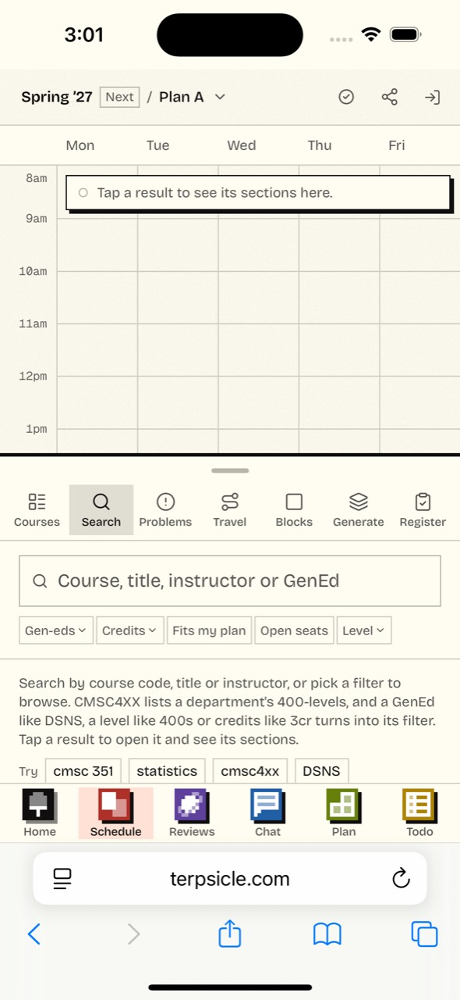 | **2. Search tab at half** (ok, 54 s) after: tap {"target":"[data-workbench-drawer] nav[aria-label=\"Tabs\"] button \"Search\"","at":{"x":87,"y":95}} after: tap {"target":"[data-workbench-drawer] button[aria-label$=\"the panel\"]","at":{"x":197,"y":61}} after: tap {"target":"[data-workbench-drawer] button[aria-label$=\"the panel\"]","at":{"x":197,"y":498}} viewport 393×659, visual 659 tall at 0, scrollY 0 drawer half, top 329, inside 280px keyboard down page processes 440 MB (3, largest 274 MB) focus div#_r_o_ at y 329–940 panel "Search" |
|  | **3. tapped the search box (+150 ms)** (ok, 82 s) after: tap {"target":"input[aria-label=\"Search courses\"]","at":{"x":208,"y":436}} viewport 393×659, visual 435.7 tall at 0, scrollY 0 drawer full, top 48, inside 387px keyboard up page processes 392 MB (3, largest 239 MB) focus input#base-ui-_r_2g_[aria-label="Search courses"] at y 134–176 panel "Search" events: vv-resize |
|  | **4. tapped the search box (+500 ms)** (ok, 95 s) viewport 393×659, visual 435.7 tall at 0, scrollY 0 drawer full, top 48, inside 387px keyboard up page processes 391 MB (3, largest 237 MB) focus input#base-ui-_r_2g_[aria-label="Search courses"] at y 134–176 panel "Search" |
|  | **5. tapped the search box (+1000 ms)** (ok, 101 s) viewport 393×659, visual 435.7 tall at 0, scrollY 0 drawer full, top 48, inside 387px keyboard up page processes 388 MB (3, largest 235 MB) focus input#base-ui-_r_2g_[aria-label="Search courses"] at y 134–176 panel "Search" |
|  | **6. tapped the search box (+2000 ms)** (ok, 106 s) viewport 393×659, visual 435.7 tall at 0, scrollY 0 drawer full, top 48, inside 387px keyboard up page processes 388 MB (3, largest 235 MB) focus input#base-ui-_r_2g_[aria-label="Search courses"] at y 134–176 panel "Search" |
| 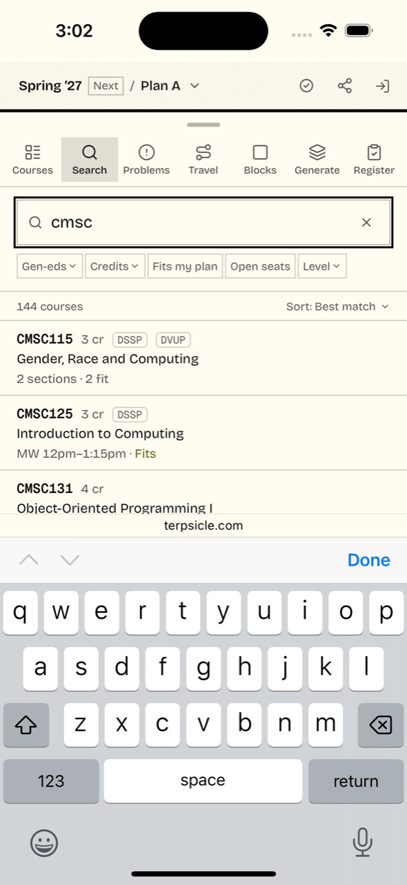 | **7. typed "cmsc"** (ok, 119 s) after: type {"text":"cmsc"} viewport 393×659, visual 435.7 tall at 0, scrollY 0 drawer full, top 48, inside 387px keyboard up page processes 463 MB (3, largest 315 MB) focus input#base-ui-_r_2g_[aria-label="Search courses"] at y 134–176 panel "Search" |
| 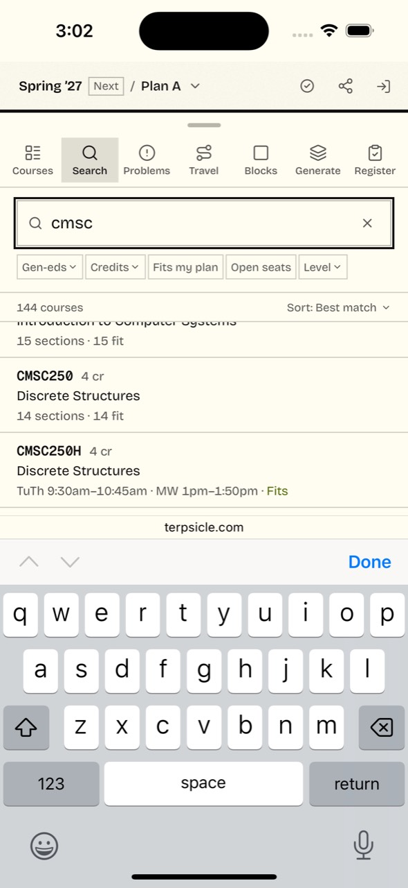 | **8. scrolled the results** (ok, 126 s) after: swipe {"from":null,"start":{"x":197,"y":399},"end":{"x":197,"y":199},"ms":500,"intent":"scroll"} viewport 393×659, visual 435.7 tall at 0, scrollY 0 drawer full, top 48, inside 387px keyboard up page processes 495 MB (3, largest 347 MB) focus input#base-ui-_r_2g_[aria-label="Search courses"] at y 134–176 panel "Search" events: pointercancel |
| 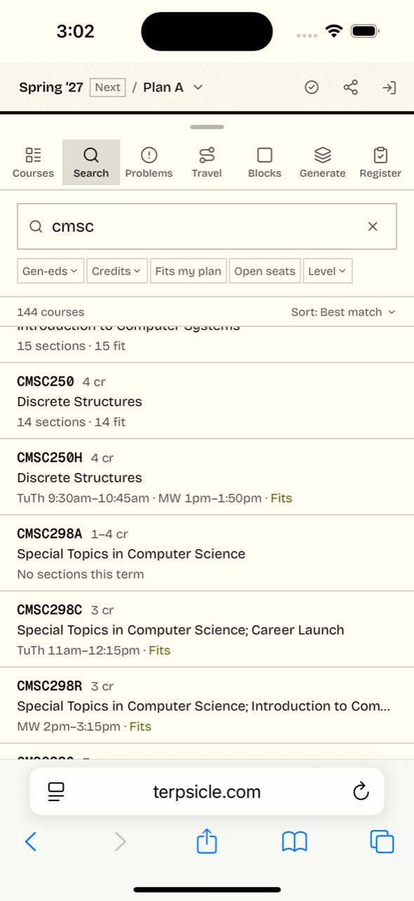 | **9. put the keyboard away** (ok, 132 s) after: hide keyboard {} viewport 393×659, visual 659 tall at 0, scrollY 0 drawer full, top 48, inside 611px keyboard down page processes 459 MB (3, largest 314 MB) panel "Search" events: vv-resize |
|  | **10. opened a result** (ok, 137 s) after: tap {"target":"#search-results [data-course-result]","at":{"x":197,"y":320}} viewport 393×659, visual 659 tall at 0, scrollY 0 drawer half, top 329, inside 280px keyboard down page processes 506 MB (3, largest 355 MB) focus section[aria-label="CMSC250"] at y 402–610 panel "Discrete Structures" |

## Search with the on-screen keyboard from full: tap the box, type, scroll, put the keyboard away, open a result

`keyboard-at-full` · [recording](keyboard-at-full/video.mp4)

| Screen | Step |
|---|---|
|  | **1. loaded** (ok, 6 s) viewport 393×659, visual 659 tall at 0, scrollY 0 drawer half, top 329, inside 280px keyboard down page processes 568 MB (3, largest 419 MB) panel "Discrete Structures" events: installed |
| 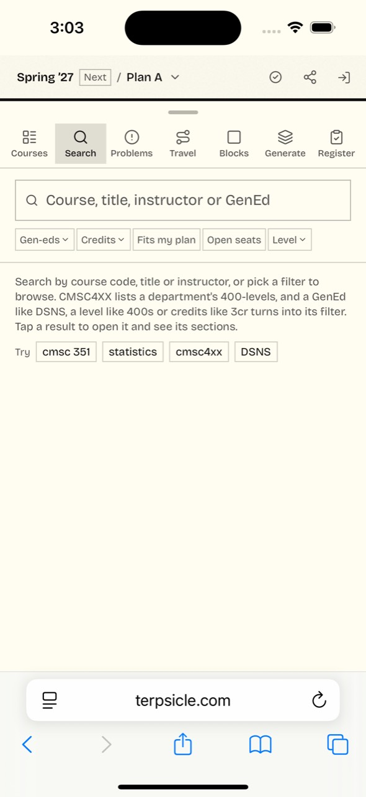 | **2. Search tab at full** (ok, 12 s) after: tap {"target":"[data-workbench-drawer] nav[aria-label=\"Tabs\"] button \"Search\"","at":{"x":87,"y":376}} after: tap {"target":"[data-workbench-drawer] button[aria-label$=\"the panel\"]","at":{"x":197,"y":342}} viewport 393×659, visual 659 tall at 0, scrollY 0 drawer full, top 48, inside 611px keyboard down page processes 515 MB (3, largest 371 MB) focus div#_r_h_ at y 48–659 panel "Search" |
|  | **3. tapped the search box (+150 ms)** (ok, 15 s) after: tap {"target":"input[aria-label=\"Search courses\"]","at":{"x":208,"y":155}} viewport 393×659, visual 435.7 tall at 0, scrollY 0 drawer full, top 48, inside 387px keyboard up page processes 534 MB (3, largest 398 MB) focus input#base-ui-_r_51_[aria-label="Search courses"] at y 134–176 panel "Search" events: vv-resize |
|  | **4. tapped the search box (+500 ms)** (ok, 17 s) viewport 393×659, visual 435.7 tall at 0, scrollY 0 drawer full, top 48, inside 387px keyboard up page processes 549 MB (3, largest 413 MB) focus input#base-ui-_r_51_[aria-label="Search courses"] at y 134–176 panel "Search" |
|  | **5. tapped the search box (+1000 ms)** (ok, 19 s) viewport 393×659, visual 435.7 tall at 0, scrollY 0 drawer full, top 48, inside 387px keyboard up page processes 549 MB (3, largest 413 MB) focus input#base-ui-_r_51_[aria-label="Search courses"] at y 134–176 panel "Search" |
|  | **6. tapped the search box (+2000 ms)** (ok, 21 s) viewport 393×659, visual 435.7 tall at 0, scrollY 0 drawer full, top 48, inside 387px keyboard up page processes 536 MB (3, largest 402 MB) focus input#base-ui-_r_51_[aria-label="Search courses"] at y 134–176 panel "Search" |
| 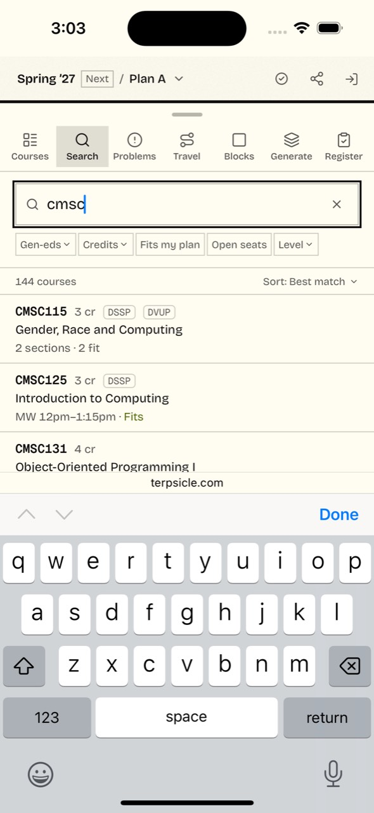 | **7. typed "cmsc"** (ok, 27 s) after: type {"text":"cmsc"} viewport 393×659, visual 435.7 tall at 0, scrollY 0 drawer full, top 48, inside 387px keyboard up page processes 611 MB (3, largest 478 MB) focus input#base-ui-_r_51_[aria-label="Search courses"] at y 134–176 panel "Search" |
| 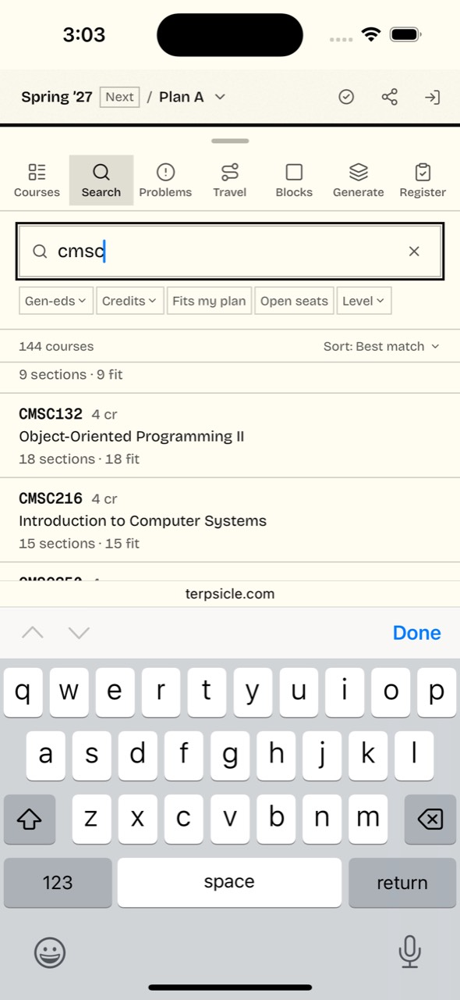 | **8. scrolled the results** (ok, 31 s) after: swipe {"from":null,"start":{"x":197,"y":399},"end":{"x":197,"y":199},"ms":500,"intent":"scroll"} viewport 393×659, visual 435.7 tall at 0, scrollY 0 drawer full, top 48, inside 387px keyboard up page processes 583 MB (3, largest 455 MB) focus input#base-ui-_r_51_[aria-label="Search courses"] at y 134–176 panel "Search" events: pointercancel |
|  | **9. put the keyboard away** (ok, 35 s) after: hide keyboard {} viewport 393×659, visual 659 tall at 0, scrollY 0 drawer full, top 48, inside 611px keyboard down page processes 493 MB (3, largest 377 MB) panel "Search" events: vv-resize |
| 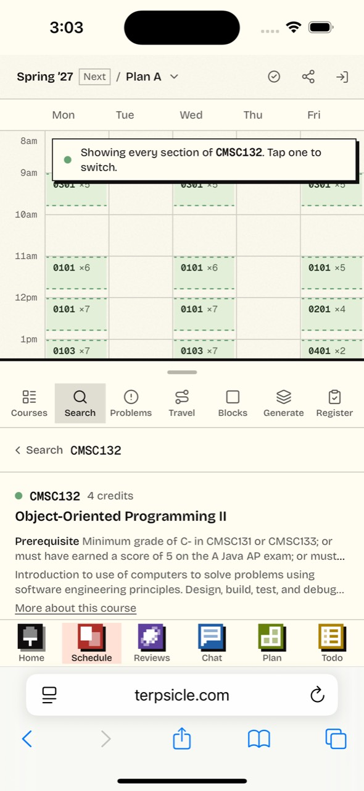 | **10. opened a result** (ok, 39 s) after: tap {"target":"#search-results [data-course-result]","at":{"x":197,"y":312}} viewport 393×659, visual 659 tall at 0, scrollY 0 drawer half, top 329, inside 280px keyboard down page processes 545 MB (3, largest 429 MB) focus section[aria-label="CMSC132"] at y 402–610 panel "Object-Oriented Programming II" |

## Search with the on-screen keyboard from peek: tap the box, type, scroll, put the keyboard away, open a result

`keyboard-at-peek` · [recording](keyboard-at-peek/video.mp4)

| Screen | Step |
|---|---|
|  | **1. loaded** (ok, 6 s) viewport 393×659, visual 659 tall at 0, scrollY 0 drawer half, top 329, inside 280px keyboard down page processes 615 MB (3, largest 503 MB) panel "Object-Oriented Programming II" events: installed |
|  | **2. Search tab at peek** (ok, 14 s) after: tap {"target":"[data-workbench-drawer] nav[aria-label=\"Tabs\"] button \"Search\"","at":{"x":87,"y":376}} after: tap {"target":"[data-workbench-drawer] button[aria-label$=\"the panel\"]","at":{"x":197,"y":342}} after: tap {"target":"[data-workbench-drawer] button[aria-label$=\"the panel\"]","at":{"x":197,"y":61}} viewport 393×659, visual 659 tall at 0, scrollY 0 drawer peek, top 485, inside 124px keyboard down page processes 610 MB (3, largest 508 MB) focus div#_r_k_ at y 485–1096 panel "Search" |
|  | **3. tapped the search box (+150 ms)** (ok, 18 s) after: tap {"target":"input[aria-label=\"Search courses\"]","at":{"x":208,"y":592}} viewport 393×659, visual 435.7 tall at 0, scrollY 0 drawer full, top 48, inside 387px keyboard up page processes 540 MB (3, largest 451 MB) focus input#base-ui-_r_55_[aria-label="Search courses"] at y 134–176 panel "Search" events: vv-resize |
|  | **4. tapped the search box (+500 ms)** (ok, 21 s) viewport 393×659, visual 435.7 tall at 0, scrollY 0 drawer full, top 48, inside 387px keyboard up page processes 318 MB (3, largest 234 MB) focus input#base-ui-_r_55_[aria-label="Search courses"] at y 134–176 panel "Search" |
|  | **5. tapped the search box (+1000 ms)** (ok, 24 s) viewport 393×659, visual 435.7 tall at 0, scrollY 0 drawer full, top 48, inside 387px keyboard up page processes 273 MB (3, largest 190 MB) focus input#base-ui-_r_55_[aria-label="Search courses"] at y 134–176 panel "Search" |
| 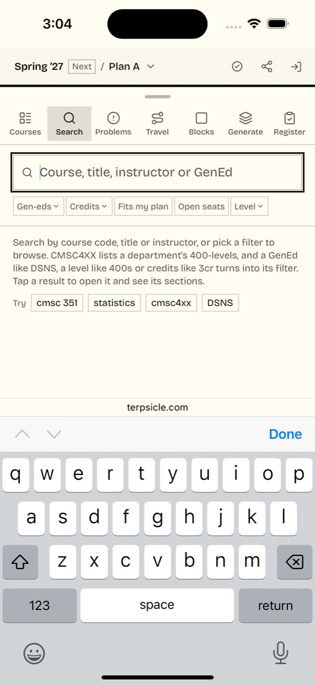 | **6. tapped the search box (+2000 ms)** (ok, 27 s) viewport 393×659, visual 435.7 tall at 0, scrollY 0 drawer full, top 48, inside 387px keyboard up page processes 242 MB (3, largest 158 MB) focus input#base-ui-_r_55_[aria-label="Search courses"] at y 134–176 panel "Search" |
|  | **7. typed "cmsc"** (ok, 35 s) after: type {"text":"cmsc"} viewport 393×659, visual 435.7 tall at 0, scrollY 0 drawer full, top 48, inside 387px keyboard up page processes 611 MB (3, largest 544 MB) focus input#base-ui-_r_55_[aria-label="Search courses"] at y 134–176 panel "Search" |
| 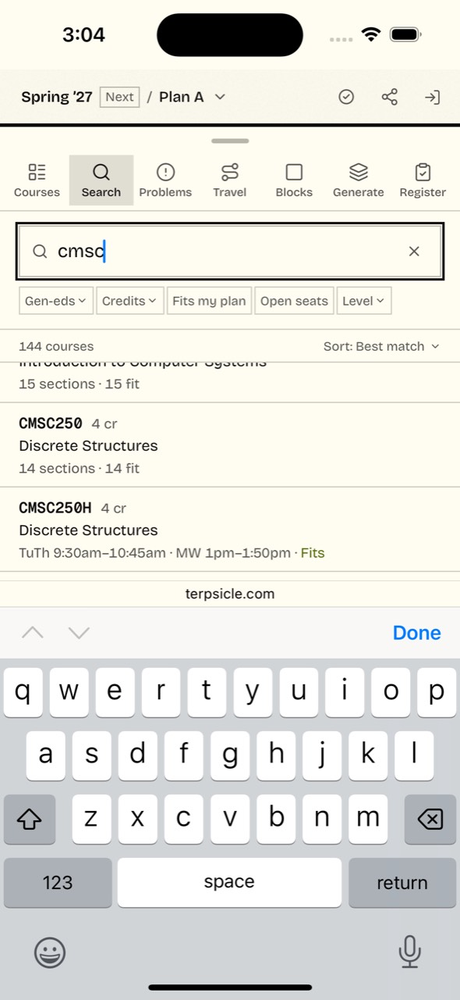 | **8. scrolled the results** (ok, 40 s) after: swipe {"from":null,"start":{"x":197,"y":399},"end":{"x":197,"y":199},"ms":500,"intent":"scroll"} viewport 393×659, visual 435.7 tall at 0, scrollY 0 drawer full, top 48, inside 387px keyboard up page processes 625 MB (3, largest 553 MB) focus input#base-ui-_r_55_[aria-label="Search courses"] at y 134–176 panel "Search" events: pointercancel |
|  | **9. put the keyboard away** (ok, 43 s) after: hide keyboard {} viewport 393×659, visual 659 tall at 0, scrollY 0 drawer full, top 48, inside 611px keyboard down page processes 528 MB (3, largest 456 MB) panel "Search" events: vv-resize |
|  | **10. opened a result** (ok, 46 s) after: tap {"target":"#search-results [data-course-result]","at":{"x":197,"y":320}} viewport 393×659, visual 659 tall at 0, scrollY 0 drawer half, top 329, inside 280px keyboard down page processes 573 MB (3, largest 503 MB) focus section[aria-label="CMSC250"] at y 402–610 panel "Discrete Structures" |

## First load

`first-load` · [recording](first-load/video.mp4)

| Screen | Step |
|---|---|
|  | **1. shell up** (ok, 3 s) viewport 393×659, visual 659 tall at 0, scrollY 0 drawer half, top 329, inside 280px keyboard down page processes 690 MB (3, largest 612 MB) panel "Discrete Structures" events: installed |
| 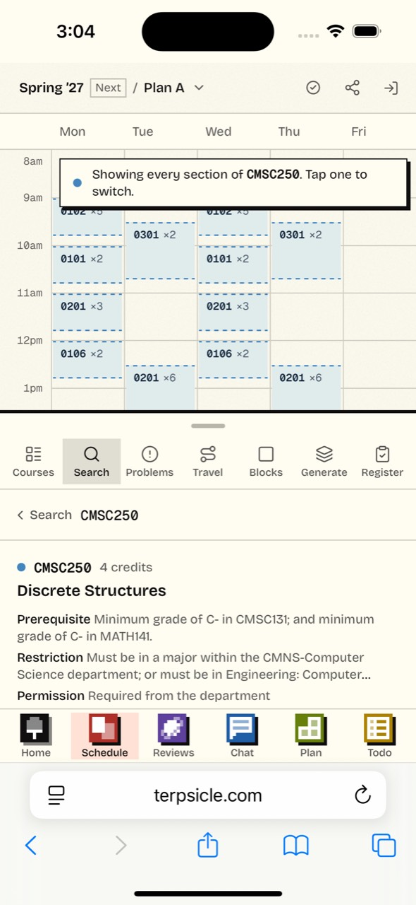 | **2. settled** (ok, 8 s) viewport 393×659, visual 659 tall at 0, scrollY 0 drawer half, top 329, inside 280px keyboard down page processes 691 MB (3, largest 613 MB) panel "Discrete Structures" |

## Tap each drawer tab, then the open one again

`tabs` · [recording](tabs/video.mp4)

| Screen | Step |
|---|---|
|  | **1. Search tab** (ok, 8 s) after: tap {"target":"[data-workbench-drawer] nav[aria-label=\"Tabs\"] button \"Search\"","at":{"x":87,"y":376}} viewport 393×659, visual 659 tall at 0, scrollY 0 drawer half, top 329, inside 280px keyboard down page processes 630 MB (3, largest 556 MB) focus div#_r_k_ at y 329–940 panel "Search" events: installed |
| 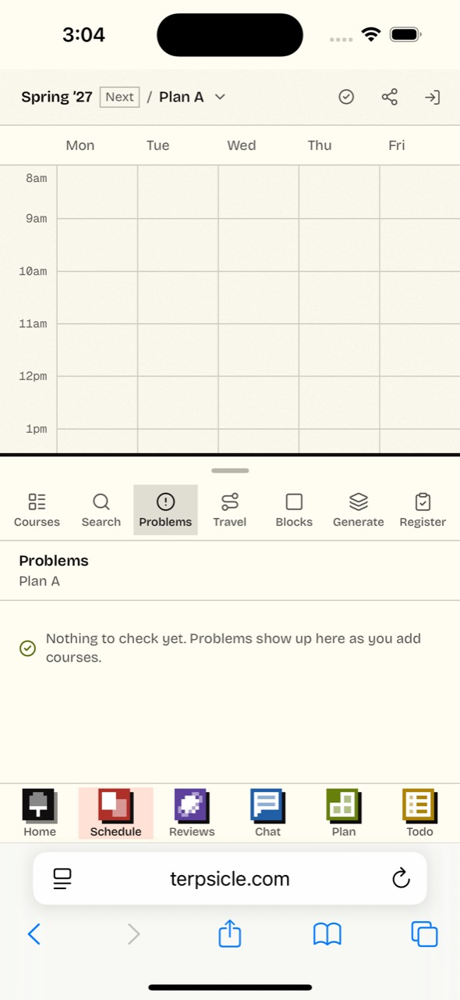 | **2. Problems tab** (ok, 11 s) after: tap {"target":"[data-workbench-drawer] nav[aria-label=\"Tabs\"] button \"Problems\"","at":{"x":142,"y":376}} viewport 393×659, visual 659 tall at 0, scrollY 0 drawer half, top 329, inside 280px keyboard down page processes 803 MB (3, largest 728 MB) focus div#_r_k_ at y 329–940 panel "Problems" |
| 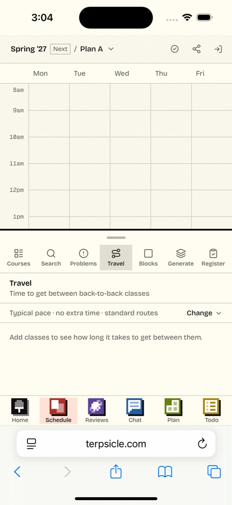 | **3. Travel tab** (ok, 15 s) after: tap {"target":"[data-workbench-drawer] nav[aria-label=\"Tabs\"] button \"Travel\"","at":{"x":197,"y":376}} viewport 393×659, visual 659 tall at 0, scrollY 0 drawer half, top 329, inside 280px keyboard down page processes 791 MB (3, largest 717 MB) focus div#_r_k_ at y 329–940 panel "Travel" |
| 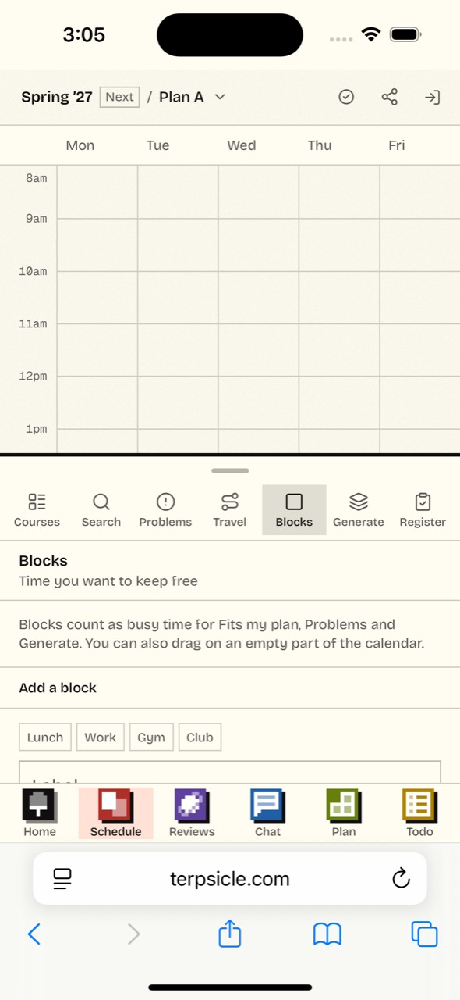 | **4. Blocks tab** (ok, 19 s) after: tap {"target":"[data-workbench-drawer] nav[aria-label=\"Tabs\"] button \"Blocks\"","at":{"x":252,"y":376}} viewport 393×659, visual 659 tall at 0, scrollY 0 drawer half, top 329, inside 280px keyboard down page processes 612 MB (3, largest 537 MB) focus div#_r_k_ at y 329–940 panel "Blocks" |
| 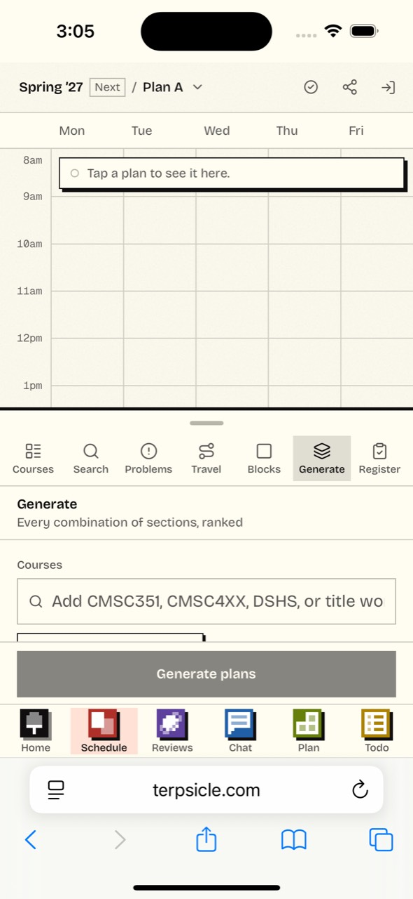 | **5. Generate tab** (ok, 21 s) after: tap {"target":"[data-workbench-drawer] nav[aria-label=\"Tabs\"] button \"Generate\"","at":{"x":307,"y":376}} viewport 393×659, visual 659 tall at 0, scrollY 0 drawer half, top 329, inside 280px keyboard down page processes 642 MB (3, largest 568 MB) focus div#_r_k_ at y 329–940 panel "Generate" |
| 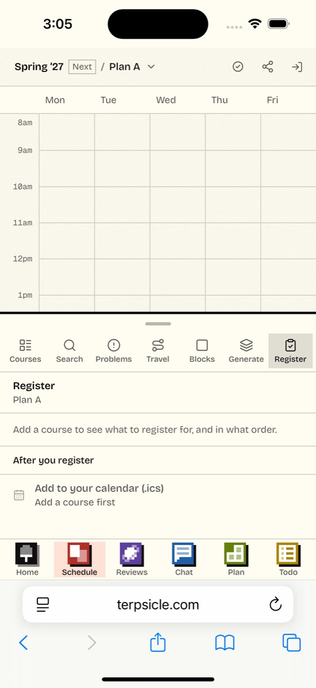 | **6. Register tab** (ok, 24 s) after: tap {"target":"[data-workbench-drawer] nav[aria-label=\"Tabs\"] button \"Register\"","at":{"x":362,"y":376}} viewport 393×659, visual 659 tall at 0, scrollY 0 drawer half, top 329, inside 280px keyboard down page processes 660 MB (3, largest 586 MB) focus div#_r_k_ at y 329–940 panel "Register" |
| 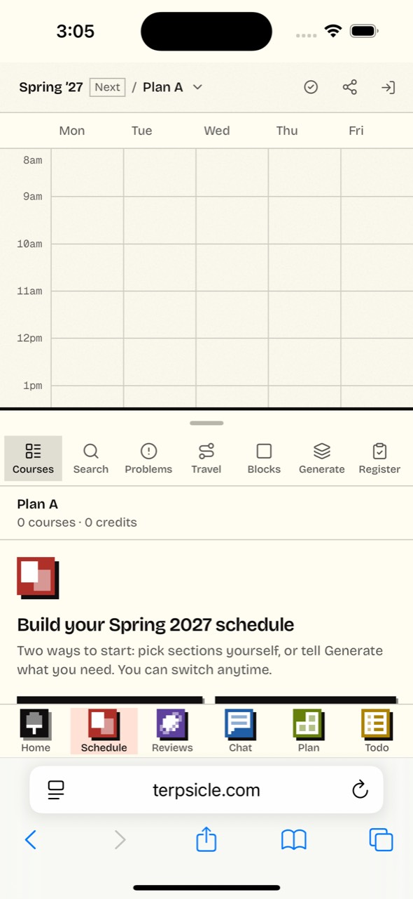 | **7. Courses tab** (ok, 28 s) after: tap {"target":"[data-workbench-drawer] nav[aria-label=\"Tabs\"] button \"Courses\"","at":{"x":32,"y":376}} viewport 393×659, visual 659 tall at 0, scrollY 0 drawer half, top 329, inside 280px keyboard down page processes 671 MB (3, largest 596 MB) focus div#_r_k_ at y 329–940 panel "Plan A" |
|  | **8. tapped the open tab** (ok, 31 s) after: tap {"target":"[data-workbench-drawer] nav[aria-label=\"Tabs\"] button \"Courses\"","at":{"x":32,"y":376}} viewport 393×659, visual 659 tall at 0, scrollY 0 drawer peek, top 485, inside 124px keyboard down page processes 666 MB (3, largest 592 MB) focus div#_r_k_ at y 485–1096 panel "Plan A" |

## Drag the grabber peek → half → full → peek

`grabber-drag` · [recording](grabber-drag/video.mp4)

| Screen | Step |
|---|---|
|  | **1. peek** (ok, 8 s) after: tap {"target":"[data-workbench-drawer] button[aria-label$=\"the panel\"]","at":{"x":197,"y":61}} viewport 393×659, visual 659 tall at 0, scrollY 0 drawer peek, top 485, inside 124px keyboard down page processes 566 MB (3, largest 485 MB) focus div#_r_k_ at y 485–1096 panel "Plan A" events: installed |
|  | **2. dragged to half** (ok, 14 s) after: swipe {"from":"[data-workbench-drawer] button[aria-label$=\"the panel\"]","start":{"x":197,"y":498},"end":{"x":197,"y":342},"ms":900,"intent":"drag"} viewport 393×659, visual 659 tall at 0, scrollY 0 drawer half, top 329, inside 280px keyboard down page processes 663 MB (3, largest 580 MB) focus div#_r_k_ at y 329–940 panel "Plan A" |
| 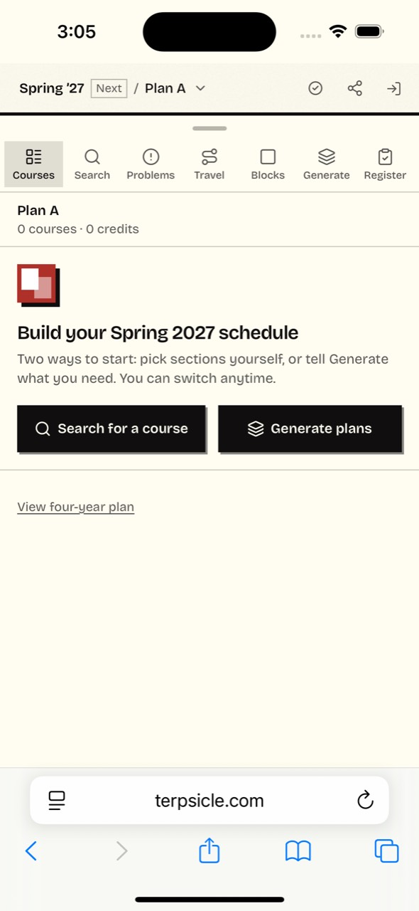 | **3. dragged to full** (ok, 19 s) after: swipe {"from":"[data-workbench-drawer] button[aria-label$=\"the panel\"]","start":{"x":197,"y":342},"end":{"x":197,"y":61},"ms":900,"intent":"drag"} viewport 393×659, visual 659 tall at 0, scrollY 0 drawer full, top 48, inside 611px keyboard down page processes 521 MB (3, largest 437 MB) focus div#_r_k_ at y 48–659 panel "Plan A" |
| 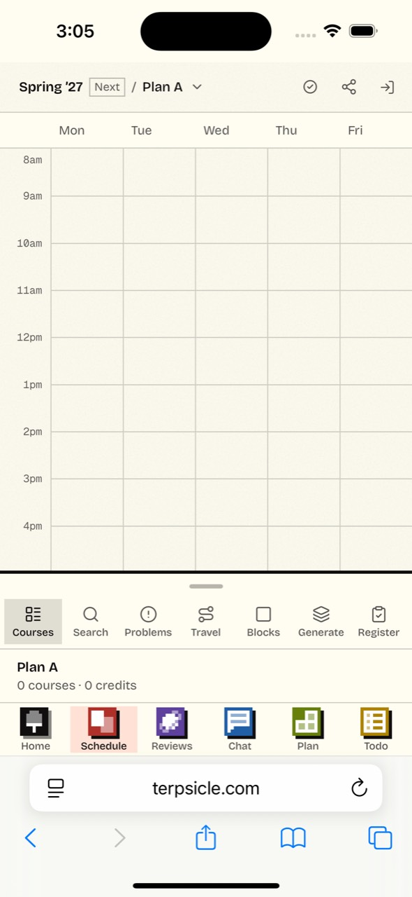 | **4. dragged to peek** (ok, 23 s) after: swipe {"from":"[data-workbench-drawer] button[aria-label$=\"the panel\"]","start":{"x":197,"y":61},"end":{"x":197,"y":498},"ms":900,"intent":"drag"} viewport 393×659, visual 659 tall at 0, scrollY 0 drawer peek, top 485, inside 124px keyboard down page processes 435 MB (3, largest 349 MB) focus div#_r_k_ at y 485–1096 panel "Plan A" |

## Pull down on a list at its top, at each snap

`pull-lists` · [recording](pull-lists/video.mp4)

| Screen | Step |
|---|---|
| 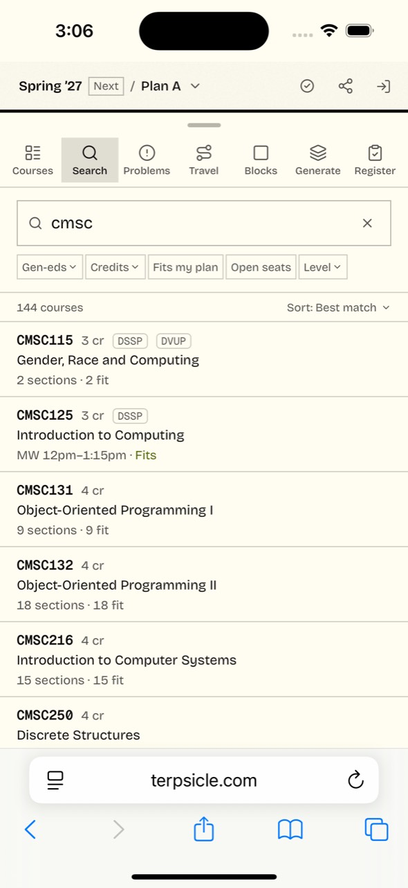 | **1. results at full** (ok, 22 s) after: tap {"target":"[data-workbench-drawer] nav[aria-label=\"Tabs\"] button \"Search\"","at":{"x":87,"y":95}} after: tap {"target":"input[aria-label=\"Search courses\"]","at":{"x":208,"y":155}} after: type {"text":"cmsc"} after: hide keyboard {} viewport 393×659, visual 659 tall at 0, scrollY 0 drawer full, top 48, inside 611px keyboard down page processes 370 MB (3, largest 285 MB) panel "Search" events: installed, vv-resize ×2 |
|  | **2. pulled down at full** (ok, 31 s) after: swipe {"from":null,"start":{"x":197,"y":270},"end":{"x":197,"y":570},"ms":600,"intent":"drag"} viewport 393×659, visual 659 tall at 0, scrollY 0 drawer half, top 329, inside 280px keyboard down page processes 411 MB (3, largest 329 MB) panel "Search" |
| 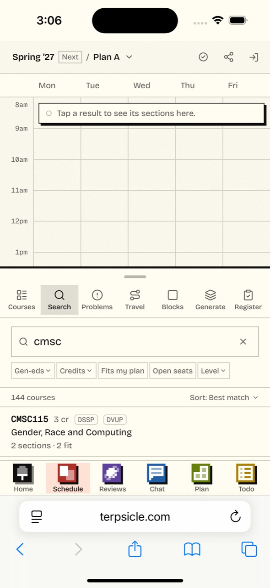 | **3. results at half** (ok, 34 s) viewport 393×659, visual 659 tall at 0, scrollY 0 drawer half, top 329, inside 280px keyboard down page processes 407 MB (3, largest 329 MB) panel "Search" |
|  | **4. pulled down at half** (ok, 39 s) after: swipe {"from":null,"start":{"x":197,"y":551},"end":{"x":197,"y":851},"ms":600,"intent":"drag"} viewport 393×659, visual 659 tall at 0, scrollY 0 drawer peek, top 485, inside 124px keyboard down page processes 407 MB (3, largest 333 MB) panel "Search" |
|  | **5. results at peek** (ok, 42 s) viewport 393×659, visual 659 tall at 0, scrollY 0 drawer peek, top 485, inside 124px keyboard down page processes 714 MB (3, largest 642 MB) panel "Search" |
|  | **6. pulled down at peek** (ok, 48 s) after: swipe {"from":null,"start":{"x":197,"y":518},"end":{"x":197,"y":818},"ms":600,"intent":"drag"} viewport 393×659, visual 659 tall at 0, scrollY 0 drawer peek, top 485, inside 124px keyboard down page processes 718 MB (3, largest 646 MB) panel "Search" |
|  | **7. pulled down on Courses at half** (warn, 57 s) after: tap {"target":"[data-workbench-drawer] nav[aria-label=\"Tabs\"] button \"Courses\"","at":{"x":32,"y":532}} after: swipe {"from":null,"start":{"x":197,"y":469},"end":{"x":197,"y":769},"ms":600,"intent":"drag"} viewport 393×659, visual 659 tall at 0, scrollY 0 drawer peek, top 485, inside 124px keyboard down page processes 666 MB (3, largest 590 MB) focus div#_r_k_ at y 485–1096 panel "Plan A" **warn drawer-moves-one-way**: 2 reversal(s) over 69 frames (329–629) |

## Scroll a long list down, then back up: the drawer stays

`scroll-list-back` · [recording](scroll-list-back/video.mp4)

| Screen | Step |
|---|---|
| 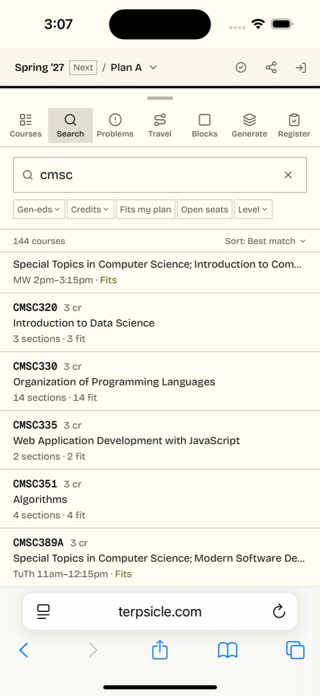 | **1. scrolled down** (ok, 25 s) after: tap {"target":"[data-workbench-drawer] nav[aria-label=\"Tabs\"] button \"Search\"","at":{"x":87,"y":95}} after: tap {"target":"input[aria-label=\"Search courses\"]","at":{"x":208,"y":155}} after: type {"text":"cmsc"} after: hide keyboard {} after: swipe {"from":null,"start":{"x":197,"y":558},"end":{"x":197,"y":208},"ms":400,"intent":"scroll"} viewport 393×659, visual 659 tall at 0, scrollY 0 drawer full, top 48, inside 611px keyboard down page processes 619 MB (3, largest 552 MB) panel "Search" events: installed, vv-resize ×2, pointercancel |
| 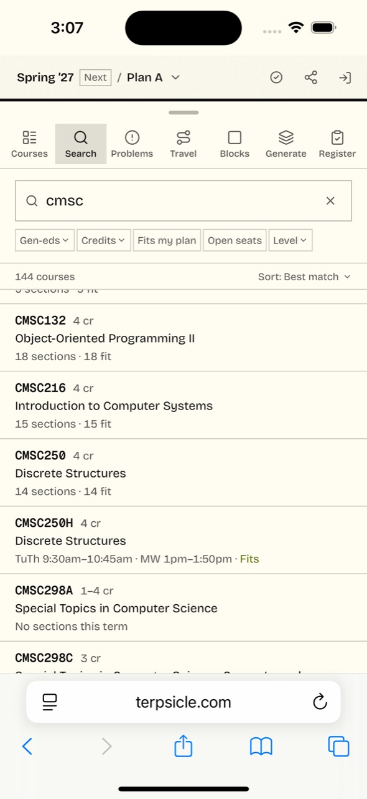 | **2. scrolled back up** (ok, 33 s) after: swipe {"from":null,"start":{"x":197,"y":373},"end":{"x":197,"y":623},"ms":400,"intent":"scroll"} viewport 393×659, visual 659 tall at 0, scrollY 0 drawer full, top 48, inside 611px keyboard down page processes 447 MB (3, largest 381 MB) panel "Search" events: pointercancel |

## Scroll the calendar, then pull down at its top

`calendar-pull` · [recording](calendar-pull/video.mp4)

| Screen | Step |
|---|---|
|  | **1. scrolled the calendar down** (ok, 17 s) after: tap {"target":"[data-workbench-drawer] button[aria-label$=\"the panel\"]","at":{"x":197,"y":342}} after: tap {"target":"[data-workbench-drawer] button[aria-label$=\"the panel\"]","at":{"x":197,"y":61}} after: swipe {"from":null,"start":{"x":197,"y":310},"end":{"x":197,"y":60},"ms":500,"intent":"scroll"} viewport 393×659, visual 659 tall at 0, scrollY 0 drawer peek, top 485, inside 124px keyboard down page processes 554 MB (3, largest 481 MB) focus div#_r_k_ at y 485–1096 panel "Search" events: installed |
|  | **2. pulled down at the top** (ok, 25 s) after: swipe {"from":null,"start":{"x":197,"y":114},"end":{"x":197,"y":464},"ms":500,"intent":"scroll"} after: swipe {"from":null,"start":{"x":197,"y":114},"end":{"x":197,"y":464},"ms":500,"intent":"scroll"} viewport 393×659, visual 659 tall at 0, scrollY 0 drawer peek, top 485, inside 124px keyboard down page processes 292 MB (3, largest 226 MB) focus div#_r_k_ at y 485–1096 panel "Search" |

## Rotate to landscape and back

`rotate` · [recording](rotate/video.mp4)

| Screen | Step |
|---|---|
|  | **1. portrait** (ok, 11 s) viewport 393×659, visual 659 tall at 0, scrollY 0 drawer half, top 329, inside 280px keyboard down page processes 863 MB (3, largest 796 MB) panel "Search" events: installed |
| 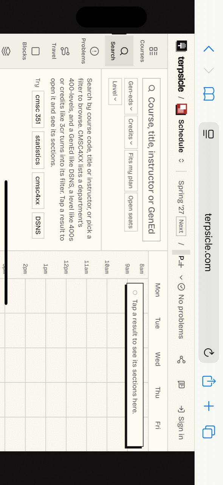 | **2. landscape** (ok, 21 s) after: rotate {"orientation":"landscape"} viewport 852×343, visual 343 tall at 0, scrollY 0 keyboard down page processes 542 MB (3, largest 484 MB) panel "Search" events: orientationchange, resize, vv-resize |
| 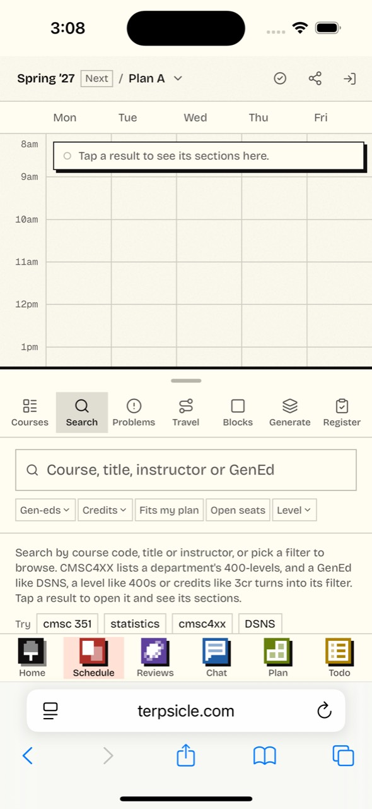 | **3. portrait again** (ok, 28 s) after: rotate {"orientation":"portrait"} viewport 393×659, visual 659 tall at 0, scrollY 0 drawer half, top 329, inside 280px keyboard down page processes 398 MB (3, largest 339 MB) panel "Search" events: orientationchange, resize, vv-resize |

## Scroll to collapse and expand the browser's toolbar

`url-bar` · [recording](url-bar/video.mp4)

| Screen | Step |
|---|---|
| 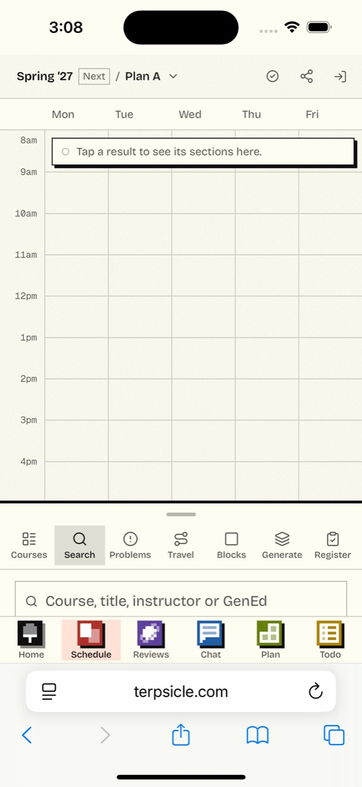 | **1. start** (ok, 13 s) after: tap {"target":"[data-workbench-drawer] button[aria-label$=\"the panel\"]","at":{"x":197,"y":342}} after: tap {"target":"[data-workbench-drawer] button[aria-label$=\"the panel\"]","at":{"x":197,"y":61}} viewport 393×659, visual 659 tall at 0, scrollY 0 drawer peek, top 485, inside 124px keyboard down page processes 619 MB (3, largest 559 MB) focus div#_r_k_ at y 485–1096 panel "Search" events: installed |
|  | **2. scrolled the calendar up (toolbar may hide)** (ok, 18 s) after: swipe {"from":null,"start":{"x":197,"y":354},"end":{"x":197,"y":54},"ms":400,"intent":"scroll"} viewport 393×659, visual 659 tall at 0, scrollY 0 drawer peek, top 485, inside 124px keyboard down page processes 392 MB (3, largest 330 MB) focus div#_r_k_ at y 485–1096 panel "Search" |
|  | **3. scrolled it back (toolbar may show)** (ok, 23 s) after: swipe {"from":null,"start":{"x":197,"y":354},"end":{"x":197,"y":654},"ms":400,"intent":"scroll"} viewport 393×659, visual 659 tall at 0, scrollY 0 drawer peek, top 485, inside 124px keyboard down page processes 347 MB (3, largest 281 MB) focus div#_r_k_ at y 485–1096 panel "Search" |
| 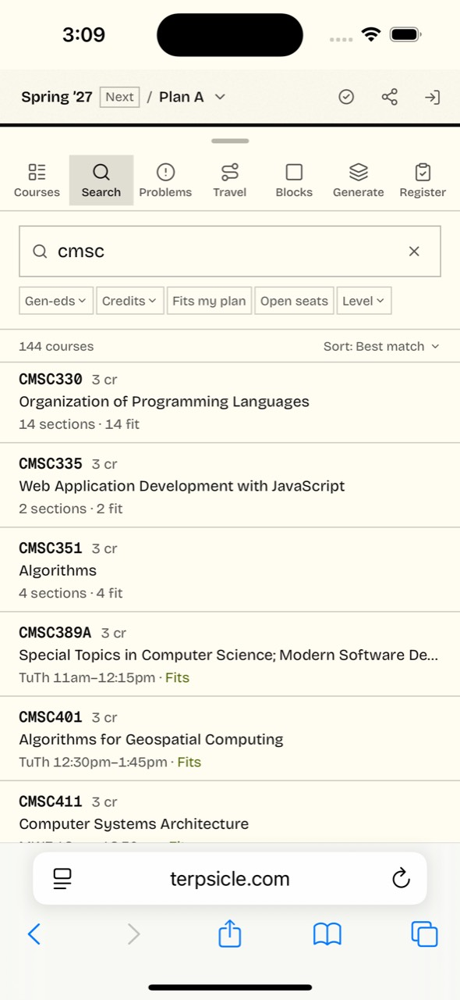 | **4. scrolled the results** (ok, 41 s) after: tap {"target":"[data-workbench-drawer] nav[aria-label=\"Tabs\"] button \"Search\"","at":{"x":87,"y":532}} after: tap {"target":"input[aria-label=\"Search courses\"]","at":{"x":208,"y":436}} after: type {"text":"cmsc"} after: hide keyboard {} after: swipe {"from":null,"start":{"x":197,"y":578},"end":{"x":197,"y":178},"ms":400,"intent":"scroll"} viewport 393×659, visual 659 tall at 0, scrollY 0 drawer full, top 48, inside 611px keyboard down page processes 599 MB (3, largest 541 MB) panel "Search" events: vv-resize ×2, pointercancel |
| 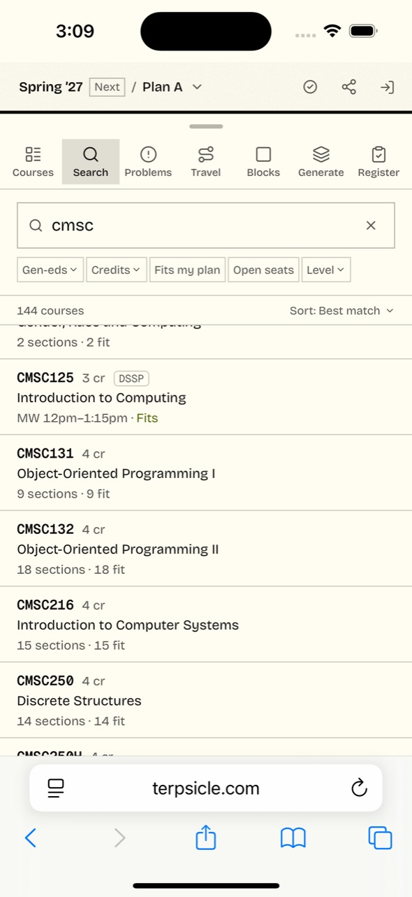 | **5. scrolled them back** (ok, 47 s) after: swipe {"from":null,"start":{"x":197,"y":578},"end":{"x":197,"y":978},"ms":400,"intent":"scroll"} viewport 393×659, visual 659 tall at 0, scrollY 0 drawer full, top 48, inside 611px keyboard down page processes 616 MB (3, largest 563 MB) panel "Search" events: pointercancel |

## A long course (ENGL101, 90+ sections) scrolled to the bottom

`long-course` · [recording](long-course/video.mp4)

| Screen | Step |
|---|---|
| 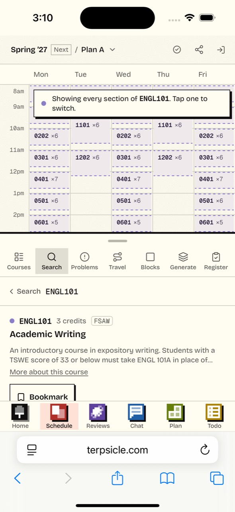 | **1. ENGL101** (warn, 30 s) after: tap {"target":"[data-workbench-drawer] nav[aria-label=\"Tabs\"] button \"Search\"","at":{"x":87,"y":376}} after: tap {"target":"input[aria-label=\"Search courses\"]","at":{"x":208,"y":592}} after: type {"text":"engl101"} after: hide keyboard {} after: tap {"target":"[data-course-result=\"ENGL101\"]","at":{"x":197,"y":286}} viewport 393×659, visual 659 tall at 0, scrollY 0 drawer half, top 329, inside 280px keyboard down page processes 639 MB (3, largest 586 MB) focus section[aria-label="ENGL101"] at y 402–610 panel "Academic Writing" events: installed, vv-resize ×2 **warn drawer-moves-one-way**: 2 reversal(s) over 25 frames (48–485) |
| 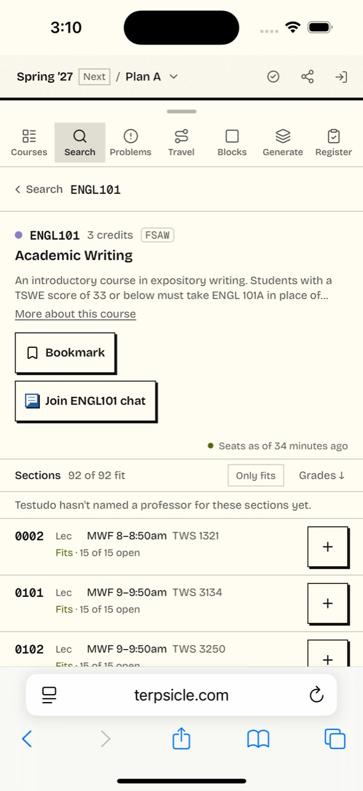 | **2. ENGL101 at full** (ok, 36 s) after: tap {"target":"[data-workbench-drawer] button[aria-label$=\"the panel\"]","at":{"x":197,"y":342}} viewport 393×659, visual 659 tall at 0, scrollY 0 drawer full, top 48, inside 611px keyboard down page processes 680 MB (3, largest 627 MB) focus div#_r_k_ at y 48–659 panel "Academic Writing" |
| 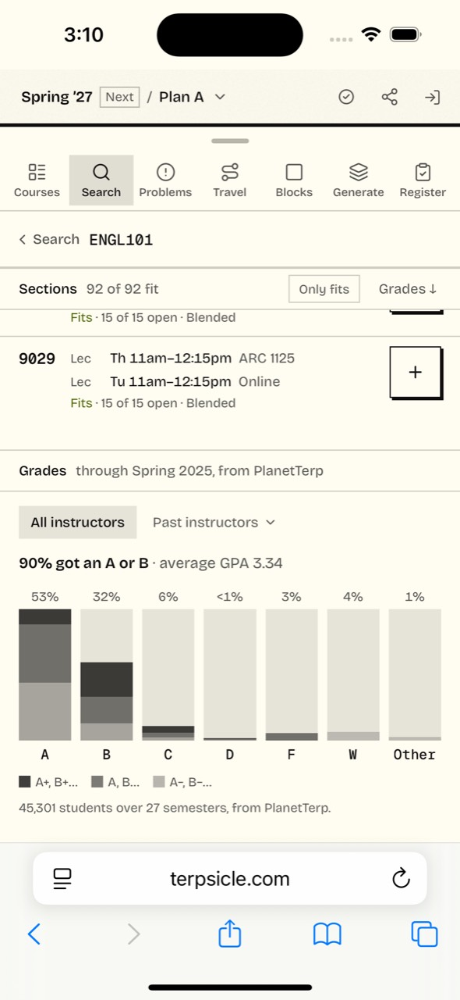 | **3. scrolled to the bottom** (ok, 66 s) after: swipe {"from":null,"start":{"x":197,"y":562},"end":{"x":197,"y":112},"ms":300,"intent":"scroll"} after: swipe {"from":null,"start":{"x":197,"y":562},"end":{"x":197,"y":112},"ms":300,"intent":"scroll"} after: swipe {"from":null,"start":{"x":197,"y":562},"end":{"x":197,"y":112},"ms":300,"intent":"scroll"} after: swipe {"from":null,"start":{"x":197,"y":562},"end":{"x":197,"y":112},"ms":300,"intent":"scroll"} after: swipe {"from":null,"start":{"x":197,"y":562},"end":{"x":197,"y":112},"ms":300,"intent":"scroll"} after: swipe {"from":null,"start":{"x":197,"y":562},"end":{"x":197,"y":112},"ms":300,"intent":"scroll"} after: swipe {"from":null,"start":{"x":197,"y":562},"end":{"x":197,"y":112},"ms":300,"intent":"scroll"} viewport 393×659, visual 659 tall at 0, scrollY 0 drawer full, top 48, inside 611px keyboard down page processes 319 MB (3, largest 270 MB) focus div#_r_k_ at y 48–659 panel "Academic Writing" events: pointercancel ×6 |

## Search, scroll, put the keyboard away and open a result, six times

`open-results` · [recording](open-results/video.mp4)

| Screen | Step |
|---|---|
|  | **1. opened a result (1)** (ok, 31 s) after: tap {"target":"[data-workbench-drawer] nav[aria-label=\"Tabs\"] button \"Search\"","at":{"x":87,"y":376}} after: tap {"target":"input[aria-label=\"Search courses\"]","at":{"x":208,"y":436}} after: type {"text":"cmsc"} after: tap {"target":"input[aria-label=\"Search courses\"]","at":{"x":187,"y":155}} after: swipe {"from":null,"start":{"x":197,"y":399},"end":{"x":197,"y":239},"ms":400,"intent":"scroll"} after: hide keyboard {} after: tap {"target":"#search-results [data-course-result]","at":{"x":197,"y":273}} viewport 393×659, visual 659 tall at 0, scrollY 0 drawer half, top 329, inside 280px keyboard down page processes 621 MB (3, largest 575 MB) focus section[aria-label="CMSC216"] at y 402–610 panel "Introduction to Computer Systems" events: installed, vv-resize ×2, pointercancel |
|  | **2. opened a result (2)** (ok, 49 s) after: tap {"target":"[data-workbench-drawer] [data-layer][data-active] button \"Back to Search\"","at":{"x":40,"y":426}} after: tap {"target":"[data-workbench-drawer] button[aria-label$=\"the panel\"]","at":{"x":197,"y":342}} after: tap {"target":"input[aria-label=\"Search courses\"]","at":{"x":187,"y":155}} after: swipe {"from":null,"start":{"x":197,"y":399},"end":{"x":197,"y":239},"ms":400,"intent":"scroll"} after: hide keyboard {} after: tap {"target":"#search-results [data-course-result]","at":{"x":197,"y":273}} viewport 393×659, visual 659 tall at 0, scrollY 0 drawer half, top 329, inside 280px keyboard down page processes 652 MB (3, largest 608 MB) focus section[aria-label="CMSC216"] at y 402–610 panel "Introduction to Computer Systems" events: vv-resize ×2, pointercancel |
|  | **3. opened a result (3)** (ok, 66 s) after: tap {"target":"[data-workbench-drawer] [data-layer][data-active] button \"Back to Search\"","at":{"x":40,"y":426}} after: tap {"target":"[data-workbench-drawer] button[aria-label$=\"the panel\"]","at":{"x":197,"y":342}} after: tap {"target":"input[aria-label=\"Search courses\"]","at":{"x":187,"y":155}} after: swipe {"from":null,"start":{"x":197,"y":399},"end":{"x":197,"y":239},"ms":400,"intent":"scroll"} after: hide keyboard {} after: tap {"target":"#search-results [data-course-result]","at":{"x":197,"y":273}} viewport 393×659, visual 659 tall at 0, scrollY 0 drawer half, top 329, inside 280px keyboard down page processes 655 MB (3, largest 610 MB) focus section[aria-label="CMSC216"] at y 402–610 panel "Introduction to Computer Systems" events: vv-resize ×2, pointercancel |
|  | **4. opened a result (4)** (ok, 84 s) after: tap {"target":"[data-workbench-drawer] [data-layer][data-active] button \"Back to Search\"","at":{"x":40,"y":426}} after: tap {"target":"[data-workbench-drawer] button[aria-label$=\"the panel\"]","at":{"x":197,"y":342}} after: tap {"target":"input[aria-label=\"Search courses\"]","at":{"x":187,"y":155}} after: swipe {"from":null,"start":{"x":197,"y":399},"end":{"x":197,"y":239},"ms":400,"intent":"scroll"} after: hide keyboard {} after: tap {"target":"#search-results [data-course-result]","at":{"x":197,"y":262}} viewport 393×659, visual 659 tall at 0, scrollY 0 drawer half, top 329, inside 280px keyboard down page processes 814 MB (3, largest 770 MB) focus section[aria-label="CMSC216"] at y 402–610 panel "Introduction to Computer Systems" events: vv-resize ×2, pointercancel |
|  | **5. opened a result (5)** (ok, 100 s) after: tap {"target":"[data-workbench-drawer] [data-layer][data-active] button \"Back to Search\"","at":{"x":40,"y":426}} after: tap {"target":"[data-workbench-drawer] button[aria-label$=\"the panel\"]","at":{"x":197,"y":342}} after: tap {"target":"input[aria-label=\"Search courses\"]","at":{"x":187,"y":155}} after: swipe {"from":null,"start":{"x":197,"y":399},"end":{"x":197,"y":239},"ms":400,"intent":"scroll"} after: hide keyboard {} after: tap {"target":"#search-results [data-course-result]","at":{"x":197,"y":273}} viewport 393×659, visual 659 tall at 0, scrollY 0 drawer half, top 329, inside 280px keyboard down page processes 672 MB (3, largest 627 MB) focus section[aria-label="CMSC216"] at y 402–610 panel "Introduction to Computer Systems" events: vv-resize ×2, pointercancel |
| 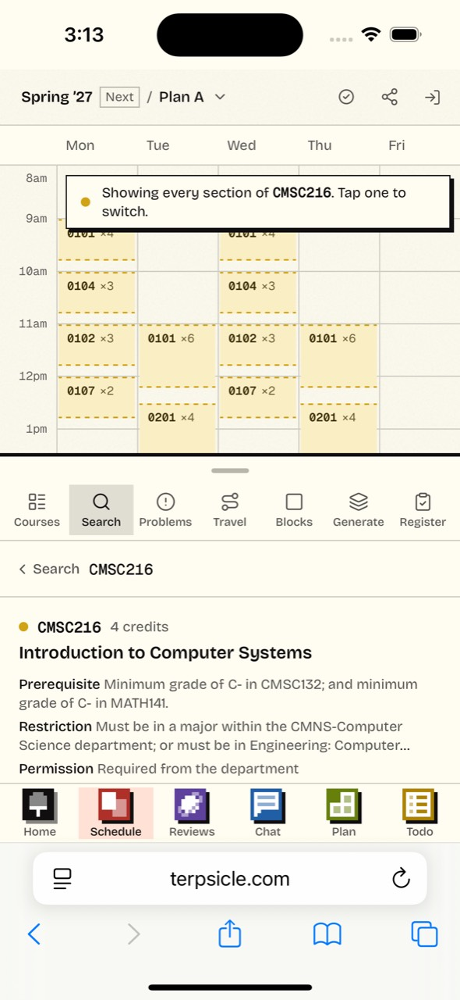 | **6. opened a result (6)** (ok, 118 s) after: tap {"target":"[data-workbench-drawer] [data-layer][data-active] button \"Back to Search\"","at":{"x":40,"y":426}} after: tap {"target":"[data-workbench-drawer] button[aria-label$=\"the panel\"]","at":{"x":197,"y":342}} after: tap {"target":"input[aria-label=\"Search courses\"]","at":{"x":187,"y":155}} after: swipe {"from":null,"start":{"x":197,"y":399},"end":{"x":197,"y":239},"ms":400,"intent":"scroll"} after: hide keyboard {} after: tap {"target":"#search-results [data-course-result]","at":{"x":197,"y":273}} viewport 393×659, visual 659 tall at 0, scrollY 0 drawer half, top 329, inside 280px keyboard down page processes 671 MB (3, largest 636 MB) focus section[aria-label="CMSC216"] at y 402–610 panel "Introduction to Computer Systems" events: vv-resize ×2, pointercancel |

## Add a section from course details, then switch it three times

`add-sections` · [recording](add-sections/video.mp4)

| Screen | Step |
|---|---|
| 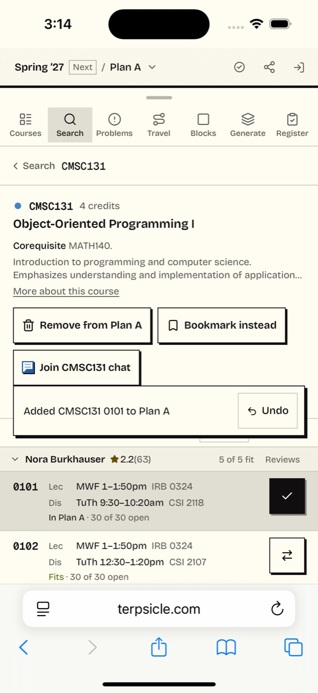 | **1. tapped Add 0101** (warn, 45 s) after: tap {"target":"[data-workbench-drawer] nav[aria-label=\"Tabs\"] button \"Search\"","at":{"x":87,"y":376}} after: tap {"target":"input[aria-label=\"Search courses\"]","at":{"x":208,"y":592}} after: type {"text":"cmsc131"} after: hide keyboard {} after: tap {"target":"[data-course-result=\"CMSC131\"]","at":{"x":197,"y":286}} after: tap {"target":"[data-workbench-drawer] button[aria-label$=\"the panel\"]","at":{"x":197,"y":342}} after: tap {"target":"[data-section] button[aria-label^=\"Add \"], [data-section] button[aria-label^=\"Switch to \"] \"Add 0101\"","at":{"x":355,"y":551}} viewport 393×659, visual 659 tall at 0, scrollY 0 drawer full, top 48, inside 611px keyboard down page processes 743 MB (3, largest 681 MB) focus section[aria-label="CMSC131"] at y 121–660 panel "Object-Oriented Programming I" events: installed, vv-resize ×2 **warn drawer-moves-one-way**: 3 reversal(s) over 43 frames (48–485) |
| 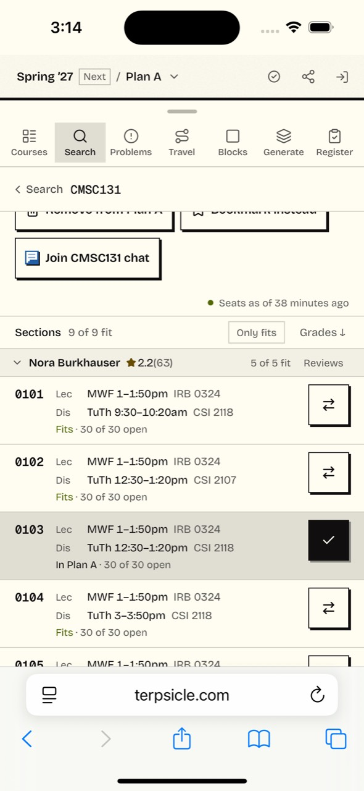 | **2. tapped Switch to 0103** (ok, 54 s) after: tap {"target":"[data-section] button[aria-label^=\"Add \"], [data-section] button[aria-label^=\"Switch to \"] \"Switch to 0103\"","at":{"x":355,"y":523}} viewport 393×659, visual 659 tall at 0, scrollY 0 drawer full, top 48, inside 611px keyboard down page processes 378 MB (3, largest 319 MB) focus section[aria-label="CMSC131"] at y 121–660 panel "Object-Oriented Programming I" |
| 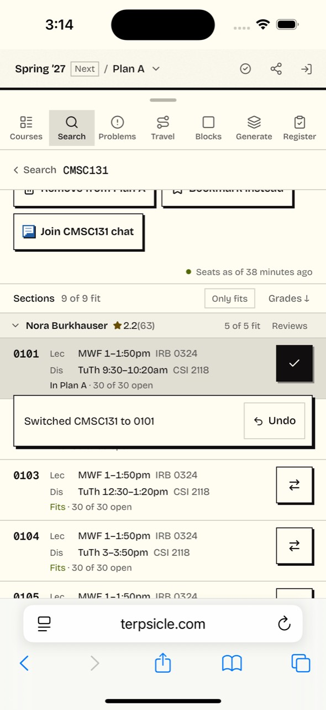 | **3. tapped Switch to 0101** (ok, 61 s) after: tap {"target":"[data-section] button[aria-label^=\"Add \"], [data-section] button[aria-label^=\"Switch to \"] \"Switch to 0101\"","at":{"x":355,"y":377}} viewport 393×659, visual 659 tall at 0, scrollY 0 drawer full, top 48, inside 611px keyboard down page processes 723 MB (3, largest 659 MB) focus section[aria-label="CMSC131"] at y 121–660 panel "Object-Oriented Programming I" |
| 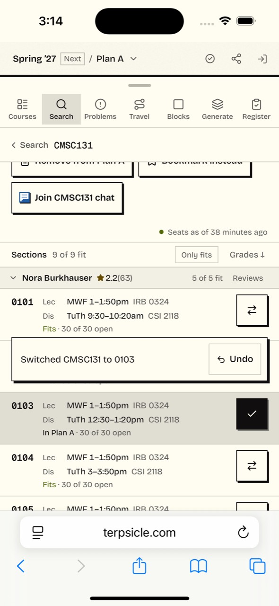 | **4. tapped Switch to 0103** (ok, 66 s) after: tap {"target":"[data-section] button[aria-label^=\"Add \"], [data-section] button[aria-label^=\"Switch to \"] \"Switch to 0103\"","at":{"x":355,"y":523}} viewport 393×659, visual 659 tall at 0, scrollY 0 drawer full, top 48, inside 611px keyboard down page processes 536 MB (3, largest 471 MB) focus section[aria-label="CMSC131"] at y 121–660 panel "Object-Oriented Programming I" |
