# Mobile lab: webkit

**Passed**: 0 failed check(s), 0 warning(s), 0 error(s).

- URL: https://pr-220-terpsicle.zsrobinson.workers.dev/schedule
- Device: Playwright webkit 26.6, iPhone 15 viewport (emulated touch, no keyboard)
- Started: 2026-09-30T00:18:14.329Z, took 80 s
- Workflow run: https://github.com/zsrobinson/terpsicle/actions/runs/36649227647
- Every step's full probe (viewport, drawer, focus, events, per-frame trace) is in `summary.json`.

| Scenario | Result | Steps | Time | Recording |
|---|---|---|---|---|
| [Search with the on-screen keyboard from half: tap the box, type, scroll, put the keyboard away, open a result](#keyboard-at-half) | ok | 10 | 20 s | [video](keyboard-at-half/video.webm) |
| [Search with the on-screen keyboard from full: tap the box, type, scroll, put the keyboard away, open a result](#keyboard-at-full) | ok | 10 | 17 s | [video](keyboard-at-full/video.webm) |
| [Search with the on-screen keyboard from peek: tap the box, type, scroll, put the keyboard away, open a result](#keyboard-at-peek) | ok | 10 | 19 s | [video](keyboard-at-peek/video.webm) |
| [First load](#first-load) | ok | 2 | 6 s | [video](first-load/video.webm) |
| [Tap each drawer tab, then the open one again](#tabs) | ok | 8 | 17 s | [video](tabs/video.webm) |
| [Drag the grabber peek → half → full → peek](#grabber-drag) | skipped | 0 | 0 s | none |

## Search with the on-screen keyboard from half: tap the box, type, scroll, put the keyboard away, open a result

`keyboard-at-half` · [recording](keyboard-at-half/video.webm)

| Screen | Step |
|---|---|
|  | **1. loaded** (ok, 4 s) viewport 393×659, visual 659 tall at 0, scrollY 0 drawer full, top 48, inside 611px page processes 858 MB (2, largest 599 MB) panel "Plan A" events: installed |
| 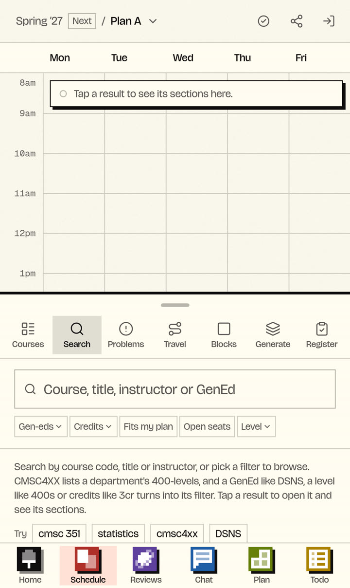 | **2. Search tab at half** (ok, 8 s) after: tap {"target":"[data-workbench-drawer] nav[aria-label=\"Tabs\"] button \"Search\"","at":{"x":87,"y":95}} after: tap {"target":"[data-workbench-drawer] button[aria-label$=\"the panel\"]","at":{"x":197,"y":61}} after: tap {"target":"[data-workbench-drawer] button[aria-label$=\"the panel\"]","at":{"x":197,"y":61}} after: tap {"target":"[data-workbench-drawer] button[aria-label$=\"the panel\"]","at":{"x":197,"y":498}} viewport 393×659, visual 659 tall at 0, scrollY 0 drawer half, top 329, inside 280px page processes 1011 MB (2, largest 752 MB) focus button#base-ui-_r_12_[aria-label="Raise the panel"] at y 330–354 panel "Search" |
|  | **3. tapped the search box (+150 ms)** (ok, 9 s) after: tap {"target":"input[aria-label=\"Search courses\"]","at":{"x":208,"y":436}} viewport 393×659, visual 659 tall at 0, scrollY 0 drawer full, top 48, inside 611px page processes 1007 MB (2, largest 747 MB) focus input#base-ui-_r_2n_[aria-label="Search courses"] at y 134–176 panel "Search" |
|  | **4. tapped the search box (+500 ms)** (ok, 9 s) viewport 393×659, visual 659 tall at 0, scrollY 0 drawer full, top 48, inside 611px page processes 1007 MB (2, largest 748 MB) focus input#base-ui-_r_2n_[aria-label="Search courses"] at y 134–176 panel "Search" |
|  | **5. tapped the search box (+1000 ms)** (ok, 10 s) viewport 393×659, visual 659 tall at 0, scrollY 0 drawer full, top 48, inside 611px page processes 1005 MB (2, largest 746 MB) focus input#base-ui-_r_2n_[aria-label="Search courses"] at y 134–176 panel "Search" |
| 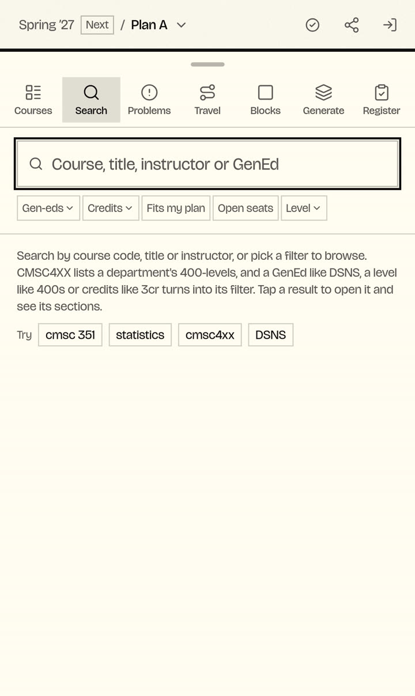 | **6. tapped the search box (+2000 ms)** (ok, 12 s) viewport 393×659, visual 659 tall at 0, scrollY 0 drawer full, top 48, inside 611px page processes 975 MB (2, largest 745 MB) focus input#base-ui-_r_2n_[aria-label="Search courses"] at y 134–176 panel "Search" |
|  | **7. typed "cmsc"** (ok, 13 s) after: type {"text":"cmsc"} viewport 393×659, visual 659 tall at 0, scrollY 0 drawer full, top 48, inside 611px page processes 1021 MB (2, largest 792 MB) focus input#base-ui-_r_2n_[aria-label="Search courses"] at y 134–176 panel "Search" |
| 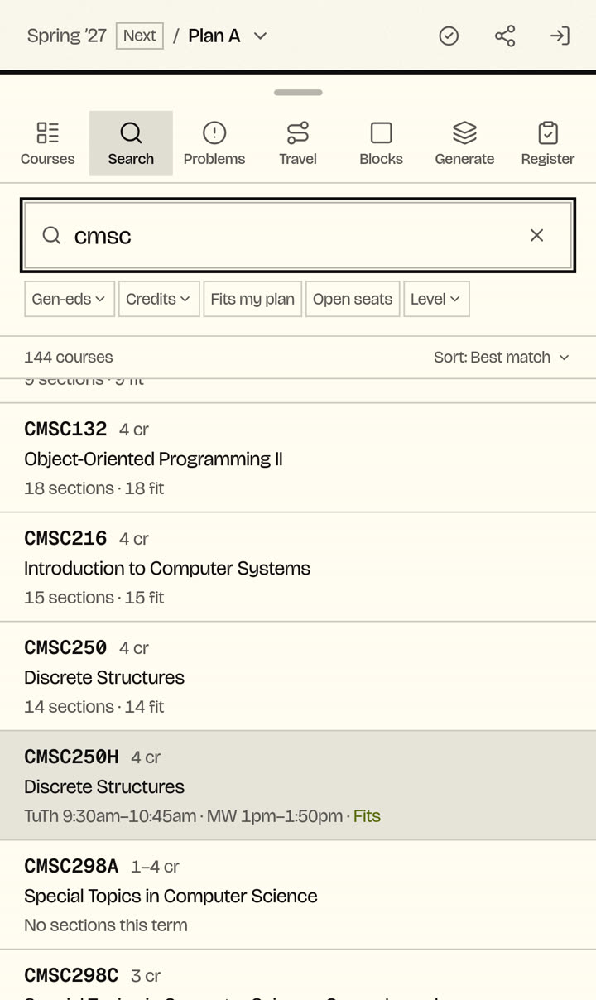 | **8. scrolled the results** (ok, 15 s) after: swipe {"from":null,"start":{"x":197,"y":578},"end":{"x":197,"y":378},"ms":500,"intent":"scroll"} viewport 393×659, visual 659 tall at 0, scrollY 0 drawer full, top 48, inside 611px page processes 1024 MB (2, largest 795 MB) focus input#base-ui-_r_2n_[aria-label="Search courses"] at y 134–176 panel "Search" |
| 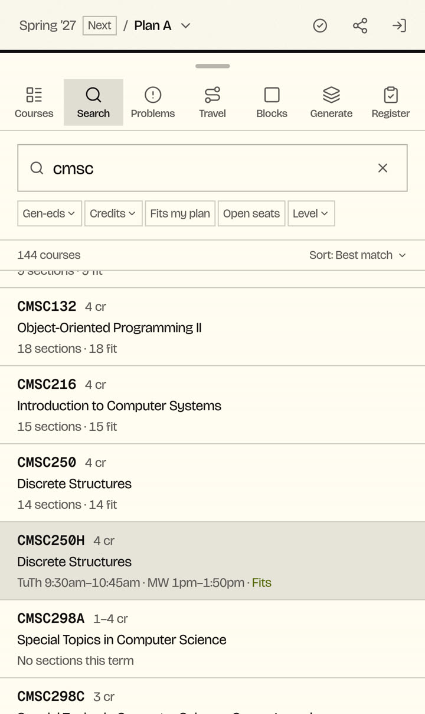 | **9. put the keyboard away** (ok, 16 s) after: hide keyboard {} viewport 393×659, visual 659 tall at 0, scrollY 0 drawer full, top 48, inside 611px page processes 1021 MB (2, largest 792 MB) panel "Search" |
| 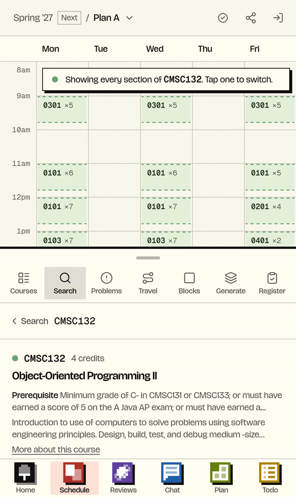 | **10. opened a result** (ok, 18 s) after: tap {"target":"#search-results [data-course-result]","at":{"x":197,"y":302}} viewport 393×659, visual 659 tall at 0, scrollY 0 drawer half, top 329, inside 280px page processes 1117 MB (2, largest 888 MB) focus section[aria-label="CMSC132"] at y 402–610 panel "Object-Oriented Programming II" |

## Search with the on-screen keyboard from full: tap the box, type, scroll, put the keyboard away, open a result

`keyboard-at-full` · [recording](keyboard-at-full/video.webm)

| Screen | Step |
|---|---|
|  | **1. loaded** (ok, 4 s) viewport 393×659, visual 659 tall at 0, scrollY 0 drawer full, top 48, inside 611px page processes 872 MB (2, largest 619 MB) panel "Plan A" events: installed |
|  | **2. Search tab at full** (ok, 5 s) after: tap {"target":"[data-workbench-drawer] nav[aria-label=\"Tabs\"] button \"Search\"","at":{"x":87,"y":95}} viewport 393×659, visual 659 tall at 0, scrollY 0 drawer full, top 48, inside 611px page processes 1008 MB (2, largest 755 MB) focus button#base-ui-_r_s_ at y 73–116 panel "Search" |
|  | **3. tapped the search box (+150 ms)** (ok, 5 s) after: tap {"target":"input[aria-label=\"Search courses\"]","at":{"x":208,"y":155}} viewport 393×659, visual 659 tall at 0, scrollY 0 drawer full, top 48, inside 611px page processes 1007 MB (2, largest 754 MB) focus input#base-ui-_r_2a_[aria-label="Search courses"] at y 134–176 panel "Search" |
|  | **4. tapped the search box (+500 ms)** (ok, 6 s) viewport 393×659, visual 659 tall at 0, scrollY 0 drawer full, top 48, inside 611px page processes 1008 MB (2, largest 755 MB) focus input#base-ui-_r_2a_[aria-label="Search courses"] at y 134–176 panel "Search" |
|  | **5. tapped the search box (+1000 ms)** (ok, 7 s) viewport 393×659, visual 659 tall at 0, scrollY 0 drawer full, top 48, inside 611px page processes 1009 MB (2, largest 756 MB) focus input#base-ui-_r_2a_[aria-label="Search courses"] at y 134–176 panel "Search" |
|  | **6. tapped the search box (+2000 ms)** (ok, 9 s) viewport 393×659, visual 659 tall at 0, scrollY 0 drawer full, top 48, inside 611px page processes 1009 MB (2, largest 756 MB) focus input#base-ui-_r_2a_[aria-label="Search courses"] at y 134–176 panel "Search" |
|  | **7. typed "cmsc"** (ok, 10 s) after: type {"text":"cmsc"} viewport 393×659, visual 659 tall at 0, scrollY 0 drawer full, top 48, inside 611px page processes 1050 MB (2, largest 797 MB) focus input#base-ui-_r_2a_[aria-label="Search courses"] at y 134–176 panel "Search" |
|  | **8. scrolled the results** (ok, 11 s) after: swipe {"from":null,"start":{"x":197,"y":578},"end":{"x":197,"y":378},"ms":500,"intent":"scroll"} viewport 393×659, visual 659 tall at 0, scrollY 0 drawer full, top 48, inside 611px page processes 1019 MB (2, largest 795 MB) focus input#base-ui-_r_2a_[aria-label="Search courses"] at y 134–176 panel "Search" |
| 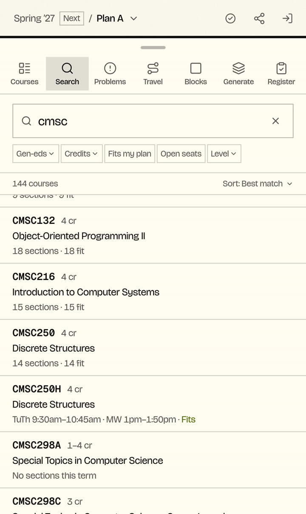 | **9. put the keyboard away** (ok, 13 s) after: hide keyboard {} viewport 393×659, visual 659 tall at 0, scrollY 0 drawer full, top 48, inside 611px page processes 1019 MB (2, largest 795 MB) panel "Search" |
|  | **10. opened a result** (ok, 15 s) after: tap {"target":"#search-results [data-course-result]","at":{"x":197,"y":302}} viewport 393×659, visual 659 tall at 0, scrollY 0 drawer half, top 329, inside 280px page processes 1106 MB (2, largest 882 MB) focus section[aria-label="CMSC132"] at y 402–610 panel "Object-Oriented Programming II" |

## Search with the on-screen keyboard from peek: tap the box, type, scroll, put the keyboard away, open a result

`keyboard-at-peek` · [recording](keyboard-at-peek/video.webm)

| Screen | Step |
|---|---|
|  | **1. loaded** (ok, 4 s) viewport 393×659, visual 659 tall at 0, scrollY 0 drawer full, top 48, inside 611px page processes 848 MB (2, largest 597 MB) panel "Plan A" events: installed |
| 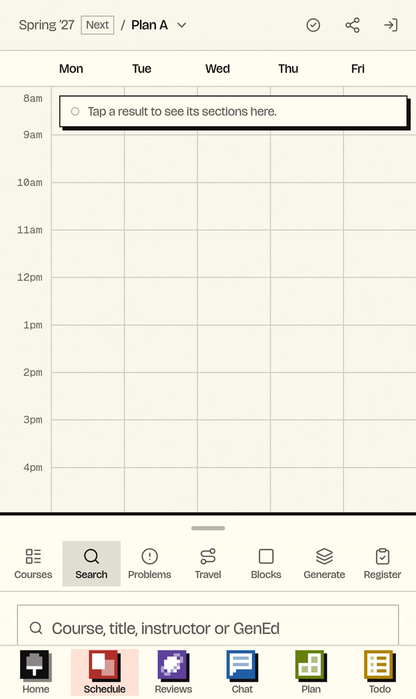 | **2. Search tab at peek** (ok, 6 s) after: tap {"target":"[data-workbench-drawer] nav[aria-label=\"Tabs\"] button \"Search\"","at":{"x":87,"y":95}} after: tap {"target":"[data-workbench-drawer] button[aria-label$=\"the panel\"]","at":{"x":197,"y":61}} viewport 393×659, visual 659 tall at 0, scrollY 0 drawer peek, top 485, inside 124px page processes 1012 MB (2, largest 761 MB) focus button#base-ui-_r_18_[aria-label="Raise the panel"] at y 486–510 panel "Search" |
|  | **3. tapped the search box (+150 ms)** (ok, 7 s) after: tap {"target":"input[aria-label=\"Search courses\"]","at":{"x":208,"y":592}} viewport 393×659, visual 659 tall at 0, scrollY 0 drawer full, top 48, inside 611px page processes 1006 MB (2, largest 755 MB) focus input#base-ui-_r_2t_[aria-label="Search courses"] at y 134–176 panel "Search" |
|  | **4. tapped the search box (+500 ms)** (ok, 8 s) viewport 393×659, visual 659 tall at 0, scrollY 0 drawer full, top 48, inside 611px page processes 1002 MB (2, largest 752 MB) focus input#base-ui-_r_2t_[aria-label="Search courses"] at y 134–176 panel "Search" |
|  | **5. tapped the search box (+1000 ms)** (ok, 9 s) viewport 393×659, visual 659 tall at 0, scrollY 0 drawer full, top 48, inside 611px page processes 1003 MB (2, largest 752 MB) focus input#base-ui-_r_2t_[aria-label="Search courses"] at y 134–176 panel "Search" |
|  | **6. tapped the search box (+2000 ms)** (ok, 10 s) viewport 393×659, visual 659 tall at 0, scrollY 0 drawer full, top 48, inside 611px page processes 1005 MB (2, largest 752 MB) focus input#base-ui-_r_2t_[aria-label="Search courses"] at y 134–176 panel "Search" |
| 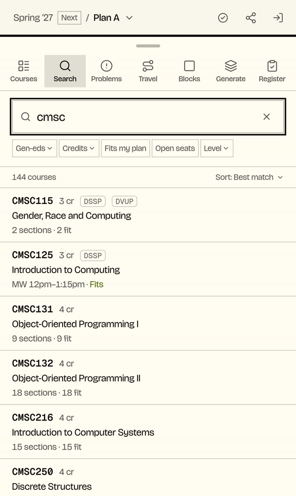 | **7. typed "cmsc"** (ok, 12 s) after: type {"text":"cmsc"} viewport 393×659, visual 659 tall at 0, scrollY 0 drawer full, top 48, inside 611px page processes 1011 MB (2, largest 786 MB) focus input#base-ui-_r_2t_[aria-label="Search courses"] at y 134–176 panel "Search" |
| 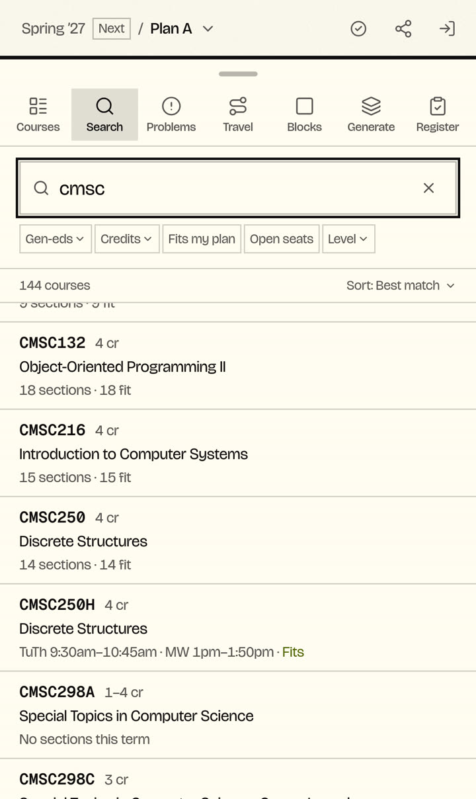 | **8. scrolled the results** (ok, 13 s) after: swipe {"from":null,"start":{"x":197,"y":578},"end":{"x":197,"y":378},"ms":500,"intent":"scroll"} viewport 393×659, visual 659 tall at 0, scrollY 0 drawer full, top 48, inside 611px page processes 1007 MB (2, largest 783 MB) focus input#base-ui-_r_2t_[aria-label="Search courses"] at y 134–176 panel "Search" |
|  | **9. put the keyboard away** (ok, 14 s) after: hide keyboard {} viewport 393×659, visual 659 tall at 0, scrollY 0 drawer full, top 48, inside 611px page processes 1007 MB (2, largest 782 MB) panel "Search" |
|  | **10. opened a result** (ok, 16 s) after: tap {"target":"#search-results [data-course-result]","at":{"x":197,"y":302}} viewport 393×659, visual 659 tall at 0, scrollY 0 drawer half, top 329, inside 280px page processes 1104 MB (2, largest 880 MB) focus section[aria-label="CMSC132"] at y 402–610 panel "Object-Oriented Programming II" |

## First load

`first-load` · [recording](first-load/video.webm)

| Screen | Step |
|---|---|
| 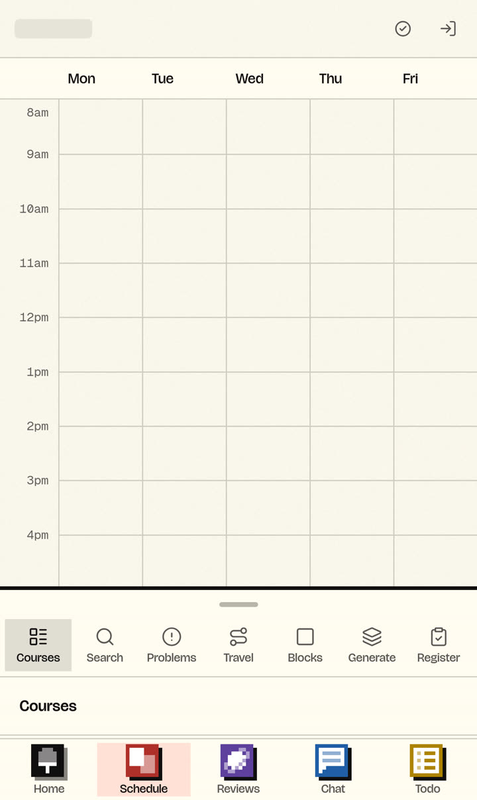 | **1. shell up** (ok, 1 s) viewport 393×659, visual 659 tall at 0, scrollY 0 drawer full, top 367.8, inside 611px page processes 805 MB (2, largest 552 MB) panel "Plan A" events: installed |
|  | **2. settled** (ok, 5 s) viewport 393×659, visual 659 tall at 0, scrollY 0 drawer full, top 48, inside 611px page processes 857 MB (2, largest 604 MB) panel "Plan A" |

## Tap each drawer tab, then the open one again

`tabs` · [recording](tabs/video.webm)

| Screen | Step |
|---|---|
| 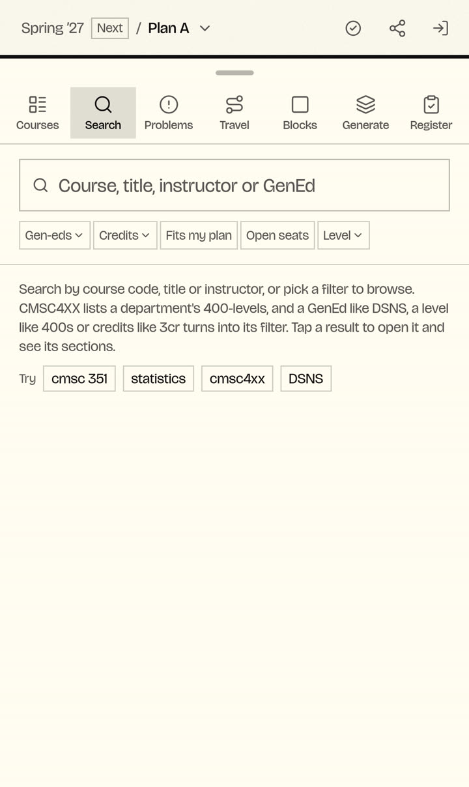 | **1. Search tab** (ok, 4 s) after: tap {"target":"[data-workbench-drawer] nav[aria-label=\"Tabs\"] button \"Search\"","at":{"x":87,"y":95}} viewport 393×659, visual 659 tall at 0, scrollY 0 drawer full, top 48, inside 611px page processes 978 MB (2, largest 747 MB) focus button#base-ui-_r_s_ at y 73–116 panel "Search" events: installed |
| 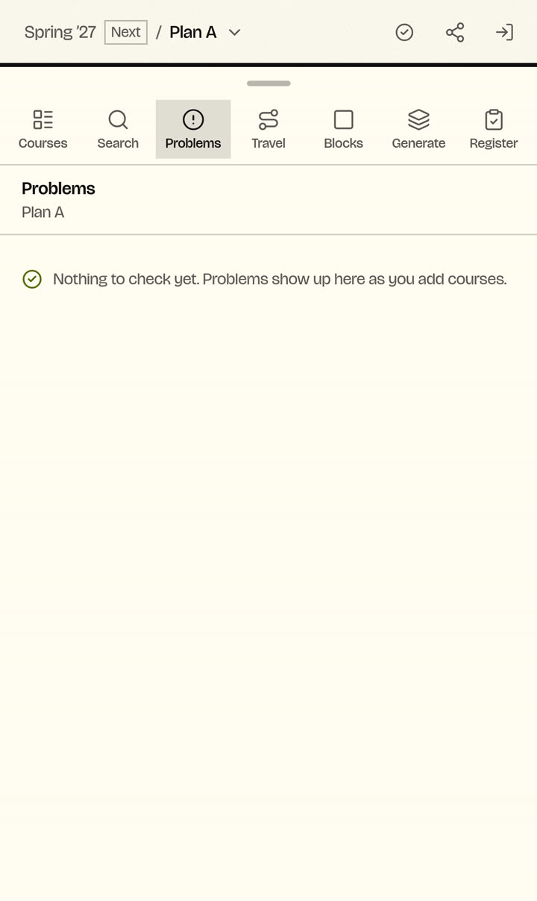 | **2. Problems tab** (ok, 6 s) after: tap {"target":"[data-workbench-drawer] nav[aria-label=\"Tabs\"] button \"Problems\"","at":{"x":142,"y":95}} viewport 393×659, visual 659 tall at 0, scrollY 0 drawer full, top 48, inside 611px page processes 1020 MB (2, largest 789 MB) focus button#base-ui-_r_v_ at y 73–116 panel "Problems" |
| 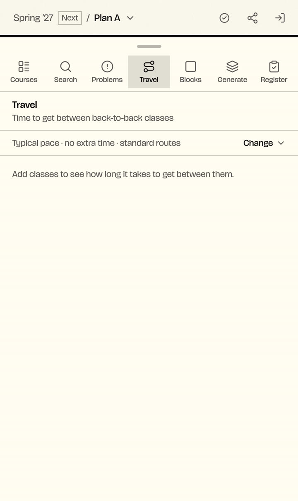 | **3. Travel tab** (ok, 8 s) after: tap {"target":"[data-workbench-drawer] nav[aria-label=\"Tabs\"] button \"Travel\"","at":{"x":197,"y":95}} viewport 393×659, visual 659 tall at 0, scrollY 0 drawer full, top 48, inside 611px page processes 1047 MB (2, largest 816 MB) focus button#base-ui-_r_12_ at y 73–116 panel "Travel" |
| 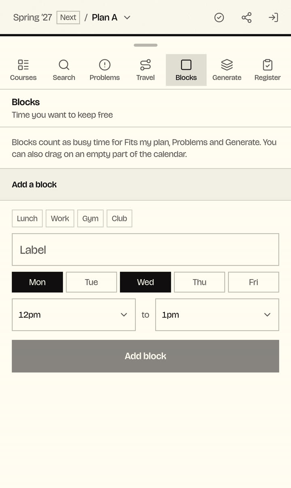 | **4. Blocks tab** (ok, 10 s) after: tap {"target":"[data-workbench-drawer] nav[aria-label=\"Tabs\"] button \"Blocks\"","at":{"x":252,"y":95}} viewport 393×659, visual 659 tall at 0, scrollY 0 drawer full, top 48, inside 611px page processes 1079 MB (2, largest 848 MB) focus button#base-ui-_r_15_ at y 73–116 panel "Blocks" |
| 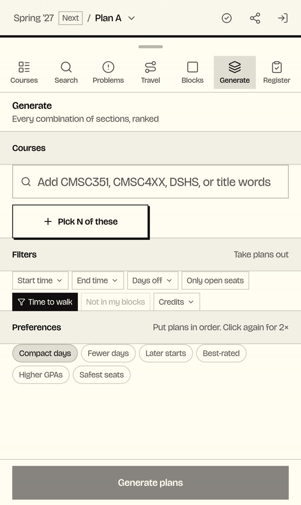 | **5. Generate tab** (ok, 11 s) after: tap {"target":"[data-workbench-drawer] nav[aria-label=\"Tabs\"] button \"Generate\"","at":{"x":307,"y":95}} viewport 393×659, visual 659 tall at 0, scrollY 0 drawer full, top 48, inside 611px page processes 1103 MB (2, largest 890 MB) focus button#base-ui-_r_18_ at y 73–116 panel "Generate" |
| 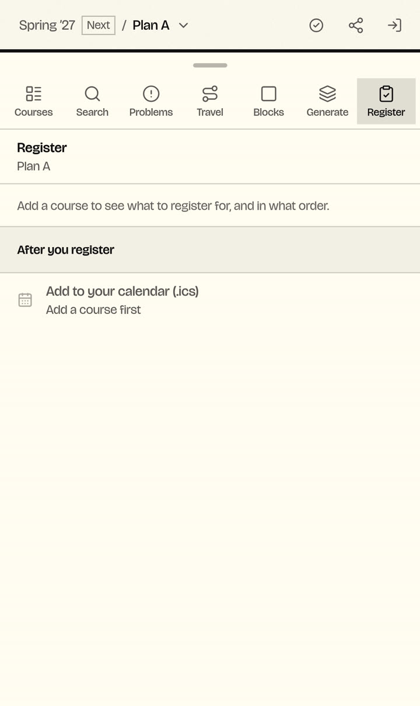 | **6. Register tab** (ok, 12 s) after: tap {"target":"[data-workbench-drawer] nav[aria-label=\"Tabs\"] button \"Register\"","at":{"x":362,"y":95}} viewport 393×659, visual 659 tall at 0, scrollY 0 drawer full, top 48, inside 611px page processes 1137 MB (2, largest 925 MB) focus button#base-ui-_r_1b_ at y 73–116 panel "Register" |
| 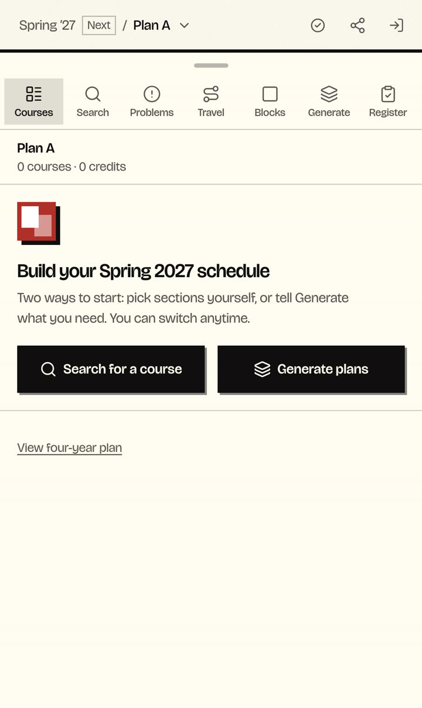 | **7. Courses tab** (ok, 13 s) after: tap {"target":"[data-workbench-drawer] nav[aria-label=\"Tabs\"] button \"Courses\"","at":{"x":32,"y":95}} viewport 393×659, visual 659 tall at 0, scrollY 0 drawer full, top 48, inside 611px page processes 1175 MB (2, largest 963 MB) focus button#base-ui-_r_p_ at y 73–116 panel "Plan A" |
| 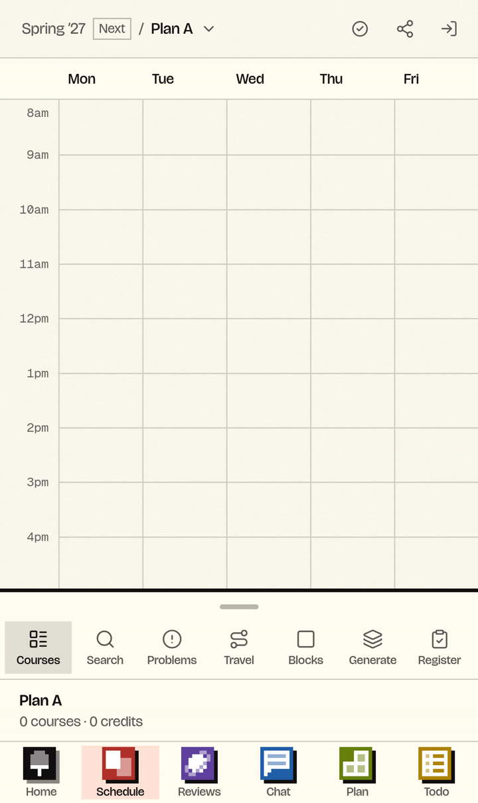 | **8. tapped the open tab** (ok, 15 s) after: tap {"target":"[data-workbench-drawer] nav[aria-label=\"Tabs\"] button \"Courses\"","at":{"x":32,"y":95}} viewport 393×659, visual 659 tall at 0, scrollY 0 drawer peek, top 485, inside 124px page processes 1180 MB (2, largest 967 MB) focus button#base-ui-_r_p_ at y 510–553 panel "Plan A" |

## Drag the grabber peek → half → full → peek

`grabber-drag`

Skipped on this engine: Playwright can't send WebKit a touch drag, and Base UI's drawer takes no mouse drag that starts on a button (the grabber).
