# Mobile lab: android

**Failed**: 0 failed check(s), 3 warning(s), 2 error(s).

- URL: https://terpsicle.com/schedule
- Device: sdk_gphone64_x86_64, Android 14 (API 34), Chrome 113.0.5672.136, screen 1080x2400 at 420 dpi
- Started: 2026-09-30T15:03:08.608Z, took 533 s
- Workflow run: https://github.com/zsrobinson/terpsicle/actions/runs/36733349372
- Every step's full probe (viewport, drawer, focus, events, per-frame trace) is in `summary.json`.

| Scenario | Result | Steps | Time | Recording |
|---|---|---|---|---|
| [Search with the on-screen keyboard from half: tap the box, type, scroll, put the keyboard away, open a result](#keyboard-at-half) | ok | 10 | 59 s | [video](keyboard-at-half/video.mp4) |
| [Search with the on-screen keyboard from full: tap the box, type, scroll, put the keyboard away, open a result](#keyboard-at-full) | ok | 10 | 55 s | [video](keyboard-at-full/video.mp4) |
| [Search with the on-screen keyboard from peek: tap the box, type, scroll, put the keyboard away, open a result](#keyboard-at-peek) | ok | 10 | 39 s | [video](keyboard-at-peek/video.mp4) |
| [First load](#first-load) | ok | 2 | 17 s | [video](first-load/video.mp4) |
| [Tap each drawer tab, then the open one again](#tabs) | ok | 8 | 29 s | [video](tabs/video.mp4) |
| [Drag the grabber peek → half → full → peek](#grabber-drag) | ok | 4 | 24 s | [video](grabber-drag/video.mp4) |
| [Pull down on a list at its top, at each snap](#pull-lists) | warn | 7 | 33 s | [video](pull-lists/video.mp4) |
| [Scroll a long list down, then back up: the drawer stays](#scroll-list-back) | ERROR | 1 | 28 s | [video](scroll-list-back/video.mp4) |
| [Scroll the calendar, then pull down at its top](#calendar-pull) | ok | 2 | 19 s | [video](calendar-pull/video.mp4) |
| [Rotate to landscape and back](#rotate) | ok | 3 | 21 s | [video](rotate/video.mp4) |
| [Scroll to collapse and expand the browser's toolbar](#url-bar) | ok | 5 | 31 s | [video](url-bar/video.mp4) |
| [A long course (ENGL101, 90+ sections) scrolled to the bottom](#long-course) | warn | 3 | 34 s | [video](long-course/video.mp4) |
| [Search, scroll, put the keyboard away and open a result, six times](#open-results) | ok | 6 | 71 s | [video](open-results/video.mp4) |
| [Add a section from course details, then switch it three times](#add-sections) | warn | 4 | 32 s | [video](add-sections/video.mp4) |
| [Open a course, then swipe back from the screen's left edge: the page moves once](#swipe-back) | ok | 4 | 25 s | [video](swipe-back/video.mp4) |

## Search with the on-screen keyboard from half: tap the box, type, scroll, put the keyboard away, open a result

`keyboard-at-half` · [recording](keyboard-at-half/video.mp4)

| Screen | Step |
|---|---|
| 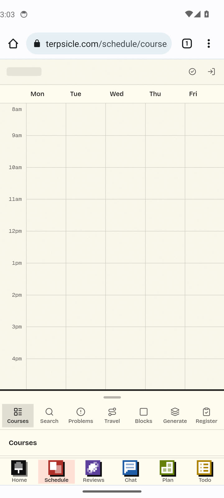 | **1. loaded** (ok, 19 s) viewport 412×783, visual 783.2 tall at 0, scrollY 0 drawer half, top 391, inside 342px keyboard down panel "Plan A" events: installed |
| 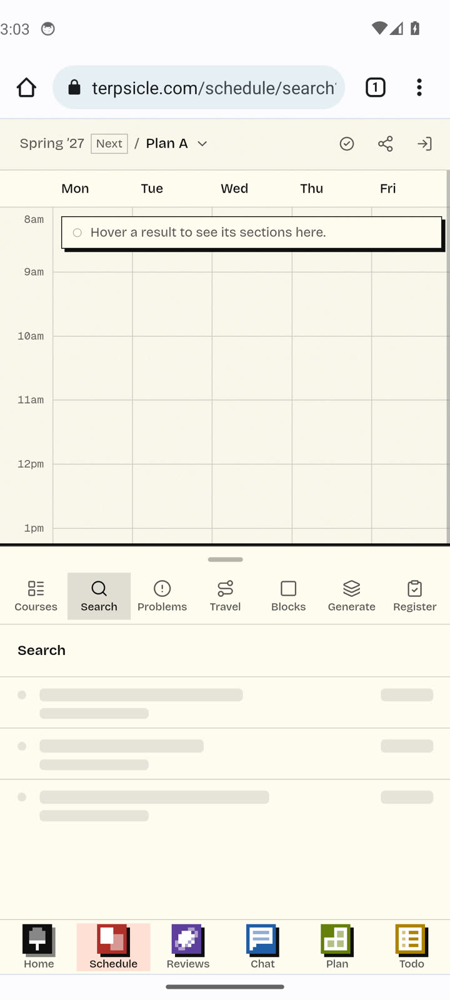 | **2. Search tab at half** (ok, 24 s) after: tap {"target":"[data-workbench-drawer] nav[aria-label=\"Tabs\"] button \"Search\"","at":{"x":91,"y":437}} viewport 412×783, visual 783.2 tall at 0, scrollY 0 drawer half, top 391, inside 342px keyboard down focus button#base-ui-_r_1d_ at y 415.8–458.8 panel "Search" |
| 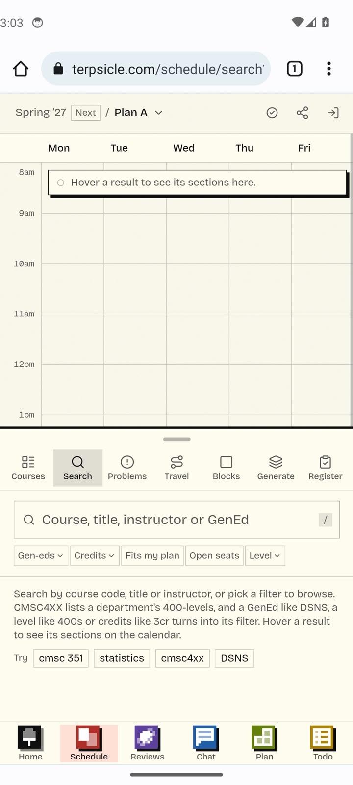 | **3. tapped the search box (+150 ms)** (ok, 27 s) after: tap {"target":"input[aria-label=\"Search courses\"]","at":{"x":206,"y":498}} viewport 412×783, visual 471.2 tall at 0, scrollY 0 drawer full, top 48, inside 423px keyboard up focus input#base-ui-_r_2k_[aria-label="Search courses"] at y 133.3–175.8 panel "Search" events: vv-resize, resize |
|  | **4. tapped the search box (+500 ms)** (ok, 34 s) viewport 412×783, visual 471.2 tall at 0, scrollY 0 drawer full, top 48, inside 423px keyboard up focus input#base-ui-_r_2k_[aria-label="Search courses"] at y 133.3–175.8 panel "Search" |
| 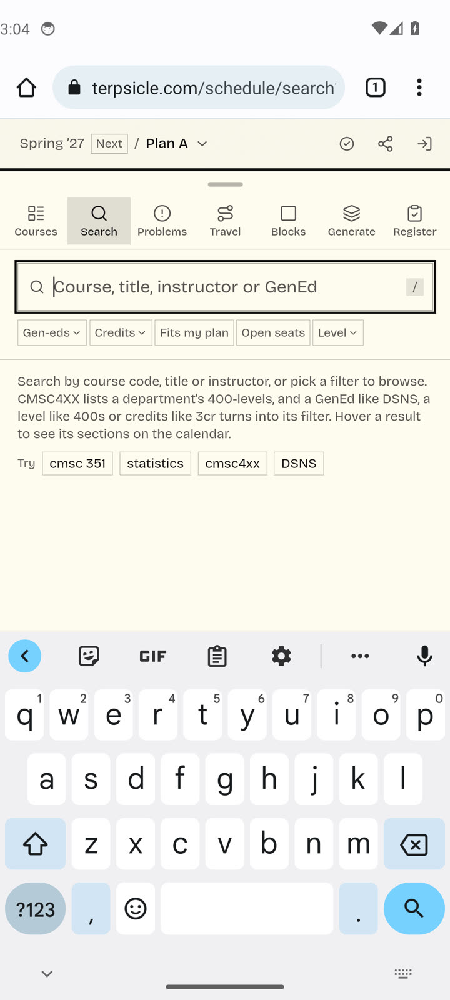 | **5. tapped the search box (+1000 ms)** (ok, 38 s) viewport 412×783, visual 471.2 tall at 0, scrollY 0 drawer full, top 48, inside 423px keyboard up focus input#base-ui-_r_2k_[aria-label="Search courses"] at y 133.3–175.8 panel "Search" |
|  | **6. tapped the search box (+2000 ms)** (ok, 42 s) viewport 412×783, visual 471.2 tall at 0, scrollY 0 drawer full, top 48, inside 423px keyboard up focus input#base-ui-_r_2k_[aria-label="Search courses"] at y 133.3–175.8 panel "Search" |
| 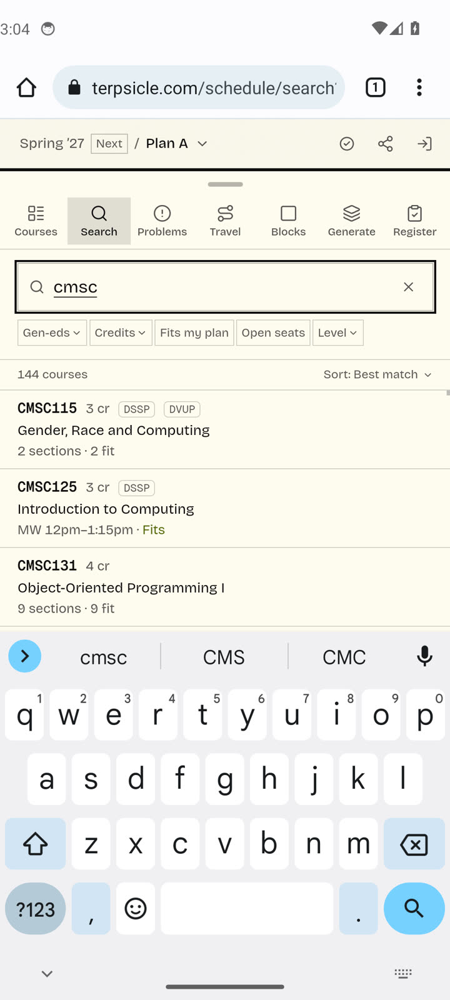 | **7. typed "cmsc"** (ok, 45 s) after: type {"text":"cmsc"} viewport 412×783, visual 471.2 tall at 0, scrollY 0 drawer full, top 48, inside 423px keyboard up focus input#base-ui-_r_2k_[aria-label="Search courses"] at y 133.3–175.8 panel "Search" |
| 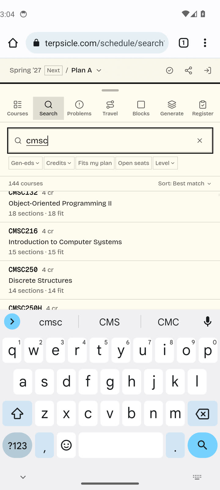 | **8. scrolled the results** (ok, 48 s) after: swipe {"from":null,"start":{"x":206,"y":427},"end":{"x":206,"y":227},"ms":500,"intent":"scroll"} viewport 412×783, visual 471.2 tall at 0, scrollY 0 drawer full, top 48, inside 423px keyboard up focus input#base-ui-_r_2k_[aria-label="Search courses"] at y 133.3–175.8 panel "Search" events: pointercancel |
| 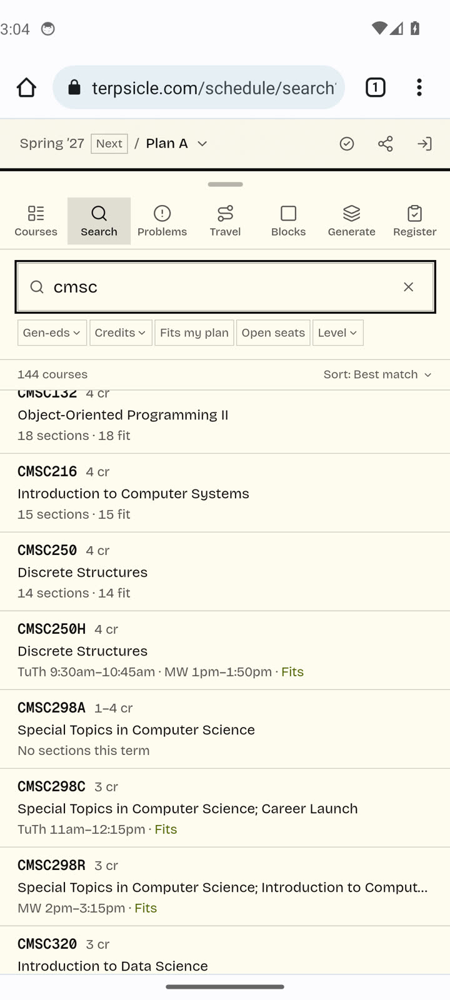 | **9. put the keyboard away** (ok, 51 s) after: hide keyboard {} viewport 412×783, visual 783.2 tall at 0, scrollY 0 drawer full, top 48, inside 734.5px keyboard down focus input#base-ui-_r_2k_[aria-label="Search courses"] at y 133.3–175.8 panel "Search" events: vv-resize, resize |
| 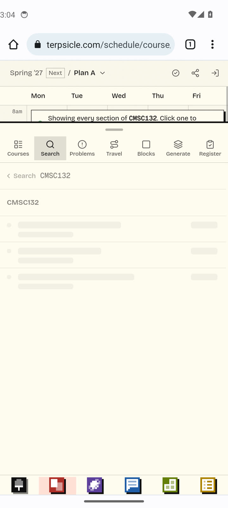 | **10. opened a result** (ok, 53 s) after: tap {"target":"#search-results [data-course-result]","at":{"x":206,"y":271}} viewport 412×783, visual 783.2 tall at 0, scrollY 0 drawer half, top 391, inside 342px keyboard down focus section[aria-label="CMSC132"] at y 463.5–733.8 panel "Object-Oriented Programming II" |

## Search with the on-screen keyboard from full: tap the box, type, scroll, put the keyboard away, open a result

`keyboard-at-full` · [recording](keyboard-at-full/video.mp4)

| Screen | Step |
|---|---|
| 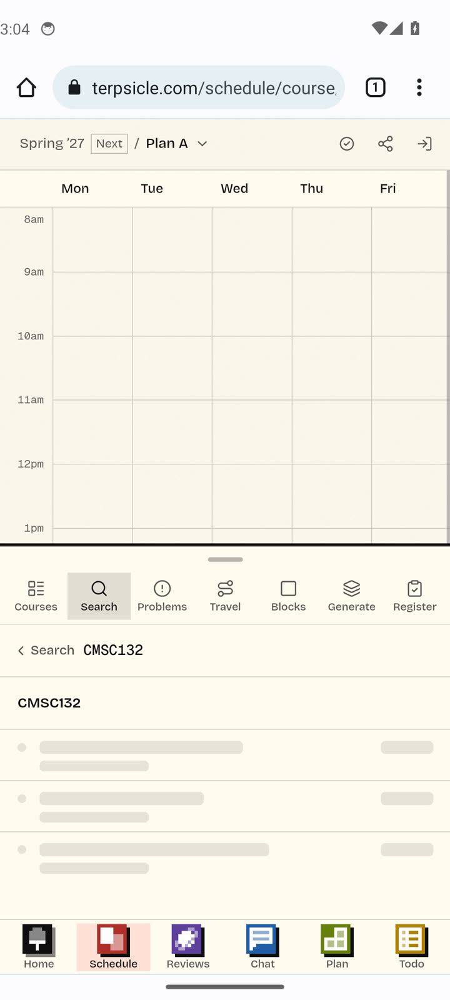 | **1. loaded** (ok, 19 s) viewport 412×783, visual 783.2 tall at 0, scrollY 0 drawer half, top 391, inside 342px keyboard down panel "Object-Oriented Programming II" events: installed |
| 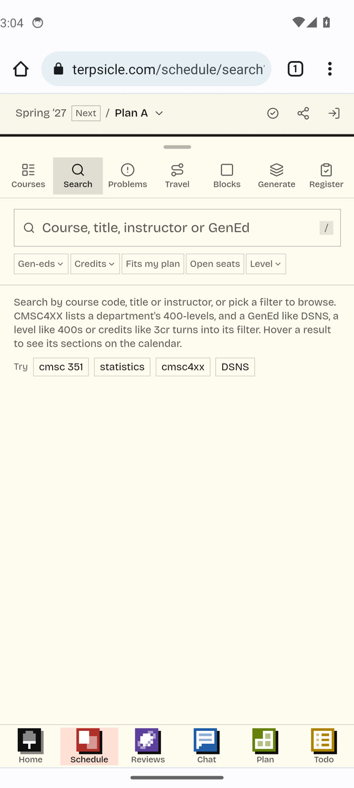 | **2. Search tab at full** (ok, 28 s) after: tap {"target":"[data-workbench-drawer] nav[aria-label=\"Tabs\"] button \"Search\"","at":{"x":91,"y":437}} after: tap {"target":"[data-workbench-drawer] button[aria-label$=\"the panel\"]","at":{"x":206,"y":404}} viewport 412×783, visual 783.2 tall at 0, scrollY 0 drawer full, top 48, inside 734.5px keyboard down focus button#base-ui-_r_1b_[aria-label="Lower the panel"] at y 48.8–72.8 panel "Search" |
| 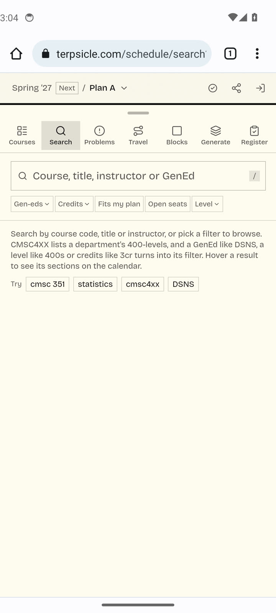 | **3. tapped the search box (+150 ms)** (ok, 31 s) after: tap {"target":"input[aria-label=\"Search courses\"]","at":{"x":206,"y":155}} viewport 412×783, visual 471.2 tall at 0, scrollY 0 drawer full, top 48, inside 423px keyboard up focus input#base-ui-_r_4c_[aria-label="Search courses"] at y 133.3–175.8 panel "Search" events: vv-resize, resize |
| 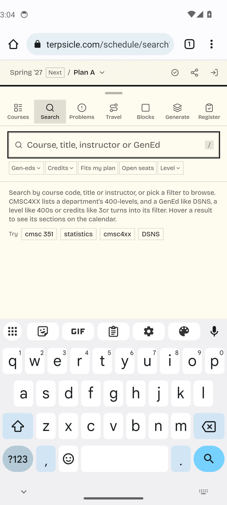 | **4. tapped the search box (+500 ms)** (ok, 34 s) viewport 412×783, visual 471.2 tall at 0, scrollY 0 drawer full, top 48, inside 423px keyboard up focus input#base-ui-_r_4c_[aria-label="Search courses"] at y 133.3–175.8 panel "Search" |
|  | **5. tapped the search box (+1000 ms)** (ok, 36 s) viewport 412×783, visual 471.2 tall at 0, scrollY 0 drawer full, top 48, inside 423px keyboard up focus input#base-ui-_r_4c_[aria-label="Search courses"] at y 133.3–175.8 panel "Search" |
|  | **6. tapped the search box (+2000 ms)** (ok, 39 s) viewport 412×783, visual 471.2 tall at 0, scrollY 0 drawer full, top 48, inside 423px keyboard up focus input#base-ui-_r_4c_[aria-label="Search courses"] at y 133.3–175.8 panel "Search" |
| 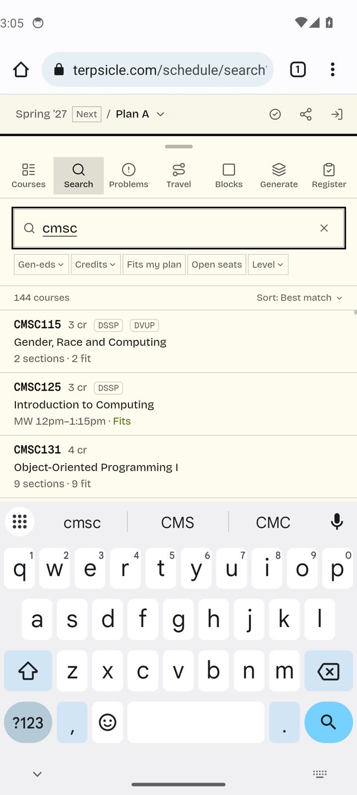 | **7. typed "cmsc"** (ok, 43 s) after: type {"text":"cmsc"} viewport 412×783, visual 471.2 tall at 0, scrollY 0 drawer full, top 48, inside 423px keyboard up focus input#base-ui-_r_4c_[aria-label="Search courses"] at y 133.3–175.8 panel "Search" |
| 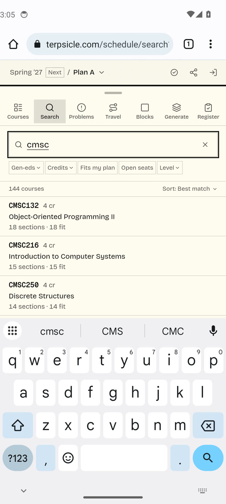 | **8. scrolled the results** (ok, 46 s) after: swipe {"from":null,"start":{"x":206,"y":427},"end":{"x":206,"y":227},"ms":500,"intent":"scroll"} viewport 412×783, visual 471.2 tall at 0, scrollY 0 drawer full, top 48, inside 423px keyboard up focus input#base-ui-_r_4c_[aria-label="Search courses"] at y 133.3–175.8 panel "Search" events: pointercancel |
| 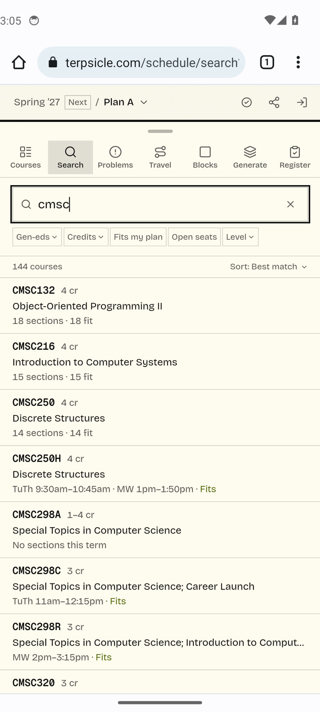 | **9. put the keyboard away** (ok, 48 s) after: hide keyboard {} viewport 412×783, visual 783.2 tall at 0, scrollY 0 drawer full, top 48, inside 734.5px keyboard down focus input#base-ui-_r_4c_[aria-label="Search courses"] at y 133.3–175.8 panel "Search" events: vv-resize, resize |
| 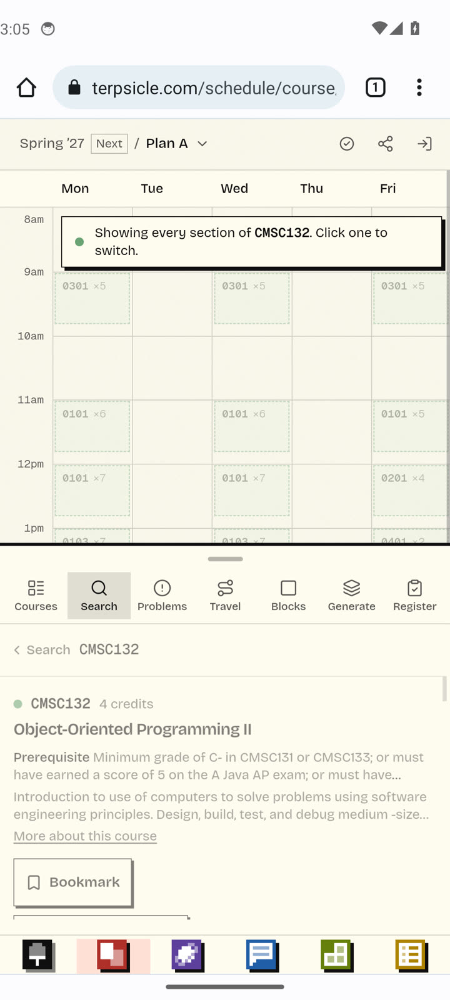 | **10. opened a result** (ok, 51 s) after: tap {"target":"#search-results [data-course-result]","at":{"x":206,"y":285}} viewport 412×783, visual 783.2 tall at 0, scrollY 0 drawer half, top 391, inside 342px keyboard down focus section[aria-label="CMSC132"] at y 463.5–733.8 panel "Object-Oriented Programming II" |

## Search with the on-screen keyboard from peek: tap the box, type, scroll, put the keyboard away, open a result

`keyboard-at-peek` · [recording](keyboard-at-peek/video.mp4)

| Screen | Step |
|---|---|
| 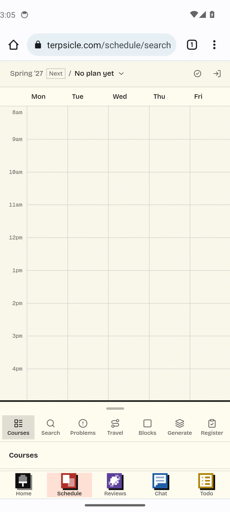 | **1. loaded** (ok, 8 s) viewport 412×783, visual 783.2 tall at 0, scrollY 0 drawer half, top 391, inside 342px keyboard down panel "Object-Oriented Programming II" events: installed |
| 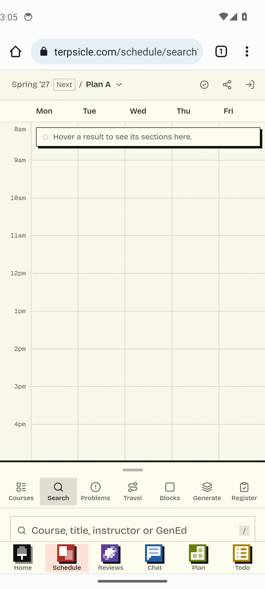 | **2. Search tab at peek** (ok, 16 s) after: tap {"target":"[data-workbench-drawer] nav[aria-label=\"Tabs\"] button \"Search\"","at":{"x":91,"y":437}} after: tap {"target":"[data-workbench-drawer] button[aria-label$=\"the panel\"]","at":{"x":206,"y":404}} after: tap {"target":"[data-workbench-drawer] button[aria-label$=\"the panel\"]","at":{"x":206,"y":61}} viewport 412×783, visual 783.2 tall at 0, scrollY 0 drawer peek, top 609, inside 124px keyboard down focus button#base-ui-_r_18_[aria-label="Raise the panel"] at y 609.8–633.8 panel "Search" |
| 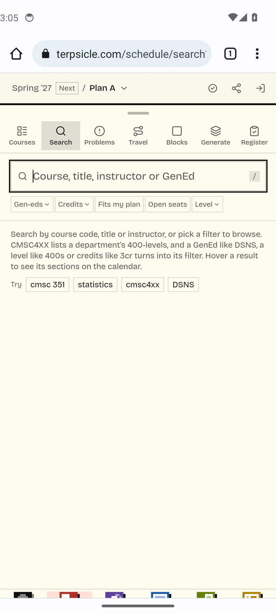 | **3. tapped the search box (+150 ms)** (ok, 17 s) after: tap {"target":"input[aria-label=\"Search courses\"]","at":{"x":206,"y":716}} viewport 412×783, visual 471.2 tall at 0, scrollY 0 drawer full, top 48, inside 423px keyboard up focus input#base-ui-_r_4b_[aria-label="Search courses"] at y 133.3–175.8 panel "Search" events: vv-resize, resize |
|  | **4. tapped the search box (+500 ms)** (ok, 20 s) viewport 412×783, visual 471.2 tall at 0, scrollY 0 drawer full, top 48, inside 423px keyboard up focus input#base-ui-_r_4b_[aria-label="Search courses"] at y 133.3–175.8 panel "Search" |
|  | **5. tapped the search box (+1000 ms)** (ok, 21 s) viewport 412×783, visual 471.2 tall at 0, scrollY 0 drawer full, top 48, inside 423px keyboard up focus input#base-ui-_r_4b_[aria-label="Search courses"] at y 133.3–175.8 panel "Search" |
|  | **6. tapped the search box (+2000 ms)** (ok, 24 s) viewport 412×783, visual 471.2 tall at 0, scrollY 0 drawer full, top 48, inside 423px keyboard up focus input#base-ui-_r_4b_[aria-label="Search courses"] at y 133.3–175.8 panel "Search" |
|  | **7. typed "cmsc"** (ok, 27 s) after: type {"text":"cmsc"} viewport 412×783, visual 471.2 tall at 0, scrollY 0 drawer full, top 48, inside 423px keyboard up focus input#base-ui-_r_4b_[aria-label="Search courses"] at y 133.3–175.8 panel "Search" |
| 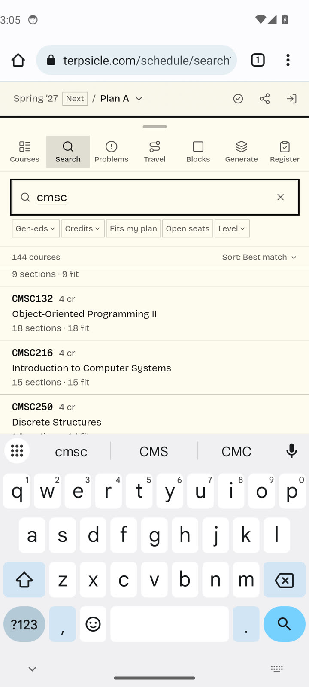 | **8. scrolled the results** (ok, 30 s) after: swipe {"from":null,"start":{"x":206,"y":427},"end":{"x":206,"y":227},"ms":500,"intent":"scroll"} viewport 412×783, visual 471.2 tall at 0, scrollY 0 drawer full, top 48, inside 423px keyboard up focus input#base-ui-_r_4b_[aria-label="Search courses"] at y 133.3–175.8 panel "Search" events: pointercancel |
| 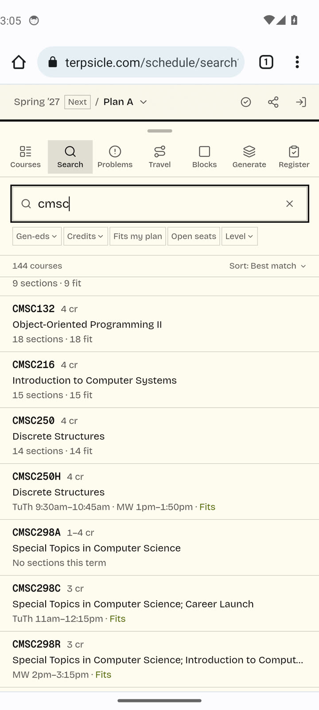 | **9. put the keyboard away** (ok, 32 s) after: hide keyboard {} viewport 412×783, visual 783.2 tall at 0, scrollY 0 drawer full, top 48, inside 734.5px keyboard down focus input#base-ui-_r_4b_[aria-label="Search courses"] at y 133.3–175.8 panel "Search" events: vv-resize, resize |
|  | **10. opened a result** (ok, 35 s) after: tap {"target":"#search-results [data-course-result]","at":{"x":206,"y":310}} viewport 412×783, visual 783.2 tall at 0, scrollY 0 drawer half, top 391, inside 342px keyboard down focus section[aria-label="CMSC132"] at y 463.5–733.8 panel "Object-Oriented Programming II" |

## First load

`first-load` · [recording](first-load/video.mp4)

| Screen | Step |
|---|---|
|  | **1. shell up** (ok, 11 s) viewport 412×783, visual 783.2 tall at 0, scrollY 0 drawer half, top 391, inside 342px keyboard down panel "Object-Oriented Programming II" events: installed |
| 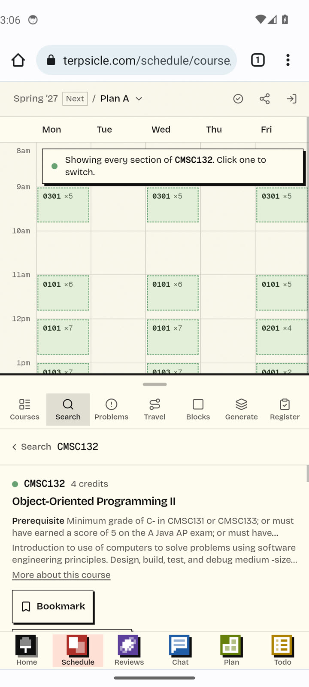 | **2. settled** (ok, 14 s) viewport 412×783, visual 783.2 tall at 0, scrollY 0 drawer half, top 391, inside 342px keyboard down panel "Object-Oriented Programming II" |

## Tap each drawer tab, then the open one again

`tabs` · [recording](tabs/video.mp4)

| Screen | Step |
|---|---|
|  | **1. Search tab** (ok, 12 s) after: tap {"target":"[data-workbench-drawer] nav[aria-label=\"Tabs\"] button \"Search\"","at":{"x":91,"y":437}} viewport 412×783, visual 783.2 tall at 0, scrollY 0 drawer half, top 391, inside 342px keyboard down focus button#base-ui-_r_1a_ at y 415.8–458.8 panel "Search" events: installed |
| 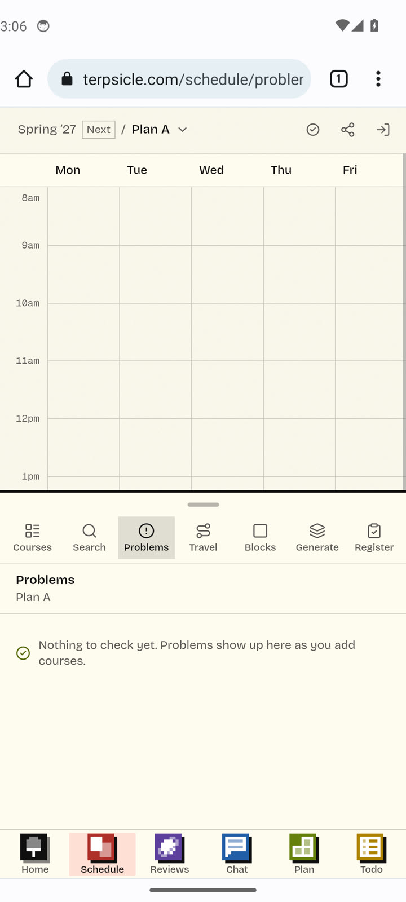 | **2. Problems tab** (ok, 14 s) after: tap {"target":"[data-workbench-drawer] nav[aria-label=\"Tabs\"] button \"Problems\"","at":{"x":148,"y":437}} viewport 412×783, visual 783.2 tall at 0, scrollY 0 drawer half, top 391, inside 342px keyboard down focus button#base-ui-_r_1d_ at y 415.8–458.8 panel "Problems" |
| 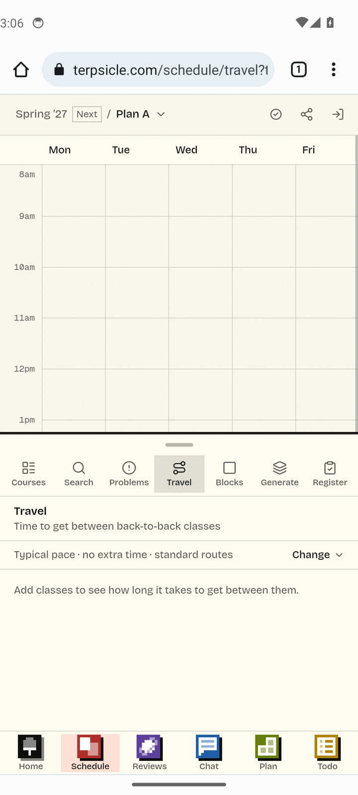 | **3. Travel tab** (ok, 17 s) after: tap {"target":"[data-workbench-drawer] nav[aria-label=\"Tabs\"] button \"Travel\"","at":{"x":206,"y":437}} viewport 412×783, visual 783.2 tall at 0, scrollY 0 drawer half, top 391, inside 342px keyboard down focus button#base-ui-_r_1g_ at y 415.8–458.8 panel "Travel" |
| 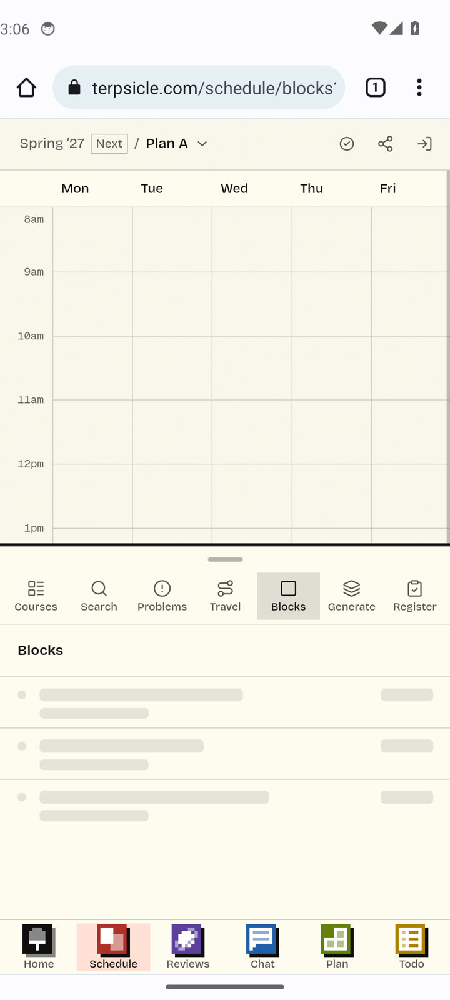 | **4. Blocks tab** (ok, 19 s) after: tap {"target":"[data-workbench-drawer] nav[aria-label=\"Tabs\"] button \"Blocks\"","at":{"x":264,"y":437}} viewport 412×783, visual 783.2 tall at 0, scrollY 0 drawer half, top 391, inside 342px keyboard down focus button#base-ui-_r_1j_ at y 415.8–458.8 panel "Blocks" |
| 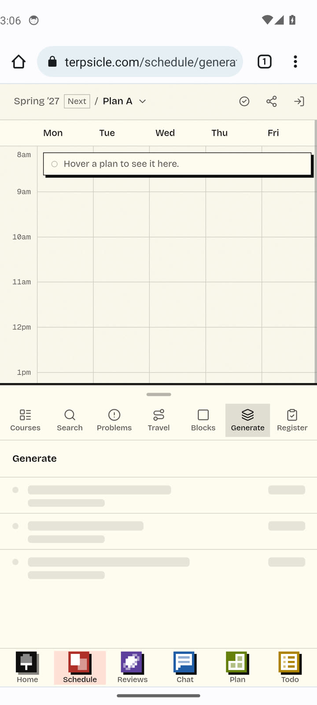 | **5. Generate tab** (ok, 21 s) after: tap {"target":"[data-workbench-drawer] nav[aria-label=\"Tabs\"] button \"Generate\"","at":{"x":322,"y":437}} viewport 412×783, visual 783.2 tall at 0, scrollY 0 drawer half, top 391, inside 342px keyboard down focus button#base-ui-_r_1m_ at y 415.8–458.8 panel "Generate" |
| 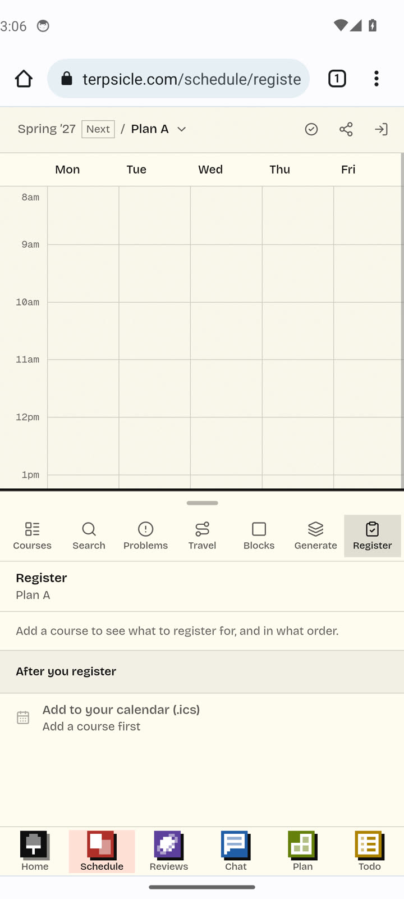 | **6. Register tab** (ok, 23 s) after: tap {"target":"[data-workbench-drawer] nav[aria-label=\"Tabs\"] button \"Register\"","at":{"x":379,"y":437}} viewport 412×783, visual 783.2 tall at 0, scrollY 0 drawer half, top 391, inside 342px keyboard down focus button#base-ui-_r_1p_ at y 415.8–458.8 panel "Register" |
|  | **7. Courses tab** (ok, 25 s) after: tap {"target":"[data-workbench-drawer] nav[aria-label=\"Tabs\"] button \"Courses\"","at":{"x":33,"y":437}} viewport 412×783, visual 783.2 tall at 0, scrollY 0 drawer half, top 391, inside 342px keyboard down focus button#base-ui-_r_17_ at y 415.8–458.8 panel "Plan A" |
|  | **8. tapped the open tab** (ok, 27 s) after: tap {"target":"[data-workbench-drawer] nav[aria-label=\"Tabs\"] button \"Courses\"","at":{"x":33,"y":437}} viewport 412×783, visual 783.2 tall at 0, scrollY 0 drawer peek, top 609, inside 124px keyboard down focus button#base-ui-_r_17_ at y 633.8–676.8 panel "Plan A" |

## Drag the grabber peek → half → full → peek

`grabber-drag` · [recording](grabber-drag/video.mp4)

| Screen | Step |
|---|---|
|  | **1. peek** (ok, 11 s) after: tap {"target":"[data-workbench-drawer] button[aria-label$=\"the panel\"]","at":{"x":206,"y":404}} after: tap {"target":"[data-workbench-drawer] button[aria-label$=\"the panel\"]","at":{"x":206,"y":61}} viewport 412×783, visual 783.2 tall at 0, scrollY 0 drawer peek, top 609, inside 124px keyboard down focus button#base-ui-_r_10_[aria-label="Raise the panel"] at y 609.8–633.8 panel "Plan A" events: installed |
|  | **2. dragged to half** (ok, 14 s) after: swipe {"from":"[data-workbench-drawer] button[aria-label$=\"the panel\"]","start":{"x":206,"y":622},"end":{"x":206,"y":404},"ms":900,"intent":"drag"} viewport 412×783, visual 783.2 tall at 0, scrollY 0 drawer half, top 391, inside 342px keyboard down focus button#base-ui-_r_10_[aria-label="Raise the panel"] at y 391.8–415.8 panel "Plan A" |
| 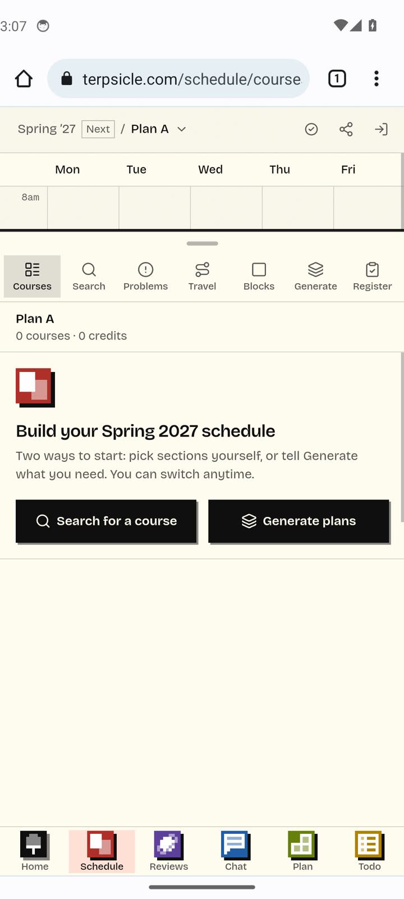 | **3. dragged to full** (ok, 17 s) after: swipe {"from":"[data-workbench-drawer] button[aria-label$=\"the panel\"]","start":{"x":206,"y":404},"end":{"x":206,"y":61},"ms":900,"intent":"drag"} viewport 412×783, visual 783.2 tall at 0, scrollY 0 drawer full, top 48, inside 734.5px keyboard down focus button#base-ui-_r_10_[aria-label="Lower the panel"] at y 48.8–72.8 panel "Plan A" |
| 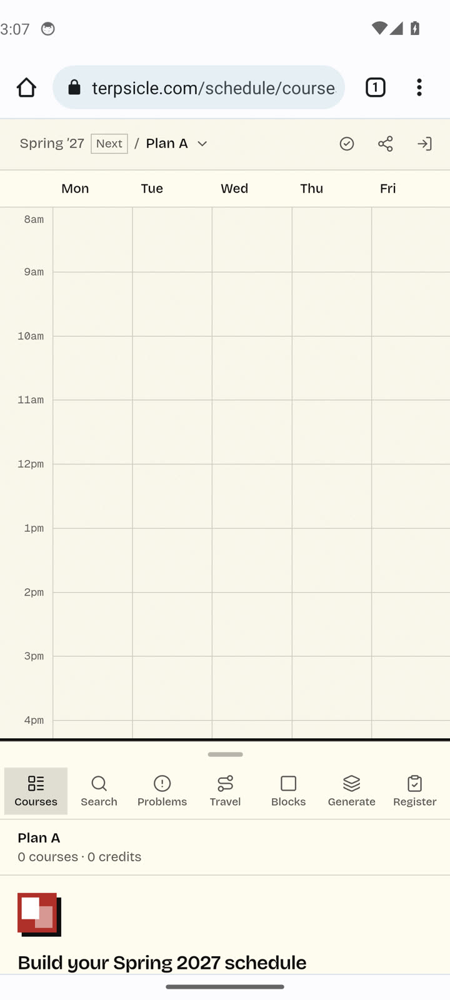 | **4. dragged to peek** (ok, 20 s) after: swipe {"from":"[data-workbench-drawer] button[aria-label$=\"the panel\"]","start":{"x":206,"y":61},"end":{"x":206,"y":622},"ms":900,"intent":"drag"} viewport 412×783, visual 783.2 tall at 0, scrollY 0 drawer peek, top 609, inside 124px keyboard down focus button#base-ui-_r_10_[aria-label="Raise the panel"] at y 609.8–633.8 panel "Plan A" |

## Pull down on a list at its top, at each snap

`pull-lists` · [recording](pull-lists/video.mp4)

| Screen | Step |
|---|---|
| 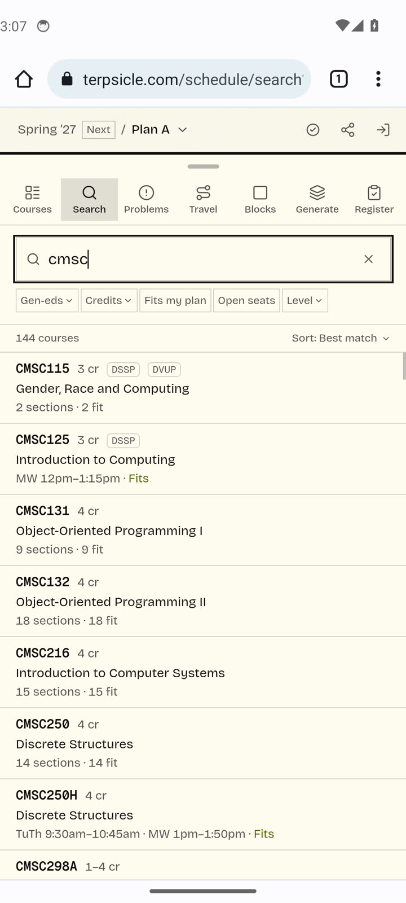 | **1. results at full** (ok, 14 s) after: tap {"target":"[data-workbench-drawer] nav[aria-label=\"Tabs\"] button \"Search\"","at":{"x":91,"y":437}} after: tap {"target":"input[aria-label=\"Search courses\"]","at":{"x":206,"y":498}} after: type {"text":"cmsc"} after: hide keyboard {} viewport 412×783, visual 783.2 tall at 0, scrollY 0 drawer full, top 48, inside 734.5px keyboard down focus input#base-ui-_r_28_[aria-label="Search courses"] at y 133.3–175.8 panel "Search" events: installed, vv-resize ×2, resize ×2 |
| 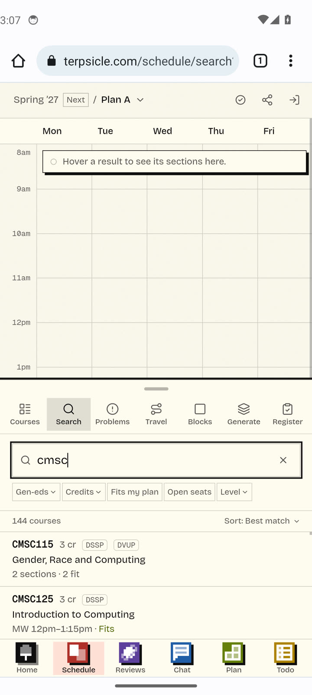 | **2. pulled down at full** (ok, 18 s) after: swipe {"from":null,"start":{"x":206,"y":269},"end":{"x":206,"y":569},"ms":600,"intent":"drag"} viewport 412×783, visual 783.2 tall at 0, scrollY 0 drawer half, top 391, inside 342px keyboard down focus input#base-ui-_r_28_[aria-label="Search courses"] at y 476.3–518.8 panel "Search" |
|  | **3. results at half** (ok, 18 s) viewport 412×783, visual 783.2 tall at 0, scrollY 0 drawer half, top 391, inside 342px keyboard down focus input#base-ui-_r_28_[aria-label="Search courses"] at y 476.3–518.8 panel "Search" |
|  | **4. pulled down at half** (ok, 21 s) after: swipe {"from":null,"start":{"x":206,"y":612},"end":{"x":206,"y":912},"ms":600,"intent":"drag"} viewport 412×783, visual 783.2 tall at 0, scrollY 0 drawer peek, top 609, inside 124px keyboard down focus input#base-ui-_r_28_[aria-label="Search courses"] at y 694.3–736.8 panel "Search" |
|  | **5. results at peek** (ok, 22 s) viewport 412×783, visual 783.2 tall at 0, scrollY 0 drawer peek, top 609, inside 124px keyboard down focus input#base-ui-_r_28_[aria-label="Search courses"] at y 694.3–736.8 panel "Search" |
| 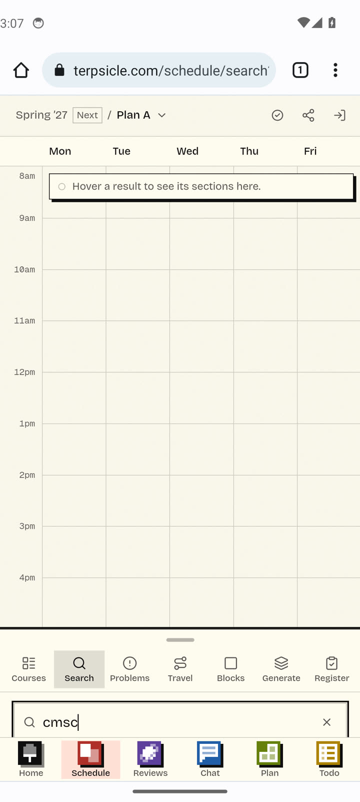 | **6. pulled down at peek** (ok, 26 s) after: swipe {"from":null,"start":{"x":206,"y":642},"end":{"x":206,"y":942},"ms":600,"intent":"drag"} viewport 412×783, visual 783.2 tall at 0, scrollY 0 drawer peek, top 609, inside 124px keyboard down focus input#base-ui-_r_28_[aria-label="Search courses"] at y 694.3–736.8 panel "Search" |
| 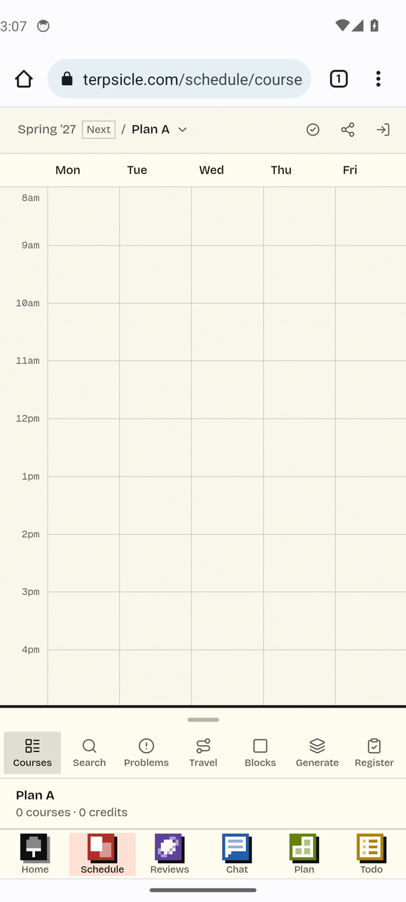 | **7. pulled down on Courses at half** (warn, 30 s) after: tap {"target":"[data-workbench-drawer] nav[aria-label=\"Tabs\"] button \"Courses\"","at":{"x":33,"y":655}} after: swipe {"from":null,"start":{"x":206,"y":536},"end":{"x":206,"y":836},"ms":600,"intent":"drag"} viewport 412×783, visual 783.2 tall at 0, scrollY 0 drawer peek, top 609, inside 124px keyboard down focus button#base-ui-_r_s_ at y 633.8–676.8 panel "Plan A" **warn drawer-moves-one-way**: 2 reversal(s) over 13 frames (391–690) |

## Scroll a long list down, then back up: the drawer stays

`scroll-list-back` · [recording](scroll-list-back/video.mp4)

**Error:** not on the page: input[aria-label="Search courses"]

| Screen | Step |
|---|---|
|  | **1. error** (ERROR, 26 s) after: tap {"target":"[data-workbench-drawer] nav[aria-label=\"Tabs\"] button \"Search\"","at":{"x":91,"y":614}} after: timeout {"waitingFor":"the search box","ms":15000} viewport 412×783, visual 783.2 tall at 0, scrollY 0 drawer half, top 391, inside 342px keyboard down focus section at y 463.5–733.8 panel "Plan A" events: installed **Error:** not on the page: input[aria-label="Search courses"] |

## Scroll the calendar, then pull down at its top

`calendar-pull` · [recording](calendar-pull/video.mp4)

| Screen | Step |
|---|---|
|  | **1. scrolled the calendar down** (ok, 12 s) after: tap {"target":"[data-workbench-drawer] button[aria-label$=\"the panel\"]","at":{"x":206,"y":404}} after: tap {"target":"[data-workbench-drawer] button[aria-label$=\"the panel\"]","at":{"x":206,"y":61}} after: swipe {"from":null,"start":{"x":206,"y":385},"end":{"x":206,"y":135},"ms":500,"intent":"scroll"} viewport 412×783, visual 783.2 tall at 0, scrollY 0 drawer peek, top 609, inside 124px keyboard down focus button#base-ui-_r_v_[aria-label="Raise the panel"] at y 609.8–633.8 panel "Plan A" events: installed, pointercancel |
|  | **2. pulled down at the top** (ok, 17 s) after: swipe {"from":null,"start":{"x":206,"y":132},"end":{"x":206,"y":482},"ms":500,"intent":"scroll"} after: swipe {"from":null,"start":{"x":206,"y":132},"end":{"x":206,"y":482},"ms":500,"intent":"scroll"} viewport 412×783, visual 783.2 tall at 0, scrollY 0 drawer peek, top 609, inside 124px keyboard down focus button#base-ui-_r_v_[aria-label="Raise the panel"] at y 609.8–633.8 panel "Plan A" events: pointercancel ×2 |

## Rotate to landscape and back

`rotate` · [recording](rotate/video.mp4)

| Screen | Step |
|---|---|
| 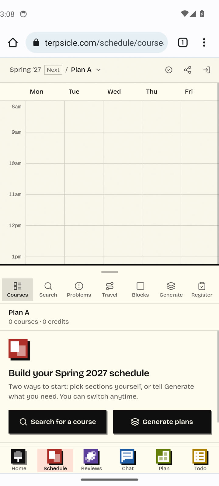 | **1. portrait** (ok, 11 s) viewport 412×783, visual 783.2 tall at 0, scrollY 0 drawer half, top 391, inside 342px keyboard down panel "Plan A" events: installed |
| 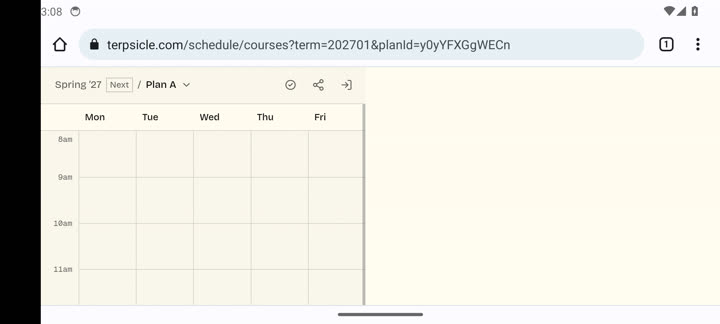 | **2. landscape** (ok, 14 s) after: rotate {"orientation":"landscape"} viewport 863×304, visual 304 tall at 0, scrollY 0 keyboard down panel "Plan A" events: orientationchange, resize, vv-resize |
| 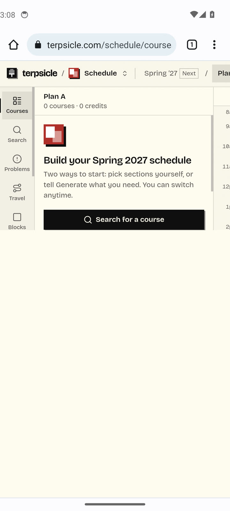 | **3. portrait again** (ok, 18 s) after: rotate {"orientation":"portrait"} viewport 412×783, visual 783.2 tall at 0, scrollY 0 drawer half, top 391, inside 342px keyboard down panel "Plan A" events: orientationchange, resize, vv-resize |

## Scroll to collapse and expand the browser's toolbar

`url-bar` · [recording](url-bar/video.mp4)

| Screen | Step |
|---|---|
|  | **1. start** (ok, 12 s) after: tap {"target":"[data-workbench-drawer] button[aria-label$=\"the panel\"]","at":{"x":206,"y":404}} after: tap {"target":"[data-workbench-drawer] button[aria-label$=\"the panel\"]","at":{"x":206,"y":61}} viewport 412×783, visual 783.2 tall at 0, scrollY 0 drawer peek, top 609, inside 124px keyboard down focus button#base-ui-_r_p_[aria-label="Raise the panel"] at y 609.8–633.8 panel "Plan A" events: installed |
|  | **2. scrolled the calendar up (toolbar may hide)** (ok, 15 s) after: swipe {"from":null,"start":{"x":206,"y":441},"end":{"x":206,"y":141},"ms":400,"intent":"scroll"} viewport 412×783, visual 783.2 tall at 0, scrollY 0 drawer peek, top 609, inside 124px keyboard down focus button#base-ui-_r_p_[aria-label="Raise the panel"] at y 609.8–633.8 panel "Plan A" events: pointercancel |
|  | **3. scrolled it back (toolbar may show)** (ok, 17 s) after: swipe {"from":null,"start":{"x":206,"y":441},"end":{"x":206,"y":741},"ms":400,"intent":"scroll"} viewport 412×783, visual 783.2 tall at 0, scrollY 0 drawer peek, top 609, inside 124px keyboard down focus button#base-ui-_r_p_[aria-label="Raise the panel"] at y 609.8–633.8 panel "Plan A" events: pointercancel |
| 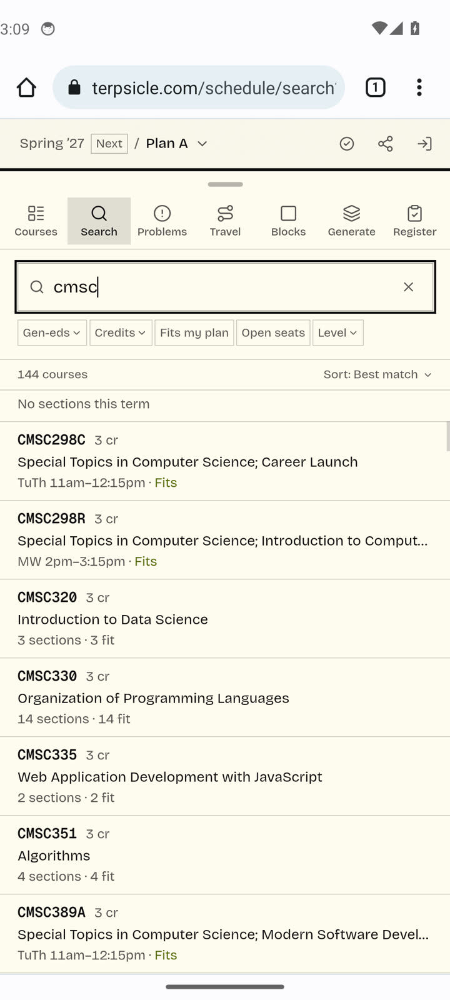 | **4. scrolled the results** (ok, 26 s) after: tap {"target":"[data-workbench-drawer] nav[aria-label=\"Tabs\"] button \"Search\"","at":{"x":91,"y":655}} after: tap {"target":"input[aria-label=\"Search courses\"]","at":{"x":206,"y":498}} after: type {"text":"cmsc"} after: hide keyboard {} after: swipe {"from":null,"start":{"x":206,"y":676},"end":{"x":206,"y":276},"ms":400,"intent":"scroll"} viewport 412×783, visual 783.2 tall at 0, scrollY 0 drawer full, top 48, inside 734.5px keyboard down focus input#base-ui-_r_28_[aria-label="Search courses"] at y 133.3–175.8 panel "Search" events: vv-resize ×2, resize ×2, pointercancel |
|  | **5. scrolled them back** (ok, 28 s) after: swipe {"from":null,"start":{"x":206,"y":676},"end":{"x":206,"y":1076},"ms":400,"intent":"scroll"} viewport 412×783, visual 783.2 tall at 0, scrollY 0 drawer full, top 48, inside 734.5px keyboard down focus input#base-ui-_r_28_[aria-label="Search courses"] at y 133.3–175.8 panel "Search" events: pointercancel |

## A long course (ENGL101, 90+ sections) scrolled to the bottom

`long-course` · [recording](long-course/video.mp4)

| Screen | Step |
|---|---|
| 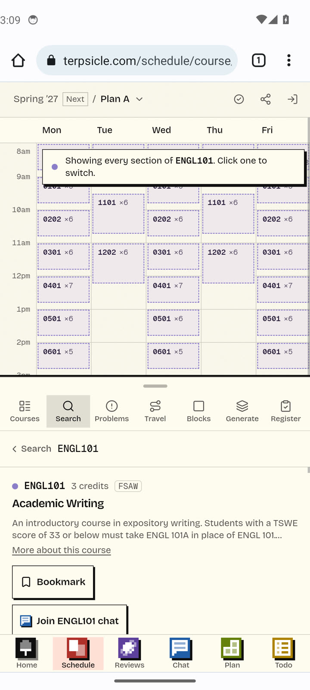 | **1. ENGL101** (warn, 20 s) after: tap {"target":"[data-workbench-drawer] nav[aria-label=\"Tabs\"] button \"Search\"","at":{"x":91,"y":437}} after: tap {"target":"input[aria-label=\"Search courses\"]","at":{"x":206,"y":716}} after: type {"text":"engl101"} after: hide keyboard {} after: tap {"target":"[data-course-result=\"ENGL101\"]","at":{"x":206,"y":285}} viewport 412×783, visual 783.2 tall at 0, scrollY 0 drawer half, top 391, inside 342px keyboard down focus section[aria-label="ENGL101"] at y 463.5–733.8 panel "Academic Writing" events: installed, vv-resize ×2, resize ×2 **warn drawer-moves-one-way**: 2 reversal(s) over 12 frames (48–609) |
| 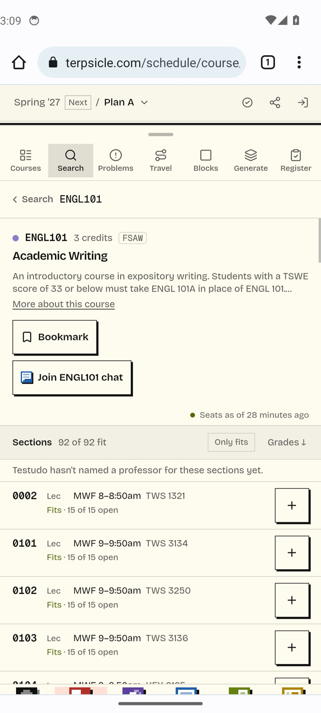 | **2. ENGL101 at full** (ok, 21 s) after: tap {"target":"[data-workbench-drawer] button[aria-label$=\"the panel\"]","at":{"x":206,"y":404}} viewport 412×783, visual 783.2 tall at 0, scrollY 0 drawer full, top 48, inside 734.5px keyboard down focus button#base-ui-_r_p_[aria-label="Lower the panel"] at y 48.8–72.8 panel "Academic Writing" |
| 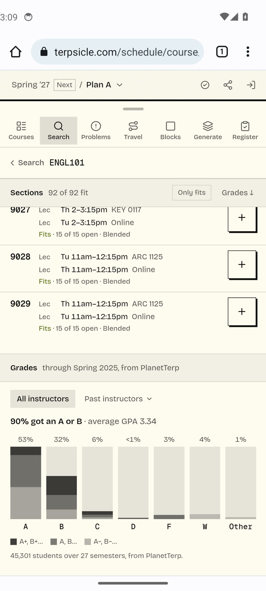 | **3. scrolled to the bottom** (ok, 31 s) after: swipe {"from":null,"start":{"x":206,"y":660},"end":{"x":206,"y":210},"ms":300,"intent":"scroll"} after: swipe {"from":null,"start":{"x":206,"y":660},"end":{"x":206,"y":210},"ms":300,"intent":"scroll"} after: swipe {"from":null,"start":{"x":206,"y":660},"end":{"x":206,"y":210},"ms":300,"intent":"scroll"} after: swipe {"from":null,"start":{"x":206,"y":660},"end":{"x":206,"y":210},"ms":300,"intent":"scroll"} after: swipe {"from":null,"start":{"x":206,"y":660},"end":{"x":206,"y":210},"ms":300,"intent":"scroll"} after: swipe {"from":null,"start":{"x":206,"y":660},"end":{"x":206,"y":210},"ms":300,"intent":"scroll"} after: swipe {"from":null,"start":{"x":206,"y":660},"end":{"x":206,"y":210},"ms":300,"intent":"scroll"} after: swipe {"from":null,"start":{"x":206,"y":660},"end":{"x":206,"y":210},"ms":300,"intent":"scroll"} after: swipe {"from":null,"start":{"x":206,"y":660},"end":{"x":206,"y":210},"ms":300,"intent":"scroll"} viewport 412×783, visual 783.2 tall at 0, scrollY 0 drawer full, top 48, inside 734.5px keyboard down focus button#base-ui-_r_p_[aria-label="Lower the panel"] at y 48.8–72.8 panel "Academic Writing" events: pointercancel ×7 |

## Search, scroll, put the keyboard away and open a result, six times

`open-results` · [recording](open-results/video.mp4)

| Screen | Step |
|---|---|
| 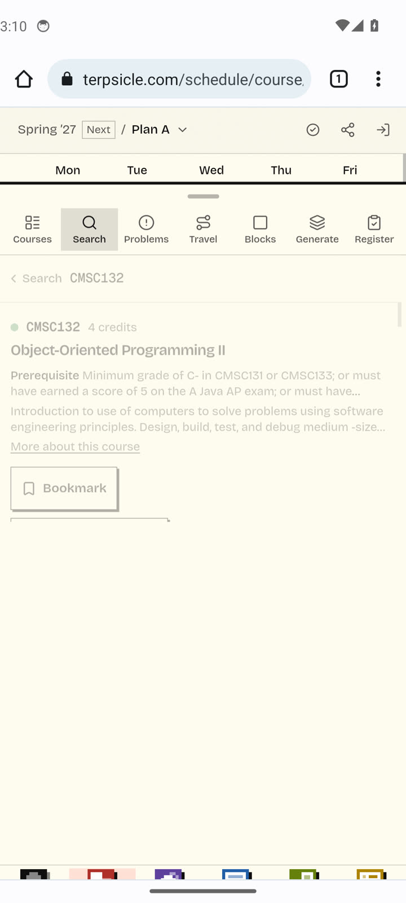 | **1. opened a result (1)** (ok, 22 s) after: tap {"target":"[data-workbench-drawer] nav[aria-label=\"Tabs\"] button \"Search\"","at":{"x":91,"y":437}} after: tap {"target":"input[aria-label=\"Search courses\"]","at":{"x":206,"y":498}} after: type {"text":"cmsc"} after: tap {"target":"input[aria-label=\"Search courses\"]","at":{"x":196,"y":155}} after: swipe {"from":null,"start":{"x":206,"y":427},"end":{"x":206,"y":267},"ms":400,"intent":"scroll"} after: hide keyboard {} after: tap {"target":"#search-results [data-course-result]","at":{"x":206,"y":317}} viewport 412×783, visual 783.2 tall at 0, scrollY 0 drawer half, top 391, inside 342px keyboard down focus section[aria-label="CMSC132"] at y 463.5–733.8 panel "Object-Oriented Programming II" events: installed, vv-resize ×2, resize ×2, pointercancel |
| 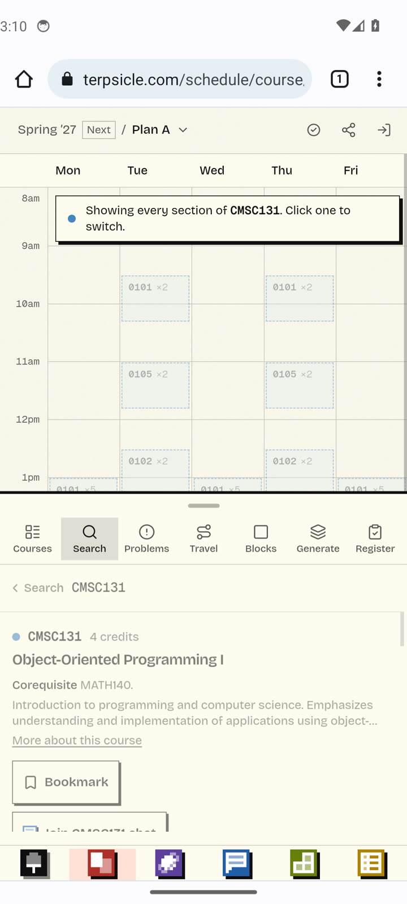 | **2. opened a result (2)** (ok, 31 s) after: tap {"target":"[data-workbench-drawer] [data-layer][data-active] button \"Back to Search\"","at":{"x":40,"y":487}} after: tap {"target":"[data-workbench-drawer] button[aria-label$=\"the panel\"]","at":{"x":206,"y":404}} after: tap {"target":"input[aria-label=\"Search courses\"]","at":{"x":196,"y":155}} after: swipe {"from":null,"start":{"x":206,"y":427},"end":{"x":206,"y":267},"ms":400,"intent":"scroll"} after: hide keyboard {} after: tap {"target":"#search-results [data-course-result]","at":{"x":206,"y":264}} viewport 412×783, visual 783.2 tall at 0, scrollY 0 drawer half, top 391, inside 342px keyboard down focus section[aria-label="CMSC131"] at y 463.5–733.8 panel "Object-Oriented Programming I" events: vv-resize ×2, resize ×2, pointercancel |
|  | **3. opened a result (3)** (ok, 40 s) after: tap {"target":"[data-workbench-drawer] [data-layer][data-active] button \"Back to Search\"","at":{"x":40,"y":487}} after: tap {"target":"[data-workbench-drawer] button[aria-label$=\"the panel\"]","at":{"x":206,"y":404}} after: tap {"target":"input[aria-label=\"Search courses\"]","at":{"x":196,"y":155}} after: swipe {"from":null,"start":{"x":206,"y":427},"end":{"x":206,"y":267},"ms":400,"intent":"scroll"} after: hide keyboard {} after: tap {"target":"#search-results [data-course-result]","at":{"x":206,"y":312}} viewport 412×783, visual 783.2 tall at 0, scrollY 0 drawer half, top 391, inside 342px keyboard down focus section[aria-label="CMSC132"] at y 463.5–733.8 panel "Object-Oriented Programming II" events: vv-resize ×2, resize ×2, pointercancel |
| 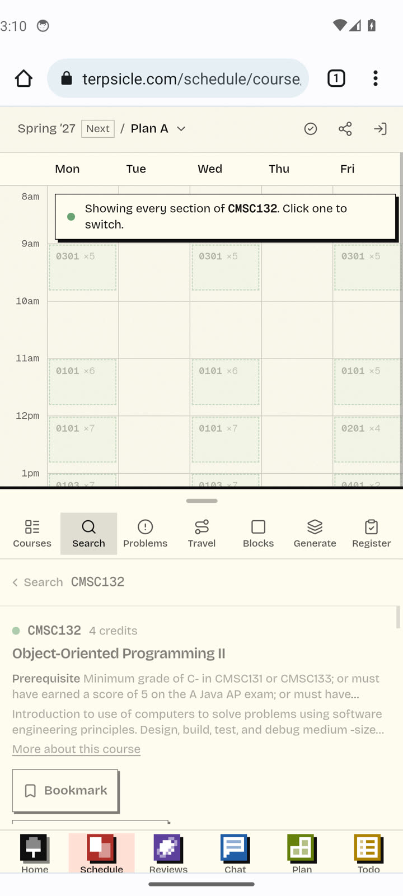 | **4. opened a result (4)** (ok, 48 s) after: tap {"target":"[data-workbench-drawer] [data-layer][data-active] button \"Back to Search\"","at":{"x":40,"y":487}} after: tap {"target":"[data-workbench-drawer] button[aria-label$=\"the panel\"]","at":{"x":206,"y":404}} after: tap {"target":"input[aria-label=\"Search courses\"]","at":{"x":196,"y":155}} after: swipe {"from":null,"start":{"x":206,"y":427},"end":{"x":206,"y":267},"ms":400,"intent":"scroll"} after: hide keyboard {} after: tap {"target":"#search-results [data-course-result]","at":{"x":206,"y":316}} viewport 412×783, visual 783.2 tall at 0, scrollY 0 drawer half, top 391, inside 342px keyboard down focus section[aria-label="CMSC132"] at y 463.5–733.8 panel "Object-Oriented Programming II" events: vv-resize ×2, resize ×2, pointercancel |
|  | **5. opened a result (5)** (ok, 57 s) after: tap {"target":"[data-workbench-drawer] [data-layer][data-active] button \"Back to Search\"","at":{"x":40,"y":487}} after: tap {"target":"[data-workbench-drawer] button[aria-label$=\"the panel\"]","at":{"x":206,"y":404}} after: tap {"target":"input[aria-label=\"Search courses\"]","at":{"x":196,"y":155}} after: swipe {"from":null,"start":{"x":206,"y":427},"end":{"x":206,"y":267},"ms":400,"intent":"scroll"} after: hide keyboard {} after: tap {"target":"#search-results [data-course-result]","at":{"x":206,"y":311}} viewport 412×783, visual 783.2 tall at 0, scrollY 0 drawer half, top 391, inside 342px keyboard down focus section[aria-label="CMSC132"] at y 463.5–733.8 panel "Object-Oriented Programming II" events: vv-resize ×2, resize ×2, pointercancel |
|  | **6. opened a result (6)** (ok, 66 s) after: tap {"target":"[data-workbench-drawer] [data-layer][data-active] button \"Back to Search\"","at":{"x":40,"y":487}} after: tap {"target":"[data-workbench-drawer] button[aria-label$=\"the panel\"]","at":{"x":206,"y":404}} after: tap {"target":"input[aria-label=\"Search courses\"]","at":{"x":196,"y":155}} after: swipe {"from":null,"start":{"x":206,"y":427},"end":{"x":206,"y":267},"ms":400,"intent":"scroll"} after: hide keyboard {} after: tap {"target":"#search-results [data-course-result]","at":{"x":206,"y":316}} viewport 412×783, visual 783.2 tall at 0, scrollY 0 drawer half, top 391, inside 342px keyboard down focus section[aria-label="CMSC132"] at y 463.5–733.8 panel "Object-Oriented Programming II" events: vv-resize ×2, resize ×2, pointercancel |

## Add a section from course details, then switch it three times

`add-sections` · [recording](add-sections/video.mp4)

| Screen | Step |
|---|---|
| 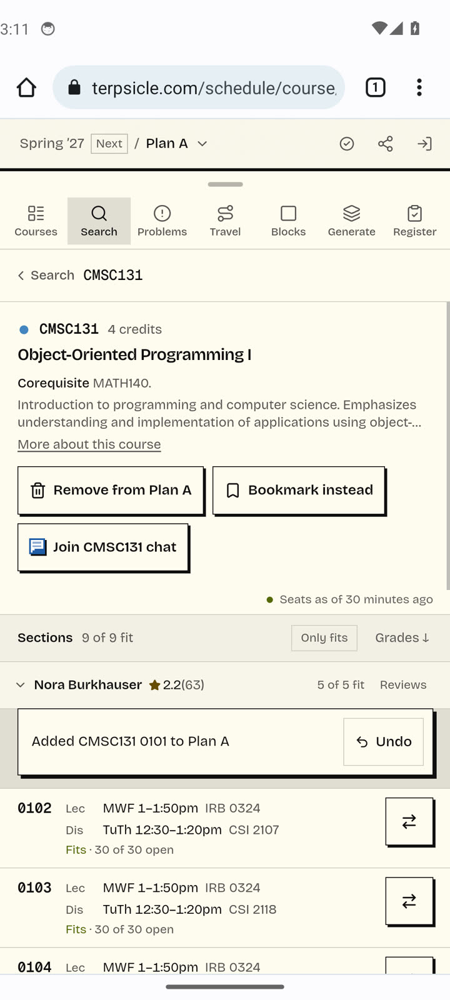 | **1. tapped Add 0101** (warn, 22 s) after: tap {"target":"[data-workbench-drawer] nav[aria-label=\"Tabs\"] button \"Search\"","at":{"x":91,"y":437}} after: tap {"target":"input[aria-label=\"Search courses\"]","at":{"x":206,"y":716}} after: type {"text":"cmsc131"} after: hide keyboard {} after: tap {"target":"[data-course-result=\"CMSC131\"]","at":{"x":206,"y":285}} after: tap {"target":"[data-workbench-drawer] button[aria-label$=\"the panel\"]","at":{"x":206,"y":404}} after: tap {"target":"[data-section] button[aria-label^=\"Add \"], [data-section] button[aria-label^=\"Switch to \"] \"Add 0101\"","at":{"x":374,"y":571}} viewport 412×783, visual 783.2 tall at 0, scrollY 0 drawer full, top 48, inside 734.5px keyboard down focus button#base-ui-_r_7t_[aria-label="Remove 0101 from Plan A"] at y 548.5–592.5 panel "Object-Oriented Programming I" events: installed, vv-resize ×2, resize ×2 **warn drawer-moves-one-way**: 3 reversal(s) over 18 frames (48–609) |
| 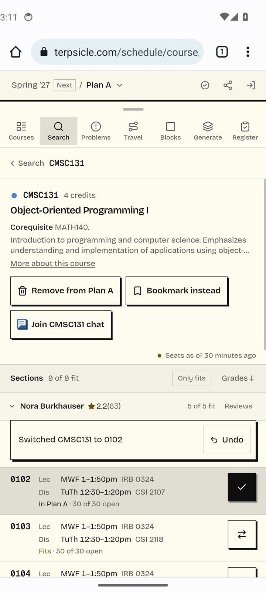 | **2. tapped Switch to 0102** (ok, 25 s) after: tap {"target":"[data-section] button[aria-label^=\"Add \"], [data-section] button[aria-label^=\"Switch to \"] \"Switch to 0102\"","at":{"x":374,"y":643}} viewport 412×783, visual 783.2 tall at 0, scrollY 0 drawer full, top 48, inside 734.5px keyboard down focus button#base-ui-_r_86_[aria-label="Remove 0102 from Plan A"] at y 621.3–665.3 panel "Object-Oriented Programming I" |
| 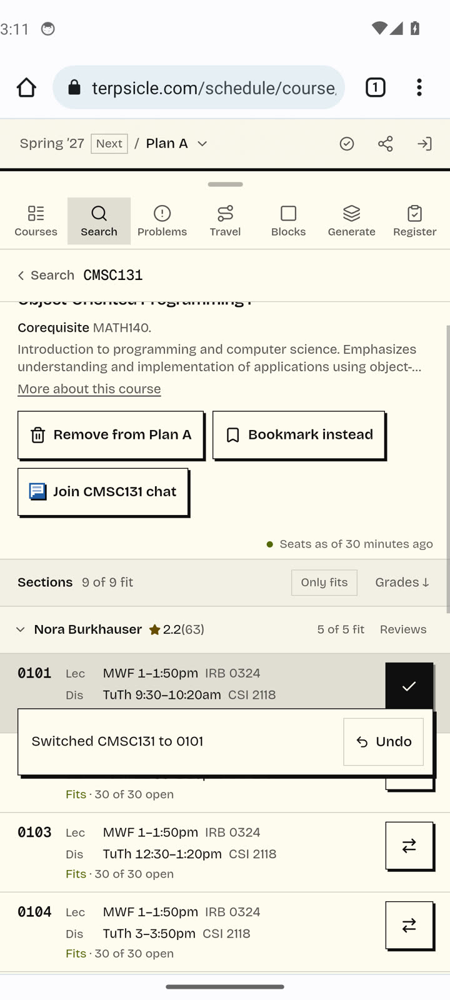 | **3. tapped Switch to 0101** (ok, 28 s) after: tap {"target":"[data-section] button[aria-label^=\"Add \"], [data-section] button[aria-label^=\"Switch to \"] \"Switch to 0101\"","at":{"x":374,"y":520}} viewport 412×783, visual 783.2 tall at 0, scrollY 0 drawer full, top 48, inside 734.5px keyboard down focus button#base-ui-_r_7t_[aria-label="Remove 0101 from Plan A"] at y 497.9–541.9 panel "Object-Oriented Programming I" |
| 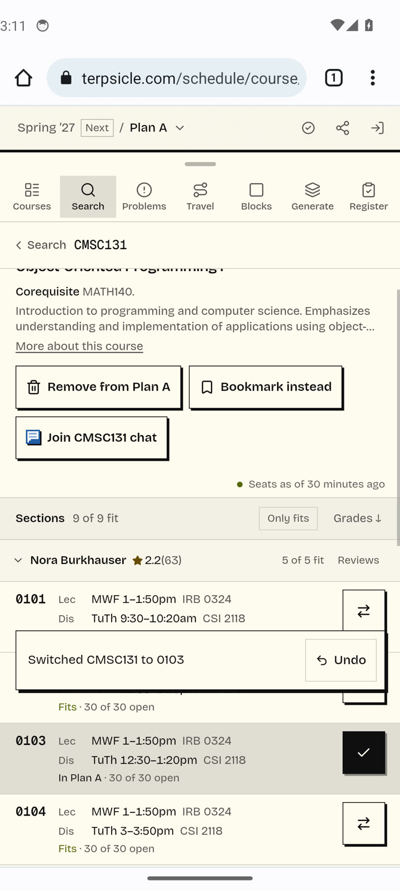 | **4. tapped Switch to 0103** (ok, 30 s) after: tap {"target":"[data-section] button[aria-label^=\"Add \"], [data-section] button[aria-label^=\"Switch to \"] \"Switch to 0103\"","at":{"x":374,"y":665}} viewport 412×783, visual 783.2 tall at 0, scrollY 0 drawer full, top 48, inside 734.5px keyboard down focus button#base-ui-_r_8f_[aria-label="Remove 0103 from Plan A"] at y 643.4–687.4 panel "Object-Oriented Programming I" |

## Open a course, then swipe back from the screen's left edge: the page moves once

`swipe-back` · [recording](swipe-back/video.mp4)

| Screen | Step |
|---|---|
| 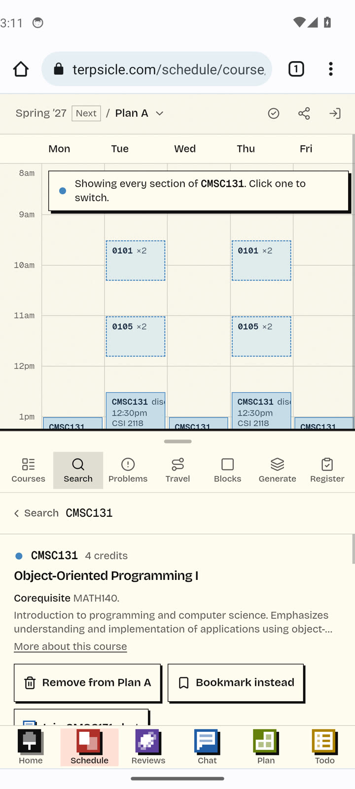 | **1. CMSC131 open** (ok, 18 s) after: tap {"target":"[data-workbench-drawer] nav[aria-label=\"Tabs\"] button \"Search\"","at":{"x":91,"y":437}} after: tap {"target":"input[aria-label=\"Search courses\"]","at":{"x":206,"y":498}} after: type {"text":"cmsc131"} after: hide keyboard {} after: tap {"target":"[data-course-result=\"CMSC131\"]","at":{"x":206,"y":285}} viewport 412×783, visual 783.2 tall at 0, scrollY 0 drawer half, top 391, inside 342px keyboard down focus section[aria-label="CMSC131"] at y 463.5–733.8 panel "Object-Oriented Programming I" events: installed, vv-resize ×2, resize ×2 |
| 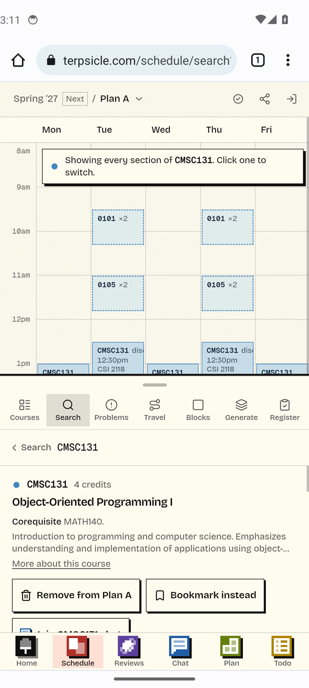 | **2. swiping back (+100 ms)** (ok, 19 s) viewport 412×783, visual 783.2 tall at 0, scrollY 0 drawer half, top 391, inside 342px keyboard down focus div#search-result-0 at y 592.3–664.3 panel "Search" |
|  | **3. swiping back (+250 ms)** (ok, 20 s) viewport 412×783, visual 783.2 tall at 0, scrollY 0 drawer half, top 391, inside 342px keyboard down focus div#search-result-0 at y 592.3–664.3 panel "Search" |
| 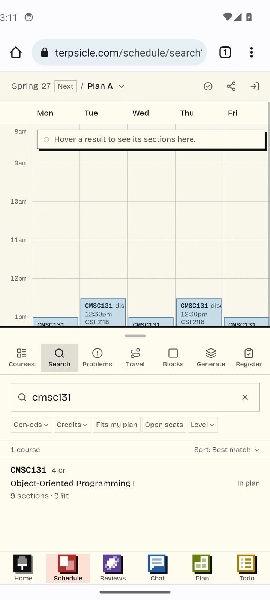 | **4. swiped back** (ok, 22 s) viewport 412×783, visual 783.2 tall at 0, scrollY 0 drawer half, top 391, inside 342px keyboard down focus div#search-result-0 at y 592.3–664.3 panel "Search" |
